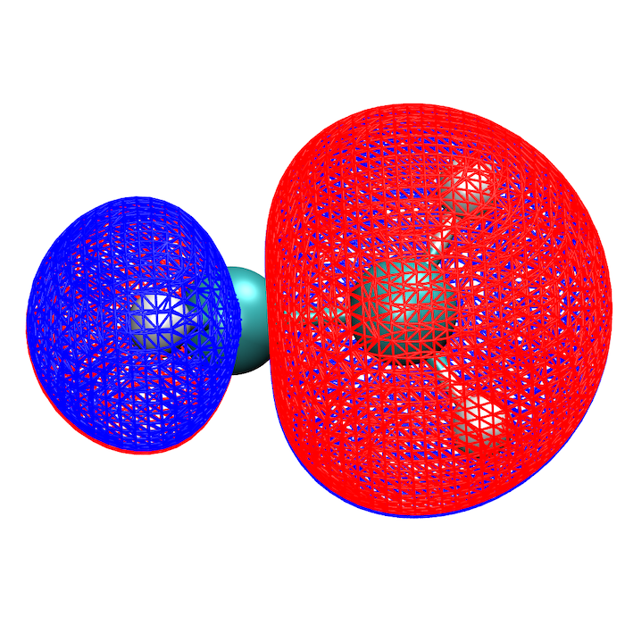
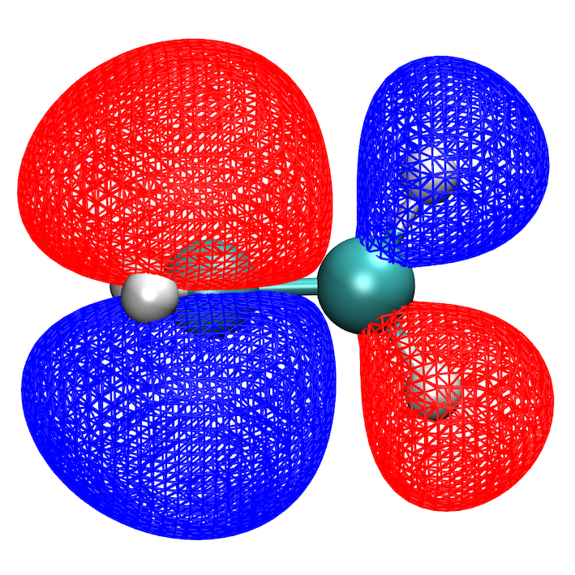

### Planck

[](https://doi.org/10.5281/zenodo.19478938)
[](https://github.com/HemanthHaridas/planck-refactored/actions/workflows/main.yml)
[](https://github.com/HemanthHaridas/planck-refactored/actions/workflows/github-code-scanning/codeql)
[](https://github.com/HemanthHaridas/planck-refactored/actions/workflows/pages/pages-build-deployment)

<p align="justify">
A quantum chemistry program implementing restricted, unrestricted, and restricted open-shell Hartree-Fock SCF and Kohn-Sham DFT with dipole and quadrupole moment analysis, Mulliken population analysis, analytic nuclear gradients, geometry optimization, vibrational frequency analysis, DIIS convergence acceleration, symmetry detection, and binary checkpoint support.
</p>

### Features

<div align="justify">

- **RHF / ROHF / UHF** — closed-shell, restricted open-shell, and unrestricted Hartree-Fock; ROHF uses a Roothaan-type effective Fock construction with aufbau orbital reordering and DIIS convergence
- **RKS / UKS (Kohn-Sham DFT)** — closed-shell and open-shell Kohn-Sham SCF via the `planck-dft` executable; LDA and GGA exchange-correlation functionals through libxc; four grid quality presets (Coarse/Normal/Fine/UltraFine); arbitrary libxc functionals via integer ID
- **Two integral engines** — Obara-Saika for low angular momentum; Rys quadrature for high angular momentum; automatic engine selection per shell quartet (`engine auto`)
- **Electric multipole moments** — dipole and quadrupole moment analysis after SCF convergence for both `hartree-fock` and `planck-dft`
- **Mulliken population analysis** — atomic gross populations, net charges, and (for UHF/ROHF) spin populations; printed when `print_populations true` or verbosity is `verbose`/`debug`
- **Conventional and Direct SCF** — ERI tensor stored once (conventional) or recomputed per iteration (direct); auto-selection based on system size
- **DIIS** — convergence acceleration with optional automatic subspace restart
- **Level shifting** — virtual orbital energy raising for open-shell convergence
- **Symmetry detection** — point group via libmsym; standard-orientation coordinates
- **MO symmetry** — irreducible representation labels assigned to each converged orbital; non-Abelian groups automatically use the largest Abelian subgroup; linear molecules handled separately
- **Post-HF** — RMP2 and UMP2 correlation energy corrections with natural orbital analysis; RCCSD for canonical closed-shell RHF references; teaching-oriented determinant-space UCCSD/UCCSDT prototypes for small UHF systems; RCCSDT with automatic backend dispatch across three tiers (determinant-space prototype, tensor production solver, tensor-optimized ccgen-driven backend); CASSCF and RASSCF multireference active-space calculations
- **Coupled cluster** — `RCCSD` is an iterative spin-orbital amplitude solver for canonical RHF references. `RCCSDT` automatically selects between (1) a determinant-space teaching prototype (≤12 spin orbitals and ≤1200 determinants), (2) a tensor production backend (dressed-intermediate CCSD + staged T3 amplitude updates), and (3) a tensor-optimized backend that consumes ccgen-generated warm-start kernels for restricted references. The backend can be forced via the `PLANCK_RCCSDT_BACKEND` environment variable (`determinant`, `tensor`, or `optimized`). `UCCSD` and `UCCSDT` currently use determinant-space prototypes aimed at small teaching examples and validation studies.
- **ccgen — symbolic coupled-cluster equation generator** — a Python package (`python/ccgen/`) that derives spin-orbital CC residual equations at arbitrary truncation order (CCD through CC6) directly from the normal-ordered Hamiltonian via Baker-Campbell-Hausdorff expansion, Wick contraction, canonicalization, and connectivity filtering. Supports algebraic optimizations (orbital-energy denominator collection, permutation-based term grouping, implicit antisymmetry exploitation), intermediate tensor extraction with layout hints, and four tiers of C++ emission including a Planck-specific tensor emitter that targets `Tensor2D`/`Tensor4D`/`Tensor6D` and the production CC infrastructure in `src/post_hf/cc/`. Used to generate the warm-start kernels consumed by the tensor-optimized RCCSDT backend.
- **RMP2 natural orbitals** — natural orbital occupation numbers and coefficients printed after a single-point RMP2 run
- **CASSCF** — Complete Active Space SCF with full-CI, state-averaged (SA-CASSCF) roots, matrix-free second-order orbital optimization, and a dedicated active-integral-cache transform for the orbital-gradient/response hot path
- **RASSCF** — Restricted Active Space SCF extending CASSCF with RAS1/RAS2/RAS3 subspace partitioning and configurable hole/electron occupation restrictions
- **Analytic nuclear gradients** — RHF and UHF analytic nuclear gradients
- **Geometry optimization** — optimizer in Cartesian coordinates or redundant generalized internal coordinates (GIC); optional constraints (fixed bonds, angles, dihedrals, frozen atoms) via `%begin_constraints`
- **Vibrational frequency analysis** — semi-numerical Hessian from finite differences of analytic gradients; mass-weighted normal mode analysis with translational/rotational projection; frequencies in cm⁻¹ and zero-point energy
- **Checkpoint system** — binary `.hfchk` files; same-basis restart, full geometry+density restart, and cross-basis density projection; `chkdump` tool can export CASSCF active orbital coefficients as volumetric files
- **Basis sets** — STO-3G, 3-21G, 6-31G, 6-31G\*

</div>

### Documentation

- `docs/PLANCK_TEACHING_GUIDE.md` — high-level implementation and usage guide
- `docs/CCGEN_TEACHING_GUIDE.md` — theory-to-code walkthrough of the Python coupled-cluster equation generator
- `docs/README.md` — lightweight static-site export instructions for the documentation set
- `python/README.md` — full usage reference for the ccgen symbolic CC equation generator (API, CLI, emitter tiers, optimization passes, Planck integration workflows)

### Requirements

| Dependency | Version | Source |
|---|---|---|
| C++ compiler | C++23 | GCC ≥ 13 or Clang ≥ 17 |
| CMake | ≥ 3.15 | System package manager |
| Eigen | 3.4.0 | Fetched automatically |
| libmsym | latest | Fetched automatically |
| libxc | latest | Fetched automatically (required for `planck-dft`) |
| basis-set-exchange | any | `pip install basis-set-exchange` (required for basis set fetching) |
| OpenMP | any | Optional; system package manager |

### Installation

### 1. Clone the repository

```bash
git clone https://github.com/HemanthHaridas/planck-refactored.git
cd planck-refactored
```

### 2. Configure

```bash
cmake -B build .
```

<p align="justify">
To disable OpenMP:
</p>

```bash
cmake -B build . -DUSE_OPENMP=OFF
```

<p align="justify">
To set a custom install prefix:
</p>

```bash
cmake -B build . -DCMAKE_INSTALL_PREFIX=/path/to/prefix
```

### 3. Build

```bash
cmake --build build
```

<p align="justify">
The first build fetches and compiles Eigen and libmsym automatically. Subsequent builds are incremental.
</p>

### 4. Install (optional)

```bash
cmake --install build
```

<p align="justify">
This installs the `hartree-fock` executable to `<prefix>/bin/` and the basis set files to `<prefix>/share/basis-sets/`.
</p>

### 5. Run

```bash
./build/hartree-fock molecule.hfinp   # HF / post-HF calculation
./build/planck-dft   molecule.hfinp   # Kohn-Sham DFT calculation
```

### Input File Format

<p align="justify">
Input files use an INI-style block format with the extension `.hfinp`. Each section is delimited by `%begin_[section]` and `%end_[section]` markers. Keywords are case-insensitive; boolean values accept `.true.` / `.false.`.
</p>

```
%begin_control
    ...
%end_control

%begin_scf
    ...
%end_scf

%begin_dft             (required for planck-dft; ignored by hartree-fock)
    ...
%end_dft

%begin_geom
    ...
%end_geom

%begin_coords
<natoms>
<charge>  <multiplicity>
<symbol>  <x>  <y>  <z>
...
%end_coords

%begin_constraints     (optional; IC geomopt only)
    ...
%end_constraints
```

### Section: `%begin_control`

<p align="justify">
General calculation settings.
</p>

| Keyword | Type | Values | Default | Description |
|---|---|---|---|---|
| `basis` | string | `sto-3g`, `3-21g`, `6-31g`, `6-31g*` | — | Basis set name |
| `basis_type` | enum | `cartesian`, `spherical` | `cartesian` | Angular function type. Only Cartesian is fully supported. |
| `calculation` | enum | `energy`/`sp`, `gradient`/`grad`, `geomopt`/`opt`, `freq`/`frequency`, `optfreq`/`geomoptfreq`/`geomopt+freq`, `imagfollow`/`imag_follow`/`irc_follow` | — | Calculation type. `gradient` computes the analytic nuclear gradient and stops. `geomopt` optimizes the geometry. `freq` computes the semi-numerical Hessian and vibrational frequencies. `optfreq` performs geometry optimization followed by frequency analysis. `imagfollow` follows the lowest imaginary frequency mode downhill. |
| `verbosity` | enum | `silent`, `minimal`, `normal`, `verbose`, `debug` | `minimal` | Output level |
| `basis_path` | string | filesystem path | compiled-in | Override the basis set search directory |
| `print_populations` | bool | `.true.`, `.false.` | `.false.` | Print Mulliken population analysis after SCF convergence. Enabled automatically when `verbosity verbose` or `verbosity debug`. |

### Section: `%begin_scf`

<p align="justify">
SCF procedure and convergence settings.
</p>

| Keyword | Type | Values | Default | Description |
|---|---|---|---|---|
| `scf_type` | enum | `rhf`/`rks`, `rohf`, `uhf`/`uks` | `rhf` | Wavefunction type. `rks`/`uks` are aliases for `rhf`/`uhf` when using `planck-dft`. `rohf`: restricted open-shell HF; post-HF and analytic gradients are not yet supported for ROHF. |
| `engine` | enum | `os` / `obara-saika`, `rys`, `auto` | `os` | Two-electron integral engine. `os`: Obara-Saika algorithm. `rys`: Rys quadrature. `auto`: selects the engine per shell quartet based on angular momentum. |
| `correlation` | enum | `rmp2`, `ump2`, `ccsd`, `uccsd`, `ccsdt`, `uccsdt`, `casscf`, `rasscf` | none | Post-HF method. `rmp2`/`ump2`: Møller-Plesset second-order correction. `ccsd`: restricted coupled cluster with singles and doubles for canonical RHF references. `uccsd`: unrestricted coupled cluster with singles and doubles for canonical UHF references; currently implemented as a determinant-space teaching prototype for small systems. `ccsdt`: restricted coupled cluster with singles, doubles, and triples; automatically dispatches to a determinant-space teaching prototype for tiny RHF systems (≤12 spin orbitals and ≤1200 determinants) or to a tensor production backend (dressed-intermediate CCSD followed by staged T3 amplitude updates) for larger systems. A third tensor-optimized backend driven by ccgen-generated warm-start kernels can be forced via the `PLANCK_RCCSDT_BACKEND=optimized` environment variable. `uccsdt`: unrestricted coupled cluster with singles, doubles, and triples for canonical UHF references; currently implemented as a determinant-space teaching prototype for small systems. `casscf`: Complete Active Space SCF (requires `nactele`, `nactorb`). `rasscf`: Restricted Active Space SCF (requires `nactele`, `nactorb`, `nras1`, `nras2`, `nras3`). |
| `nactele` | int | ≥ 1 | — | Number of active electrons for CASSCF/RASSCF |
| `nactorb` | int | ≥ 1 | — | Number of active orbitals for CASSCF/RASSCF |
| `nroots` | int | ≥ 1 | `1` | Number of CI roots for state-averaged CASSCF (SA-CASSCF). `1` = single-state CASSCF. |
| `weights` | float list | space-separated | equal | SA-CASSCF state-averaging weights, one per root. Automatically normalized to sum to 1. Defaults to equal weights if omitted or if the count does not match `nroots`. |
| `core_irrep_counts` | irrep list | `irrep=N ...` | — | Explicit per-irrep counts of doubly occupied (core) orbitals, e.g. `A1=3 B1=1`. Overrides energy-sorted inference. |
| `active_irrep_counts` | irrep list | `irrep=N ...` | — | Explicit per-irrep counts of active orbitals, e.g. `A1=2 B1=2`. Overrides energy-sorted inference. |
| `mo_permutation` | int list | space-separated | — | Zero-based MO indices specifying the reordering applied before the MCSCF loop. |
| `ci_max_dim` | int | ≥ 1 | auto | Maximum Davidson CI subspace dimension. |
| `target_irrep` | string | irrep label | — | Target irrep for CI diagonalization (e.g. `A1`). |
| `max_holes` | int | ≥ 0 | — | RASSCF: maximum number of holes allowed in the RAS1 subspace. |
| `max_elec` | int | ≥ 0 | — | RASSCF: maximum number of electrons allowed in the RAS3 subspace. |
| `mcscf_max_iter` | int | ≥ 1 | `100` | Maximum CASSCF macro-iterations |
| `mcscf_micro_per_macro` | int | ≥ 1 | `4` | Micro-iterations per macro-iteration |
| `tol_mcscf_energy` | float | > 0 | `1e-8` | CASSCF energy convergence threshold in Hartree |
| `tol_mcscf_grad` | float | > 0 | `1e-5` | CASSCF orbital gradient convergence threshold |
| `use_diis` | bool | `.true.`, `.false.` | `.true.` | Enable DIIS convergence acceleration |
| `diis_dim` | int | ≥ 2 | `8` | Maximum DIIS subspace size |
| `diis_restart` | float | ≥ 0 | `2.0` | Clear the DIIS subspace when the error grows by more than this factor relative to the previous iteration. Set to `0` to disable. |
| `level_shift` | float | ≥ 0.0 | `0.0` | Virtual orbital level shift in Hartree. Raises virtual MO energies to widen the HOMO–LUMO gap and suppress orbital swapping. Recommended `0.2`–`0.5` for open-shell systems. Set to `0` to disable. |
| `max_cycles` | int | ≥ 1 | auto | Maximum SCF iterations |
| `tol_energy` | float | > 0 | `1e-10` | Energy convergence threshold in Hartree |
| `tol_density` | float | > 0 | `1e-10` | Density matrix convergence threshold (RMS and max element) |
| `scf_mode` | enum | `conventional`, `direct`, `auto` | `conventional` | ERI strategy. `conventional`: build the full ERI tensor once before the SCF loop (fast per-iteration, higher memory). `direct`: recompute ERIs every iteration (low memory, slower). `auto`: selects based on system size. |
| `tol_eri` | float | > 0 | `1e-10` | ERI screening threshold |
| `threshold` | int | ≥ 1 | `100` | Basis function count cutoff used by `scf_mode auto` to decide between conventional and direct. |
| `guess` | enum | `hcore`, `sad`, `density`, `full` | `hcore` | Initial density guess. `sad`: Superposition of Atomic Densities. `density`: load density matrix from checkpoint. `full`: restore geometry and density from checkpoint. Falls back to `hcore` if the checkpoint is missing or incompatible. Cross-basis projection is applied automatically when the checkpoint basis differs from the current basis. |
| `save_checkpoint` | bool | `.true.`, `.false.` | `.true.` | Write a `.hfchk` checkpoint file after successful convergence |

### Section: `%begin_dft`

<p align="justify">
Kohn-Sham DFT settings. Only read by `planck-dft`; ignored by `hartree-fock`. The `scf_type` keyword in `%begin_scf` controls the reference: `rhf` → RKS (restricted), `uhf` → UKS (unrestricted).
</p>

| Keyword | Type | Values | Default | Description |
|---|---|---|---|---|
| `grid` / `grid_level` | enum | `coarse`, `normal`, `fine`, `ultrafine` | `normal` | Molecular integration grid quality. Higher quality uses more radial shells and angular points; see grid preset table below. |
| `exchange` | enum | `slater`/`lda`, `b88`/`becke88`, `pw91`, `pbe` | `pbe` | Exchange functional |
| `correlation` | enum | `vwn`/`vwn5`, `lyp`, `p86`, `pw91`, `pbe` | `pbe` | Correlation functional |
| `exchange_id` | int | any libxc integer ID | — | Use an arbitrary libxc exchange functional by its integer identifier. Overrides `exchange`. |
| `correlation_id` | int | any libxc integer ID | — | Use an arbitrary libxc correlation functional by its integer identifier. Overrides `correlation`. |
| `use_sao_blocking` | bool | `.true.`, `.false.` | `.true.` | Enable symmetry-adapted AO blocking for the Coulomb matrix assembly. |
| `print_grid_summary` | bool | `.true.`, `.false.` | `.true.` | Print a per-atom grid point count summary before the KS iterations. |
| `save_checkpoint` | bool | `.true.`, `.false.` | `.false.` | Write a `.dftchk` checkpoint file after successful convergence. |

#### DFT grid presets

| Preset | Typical angular pts (heavy atom) | Radial shells |
|---|---|---|
| `coarse` | 110 | ~28–33 |
| `normal` | 194 | ~32–37 |
| `fine` | 302 | ~36–41 |
| `ultrafine` | 590 | ~40–45 |

#### Common functional combinations

| Name | `exchange` | `correlation` | Type |
|---|---|---|---|
| SVWN | `slater` | `vwn5` | LDA |
| BLYP | `b88` | `lyp` | GGA |
| BP86 | `b88` | `p86` | GGA |
| BPW91 | `b88` | `pw91` | GGA |
| PW91 | `pw91` | `pw91` | GGA |
| PBE | `pbe` | `pbe` | GGA (default) |

### Section: `%begin_geom`

<p align="justify">
Molecular geometry options.
</p>

| Keyword | Type | Values | Default | Description |
|---|---|---|---|---|
| `coord_type` | enum | `cartesian`, `zmatrix` / `internal` | `cartesian` | Coordinate specification type |
| `coord_units` | enum | `angstrom`, `bohr` | `angstrom` | Units for input coordinates |
| `use_symm` | bool | `.true.`, `.false.` | `.true.` | Detect molecular point group and reorient to standard frame |
| `opt_coords` | enum | `cartesian`, `internal` / `ic` / `gic` | `cartesian` | Coordinate system for geometry optimization. `cartesian`: Cartesian coordinates. `internal`: redundant generalized internal coordinates (bonds, bends, torsions). Only used when `calculation geomopt`. |
| `imag_follow_step` | float | > 0 | `0.1` | Step size along the imaginary frequency mode for `calculation imagfollow`. |

### Section: `%begin_constraints` (optional)

<p align="justify">
Geometry constraints for IC-BFGS optimization. This section is only valid when `opt_coords internal` and `coord_type zmatrix` are set; the program will exit with an error if constraints are present without both of these options. Atom indices are 1-based. Lines starting with `#` are treated as comments and ignored.
</p>

| Line format | Constraint type | Description |
|---|---|---|
| `b  i  j` | Bond | Fix the distance between atoms `i` and `j` |
| `a  i  j  k` | Angle | Fix the angle at atoms `i`–`j`–`k` (`j` is the vertex) |
| `d  i  j  k  l` | Dihedral | Fix the dihedral angle `i`–`j`–`k`–`l` |
| `f  i` | Frozen atom | Hold all three Cartesian DOFs of atom `i` fixed |

<p align="justify">
Example — fix the O–H bond length (atoms 1–2) and freeze the oxygen (atom 1):
</p>

```
%begin_constraints
    b  1  2   # fix O-H1 bond
    f  1      # freeze oxygen
%end_constraints
```

### Section: `%begin_coords`

<p align="justify">
Molecular geometry specification. The header lines are the same for both coordinate types:
</p>

```
<natoms>
<charge>  <multiplicity>
```

<div align="justify">

- **natoms** — number of atoms (integer)
- **charge** — total molecular charge (integer, can be negative)
- **multiplicity** — spin multiplicity M = 2S+1 (integer ≥ 1; 1 = singlet, 2 = doublet, 3 = triplet)

</div>

#### Cartesian format (`coord_type cartesian`)

```
<symbol>  <x>  <y>  <z>
...
```

<p align="justify">
Each subsequent line gives the element symbol and x, y, z coordinates in the units from `coord_units`.
</p>

#### Z-matrix format (`coord_type zmatrix`)

```
<symbol>
<symbol>  <i1>  <r>
<symbol>  <i1>  <r>   <i2>  <angle>
<symbol>  <i1>  <r>   <i2>  <angle>   <i3>  <dihedral>
...
```

<div align="justify">

- `i1`, `i2`, `i3` — 1-based indices of reference atoms
- `r` — bond length to atom `i1` (units from `coord_units`)
- `angle` — bond angle at `i1` relative to `i2` (degrees)
- `dihedral` — dihedral angle about the `i1`–`i2` bond relative to `i3` (degrees)

</div>

<p align="justify">
Example (water):
</p>

```
3
0   1
O
H  1  0.9572
H  1  0.9572  2  104.52
```

### Basis Sets

<p align="justify">
Basis set files are in Gaussian94 (`.gbs`) format and are installed to `<prefix>/share/basis-sets/`. The build system fetches missing basis sets automatically from the [Basis Set Exchange](https://www.basissetexchange.org/) before compiling.
</p>

#### Prerequisite — `basis-set-exchange`

<p align="justify">
The automatic fetch requires the `bse` command-line tool, which is part of the `basis-set-exchange` Python package. Install it once before building:
</p>

```bash
pip install basis-set-exchange
```

<p align="justify">
Verify the install:
</p>

```bash
bse --version
```

#### How automatic fetching works

<p align="justify">
The file `basis-sets/basis` is a plain-text manifest — one basis set name per line. Missing basis sets are downloaded automatically during the first `cmake --build build`. Already-present files are never re-fetched. You can also trigger the fetch manually:
</p>

```bash
cmake --build build --target fetch-basis-sets
```

#### Adding a new basis set

<div align="justify">

1. Add its name (exactly as `bse` recognises it) on a new line in `basis-sets/basis`.
2. Re-run `cmake --build build` — the missing file is fetched and the build proceeds.

</div>

#### Included basis sets

| Family | Sets |
|---|---|
| STO-nG (minimal) | `STO-2G`, `STO-3G`, `STO-3G*`, `STO-4G`, `STO-5G`, `STO-6G` |
| Pople split-valence | `3-21G`, `4-31G`, `5-21G`, `6-21G`, `6-31G`, `6-31G*`, `6-31G**`, `6-31G(d,p)`, `6-31G(2df,p)`, `6-31G(3df,3pd)`, `6-31+G`, `6-31+G*`, `6-31+G**`, `6-31++G`, `6-31++G*`, `6-31++G**`, and J-basis variants |
| Pople triple-zeta | `6-311G`, `6-311G*`, `6-311G**`, `6-311G(d,p)`, `6-311G(2df,2pd)`, `6-311+G`, `6-311+G*`, `6-311+G**`, `6-311++G`, `6-311++G*`, `6-311++G**`, `6-311++G(2d,2p)`, `6-311++G(3df,3pd)`, and J/RIFIT variants |
| Dunning cc | `cc-pVDZ`, `cc-pVTZ`, `cc-pVQZ`, `cc-pV5Z`, `cc-pV6Z`, `cc-pV8Z`, `cc-pV9Z` |
| Core-valence Dunning | `cc-pCVDZ`, `cc-pCVTZ`, `cc-pCVQZ`, `cc-pCV5Z` |
| Augmented Dunning | `aug-cc-pVDZ`, `aug-cc-pVTZ`, `aug-cc-pVQZ`, `aug-cc-pV5Z`, `aug-cc-pV6Z`, `aug-cc-pV7Z` |
| Augmented core-valence Dunning | `aug-cc-pCVDZ`, `aug-cc-pCVTZ`, `aug-cc-pCVQZ`, `aug-cc-pCV5Z` |

### Checkpoint System

<p align="justify">
After a successful SCF, a binary checkpoint file `<input_stem>.hfchk` is written automatically (when `save_checkpoint .true.`).
</p>

### Same-basis restart

<p align="justify">
Set `guess read` in the next run with the same basis and geometry to restart from the saved density.
</p>

### Cross-basis projection (density projection)

<p align="justify">
To warm-start a larger basis from a converged smaller-basis checkpoint:
</p>

<div align="justify">

1. Converge in the small basis with `save_checkpoint .true.`
2. Change `basis` to the larger set and add `guess read`
3. Run — Planck detects the basis-size mismatch and projects the density into the new basis automatically
</div>

### Examples

### RHF single point — water, STO-3G

```
%begin_control
    basis       sto-3g
    calculation energy
    verbosity   normal
    basis_type  cartesian
%end_control

%begin_scf
    scf_type    rhf
    use_diis    .true.
    diis_dim    8
    engine      os
%end_scf

%begin_geom
    coord_type  cartesian
    coord_units angstrom
    use_symm    .true.
%end_geom

%begin_coords
3
0   1
O     0.000000    0.000000     0.117176
H     0.000000    0.756950    -0.468703
H     0.000000   -0.756950    -0.468703
%end_coords
```

<p align="justify">
After the converged energy table, Planck prints a dipole and quadrupole report automatically. The dipole block includes electronic, nuclear, and total components in atomic units and Debye. The quadrupole block reports the traceless Cartesian tensor in atomic units.
</p>

### RKS single point — water, PBE/STO-3G

<p align="justify">
Run with `./build/planck-dft water_dft.hfinp`. The `%begin_dft` block selects the functional and grid; `scf_type rhf` in `%begin_scf` selects the RKS (restricted) reference.
</p>

```
%begin_control
    basis       sto-3g
    calculation energy
    verbosity   normal
    basis_type  cartesian
%end_control

%begin_scf
    scf_type    rhf
    use_diis    .true.
    diis_dim    8
    engine      os
%end_scf

%begin_dft
    exchange    pbe
    correlation pbe
    grid        normal
%end_dft

%begin_geom
    coord_type  cartesian
    coord_units angstrom
    use_symm    .true.
%end_geom

%begin_coords
3
0   1
O     0.000000    0.000000     0.117176
H     0.000000    0.756950    -0.468703
H     0.000000   -0.756950    -0.468703
%end_coords
```

### RKS single point — water, SVWN/STO-3G (pure LDA)

```
%begin_dft
    exchange    slater
    correlation vwn5
    grid        normal
%end_dft
```

### UHF triplet — open-shell water, 6-31G

```
%begin_control
    basis       6-31g
    calculation energy
    verbosity   normal
    basis_type  cartesian
%end_control

%begin_scf
    scf_type     uhf
    use_diis     .true.
    diis_dim     8
    engine       os
    level_shift  0.3
    diis_restart 2.0
%end_scf

%begin_geom
    coord_type  cartesian
    coord_units angstrom
    use_symm    .true.
%end_geom

%begin_coords
3
0   3
O     0.000000    0.000000     0.117176
H     0.000000    0.756950    -0.468703
H     0.000000   -0.756950    -0.468703
%end_coords
```

### ROHF doublet — water radical cation, STO-3G

```
%begin_control
    basis       sto-3g
    calculation energy
    verbosity   normal
    basis_type  cartesian
%end_control

%begin_scf
    scf_type         rohf
    use_diis         .true.
    diis_dim         8
    engine           os
    print_populations .true.
%end_scf

%begin_geom
    coord_type  cartesian
    coord_units angstrom
    use_symm    .true.
%end_geom

%begin_coords
3
1   2
O     0.000000    0.000000     0.117176
H     0.000000    0.756950    -0.468703
H     0.000000   -0.756950    -0.468703
%end_coords
```

### Analytic gradient — water, STO-3G

```
%begin_control
    basis       sto-3g
    calculation gradient
    verbosity   normal
    basis_type  cartesian
%end_control

%begin_scf
    scf_type    rhf
    use_diis    .true.
    diis_dim    8
    engine      os
%end_scf

%begin_geom
    coord_type  cartesian
    coord_units angstrom
    use_symm    .false.
%end_geom

%begin_coords
3
0   1
O     0.000000     0.000000     0.100000
H     0.800000     0.000000    -0.500000
H    -0.800000     0.000000    -0.500000
%end_coords
```

### Geometry optimization — Cartesian

<p align="justify">
Set `calculation geomopt`. The optimizer converges when the maximum Cartesian gradient component falls below `grad_tol` (default 3×10⁻⁴ Ha/Bohr):
</p>

```
%begin_control
    basis       sto-3g
    calculation geomopt
    verbosity   normal
    basis_type  cartesian
%end_control

%begin_scf
    scf_type    rhf
    use_diis    .true.
    diis_dim    8
    engine      os
    guess       hcore
%end_scf

%begin_geom
    coord_type  cartesian
    coord_units angstrom
    use_symm    .false.
%end_geom

%begin_coords
3
0   1
O     0.000000     0.000000     0.100000
H     0.800000     0.000000    -0.500000
H    -0.800000     0.000000    -0.500000
%end_coords
```

### Geometry optimization — internal coordinates (GIC)

<p align="justify">
Add `opt_coords internal` in `%begin_geom`. Bonds, valence bends, and proper torsions are detected automatically:
</p>

```
%begin_geom
    coord_type  cartesian
    coord_units angstrom
    use_symm    .false.
    opt_coords  internal
%end_geom
```

### Constrained geometry optimization — fixed bond

<p align="justify">
Requires `opt_coords internal` and `coord_type zmatrix`. The `%begin_constraints` block lists one constraint per line using 1-based atom indices. Here both O–H bonds are held fixed:
</p>

```
%begin_control
    basis       sto-3g
    calculation geomopt
    verbosity   normal
    basis_type  cartesian
%end_control

%begin_scf
    scf_type    rhf
    use_diis    .true.
    diis_dim    8
    engine      os
    guess       hcore
%end_scf

%begin_geom
    coord_type  zmatrix
    coord_units angstrom
    use_symm    .false.
    opt_coords  internal
%end_geom

%begin_coords
3
0   1
O
H  1  0.9572
H  1  0.9572  2  104.52
%end_coords

%begin_constraints
    b  1  2   # fix O-H1 bond length
    b  1  3   # fix O-H2 bond length
%end_constraints
```

### Vibrational frequency analysis — water, STO-3G

<p align="justify">
Set `calculation freq` to compute a semi-numerical Hessian and perform normal mode analysis. For best results run at an optimized geometry:
</p>

```
%begin_control
    basis       sto-3g
    calculation freq
    verbosity   normal
    basis_type  cartesian
%end_control

%begin_scf
    scf_type    rhf
    use_diis    .true.
    diis_dim    8
    engine      os
    guess       hcore
%end_scf

%begin_geom
    coord_type  cartesian
    coord_units angstrom
    use_symm    .false.
%end_geom

%begin_coords
3
0   1
O     0.000000     0.000000     0.000000
H     0.000000     0.756951     0.585766
H     0.000000    -0.756951     0.585766
%end_coords
```

<p align="justify">
Expected output at the HF/STO-3G optimized geometry:
</p>

```
[INF]  Vibrational Frequencies :
[INF]    Molecule: non-linear (6 T+R modes removed, 3 vibrational modes)
[INF]      Mode    Frequency (cm⁻¹)
[INF]         1         1749.xx
[INF]         2         3949.xx
[INF]         3         4131.xx
[INF]  Zero-point energy :  0.020xxx Eh  (12.xx kcal/mol)
```

<p align="justify">
The finite-difference step size can be changed with `hessian_step` in `%begin_control` (default 5×10⁻³ Bohr). Imaginary frequencies are printed as negative values.
</p>

### CASSCF active-space — water, CAS(4,4)/STO-3G

<p align="justify">
Set `correlation casscf` and specify the active space with `nactele` and `nactorb`. The CASSCF wavefunction is built on top of a converged RHF reference:
</p>

```
%begin_control
    basis       sto-3g
    calculation energy
    verbosity   normal
    basis_type  cartesian
%end_control

%begin_scf
    scf_type           rhf
    correlation        casscf
    use_diis           .true.
    diis_dim           8
    engine             os
    guess              hcore
    nactele            4
    nactorb            4
    nroots             1
    mcscf_max_iter     200
    mcscf_micro_per_macro  4
    tol_mcscf_energy   1e-8
    tol_mcscf_grad     1e-4
%end_scf

%begin_geom
    coord_type  cartesian
    coord_units angstrom
    use_symm    .true.
%end_geom

%begin_coords
3
0   1
O    0.000000    0.000000    0.117176
H    0.000000    0.757005   -0.468704
H    0.000000   -0.757005   -0.468704
%end_coords
```

<p align="justify">
Expected energy: `E(CASSCF) ≈ -75.9851 Eh` for H₂O CAS(4,4)/STO-3G.
</p>

### CASSCF correlated π-orbitals — twisted ethylene, CAS(2,2)/STO-3G

<p align="justify">
Twisted ethylene (90° C–C torsion) is a classic multireference system: at the perpendicular geometry the π and π* orbitals become exactly degenerate, making a single-determinant RHF description qualitatively wrong. A CAS(2,2) active space — two electrons in the two frontier π-type orbitals — correctly captures this near-degeneracy correlation.
</p>

<p align="justify">
The two active π-type orbitals are exactly degenerate at the 90° twisted geometry. The CASSCF wavefunction distributes the two active electrons equally across both orbitals, recovering the correct diradical character of the twisted state.
</p>

| MO 8 (π-type active orbital) | MO 9 (π-type active orbital) |
|:---:|:---:|
|  |  |

<p align="justify">
The two orbitals are degenerate at the 90° twisted geometry and together span the active space of the CAS(2,2) wavefunction. Visualized from a CASSCF/STO-3G checkpoint using `chkdump --casscf-active` and rendered in VMD.
</p>

### Coupled cluster — RCCSDT on a small closed-shell system

<p align="justify">
Enable restricted CCSDT by setting <code>correlation ccsdt</code> on a converged RHF reference. The solver automatically picks the determinant-space prototype for tiny systems (≤12 spin orbitals and ≤1200 determinants) and the tensor production backend for larger ones. After convergence the CCSD reference correlation energy, the CCSDT correlation increment, and the total CCSDT energy are printed together.
</p>

```
%begin_control
    basis       sto-3g
    calculation energy
    verbosity   normal
    basis_type  cartesian
%end_control

%begin_scf
    scf_type    rhf
    correlation ccsdt
    use_diis    .true.
    diis_dim    8
    engine      os
%end_scf

%begin_geom
    coord_type  cartesian
    coord_units angstrom
    use_symm    .true.
%end_geom

%begin_coords
3
0   1
O     0.000000    0.000000     0.117176
H     0.000000    0.756950    -0.468703
H     0.000000   -0.756950    -0.468703
%end_coords
```

#### Forcing a specific RCCSDT backend

<p align="justify">
The automatic dispatch can be overridden at runtime by exporting <code>PLANCK_RCCSDT_BACKEND</code> before invoking <code>hartree-fock</code>:
</p>

| Value | Backend |
|---|---|
| `determinant` / `determinant_prototype` | Teaching-oriented determinant-space solver (small systems only) |
| `tensor` / `tensor_production` | Dense tensor production backend (dressed-intermediate CCSD + staged T3 updates) |
| `optimized` / `tensor_optimized` | Phase-4 tensor-optimized backend that consumes ccgen-generated warm-start kernels (experimental for restricted CCSDT triples) |

```bash
PLANCK_RCCSDT_BACKEND=optimized ./build/hartree-fock mol.hfinp
```

### Symbolic CC equation generation — `ccgen`

<p align="justify">
The <code>python/ccgen/</code> package derives spin-orbital coupled-cluster residual equations at arbitrary truncation order (CCD, CCSD, CCSDT, CCSDTQ, CC5, CC6) from the normal-ordered Hamiltonian, applies optional algebraic optimizations, and emits production code in several formats. See <code>python/README.md</code> for the full reference.
</p>

Install locally:

```bash
cd python
pip install -e .
```

Quick examples:

```bash
# Human-readable CCSD equations
python generate_ccsdt_cpp.py ccsd --pretty

# NumPy einsum form with opt_einsum contraction paths
python generate_ccsdt_cpp.py ccsd --einsum --opt-einsum

# Tiled + OpenMP C++ output with denominator collection
python generate_ccsdt_cpp.py ccsd --tiled --collect-denominators

# Planck-specific tensor kernels targeting src/post_hf/cc/ infrastructure
python generate_ccsdt_cpp.py ccsdt --planck

# Generate Planck-compatible .cpp kernel files
python generate_planck_cc_kernels.py --output-dir build/ --methods ccsd ccsdt

# Generate the spin-orbital CCSD warm-start .inc file used by the tensor-optimized RCCSDT backend
python generate_spinorbital_ccsd_warm_start.py --output ccsd_warm_start.inc
```

Programmatic API:

```python
from ccgen import generate_cc_equations
from ccgen.generate import print_equations, print_cpp_planck

# Apply algebraic optimizations at generation time
eqs = generate_cc_equations(
    "ccsd",
    collect_denominators=True,
    permutation_grouping=True,
)

print(print_equations("ccsd"))
print(print_cpp_planck("ccsdt", include_intermediates=True))
```

### Cross-basis restart — STO-3G → 6-31G

<p align="justify">
Run STO-3G first (saves `mol.hfchk`), then change the basis and add `guess read`:
</p>

```
%begin_control
    basis       6-31g       # changed from sto-3g
    calculation energy
    verbosity   normal
    basis_type  cartesian
%end_control

%begin_scf
    scf_type    rhf
    use_diis    .true.
    engine      os
    guess       read        # reads mol.hfchk, projects density into 6-31G
%end_scf
...
```

### Output

<p align="justify">
The program prints a structured log to standard output. Key sections:
</p>

<div align="justify">

- **Input Parsing** — confirms input was read successfully
- **Symmetry Detection** — detected point group
- **Basis Construction** — number of shells and contracted functions
- **1e Integrals** — overlap, kinetic, nuclear attraction
- **2e Integrals** — ERI tensor size and build status (conventional mode only)
- **SCF Iterations** — energy, ΔE, RMS(ΔP), Max(ΔP), DIIS error, wall time per iteration
- **MO Energies** — orbital energies in Hartree with HOMO/LUMO labels and irrep labels when symmetry is enabled
- **⟨S²⟩ / ⟨S⟩** — spin contamination diagnostics (UHF only)
- **Converged Energy** — total energy in Hartree, eV, and kcal/mol; MP2 correlation and corrected total if post-HF enabled
- **Dipole Moment** — printed automatically after a converged SCF/KS solution; includes the electronic, nuclear, and total `X`, `Y`, `Z` components in atomic units, plus the total vector norm in atomic units and Debye
- **Quadrupole Moment** — printed automatically after the dipole block; includes electronic, nuclear, and total components of the traceless Cartesian tensor (`XX`, `XY`, `XZ`, `YY`, `YZ`, `ZZ`) in atomic units
- **Mulliken Population Analysis** — printed when `print_populations true` or verbosity is `verbose`/`debug`; shows AO gross populations, net atomic charges, and spin populations (UHF/ROHF)
- **RMP2 Natural Orbitals** — occupation numbers and natural orbital coefficients printed after single-point RMP2
- **Nuclear Gradient** — printed when `calculation gradient` or `calculation geomopt`; one row per atom showing ∂E/∂x, ∂E/∂y, ∂E/∂z in Ha/Bohr, followed by max and RMS norms
- **IC System** — when `opt_coords internal`, logs the count of stretches, bends, and torsions in the redundant GIC set
- **Opt Step N** — per-step log line: energy, max Cartesian gradient, and RMS IC gradient (IC mode) or RMS Cartesian gradient (Cartesian mode)
- **Optimized Geometry** — final Cartesian coordinates in Bohr after convergence
- **Vibrational Frequencies** — when `calculation freq`: molecule type (linear/non-linear), number of T+R modes removed, n_vib vibrational frequencies in cm⁻¹ (negative = imaginary), and zero-point energy in Eh and kcal/mol
- **Wall Time** — total elapsed time

</div>

<p align="justify">
For `planck-dft` runs, the log additionally includes:
</p>

<div align="justify">

- **Theory / Reference** — `Kohn-Sham DFT` and `RKS` or `UKS`
- **DFT Grid** — selected grid preset name
- **Exchange / Correlation** — functional names resolved at startup
- **Grid Summary** — per-atom point count table (when `print_grid_summary .true.`): atom index, element, atomic number, number of grid points
- **Integrated Electrons** — electron count from numerical density integration
- **XC Energy** — exchange-correlation energy contribution in Hartree
- **DFT Energy** — total Kohn-Sham energy in Hartree
- **Dipole / Quadrupole Moments** — same post-SCF multipole report as for HF

</div>

### Section: `%begin_control` (additional keywords)

| Keyword | Type | Default | Description |
|---|---|---|---|
| `grad_tol` | float | `3e-4` | Geometry optimization convergence threshold: maximum Cartesian gradient component in Ha/Bohr |
| `max_geomopt_iter` | int | `50` | Maximum number of geometry optimization steps |
| `hessian_step` | float | `5e-3` | Finite-difference step size in Bohr for the semi-numerical Hessian |

### Build Options

| CMake variable | Default | Description |
|---|---|---|
| `USE_OPENMP` | `ON` | Enable OpenMP parallelism for integral loops (applies to both `hartree-fock` and `planck-dft`) |
| `BUILD_TOOLS` | `ON` | Build utility tools (`chkdump` checkpoint formatter) |
| `CMAKE_INSTALL_PREFIX` | `./install` | Installation prefix |

<p align="justify">
Both executables (`hartree-fock` and `planck-dft`) are built and installed by default. `planck-dft` requires libxc, which is fetched and compiled automatically as an ExternalProject during the first build.
</p>

### Utility Tools

### `chkdump`

<p align="justify">
Converts a binary `.hfchk` checkpoint file to formatted human-readable text:
</p>

```bash
./build/chkdump mol.hfchk            # → stdout
./build/chkdump mol.hfchk mol.txt    # → file
```

<p align="justify">
Output includes: format version, SCF type, convergence status, total energy, nuclear repulsion, geometry (with element symbols), MO energies with HOMO/LUMO labels, overlap matrix, core Hamiltonian, density matrix, Fock matrix, and MO coefficients.
</p>

<p align="justify">
For CASSCF checkpoints, `chkdump` additionally writes the converged active orbitals and generates a Gaussian CUBE file for each active orbital, allowing direct visualization of the active-space wavefunctions in external molecular visualization tools (e.g. VESTA, VMD, Avogadro):
</p>

```bash
./build/chkdump mol.hfchk --casscf-active           # writes mol_active_orb_<i>.cube for each active orbital
```

<p align="justify">
Disable with `-DBUILD_TOOLS=OFF`.
</p>
