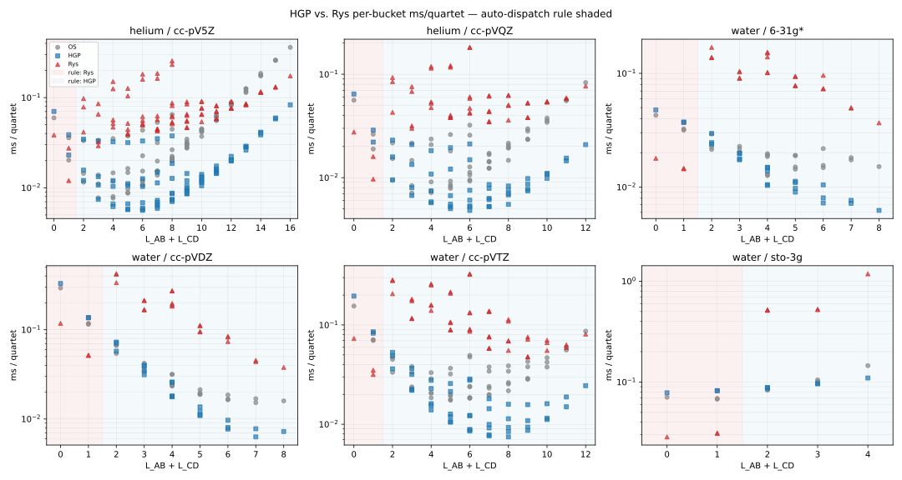

# Planck Teaching Guide

A complete theory-to-code walkthrough of the Planck quantum chemistry program.
Intended for students learning Hartree-Fock and post-HF methods, contributors
reading the source, and researchers auditing the implementation.

## 1. What Planck Is

Planck is a compact electronic structure program built around Gaussian-basis
self-consistent field theory. It implements:

- Restricted and unrestricted Hartree-Fock (RHF/UHF) with DIIS acceleration
- Kohn-Sham DFT (RKS/UKS) with LDA, GGA, hybrid, range-separated-hybrid, and double-hybrid exchange-correlation functionals via libxc
- Obara-Saika, Head-Gordon-Pople, and Rys-quadrature two-electron integral engines
- Cartesian and real spherical-harmonic Gaussian basis functions
- Conventional (stored ERI tensor) and direct (on-the-fly Fock build) SCF
- Point-group detection, symmetry-adapted orbitals, and MO irrep labeling
- RMP2 and UMP2 correlation energies with RMP2 natural orbital analysis
- Density-fitted (RI) integrals: RI-MP2 energies and gradients, an RI-JK Fock builder, and RI-routed CASSCF/FCI
- RCCSD for canonical closed-shell RHF references
- Small-system determinant-space teaching prototypes for RCCSDT, UCCSD, and UCCSDT
- Coupled-cluster kernels **generated at build time** by `ccgen`, to arbitrary
  excitation rank: restricted (`cc3`-`cc6`) and, opt-in, unrestricted
  (`ucc2`-`ucc6`). Optionally dressed and OpenMP-threaded
- Analytic RHF, UHF, ROHF, RKS, UKS, RMP2, and UMP2 nuclear gradients
- Analytic RMP2 nuclear gradients include Z-vector / CPHF relaxation
- Geometry optimization in Cartesian and internal coordinates
- Semi-numerical Hessians and harmonic vibrational analysis
- CASSCF and RASSCF active-space multiconfigurational SCF, and full CI
- Binary checkpoint save/restart with cross-basis Löwdin projection
- A memory-direct Fock build that never allocates the \(n_b^4\) ERI tensor, shared by all four integral engines
- Optional MPI distribution of the direct-SCF Fock build

### The three binaries

| Binary | Entry point | Purpose |
|---|---|---|
| `hartree-fock` | `src/driver.cpp` → `HartreeFock::Driver::run` (`src/hf_driver.cpp`) | HF, post-HF, gradients, geomopt, frequencies |
| `planck-dft` | `src/dft/main.cpp` → `DFT::Driver::run` (`src/dft/driver.cpp`) | Kohn-Sham DFT and TD-DFT |
| `planck-mpi` | `src/mpi/main.cpp` | Unified MPI front end; dispatches to *either* of the above based on `Calculator::is_dft_run()`. Built only with `-DBUILD_MPI=ON` |

All three share the same compute layer. The central data object is
`HartreeFock::Calculator` in `src/base/types.h`, which carries all options,
molecular data, basis data, SCF state, and results, and is common to every
pipeline. The MPI surface is confined to `src/base/mpi_env.h`, which compiles to
no-ops in the two serial binaries — so the integral and SCF kernels carry
identical source in all three, with no runtime cost off the MPI path.

A Python front end (`python/planck.py`) drives either serial binary and returns
results as a dict, parsed from the binary's `--json` dump rather than scraped
from the human-readable log.

## 2. Architecture Overview

### Data Flow

```
Input file (.hfinp)
  → parse (src/io/io.cpp)
  → Molecule + options in Calculator
  → coordinate conversion + symmetry detection (src/symmetry/)
  → GBS basis reading + normalization (src/basis/)
  → shell-pair construction (src/integrals/shellpair.cpp)
  → one-electron integrals S, T, V (src/integrals/os.cpp)
  → optional SAO basis construction (src/symmetry/mo_symmetry.cpp)
  → SCF loop (src/scf/scf.cpp)
       ├── conventional:  build the full ERI tensor once, reuse it
       ├── direct:        rebuild G(P) each iteration, memory-direct — each
       │                  quartet is contracted straight into F and the nb^4
       │                  tensor is never allocated (src/integrals/fused_fock.h)
       └── RI:            fitted 3-center factors instead of 4-center ERIs
                          (src/post_hf/ri/ri_eri.cpp)
  → post-HF: MP2, coupled cluster, FCI, or CASSCF (src/post_hf/)
  → gradient (src/gradient/)
  → geometry optimization (src/opt/)
  → frequency analysis (src/freq/)
  → checkpoint write (src/io/checkpoint.cpp)
```

One part of this is not in the repository. **The coupled-cluster kernels above
rank 3 are generated at build time**, not written by hand:

```
CMake configure
  → ccgen (python/ccgen/) derives the CC equations symbolically
  → emits C++ into build/generated/cc/*_planck_generated.cpp
  → those are #include'd by src/post_hf/cc/generated_kernel_registry.cpp
  → compiled into hartree-fock like any other source
```

So `grep`ping `src/` for a quadruples residual finds nothing: it is emitted by
`python/ccgen/emit/planck_tensor_cpp.py` during the build. §16 covers which
methods come from where; `docs/CCGEN_TEACHING_GUIDE.md` covers the generator
itself.

### Directory Summary

| Directory | Contents |
|---|---|
| `src/base` | `types.h` (all structs/enums/Calculator), `tables.h`, `basis.h`, `mpi_env.h` (the whole MPI surface) |
| `src/io` | input parsing, checkpoint I/O, logging, FCIDUMP export, JSON results |
| `src/basis` | GBS file reading, primitive normalization, contraction, cart→spherical transform, RI auxiliary-basis loading |
| `src/integrals` | shell pairs, Obara-Saika OS engine, Head-Gordon-Pople (HGP) engine, Rys quadrature engine, and the shared memory-direct fused Fock loop (`fused_fock.h`, `fock_accumulate.h`) |
| `src/scf` | orthogonalizer, initial guess (H\(_{core}\)/SAD), RHF/UHF/ROHF SCF loops, DIIS, stability analysis |
| `src/symmetry` | libmsym wrapper, SAO basis, MO labeling, integral sym ops, full point-group ERI reduction |
| `src/post_hf` | MP2 energy/gradient, RCCSD/UCCSD/RCCSDT/UCCSDT/RCCSDTQ, FCI, CASSCF/RASSCF, AO→MO transforms, CPHF |
| `src/post_hf/ci` | the shared CI engine (determinant strings, sigma build, Davidson, RDMs) used by both FCI and CASSCF |
| `src/post_hf/ri` | density fitting: 2c/3c integrals, metric factorization, fitted factors, RI-JK, RI derivative integrals and gradient |
| `src/gradient` | analytic RHF, UHF, ROHF, RMP2, and UMP2 gradients |
| `src/opt` | L-BFGS/BFGS optimizer, internal coordinates, constraints |
| `src/freq` | finite-difference Hessian, vibrational analysis |
| `src/solvation` | C-PCM cavity, influence matrix, reaction-field operator (shared by HF and DFT) |
| `src/bsse` | ghost atoms and the counterpoise driver |
| `src/populations` | Mulliken, Löwdin, Mayer bond orders |
| `src/dft` | Kohn-Sham DFT pipeline: molecular grid, AO evaluation, XC matrix, analytic KS gradients, TD-DFT, KS driver |
| `src/dft/base` | grid construction headers: radial (Treutler-Ahlrichs), angular (Lebedev), Becke partition, libxc wrapper |
| `src/mpi` | the `planck-mpi` unified front end |
| `python/` | the Python front end (`planck.py`) and `ccgen`, the CC equation generator |
| `build/generated/cc/` | **not in the repository** — the CC kernels ccgen emits at build time, compiled into the binary via `src/post_hf/cc/generated_kernel_registry.cpp` |

## 3. Core Data Structures

### `Molecule`

Holds atomic numbers, charge, multiplicity, and three coordinate
representations that are easy to confuse:

- `coordinates` — user-input geometry in Angstrom
- `_coordinates` — same in Bohr, set by `prepare_coordinates()`
- `standard` — symmetry-standard orientation in Angstrom (set by `detectSymmetry()`)
- `_standard` — symmetry-standard orientation in Bohr (used by all integrals)

Basis centers and the nuclear repulsion sum both use `_standard`. Moving
a geometry (e.g. in a geometry optimization step) must update `_standard`.

### `Shell` and `ContractedView`

`Shell` stores the angular momentum type (`ShellType::S/P/D/F/G/H`), center
position in Bohr, atom index, primitive exponents, contracted coefficients (with
the contracted norm \(N_c\) pre-folded in), and per-primitive normalizations.

`ContractedView` is a lightweight reference into one Cartesian component of one
shell: it holds a pointer to its parent `Shell`, the Cartesian exponent triple
\((l_x, l_y, l_z)\), its global AO index `_index`, and a component norm factor.
The `shell_pairs` array is a flat list of all unique `(ContractedView_i,
ContractedView_j)` pairs with \(i \le j\), one entry per unique AO pair.

### `ShellPair`

Precomputed data for one pair of contracted AOs:

- `R = A - B`, `R2 = |R|^2`
- a `primitive_pairs` vector, one entry per \((\alpha_i, \beta_j)\) combination
- each `PrimitivePair` stores combined exponent \(\zeta = \alpha + \beta\),
  the Gaussian product center \(\mathbf P\), displacements \(\mathbf{PA}\) and
  \(\mathbf{PB}\), prefactor, and contracted coefficient product

The Gaussian product theorem guarantees that the product of two Gaussians on
different centers is a Gaussian on their weighted center, so precomputing these
quantities once is a large speedup.

### `Calculator`

The top-level object. Owns everything: options structs
(`OptionsSCF`, `OptionsBasis`, `OptionsGeometry`, `OptionsIntegral`,
`OptionsOutput`, `OptionsDFT`), `Molecule`, `Basis`, `DataSCF`, all integral
matrices (`_overlap`, `_hcore`, `_eri`), energies, gradient, Hessian, SAO data,
integral symmetry ops, and active-space results.

`OptionsDFT` holds the DFT-specific settings: `_grid` (grid quality enum),
`_exchange` and `_correlation` (XC functional enums), optional raw libxc integer
IDs (`_exchange_id`, `_correlation_id`), and boolean flags for SAO blocking,
grid printing, and checkpoint saving.

### FCIDUMP as an Interchange Format

One important idea in quantum chemistry software is that the expensive part is
often not the many-body solver itself, but the preparation of a good
molecular-orbital Hamiltonian:

- choose a basis,
- solve SCF,
- transform the one- and two-electron integrals from AO basis to MO basis,
- package the Hamiltonian in a form another program can read.

`FCIDUMP` is the standard text format for that last step. Historically it comes
from the MOLPRO ecosystem, but in practice it has become the common interchange
format for external determinant-based solvers such as FCI, selected CI, DMRG,
and FCIQMC codes. The main conceptual point is:

> An FCIDUMP file does not store a wavefunction. It stores the second-quantized
> electronic Hamiltonian in a chosen orthonormal spatial-orbital basis.

In that basis, the nonrelativistic electronic Hamiltonian is

\[
\hat H = E_{nuc}
+ \sum_{ij} h_{ij}\, a_i^\dagger a_j
+ \frac{1}{2}\sum_{ijkl} (ij|kl)\,
  a_i^\dagger a_k^\dagger a_l a_j
\]

where:

- \(E_{nuc}\) is the scalar nuclear repulsion energy,
- \(h_{ij}\) are the one-electron matrix elements in the MO basis,
- \((ij|kl)\) are the two-electron repulsion integrals in chemists' notation.

That is exactly the information an exact diagonalizer or approximate CI-style
solver needs. So an FCIDUMP lets one program do the SCF + integral work and a
different program do the many-electron solve.

In Planck, the exporter lives in `src/io/fcidump.{h,cpp}`. After a converged
SCF, it writes:

- an `&FCI` header with `NORB`, `NELEC`, `MS2`, `ORBSYM`, and `ISYM`,
- the unique MO-basis two-electron integrals,
- the unique MO-basis one-electron integrals,
- the nuclear repulsion energy as the final scalar record.

The body uses the standard FCIDUMP convention:

- two-electron entries are written as `value  i  j  k  l`,
- one-electron entries are marked by `k=l=0`,
- the scalar constant term is marked by `i=j=k=l=0`,
- orbital indices are 1-based.

Planck writes only the symmetry-unique subset of the two-electron tensor, using
the usual 8-fold permutation symmetry of a real restricted Hamiltonian. A
reader reconstructs the rest from those symmetry relations.

There are two practical restrictions worth remembering:

1. Planck currently exports only converged **RHF** and **ROHF** references.
   This is because the standard FCIDUMP layout assumes one common set of
   spatial orbitals for both spins. UHF would need an unrestricted extension
   that many downstream programs do not read.
2. The file is an MO-basis Hamiltonian, so its contents depend on the orbital
   basis chosen by the SCF reference. Different canonical orbital sets can lead
   to different matrix elements, even though an exact FCI energy from that
   Hamiltonian is invariant to rotations within the occupied or virtual spaces.

When symmetry is available, Planck also fills the `ORBSYM` field using the
standard MOLPRO/PySCF integer numbering for supported Abelian point groups.
When the point group is unsupported or non-Abelian, it safely falls back to all
ones, which means "treat every orbital as totally symmetric."

To request a dump in an input file, set the `fcidump` keyword to an output path.
The driver performs the export immediately after SCF convergence, even if no
in-house post-HF method is requested. Conceptually, that makes FCIDUMP a bridge
from Planck's SCF/integral machinery to the broader ecosystem of external
correlated solvers.

---

## 4. Gaussian Basis Functions

### Primitive Gaussians

A primitive Cartesian Gaussian centered at \(\mathbf A\) is:

\[
g(\mathbf r; \alpha, \mathbf A, l_x, l_y, l_z)
= (x - A_x)^{l_x}(y - A_y)^{l_y}(z - A_z)^{l_z}
  e^{-\alpha |\mathbf r - \mathbf A|^2}
\]

The total angular momentum is \(L = l_x + l_y + l_z\). For \(L=0\) there is
one s-type function; for \(L=1\) there are three p-type functions
(\(l_x l_y l_z = 100, 010, 001\)); for \(L=2\) there are six Cartesian
d-type functions, and so on. The integral engine works entirely in this
Cartesian basis. Calculations may also be run in a real spherical-harmonic
basis (\(2L+1\) functions per shell), which is obtained from the Cartesian
integrals by a fixed linear transform — see "Spherical Harmonic Basis
Functions" below.

### Contracted Gaussians

Real basis sets contract primitives into shells. A contracted basis function is:

\[
\chi_\mu(\mathbf r) = N_c \sum_{p=1}^{K} d_p \, N_p \,
  (x-A_x)^{l_x}(y-A_y)^{l_y}(z-A_z)^{l_z}
  e^{-\alpha_p |\mathbf r - \mathbf A|^2}
\]

where \(d_p\) are contraction coefficients, \(N_p\) is the primitive
normalization, and \(N_c\) is the contracted normalization that ensures
\(\langle \chi_\mu | \chi_\mu \rangle = 1\) for the \(s\)-type component.

**Practical note**: many Gaussian-basis implementations fold \(N_c\) into the
contraction coefficients during basis-set setup, so later integral code only
needs the primitive normalization \(N_p\) and the already-normalized contracted
coefficients.

### Normalization of a Primitive

For a Cartesian Gaussian with angular momentum \((l_x, l_y, l_z)\) and exponent \(\alpha\):

\[
N_p = \left(\frac{2\alpha}{\pi}\right)^{3/4}
\left(\frac{(4\alpha)^L}{(2l_x-1)!!(2l_y-1)!!(2l_z-1)!!}\right)^{1/2}
\]

The contracted norm \(N_c\) is determined so that the \(s\)-component of the shell
integrates to 1. Each `ContractedView` stores a `_component_norm` factor equal
to \(1/\sqrt{(2l_x-1)!!(2l_y-1)!!(2l_z-1)!!}\) which handles the
\((l_x,l_y,l_z)\)-dependent part of \(N_p\) at the AO level.

---

## 5. Hartree-Fock Theory

### The Variational Principle

HF approximates the ground state \(|\Psi\rangle\) as a single Slater
determinant built from \(N\) molecular spin-orbitals:

\[
|\Psi_{HF}\rangle = |\phi_1 \phi_2 \cdots \phi_N\rangle
\]

The HF energy is:

\[
E_{HF} = \langle \Psi_{HF} | \hat H | \Psi_{HF} \rangle
= \sum_i h_{ii} + \frac{1}{2}\sum_{ij}(J_{ij} - K_{ij})
\]

where \(h_{ii}\) are core one-electron energies, \(J_{ij}\) are Coulomb
integrals, and \(K_{ij}\) are exchange integrals.

### Roothaan Equations (RHF)

Expanding spatial MOs in the AO basis \(\chi_\mu\):

\[
\phi_i(\mathbf r) = \sum_\mu C_{\mu i}\, \chi_\mu(\mathbf r)
\]

and applying the variational condition yields the Roothaan matrix eigenvalue problem:

\[
\mathbf F \mathbf C = \mathbf S \mathbf C \boldsymbol\varepsilon
\]

where \(\mathbf S\) is the AO overlap matrix, \(\mathbf C\) contains MO
coefficients (columns = MOs), and \(\boldsymbol\varepsilon\) contains orbital
energies.

The **Fock matrix** is:

\[
F_{\mu\nu} = H_{\mu\nu}^{core} + G_{\mu\nu}
\]

The core Hamiltonian is:

\[
H_{\mu\nu}^{core} = T_{\mu\nu} + V_{\mu\nu}
\]

The two-electron contribution for closed-shell RHF is:

\[
G_{\mu\nu} = \sum_{\lambda\sigma} P_{\lambda\sigma}
\left[(\mu\nu|\lambda\sigma) - \frac{1}{2}(\mu\lambda|\nu\sigma)\right]
\]

The **density matrix** for \(n_{occ}\) doubly-occupied orbitals is:

\[
P_{\mu\nu} = 2\sum_{i=1}^{n_{occ}} C_{\mu i}\, C_{\nu i}
\]

The total RHF energy is:

\[
E_{RHF} = \frac{1}{2}\sum_{\mu\nu} P_{\mu\nu}\left(H_{\mu\nu}^{core} + F_{\mu\nu}\right)
+ E_{nuc}
\]

### Pople-Nesbet Equations (UHF)

For open-shell systems, separate spin-orbital sets are maintained. Defining
\(P^\alpha_{\mu\nu} = \sum_{i \in \alpha} C^\alpha_{\mu i} C^\alpha_{\nu i}\)
and similarly for \(\beta\), the total density is
\(P^T = P^\alpha + P^\beta\). The UHF Fock matrices are:

\[
F^\alpha_{\mu\nu} = H^{core}_{\mu\nu}
+ \sum_{\lambda\sigma}\left[P^T_{\lambda\sigma}(\mu\nu|\lambda\sigma)
- P^\alpha_{\lambda\sigma}(\mu\lambda|\nu\sigma)\right]
\]

\[
F^\beta_{\mu\nu} = H^{core}_{\mu\nu}
+ \sum_{\lambda\sigma}\left[P^T_{\lambda\sigma}(\mu\nu|\lambda\sigma)
- P^\beta_{\lambda\sigma}(\mu\lambda|\nu\sigma)\right]
\]

The UHF energy is:

\[
E_{UHF} = \frac{1}{2}\sum_{\mu\nu}
\left[P^T_{\mu\nu} H^{core}_{\mu\nu}
+ P^\alpha_{\mu\nu} F^\alpha_{\mu\nu}
+ P^\beta_{\mu\nu} F^\beta_{\mu\nu}\right]
+ E_{nuc}
\]

### Restricted Open-Shell Hartree-Fock (ROHF)

ROHF describes open-shell systems (radicals, ground-state triplets, etc.) using a **single set of spatial orbitals** shared by both spin channels.  This is in contrast to UHF, which allows the alpha and beta MO sets to differ.

#### Orbital Space Partition

Given \(N_e\) electrons and multiplicity \(2S+1\), the numbers of alpha and beta electrons are

\[
N_\alpha = \frac{N_e + (2S)}{2}, \qquad N_\beta = \frac{N_e - (2S)}{2}
\]

from which three disjoint orbital subspaces are defined:

| Subspace | Occupation | Count |
|---|---|---|
| Closed (core) \(c\) | 2 (alpha + beta) | \(N_c = N_\beta\) |
| Open (singly occupied) \(o\) | 1 (alpha only) | \(N_o = N_\alpha - N_\beta\) |
| Virtual \(v\) | 0 | \(N_{mo} - N_\alpha\) |

The density matrices for the two spin channels share the same MO coefficients \(C\):

\[
P^\alpha_{\mu\nu} = \sum_{i=1}^{N_\alpha} C_{\mu i} C_{\nu i}, \qquad
P^\beta_{\mu\nu} = \sum_{i=1}^{N_\beta} C_{\mu i} C_{\nu i}
\]

#### Alpha and Beta Fock Matrices

Individual spin-Fock matrices are built exactly as in UHF:

\[
F^\alpha_{\mu\nu} = H_{\mu\nu} + G^\alpha_{\mu\nu}[P^\alpha, P^\beta], \qquad
F^\beta_{\mu\nu}  = H_{\mu\nu} + G^\beta_{\mu\nu}[P^\alpha, P^\beta]
\]

The electronic energy uses the same two-component formula as UHF:

\[
E_{elec} = \tfrac{1}{2}\left[P^\alpha_{\mu\nu}(H_{\mu\nu} + F^\alpha_{\mu\nu}) + P^\beta_{\mu\nu}(H_{\mu\nu} + F^\beta_{\mu\nu})\right]
\]

#### Effective (Canonical) Fock Matrix

A key challenge in ROHF is that the closed, open, and virtual blocks couple differently to \(F^\alpha\) and \(F^\beta\).  The coupling conditions for a stationary ROHF solution are:

\[
\langle c | F^\alpha + F^\beta | o \rangle = 0, \quad
\langle c | F^\beta | v \rangle = 0, \quad
\langle o | F^\alpha | v \rangle = 0
\]

These three conditions cannot in general be satisfied simultaneously by either \(F^\alpha\) or \(F^\beta\) alone.  A standard practical construction is the **Guest–Saunders effective Fock matrix**, which builds a single pseudo-Fock matrix whose diagonalization satisfies the three coupling conditions.

Defining the projectors onto the three subspaces via the density matrices and overlap:

\[
\mathbf P_c = P^\beta S, \qquad
\mathbf P_o = (P^\alpha - P^\beta) S, \qquad
\mathbf P_v = I - P^\alpha S
\]

and the averaged Fock \(F_c = \tfrac{1}{2}(F^\alpha + F^\beta)\), the effective Fock is:

\[
F^{eff} = \mathbf P_c^T F_c \mathbf P_c
         + \mathbf P_o^T F_c \mathbf P_o
         + \mathbf P_v^T F_c \mathbf P_v
         + \mathbf P_o^T F^\beta \mathbf P_c
         + \mathbf P_o^T F^\alpha \mathbf P_v
         + \mathbf P_v^T F_c \mathbf P_c
         + \text{transpose}
\]

The final effective matrix is symmetrized to preserve Hermiticity. Diagonalizing
\(F^{eff}\) yields a common MO set that simultaneously satisfies all three
inter-block coupling conditions.

#### DIIS Error Vector

DIIS is applied to \(F^{eff}\) using the total density \(P^{tot} = P^\alpha + P^\beta\):

\[
\mathbf e = X^T(F^{eff} P^{tot} S - S P^{tot} F^{eff}) X
\]

This is the same Pulay commutator as in RHF but with \(F^{eff}\) replacing the closed-shell Fock and the total (not twice the alpha) density.

#### Open-Shell Orbital Identification

After diagonalizing \(F^{eff}\), the resulting MO energies are those of the pseudo-Fock and may not correctly order the open-shell orbitals relative to closed-shell and virtual ones.  A practical reordering step is therefore applied:

1. Keep the first \(N_c\) eigenvectors (lowest \(F^{eff}\) eigenvalues) as closed orbitals.
2. From the remaining candidates, select the \(N_o\) with the lowest **alpha** Fock diagonal energies \(\langle p | F^\alpha | p \rangle\) — these are the singly-occupied MOs.
3. Sort the remaining virtuals by \(F^{eff}\) eigenvalue.

This ensures that the "open-shell" label follows the physics (alpha spin binding energy) rather than the artificial \(F^{eff}\) pseudo-spectrum.

#### Convergence and Output

Convergence is tested on \(|\Delta E|\) and \(\|\Delta P\|\) identically to UHF.
At convergence the alpha and beta channels share the same spatial-orbital
coefficient matrix \(C\); the effective-Fock eigenvalues provide one canonical
orbital-energy set, while spin-specific diagonal Fock expectations can still be
used to characterize the singly occupied space.

The spin-contamination diagnostic \(\langle S^2 \rangle\) is printed after convergence.  For a pure spin state ROHF always gives exactly \(\langle S^2\rangle = S(S+1)\) — unlike UHF, which can mix higher spin states.

#### Practical limitation

Many correlated and response methods require dedicated ROHF working equations
rather than a simple RHF or UHF reuse, so ROHF often remains a distinct
reference class in electronic-structure programs even when the SCF itself is
well behaved.

---

## 6. SCF Algorithm

### Symmetric Orthogonalization

The AO basis is non-orthogonal (\(\mathbf S \ne \mathbf I\)). To diagonalize
the Fock matrix, it is transformed to an orthonormal basis using:

\[
\mathbf X = \mathbf S^{-1/2}
\]

computed via the eigendecomposition \(\mathbf S = \mathbf U \boldsymbol\sigma \mathbf U^T\):

\[
\mathbf X = \mathbf U\,\mathrm{diag}(\sigma_i^{-1/2})\,\mathbf U^T
\]

The transformed Fock matrix is then:

\[
\mathbf F' = \mathbf X^T \mathbf F \mathbf X
\]

which is a standard symmetric eigenvalue problem \(\mathbf F' \mathbf C' = \mathbf C' \boldsymbol\varepsilon\).
The AO-basis MO coefficients are recovered by:

\[
\mathbf C = \mathbf X \mathbf C'
\]

#### Planck Implementation Note

Planck constructs this orthogonalizer in `build_orthogonalizer`
(`src/scf/scf.cpp`).

### Initial Density Guess

The default initial guess (`SCFGuess::HCore`) diagonalizes the core
Hamiltonian \(\mathbf H^{core} = \mathbf T + \mathbf V\) to produce an initial
set of MO coefficients and a starting density matrix. This corresponds to
completely neglecting electron-electron repulsion in the initial guess.

### SAD Guess

The **superposition of atomic densities** (SAD) guess starts from a simple
physical idea: instead of guessing the molecular density from the one-electron
core Hamiltonian, first solve each atom in isolation, then add those atomic
densities together in the molecular AO basis. This usually produces a more
chemically reasonable starting point for stretched bonds, heteronuclear
systems, and open-shell cases.

For RHF, the reconstruction step is

\[
\bar P = X^T P_{\mathrm{raw}} X, \qquad X = S^{-1/2}
\]

followed by diagonalization of \(\bar P\), keeping the top
\(n_{\mathrm{occ}} = N_e/2\) natural orbitals, and rebuilding

\[
P = 2 C_{\mathrm{occ}} C_{\mathrm{occ}}^T.
\]

For open-shell SAD, the same projection is performed separately for the alpha
and beta raw densities, occupying the top \(n_\alpha\) and \(n_\beta\) natural
orbitals with unit occupancy in each spin channel.

This projection step matters because the literal block-summed atomic density is
generally **not idempotent** and does not exactly correspond to a single Slater
determinant in the molecular AO space. The projection turns it into the
nearest proper SCF starting density while preserving the overall electron count
to within the overlap-thresholding tolerance.

#### Planck's SAD Construction

Planck also supports a SAD initial guess through `SCFGuess::SAD`. The
implementation lives in `src/scf/sad.cpp` with the public entry points
declared in `src/scf/sad.h`:

- `compute_sad_guess_rhf(calc)` for closed-shell RHF
- `compute_sad_guess_open_shell(calc, n_alpha, n_beta)` for UHF and ROHF

Planck builds that guess in four stages:

1. **Read one atomic basis per unique element** — `read_gbs_basis_atomic`
   reuses the same GBS file and Cartesian normalization conventions as the full
   molecular calculation.
2. **Run atomic UHF calculations** — for each unique element, `run_atomic_uhf`
   builds an isolated atom at the origin, computes its one-electron integrals,
   and runs a silent atomic UHF with an HCore guess.
3. **Apply shell-wise spherical averaging** — the raw atomic density is not
   rotationally invariant because Cartesian \(p,d,f,\dots\) components can
   carry directional bias. `spherical_average_atomic_density` replaces each
   shell block by a spherically averaged form while preserving the shell
   population in the atomic AO metric.
4. **Assemble and project back to a valid molecular density** — the averaged
   atomic blocks are inserted atom-by-atom into a block-diagonal molecular
   density. That raw SAD density is then orthogonalized with \(S^{-1/2}\),
   diagonalized, and reconstructed from the leading natural orbitals so the
   final guess has the correct RHF or spin-resolved UHF/ROHF occupations.

In `src/scf/scf.cpp`, the SAD path is selected before the usual HCore/SAO
guess construction:

- `run_rhf` calls `compute_sad_guess_rhf`
- `run_uhf` calls `compute_sad_guess_open_shell`
- `run_rohf` also calls `compute_sad_guess_open_shell`

So SAD is available for all three SCF flavors currently implemented by Planck.

### When the Guess Matters

Different initial guesses can converge to **different SCF stationary points**.
This is not a bug. SCF does not minimize the energy directly; it solves the
fixed-point equation \([\mathbf F, \mathbf P] = 0\), and any density whose
Fock eigenvectors reproduce that density is a valid solution. The global
minimum is one such fixed point, but for a symmetric molecule there can be
others — broken-symmetry stationary points where the density localizes
asymmetrically across equivalent atoms. DIIS converges to whichever fixed
point lies in the same basin as the initial guess.

The two subsections below switch from this general SCF lesson to Planck-
specific material: first a concrete validation case, then a current SAD
caveat.

#### Case Study: Planar Ethylene Without Symmetry

A clean illustration is RHF/3-21G on planar ethylene with `use_symm false`:

| Guess  | Iterations | Total energy (Eh)    | Dipole (D) | Core MOs (Eh)        |
|--------|------------|----------------------|------------|----------------------|
| HCore  | 27         | \(-77.38375\)        | \(-2.78\)  | \(-11.306, -11.043\) |
| SAD    | 89         | \(-77.41957\)        | \( 0.00\)  | \(-11.174, -11.174\) |

The HCore solution is **0.036 Eh (≈22.5 kcal/mol) higher** than the SAD
solution. Two diagnostics tell us what went wrong:

1. **The two carbon \(1s\) core orbitals are split by 0.26 Eh under HCore but degenerate to within \(2\times10^{-6}\) Eh under SAD.**
   Ethylene's two carbons are equivalent, so the core orbitals must form a
   near-degenerate symmetric/antisymmetric pair. The HCore solution has
   localized one core onto each carbon individually rather than forming
   the symmetry-adapted combination.
2. **A 2.78 D dipole along the C–C axis.** Ethylene is centrosymmetric — the
   exact dipole is zero. A non-zero dipole along the bond axis means net
   negative charge has piled up on one carbon (\(\mathrm C^{\delta-}\)) and
   positive charge on the other (\(\mathrm C^{\delta+}\)). The SCF has found
   a charge-transfer broken-symmetry solution.

#### Why does HCore find this and SAD does not?

\(\mathbf H^{core} = \mathbf T + \mathbf V_{ne}\) is totally symmetric — it
commutes with every symmetry operation of the nuclear framework — so its
*eigenvalues* respect the molecular symmetry. But for degenerate eigenvalues,
the *eigenvectors* returned by LAPACK are an arbitrary orthonormal basis of
the degenerate subspace. The two carbon \(1s\) combinations are exactly
degenerate in \(\mathbf H^{core}\) (the carbons are equivalent in the
one-electron Hamiltonian), so LAPACK typically returns the localized
atom-centered pair \(\{1s_L,\,1s_R\}\) rather than the symmetry-adapted pair
\(\{(1s_L+1s_R)/\sqrt2,\,(1s_L-1s_R)/\sqrt2\}\). The initial *density* is the
same either way (it is the sum of the two projectors), but the first Fock
build uses the *occupied orbitals* to construct \(\mathbf K\), and the
exchange contribution is sensitive to whether the occupied space is
represented locally or canonically. From there, DIIS amplifies whatever
small CT-direction component the early iterations contain, and a self-
reinforcing \(\delta\rho \to \delta F \to \delta\rho\) loop along the
charge-transfer mode locks the SCF into the broken-symmetry well.

SAD avoids this two ways. First, the SAD density is *built* from spherically
averaged atomic blocks — equivalent atoms get identical density blocks by
construction, so the initial density already lies in the totally-symmetric
subspace. Second, SAD never goes through a degenerate \(\mathbf H^{core}\)
diagonalization, so there is no LAPACK-basis-choice step that breaks the
two-carbon symmetry arbitrarily.

Two practical fixes for HCore, both confirmed on this case:

- **Turn symmetry on.** With `use_symm true` the Fock matrix is built and
  diagonalized in irrep blocks. The CT rotation that mixes occupied
  \(a_g\) core with virtual \(b_{1u}\) lives across blocks and is therefore
  forbidden. The same HCore input that gave \(-77.3838\) without symmetry
  gives \(-77.41957\) — agreement with SAD to nine decimals — once symmetry
  is enabled.
- **Use SAD.** Cheaper and more general: it works for asymmetric molecules
  too, and it does not require detecting a point group.

The deeper lesson is that broken-symmetry RHF stationary points are real
features of the Hartree-Fock energy surface, not numerical artifacts. They
become genuine ground states for stretched bonds (where RHF fails and UHF
takes over). The instability we hit on equilibrium ethylene is the same
mechanism that drives the well-known RHF \(\to\) UHF transition at bond
dissociation. Treat HCore as a fine guess for asymmetric molecules and
small clusters, but reach for SAD or `use_symm true` whenever the molecule
has equivalent atoms.

#### Current Planck Caveat: Isolated-Atom SAD

There is one known exception that runs the *other* way. For a small **isolated
closed-shell atom** the SAD guess can itself false-converge to a wrong SCF
stationary point: a lone helium atom in cc-pVDZ settles at \(-2.85515\) Eh from
SAD but at the correct \(-2.85516\) Eh (matching PySCF to \(10^{-10}\)) from
HCore, each "converging" in five iterations at a different HOMO energy. The SAD
atomic-density seed apparently lands in the wrong basin for a single small atom.
This matters directly for the isolated-monomer references in a counterpoise
calculation ([§24](#24-basis-set-superposition-error-and-the-counterpoise-correction)),
where a core-Hamiltonian guess is the safer choice for those small fragments. The
lesson is not that one guess is universally safer — it is that the converged SCF
solution should be sanity-checked (symmetry of degenerate orbitals, dipole of a
centrosymmetric system, agreement across guesses) rather than trusted because the
iteration count looked reasonable.

### Wavefunction Stability Analysis

The case study above raises a concrete question: how can the SCF tell
whether the converged solution is a global minimum, a broken-symmetry local
minimum, or an unstable stationary point? The answer is **stability
analysis** — diagonalizing the orbital Hessian (the second variation of the
HF energy with respect to occupied-virtual orbital rotations) and checking
its lowest eigenvalues. Negative eigenvalues mean an orbital rotation
exists that lowers the energy.

#### Planck Interface

Planck implements this in [src/scf/stability.cpp](../src/scf/stability.cpp),
gated by the input keywords

```
%begin_scf
    stability_check   .true.   ; build orbital Hessian, report lowest eigs
    stability_follow  .true.   ; if unstable, rotate along the unstable mode
                              ; and re-run SCF
%end_scf
```

#### The Orbital Hessian

Around a converged closed-shell RHF solution, parametrize a small rotation
of the occupied orbitals into virtuals as \(\kappa = \kappa_{ai} (E_{ai} -
E_{ia})\) where \(E_{pq}\) is the singlet excitation operator. Expanding
the energy to second order in \(\kappa\):

\[
E(\kappa) - E(0)
  = \kappa^T \mathbf g
  + \tfrac12 \kappa^T \mathbf H \kappa + \mathcal O(\kappa^3).
\]

At a stationary point \(\mathbf g = 0\), and the question of stability
reduces to the lowest eigenvalue of the **orbital Hessian** \(\mathbf H\).
The key fact is that \(\mathbf H\) splits into independent **singlet** and
**triplet** blocks (because the closed-shell reference is a singlet, the
linear response separates by spin):

| Block | Diagonal \(\mathbf A\) | Coupling \(\mathbf B\) |
|-------|------------------------|------------------------|
| Singlet | \( (\varepsilon_a - \varepsilon_i)\delta + 2(ai|bj) - (ab|ij) \) | \( 2(ai|bj) - (aj|bi) \) |
| Triplet | \( (\varepsilon_a - \varepsilon_i)\delta - (ab|ij) \) | \( -(aj|bi) \) |

The full block-structured Hessian is
\(\begin{pmatrix} \mathbf A & \mathbf B \\ \mathbf B & \mathbf A \end{pmatrix}\)
in the \((X, Y)\) excitation/de-excitation basis. Its eigenvalues come in
\(\pm\)-pairs whose signs are determined by the lowest eigenvalues of
\(\mathbf A \pm \mathbf B\). So three matrix builds answer three physically
distinct questions.

#### The Three Standard RHF Stability Checks

| Check | Matrix | Negative ⇒ |
|-------|--------|------------|
| **Internal real** | \(\mathbf A^S + \mathbf B^S\) | Another *real RHF* solution exists at lower energy |
| **Internal complex** | \(\mathbf A^S - \mathbf B^S\) | A *complex-orbital RHF* would be lower |
| **External triplet** | \(\mathbf A^T - \mathbf B^T\) | A *UHF* solution would be lower (RHF→UHF) |

The internal-complex matrix \(\mathbf A^S - \mathbf B^S\) and the external-
triplet matrix \(\mathbf A^T - \mathbf B^T\) reduce to the *same* algebraic
form

\[
\bigl[\mathbf A - \mathbf B\bigr]_{ai,bj}
   = (\varepsilon_a - \varepsilon_i)\delta_{ab}\delta_{ij}
     - (ab|ij) + (aj|bi),
\]

once the \((ai|bj)\) Coulomb pieces cancel. The two checks are
distinguished only by which physical perturbation each tests. In practice,
when ethylene/3-21G HCore-no-symm reaches the broken-symmetry RHF, both
diagnostics light up simultaneously — they share a matrix and an unstable
mode.

#### UHF Stability

For UHF the orbital Hessian has \(\alpha\alpha\), \(\alpha\beta\),
\(\beta\alpha\), and \(\beta\beta\) blocks. Two physically distinct checks
are reported:

- **Internal UHF→UHF** (spin-conserving) — full
  \(\alpha\alpha \oplus \beta\beta\) Hessian with the \(\alpha\beta\)
  Coulomb cross-coupling included. Negative ⇒ another UHF stationary point
  is lower.
- **External UHF→GHF** (spin-flip) — couples \(\alpha\)-occupied to
  \(\beta\)-virtual rotations. Planck reports a diagonal-only approximation
  here (just \(\varepsilon^\beta_a - \varepsilon^\alpha_i\) gaps) since
  full GHF stability requires extra cross-spin two-electron blocks and
  Planck does not yet support a GHF reference to follow into.

#### Following an Unstable Mode

When a check fires, one can rotate the orbitals along the lowest unstable
eigenvector and re-run SCF. Planck exposes this through
`stability_follow .true.` and implements the
rotation with the eigenvector \(R_{ai}\) (reshaped \(n_v \times
n_o\)) by the standard SVD trick: writing \(R = U_R \Sigma V_R^T\),

\[
\exp\!\begin{pmatrix} 0 & -R^T \\ R & 0 \end{pmatrix}
  = \begin{pmatrix} V_R \cos\Sigma\, V_R^T & -V_R \sin\Sigma\, U_R^T \\
                    U_R \sin\Sigma\, V_R^T &  U_R \cos\Sigma\, U_R^T
    \end{pmatrix}.
\]

This is exactly unitary at any step size, so the orbitals stay orthonormal.

Two follow modes are implemented in Planck:

- **RHF → UHF (triplet external)** — the most common case. Planck promotes
  the calculator to UHF using a two-step broken-symmetry guess:

  1. **HOMO–LUMO mix on beta only.** Rotate \(\beta_{\text{HOMO}}\) and
     \(\beta_{\text{LUMO}}\) by \(\pi/8\) (22.5°). This makes the alpha and
     beta occupied spaces explicitly different along the frontier, *regardless
     of what the unstable eigenvector mostly points at*. Without this step,
     unstable modes that pick up mostly core-orbital character leave the
     frontier closed-shell, and UHF re-symmetrizes back to the starting RHF.
  2. **Apply the eigenvector rotation as a sharpening step.** Alpha gets
     \(+\,s\,R\), beta gets \(-\,s\,R\). This guides the SCF toward the
     specific lower stationary point identified by the analyzer.

  The step \(s\) is adaptive: \(|\lambda| < 10^{-2}\) uses the user-supplied
  default of `0.05 rad`; \(|\lambda| \ge 10^{-2}\) bumps to \(\pi/4 = 0.785 rad\),
  the standard "break-symmetry-hard" amplitude.

- **Internal RHF→RHF or UHF→UHF** — Planck applies the eigenvector rotation
  within the same SCF type and re-enters the same `run_*` entry point. The
  seeded density is read by SCF via the `ReadDensity` guess path, so no
  fresh HCore/SAD step happens.

#### What Following Actually Finds

Following an instability is genuinely re-running SCF from a different
starting point — it inherits all the convergence behavior of the underlying
solver. In particular, if the rotated reference is close to *another*
instability (e.g. ethylene RHF at small basis is itself unstable to UHF in
addition to the broken-symmetry RHF), the follow may land on yet another
stationary point lower than the original. This is correct behavior and
matches every published stability code: the follow finds *some* lower
stationary point, not necessarily the *physical* ground state. For
ethylene/3-21G specifically, the post-follow UHF lands at \(E = -77.5245\)
with \(\langle S^2\rangle \approx 1.04\), which is a deeply spin-broken
biradical solution — real, but unphysical for closed-shell ethylene at
equilibrium. Larger basis sets and more correlation eliminate this
spurious low UHF.

#### Planck Validation Note: Twisted Ethylene, Guess Sensitivity, and the STO-3G Pathology

A clean illustration of how guess choice, basis flexibility, and the follow
machinery interact comes from running 90°-twisted ethylene
(`tests/inputs/regression/hf/ethylene_rhf_stability_unstable.hfinp`) across four
basis sets with two guesses each (HCore vs SAD), once with
`stability_follow .false.` and once with `.true.` and `max_cycles 300`.

**Pre-follow RHF (just `stability_check`)**:

| Basis    | Guess | Iters | E(RHF) / Eh    | RHF→RHF (real,int) | Notes |
|----------|-------|------:|---------------:|--------------------|-------|
| STO-3G   | HCore | 75    | −76.85549982   | +0.108 stable     | Stable RHF basin |
| STO-3G   | SAD   | 74    | −76.85549982   | +0.108 stable     | Same basin |
| 3-21G    | HCore | 39    | −77.38375253   | **−0.071 UNSTABLE** | Wrong basin |
| 3-21G    | SAD   | 56    | **−77.41957055** | +0.068 stable   | Correct basin (lower by 36 mEh) |
| 6-31G    | HCore | 93    | −77.79102440   | −0.069 UNSTABLE   | Same basin both guesses |
| 6-31G    | SAD   | 54    | −77.79102440   | −0.069 UNSTABLE   | Same basin both guesses |
| cc-pVDZ  | HCore | 46    | −77.83343086   | −0.061 UNSTABLE   | Same basin both guesses |
| cc-pVDZ  | SAD   | 28    | −77.83343086   | −0.061 UNSTABLE   | Same basin both guesses |

Three observations are useful for teaching:

1. **STO-3G is too small to expose the real-internal RHF instability.** The
   minimal basis only sees the external triplet instability, λ ≈ −2.6 × 10⁻³.
   No second RHF basin is visible because the basis cannot represent the
   broken-symmetry RHF.
2. **3-21G is the only basis where guess choice splits which RHF basin is reached.**
   Pre-follow, HCore lands on a real-internally unstable RHF stationary point
   (a saddle on the RHF manifold) and SAD lands on the true RHF minimum 36
   mEh lower. 6-31G and cc-pVDZ both have enough flexibility that DIIS funnels
   both guesses into the same RHF basin (they converge to identical Fock
   matrices to all printed digits).
3. **For 6-31G and cc-pVDZ the converged RHF is itself real-internally unstable.**
   The guess didn't matter because there's only one RHF basin reachable from
   either guess — but that basin is not even an RHF minimum.

**After follow with `stability_follow .true., max_cycles 300, use_diis .true.`**:

| Basis    | Guess | UHF iters | E(UHF) / Eh    | Converged? |
|----------|-------|----------:|---------------:|-----------|
| STO-3G   | HCore | 300+      | −76.79737861   | **❌ DIIS stalls** |
| STO-3G   | SAD   | 96        | −77.00413153   | ✅         |
| 3-21G    | HCore | 220       | −77.52454006   | ✅         |
| 3-21G    | SAD   | 172       | −77.52454006   | ✅         |
| 6-31G    | HCore | 126       | −77.93022197   | ✅         |
| 6-31G    | SAD   | 145       | −77.93022197   | ✅         |
| cc-pVDZ  | HCore | 194       | −77.96312737   | ✅         |
| cc-pVDZ  | SAD   | 101       | −77.96312737   | ✅         |

Three of the four basis sets converge HCore = SAD to all 10 printed digits
after follow — the broken-symmetry UHF is the unique reference, and the
follow machinery dissolves the guess dependence. The 3-21G HCore/SAD pre-
follow gap of 36 mEh shrinks to < 1 nEh (10⁻¹⁰ Eh) post-follow.

**The STO-3G HCore pathology — and what actually causes it.** STO-3G HCore
is the one combination where the follow does not converge with default
DIIS settings. The failure mode is *not* energy-lowering failure: the
energy is dead flat at −76.79737861 from iteration ~100 onward, with
ΔE = 0 to 10 digits, while the density oscillates persistently with
`Max(D)` in the 10⁻⁹ – 10⁻⁶ range — never satisfying the density threshold
`_tol_density = 1e-10`. From the iteration trail past iteration 100:

```
212  -76.7973786094   ΔE=0e+00   RMS(D)=2.97e-08   Max(D)=1.37e-07   DIIS=9.55e-08
…
300  -76.7973786095   ΔE=0e+00   RMS(D)=2.85e-09   Max(D)=2.33e-08   DIIS=1.53e-09
```

The decisive diagnostic is what happens when DIIS is turned off
(`use_diis .false.`) with everything else identical:

| Run | use_diis | UHF iters | E(UHF) / Eh    | Converged? |
|---|---|---:|---:|---|
| STO-3G HCore (DIIS on)  | .true.  | 300+ | −76.79737861   | ❌ |
| STO-3G HCore (DIIS off) | .false. | **45** | **−77.00413153** | **✅** |
| STO-3G SAD  (DIIS on)   | .true.  | 96   | −77.00413153   | ✅ |

Without DIIS, HCore converges in **45 iterations** — fewer than SAD with
DIIS — to **exactly the same UHF energy** as SAD (−77.0041315259 Eh). This
is the cleanest possible attribution: the proximate cause of the failure
is **DIIS itself**, not the guess, not the basis size, not the follow
step. Plain Roothaan-Hall iteration from the same HCore-derived,
follow-rotated starting orbitals reaches the correct broken-symmetry UHF
without difficulty.

What is going on physically:

1. The post-follow starting orbitals from HCore sit near a region of the
   UHF energy surface where two broken-symmetry density solutions are
   almost degenerate (their energy difference is below 10⁻¹⁰ Eh). The
   plain SCF map between these two densities is *contractive* — fixed-point
   iteration converges to one of them in tens of cycles.
2. DIIS extrapolates the next Fock matrix from a linear combination of
   recent iterates that minimizes the predicted error
   `e = FPS − SPF`. When two physically distinct densities both produce
   small `e` and the energy gradient is essentially zero in the subspace
   that distinguishes them, DIIS has no useful signal to choose between
   them. The extrapolated Fock alternates between Fock matrices that
   would each individually contract toward a different solution. The
   density iterates limit-cycle.
3. The contraction toward either single solution that plain Roothaan-Hall
   would provide is destroyed by the DIIS averaging: each cycle the
   averaging pulls the density back across the watershed.

Why this hits *only* STO-3G HCore and not the other seven combinations:

- **STO-3G** is the only basis where the post-follow starting density
  sits this close to the watershed. With one 2p shell per carbon and no
  polarization, the broken-symmetry singlet has very limited variational
  freedom — multiple near-degenerate UHF densities exist within nano-
  hartree of each other. Larger bases break this near-degeneracy and the
  DIIS error vector picks a unique direction.
- **HCore** is the only guess in STO-3G that lands in a real-internally
  *stable* RHF basin (λ_min(real,int) = +0.108, the largest of any basis
  / guess combination). The follow's small eigenvector rotation
  (eig_step = 0.05 rad, since |λ_triplet| = 2.6 × 10⁻³ < 10⁻²) plus the
  π/8 β HOMO–LUMO mix gives a starting point that is exactly *between*
  the two broken-symmetry wells rather than inside one of them. SAD
  starts from projected atomic densities that already break the alpha/
  beta symmetry on the C 2p shell, placing the post-follow starting
  point inside one well from the start.

So the four ingredients are: (a) STO-3G's tiny variational space hosts a
near-degenerate pair of UHF stationary points, (b) HCore + small
follow step lands the starting density on the watershed, (c) plain SCF
iteration from there *would* contract into one of them, but (d) DIIS
averages across the watershed and locks the iteration into a limit cycle.
Removing any one of (a), (b), or (d) restores convergence — the other
runs in the table prove this experimentally:

- Remove (a): bigger basis (3-21G, 6-31G, cc-pVDZ HCore) → converges with
  DIIS.
- Remove (b): better guess (STO-3G SAD) → converges with DIIS.
- Remove (d): STO-3G HCore with `use_diis .false.` → converges in 45
  cycles.

**Pedagogical takeaways.** Three lessons generalize beyond this specific
case:

- DIIS is not a free win. It dramatically accelerates convergence when
  the SCF map is approximately linear and there is a single attractor,
  but it can *prevent* convergence when the iteration sits near the
  watershed of two near-degenerate solutions and the gradient signal in
  that subspace is below the DIIS error scale. The classic remedies are
  (i) initial damping or level-shifting until the density is clearly in
  one basin, (ii) DIIS reset when the error vector ceases to shrink, or
  (iii) plain Roothaan-Hall fallback in the late iterations.
- Reading the iteration trail matters. ΔE = 0 to all digits with
  `Max(D)` 10⁻⁷–10⁻⁸ *never* satisfying the density threshold is the
  signature of DIIS limit-cycling between near-degenerate stationary
  points, not of slow convergence — bumping `max_cycles` will not help.
  The right diagnostic experiment is a one-line change to `use_diis
  .false.` and rerun.
- Guess-dependent pre-follow results like the 3-21G 36 mEh splitting are
  not numerical noise. They are real evidence of multiple SCF stationary
  points and should always be cross-checked by enabling stability
  analysis. After following, hcore = sad to 10 digits is the signal the
  underlying reference is unique.

#### Cost

The orbital Hessian is dense in the occupied-virtual space:
\((n_v \cdot n_o)^2\) doubles per channel. For ethylene/3-21G that is
\((18 \cdot 8)^2 \approx 165\) KB per matrix; for a 100-basis closed-shell
system it is \(\approx 35\) MB. The cost of the AO\(\to\)MO transform is
already amortized with the CPHF code path. For systems above a few hundred
basis functions, replace the dense diagonalization with a Davidson
iteration on the matrix-vector product — Planck does not yet do this.

### SCF Iteration Loop

Each RHF iteration in `run_rhf`:

1. Compute \(G_{\mu\nu}[P]\) from the current density (either from the stored ERI
   tensor via `_compute_fock_rhf`, or on-the-fly via `_compute_2e_fock`)
2. Form \(\mathbf F = \mathbf H^{core} + \mathbf G\)
3. Compute the current energy
4. Form the DIIS error vector and call `diis.push(F, e)`; if DIIS is ready,
   replace \(\mathbf F\) with the extrapolated Fock
5. Transform to orthonormal basis: \(\mathbf F' = \mathbf X^T \mathbf F \mathbf X\)
6. Diagonalize \(\mathbf F' \mathbf C' = \mathbf C' \boldsymbol\varepsilon\)
7. Back-transform: \(\mathbf C = \mathbf X \mathbf C'\)
8. Build new density \(P_{\mu\nu} = 2\sum_i^{occ} C_{\mu i} C_{\nu i}\)
9. Test convergence: \(|\Delta E| < \epsilon_E\) and \(\|\Delta P\|_{max} < \epsilon_P\)

Convergence is declared when both criteria are simultaneously satisfied.

### Level Shifting

If `_level_shift > 0`, the virtual orbital energies are shifted upward by
\(\Delta\) before each diagonalization:

\[
F'_{ab} \leftarrow F'_{ab} + \Delta
\quad \text{(virtual-virtual block in the MO basis)}
\]

This increases the HOMO-LUMO gap and prevents the SCF from alternating between
states with different orbital occupations, at the cost of slower convergence
near the solution.

---

## 7. DIIS Convergence Acceleration

Pulay's Direct Inversion in the Iterative Subspace (DIIS) accelerates SCF
convergence by extrapolating a Fock matrix from a stored subspace of recent
Fock matrices that minimizes the residual.

### Error Metric

The Pulay error vector at iteration \(k\) is the FPS-SPF commutator in the
orthonormal basis:

\[
\mathbf e_k = \mathbf X^T(\mathbf F_k \mathbf P_k \mathbf S - \mathbf S \mathbf P_k \mathbf F_k)\mathbf X
\]

When the SCF is converged, \(\mathbf F\) and \(\mathbf P\) commute and
\(\mathbf e = \mathbf 0\). The norm \(\|\mathbf e\|_{RMS}\) is the primary
convergence diagnostic.

### DIIS Linear System

Given \(m\) stored pairs \(\{(\mathbf F_k, \mathbf e_k)\}\), find coefficients
\(\{c_k\}\) such that:

\[
\mathbf F^{extrap} = \sum_{k=1}^m c_k \mathbf F_k
\quad \text{subject to} \quad \sum_k c_k = 1
\]

minimizes \(\|\sum_k c_k \mathbf e_k\|^2\). Using a Lagrange multiplier
\(\lambda\) for the constraint, this becomes the augmented linear system:

\[
\begin{pmatrix} \mathbf B & -\mathbf 1 \\ -\mathbf 1^T & 0 \end{pmatrix}
\begin{pmatrix} \mathbf c \\ \lambda \end{pmatrix}
=
\begin{pmatrix} \mathbf 0 \\ -1 \end{pmatrix}
\]

where \(B_{ij} = \mathrm{Tr}(\mathbf e_i^T \mathbf e_j)\).

In practice this constrained linear system is solved with a numerically stable
factorization of the augmented matrix. The DIIS subspace is typically capped at
a small fixed dimension, with the oldest vectors discarded when the subspace
fills.

---

## 8. Symmetry

This chapter mixes two scopes. The basic point-group and projection-operator
ideas are general quantum-chemistry theory. The later sections on monomial D2h
screening, full-group petite lists, metric-correct spherical operation
matrices, and the exact density covariance requirement describe the particular
symmetry machinery used in Planck's integral and direct-SCF implementations.

### Point Group Detection

Symmetry detection identifies the molecular point group from the nuclear geometry
and reorients the molecule into a standard frame — the principal rotation axis
along \(z\), secondary elements aligned by convention. All subsequent symmetry
constructions (orbital adaptation, irrep labels, integral reduction) use this
standard-orientation geometry so that the symmetry operations have their canonical
matrix forms.

### Symmetry-Adapted Orbitals (SAO Basis)

For a non-trivial point group the Fock matrix becomes block-diagonal when the AO
basis is replaced by symmetry-adapted orbitals (SAOs) — fixed linear combinations
of AOs that each transform as a single irreducible representation (irrep). Because
the Fock operator is totally symmetric, it cannot couple SAOs of different irreps,
so the matrix breaks into one block per irrep.

The SAOs are constructed with the irrep projection operator
\[
   \hat P^{(\Gamma)} = \frac{d_\Gamma}{h} \sum_{R} \chi^{(\Gamma)}(R)^* \,\hat R ,
\]
where \(h\) is the group order, \(d_\Gamma\) the dimension of irrep \(\Gamma\),
and \(\chi^{(\Gamma)}(R)\) its character for operation \(R\). Applying
\(\hat P^{(\Gamma)}\) to each AO yields trial vectors lying in the irrep-\(\Gamma\)
subspace; orthonormalizing them (against the overlap metric) gives the SAOs of that
irrep. Standard practice — adopted here — works in the largest **Abelian** subgroup
with only one-dimensional irreps (at most D\(_{2h}\)), so every SAO carries a
unique, unambiguous irrep label.

Collecting the SAOs as columns of a unitary transformation \(\mathbf U\) and
transforming the Fock and overlap matrices into this basis block-diagonalizes both.
Diagonalizing each block independently reduces the \(O(n_b^3)\) cost of a single
\(n_b\)-dimensional diagonalization to \(\sum_g O(n_g^3)\), where \(n_g\) is the
number of SAOs in irrep \(g\).

### MO Irrep Assignment

After convergence each molecular orbital is labeled by the irrep it transforms as.
For each operation \(R\), how the AO basis maps onto itself defines an AO
representation matrix \(\mathbf D_R\). In the one-dimensional Abelian groups used,
each Cartesian Gaussian simply picks up a sign \(\pm 1\) under every operation, so
\(\mathbf D_R\) is diagonal. The character an MO presents under \(R\) is then
\[
   \chi_i(R) = \sum_\mu |C_{\mu i}|^2 \,(\mathbf D_R)_{\mu\mu},
\]
and matching the pattern \(\{\chi_i(R)\}_R\) against the rows of the character table
identifies the irrep of MO \(i\).

### Integral Symmetry Reduction (Coordinate-Axis Subgroup)

Symmetry can also cut the cost of building the two-electron integrals, not just the
diagonalization. The simplest version exploits the coordinate-axis reflections of
D\(_{2h}\): the seven sign-flip operations
\(\{(-1,1,1),(1,-1,1),(1,1,-1),(-1,-1,1),(-1,1,-1),(1,-1,-1),(-1,-1,-1)\}\) that are
genuine symmetries of the molecule. Under any such reflection a Cartesian Gaussian
\(x^{l_x} y^{l_y} z^{l_z} e^{-\alpha r^2}\) maps to \(\pm 1\) times the
corresponding Gaussian on the symmetry-equivalent atom — no mixing of Cartesian
components occurs. Each operation is thus a *monomial* map of the AO basis: a
permutation of basis functions together with a \(\pm 1\) phase, exact for every
angular momentum.

Two-electron integrals related by such an operation are equal, so only one member
of each symmetry orbit need be computed and the rest filled in by permutation and
sign. This is the lightest-weight integral reduction; its reach is exactly
D\(_{2h}\), for the algebraic reason explained next.

### Planck's Full Point-Group ERI Reduction

The coordinate-axis-reflection scheme above is limited to D\(_{2h}\). The reason is
algebraic: a reflection through a coordinate plane sends a Cartesian Gaussian
\(x^{l_x}y^{l_y}z^{l_z}\) to \(\pm 1\) times the *same* function on an equivalent
atom — a *monomial* map (one basis function to one basis function, with a sign).
A general operation (\(C_3\), \(C_4\), a diagonal mirror \(\sigma_d\), \(S_4\),
\(\dots\)) instead sends a Cartesian Gaussian to a *linear combination* of basis
functions, which a single permutation-with-sign cannot express. Molecules of
higher symmetry (\(C_{3v}\), \(D_{3h}\), \(T_d\), \(O_h\), \(\dots\)) therefore
only realize their D\(_{2h}\) subgroup's worth of savings under the monomial
scheme. The full point-group reduction removes this restriction. It rests on three
ideas.

**1. The AO representation of the group.** Each symmetry operation \(R\) acts on
the AO basis as a linear map. Collecting its coefficients gives a dense
\(n_b \times n_b\) matrix \(\mathbf O_R\),
\[
  \chi_\mu \;\xrightarrow{\;R\;}\; \sum_\nu (\mathbf O_R)_{\nu\mu}\,\chi_\nu ,
\]
which forms a (generally reducible) representation of the point group, closed under
multiplication. For D\(_{2h}\) the \(\mathbf O_R\) happen to be signed permutations;
for the full group they are genuinely dense — the single generalization that unlocks
everything below.

A subtlety that matters in the Cartesian basis: \(\mathbf O_R\) is **metric-orthogonal**
but not, in general, plain-orthogonal. The spatial operation is orthogonal, so it
preserves overlaps, which is the statement
\(\mathbf O_R^{\mathsf T}\mathbf S\,\mathbf O_R = \mathbf S\) (with \(\mathbf S\) the AO
overlap). Only when the basis is *orthonormal* (\(\mathbf S = \mathbf I\)) does this
reduce to \(\mathbf O_R^{\mathsf T}\mathbf O_R = \mathbf I\). Cartesian \(s\) and \(p\)
functions are effectively orthonormal within a shell, so their \(\mathbf O_R\) *is*
orthogonal; but Cartesian \(d\) and higher functions are a non-orthonormal, reducible
set (e.g. \(\langle x^2|y^2\rangle \neq 0\); the trace \(x^2+y^2+z^2\) is an \(s\)-like
contaminant), so a genuine rotation mixes them with a non-identity metric and
\(\mathbf O_R^{\mathsf T}\mathbf O_R \neq \mathbf I\). Keeping the distinction between
the metric-orthogonal and plain-orthogonal cases is essential below — assuming plain
orthogonality silently corrupts the density contract for \(d\)-and-higher bases.

**2. The petite list.** The two-electron integrals \((\mu\nu|\lambda\sigma)\)
inherit the group's symmetry: applying \(R\) to all four indices leaves the
integral's value unchanged. Combined with the ordinary 8-fold permutational
symmetry of \((\mu\nu|\lambda\sigma)\), this partitions all shell quartets into
*orbits* of mutually equal integrals. Only one representative per orbit needs to be
evaluated — the **petite list**. Choosing the lexicographically smallest member of
each orbit as its representative gives a deterministic, non-overlapping selection.
The representatives are a small fraction of all quartets, and this is where the
integral *compute* is saved, by up to a factor of the group order \(|G|\).

**3. Skeleton Fock and symmetrization.** Building a Fock matrix from the
representatives alone gives a **skeleton** Fock \(\mathbf F_{\text{skel}}\) — it is
missing the contributions of every skipped (symmetry-equivalent) quartet. Those are
restored by *projecting onto the totally-symmetric component* of the group
(the Dupuis–King construction):
\[
  \mathbf F \;=\; \frac{1}{|G|}\sum_{R}\mathbf O_R^{\mathsf T}\,
                 \mathbf F_{\text{skel}}\,\mathbf O_R .
\]
This group average is a projector: it leaves a group-invariant matrix unchanged (a
fixed point) and applying it twice gives the same result (idempotent). With the
representative weighted by the size of its orbit, the projection reproduces the
full Fock matrix exactly — the skipped integrals re-enter through the averaging
rather than being recomputed.

**The symmetry-adapted-density requirement (covariant vs contravariant).** The
construction
\(\mathbf F = \tfrac{1}{|G|}\sum_R \mathbf O_R^{\mathsf T}\mathbf F_{\text{skel}}\mathbf O_R\)
reproduces \(\mathbf F(\mathbf P)\) **only when the density itself is
symmetry-adapted**. But "symmetry-adapted" means different things for an operator and
for a density, and the difference is invisible until \(d\) functions appear. A matrix
of a symmetric *operator* — the overlap \(\mathbf S\), the core Hamiltonian, the Fock
\(\mathbf F\) — is **covariant**: it transforms as
\(\mathbf O_R^{\mathsf T}\mathbf F\,\mathbf O_R = \mathbf F\). The **density**
\(\mathbf P\), which contracts against integrals as
\(\sum_{\lambda\sigma}\mathbf P_{\lambda\sigma}(\mu\nu|\lambda\sigma)\), is the dual
object and transforms **contravariantly**:
\[
  \mathbf O_R\,\mathbf P\,\mathbf O_R^{\mathsf T} \;=\; \mathbf P .
\]
For orthogonal \(\mathbf O_R\) (i.e. \(s,p\) shells) \(\mathbf O_R^{\mathsf T}=\mathbf O_R^{-1}\)
and the two laws coincide, which is why the distinction never surfaces in an
\(s,p\) basis. For Cartesian \(d\) and higher under a non-monomial operation
(\(C_3\), \(S_4\), \(\dots\)) the two laws genuinely differ, and only the
contravariant one is the correct density contract — checking or projecting a density
with the covariant operator law there wrongly rejects a perfectly symmetric density.

Working in the symmetry-adapted orbital basis guarantees the (contravariant)
requirement: every occupied MO is symmetry-pure, so the density
\(\mathbf P = 2\,\mathbf C_{\text{occ}}\mathbf C_{\text{occ}}^{\mathsf T}\) satisfies
\(\mathbf O_R\,\mathbf P\,\mathbf O_R^{\mathsf T}=\mathbf P\) by construction. Given
such a \(\mathbf P\), the Coulomb/exchange build is a symmetric operator, so the
skeleton Fock obeys the covariant law and the
\(\tfrac{1}{|G|}\sum_R\mathbf O_R^{\mathsf T}(\cdot)\mathbf O_R\) projection restores
it exactly. The reduction is therefore used together with SAO blocking; a converged
SCF in that basis stays in the symmetric subspace throughout. Because the full group
contains its D\(_{2h}\) subgroup, this reduction subsumes — and replaces — the
coordinate-axis scheme.

The same petite-list and symmetrization arguments are independent of which integral
recurrence evaluates the representative quartets, so they apply equally to the
Obara–Saika and Rys engines.

The petite-list loop carries the same two performance optimizations as the ordinary
direct Fock build: it is parallelized over the representative pair-quartets with
OpenMP, and each surviving quartet is Schwarz-screened
(\(Q(i,j)\,Q(k,l) < \epsilon_{ERI}\), §9) before its integral is evaluated. Both are
value-neutral — the Schwarz bound is symmetry-invariant, so screening a representative
screens its whole orbit, and the orbit slots written by distinct representatives are
disjoint, so the parallel scatter needs only same-value atomic stores.

### Planck's Spherical-Harmonic Full-Symmetry Path

The reduction above is engine-Cartesian: the integral primitives, the petite list, and
the skeleton ERI are all built in the Cartesian-Gaussian basis. In a spherical-harmonic
run (§ "Spherical Harmonic Basis Functions") the SCF instead works in the
real-spherical AO basis, related to the Cartesian one by the fixed block-diagonal
transform \(\mathbf C\) (`_cart_to_sph`, shape \([n_{\text{sph}}\times n_{\text{cart}}]\),
which also *discards* the \(r^2\)-contamination subspace of each \(L\ge 2\) shell). Two
things must be expressed in that working basis: the operation matrices \(\mathbf O_R\),
and the Fock build itself.

**The operation matrices.** A natural-looking guess is the similarity
\(\mathbf O_R^{\text{sph}} = \mathbf C\,\mathbf O_R^{\text{cart}}\,\mathbf C^{+}\) with
\(\mathbf C^{+}\) the Moore–Penrose pseudoinverse (\(\mathbf C\,\mathbf C^{+}=\mathbf I\)).
This is **wrong** for \(d\) and higher shells. It is a valid *abstract* group
representation — it is closed under multiplication and is even orthogonal — so it
passes orthogonality and closure checks, yet it is **not the physical AO transform**:
it fails the acid test \(\mathbf O_R^{\mathsf T}\mathbf S_{\text{sph}}\mathbf O_R =
\mathbf S_{\text{sph}}\) that every true representation of a symmetric one-electron
operator must satisfy. The defect is the missing metric: \(\mathbf C^{+}\) satisfies
\(\mathbf C\,\mathbf C^{+}=\mathbf I\) but \(\mathbf C^{+}\mathbf C\neq\mathbf I\), and a
representation transform must respect the overlap, not the Euclidean inner product.

Deriving the coefficients of a transformed spherical AO in a non-orthonormal basis
(coefficients are \(\mathbf S^{-1}\langle\chi\,|\,\cdot\rangle\), and
\(\langle\chi^{\text{sph}}_q\,|\,R\,\chi^{\text{sph}}_p\rangle =
(\mathbf C\,\mathbf S_{\text{cart}}\,\mathbf O_R^{\text{cart}}\,\mathbf C^{\mathsf T})_{qp}\))
gives the **metric-correct** spherical representation:
\[
  \mathbf O_R^{\text{sph}}
  \;=\;
  \mathbf S_{\text{sph}}^{-1}\,
  \bigl(\mathbf C\,\mathbf S_{\text{cart}}\,\mathbf O_R^{\text{cart}}\,\mathbf C^{\mathsf T}\bigr),
  \qquad
  \mathbf S_{\text{sph}} = \mathbf C\,\mathbf S_{\text{cart}}\,\mathbf C^{\mathsf T},
\]
which passes the acid test to machine precision. Note that
\(\mathbf O_R^{\text{sph}}\) is metric-orthogonal but **not** plain-orthogonal: even
in the spherical basis the same-\(L\) shells of a contracted set are radially
non-orthonormal, so the covariant/contravariant distinction (above) persists exactly
as it does for Cartesian \(d\). The acid test — not orthogonality or closure — is the
check that distinguishes the physical representation; the same construction is used for
both the symmetry-adapted-orbital projector and the full-group ERI reduction so the two
agree on what "symmetry-adapted" means.

**The Fock build.** The skeleton ERI is still accumulated over Cartesian quartets (the
engine is Cartesian); the resulting skeleton tensor is transformed to the spherical AO
basis with \(\mathbf C\), contracted with the spherical density, and symmetrized with
the spherical \(\mathbf O_R^{\text{sph}}\). For a converged SCF whose ground state is
totally symmetric the spherical density satisfies the contravariant contract by
construction, and the spherical Fock reproduces the no-symmetry spherical Fock to
\(\sim 10^{-15}\). (Systems whose ground state genuinely breaks the point group via a
partially-occupied degenerate frontier are outside this scheme's remit — forcing a
symmetric density would select a higher, non-variational solution — and run on the
ordinary path instead.)

### Planck Convention: A Single Atom Is K\(_h\)

A lone atom has the full spherical symmetry group K\(_h\) (the three-dimensional
rotation–reflection group \(O(3)\)). A point-group detector that derives the group
from the geometry's symmetry operations cannot find this for a single atom: a lone
point at the origin admits a continuum of operations and so generates no finite
operation list, and many detectors report the trivial group \(C_1\) as a result.
Planck recognizes the case directly — a single-atom system is labeled K\(_h\) and
centered at the origin. K\(_h\) is a continuous group with no finite operation
list, and a one-atom system has no symmetry-equivalent atoms to reduce integrals
over, so — like the linear groups \(C_{\infty v}\) and \(D_{\infty h}\) — it is
reported as the point group but is not used by the finite-group SAO-blocking or
ERI-reduction machinery.

---

## 9. The Obara-Saika Integral Engine

The Obara-Saika (OS) recursion is a standard workhorse for Gaussian-basis
integrals. One-electron overlap, kinetic, nuclear-attraction, multipole, and
derivative integrals are all naturally expressed in this framework, and
two-electron integrals can also be built with OS recurrences. In hybrid
integral engines it commonly serves as the low-angular-momentum path, with
alternative schemes such as Rys quadrature taking over for higher angular
momentum.

### Overlap Integral

The one-dimensional OS overlap table \(S(l_A, l_B)\) is seeded at
\(S(0,0) = 1\) (the Gaussian prefactor is applied by the caller), where
\(\zeta = \alpha + \beta\) and \(\mu = \alpha\beta/\zeta\). The full
\(l_A \times l_B\) table is built in three phases.

*Phase 1 — A-column* \((l_B = 0)\): increment angular momentum on center A
with \(l_B\) fixed at zero:

\[
S(l_A+1,\,0) = (P_x - A_x)\,S(l_A,\,0) + \frac{l_A}{2\zeta}\,S(l_A-1,\,0)
\]

*Phase 2 — B-row* \((l_A = 0)\): increment angular momentum on center B
with \(l_A\) fixed at zero:

\[
S(0,\,l_B+1) = (P_x - B_x)\,S(0,\,l_B) + \frac{l_B}{2\zeta}\,S(0,\,l_B-1)
\]

*Phase 3 — full table* \((l_A > 0,\; l_B > 0)\): fill remaining entries using
the general A-increment, which now has a non-zero \(l_B\) coupling term:

\[
S(l_A+1,\,l_B) = (P_x - A_x)\,S(l_A,\,l_B)
               + \frac{l_A}{2\zeta}\,S(l_A-1,\,l_B)
               + \frac{l_B}{2\zeta}\,S(l_A,\,l_B-1)
\]

The symmetric B-increment (not used in the main table fill but structurally
identical with \(A \leftrightarrow B\)) is:

\[
S(l_A,\,l_B+1) = (P_x - B_x)\,S(l_A,\,l_B)
               + \frac{l_B}{2\zeta}\,S(l_A,\,l_B-1)
               + \frac{l_A}{2\zeta}\,S(l_A-1,\,l_B)
\]

The two recursions differ only in the first term (\(P_x - A_x\) vs
\(P_x - B_x\)); the remainder terms are identical. The 3D overlap is a product
of three independent 1D tables. One-electron kinetic integrals are built from
the same recurrence data through the kinetic-energy relation:

\[
T(l_A, l_B) = \frac{\beta(2l_B+3)}{1}\,S(l_A,l_B)
            - 2\beta^2 \,S(l_A, l_B+2)
            - \frac{l_B(l_B-1)}{2}\,S(l_A, l_B-2)
\]

The final overlap and kinetic integrals are then assembled shell-pair by
shell-pair into the \(n_b \times n_b\) matrices \(S\) and \(T\).

### Nuclear Attraction Integral

The nuclear attraction integral requires the Boys function:

\[
V_{\mu\nu} = -\sum_C Z_C \langle \chi_\mu | |\mathbf r - \mathbf C|^{-1} | \chi_\nu \rangle
\]

Evaluation uses the Obara-Saika vertical recursion involving auxiliary integrals
\([0|0]^{(m)}\):

\[
[0|0]^{(m)} = \frac{2\pi}{\zeta}\, e^{-\mu R_{AB}^2}\, F_m(\zeta R_{PC}^2)
\]

where \(F_m\) is the \(m\)-th order Boys function:

\[
F_m(t) = \int_0^1 u^{2m} e^{-t u^2}\, du
\]

For large \(t\), the Boys function is computed via the asymptotic expansion
\(F_m(t) \approx (2m-1)!!/(2t)^{m+1}\sqrt{\pi/t}\). For small \(t\), a
Taylor series, polynomial approximation, or tabulated interpolation is
typically used.

The vertical recursion for nuclear attraction auxiliary integrals:

\[
(a+1_i|0)^{(m)} = (P_i - A_i)(a|0)^{(m)} - (P_i - C_i)(a|0)^{(m+1)}
+ \frac{a_i}{2\zeta}\left[(a-1_i|0)^{(m)} - (a-1_i|0)^{(m+1)}\right]
\]

seeds at \([0|0]^{(m)}\) and builds up angular momentum.

### Two-Electron Repulsion Integrals (ERIs)

The electron repulsion integral over contracted Gaussians:

\[
(\mu\nu|\lambda\sigma) =
\iint \chi_\mu(\mathbf r_1)\chi_\nu(\mathbf r_1)
\frac{1}{r_{12}}
\chi_\lambda(\mathbf r_2)\chi_\sigma(\mathbf r_2)\,
d\mathbf r_1\, d\mathbf r_2
\]

The OS scheme splits ERI evaluation into two stages.

**Vertical Recursion Relation (VRR)**. Starting from the primitive auxiliary
integral:

\[
(ss|ss)^{(m)} = \frac{2\pi^{5/2}}{\zeta\eta\sqrt{\zeta+\eta}}\,
e^{-\mu_{AB} R_{AB}^2 - \mu_{CD} R_{CD}^2}\,
F_m\!\left(\frac{\zeta\eta}{\zeta+\eta} R_{PQ}^2\right)
\]

the VRR first builds angular momentum on bra center A (with the ket still at
zero), then on ket center C. Let δ = ζ + η, ρ = ζη/δ, and
W = (ζP + ηQ)/δ be the weighted Gaussian product center.

*A-side VRR* — increments angular momentum on center A while the ket center C
is held at angular momentum **c** (initially zero):

\[
(a+1_i\,0\,|\,c\,0)^{(m)} =
  (P_i - A_i)\,(a\,0\,|\,c\,0)^{(m)}
+ (W_i - P_i)\,(a\,0\,|\,c\,0)^{(m+1)}
+ \frac{a_i}{2\zeta}\!\left[
    (a{-}1_i\,0\,|\,c\,0)^{(m)}
  - \frac{\rho}{\zeta}(a{-}1_i\,0\,|\,c\,0)^{(m+1)}
  \right]
+ \frac{c_i}{2\delta}\,(a{-}1_i\,0\,|\,c{-}1_i\,0)^{(m+1)}
\]

*C-side VRR* — after the A-side VRR has produced \((a\,0\,|\,0\,0)^{(m)}\),
angular momentum is built on ket center C:

\[
(a\,0\,|\,c+1_i\,0)^{(m)} =
  (Q_i - C_i)\,(a\,0\,|\,c\,0)^{(m)}
+ (W_i - Q_i)\,(a\,0\,|\,c\,0)^{(m+1)}
+ \frac{c_i}{2\eta}\!\left[
    (a\,0\,|\,c{-}1_i\,0)^{(m)}
  - \frac{\rho}{\eta}(a\,0\,|\,c{-}1_i\,0)^{(m+1)}
  \right]
+ \frac{a_i}{2\delta}\,(a{-}1_i\,0\,|\,c{-}1_i\,0)^{(m+1)}
\]

The A-side and C-side recurrences are structurally symmetric: P↔Q, A↔C, ζ↔η.
The cross-coupling term \(a_i/2\delta\) in the C-side VRR is non-zero because
the A-side VRR has already built up nonzero bra angular momentum a by that
point; the analogous \(c_i/2\delta\) term in the A-side VRR is zero when the
A-side is applied first (c = 0 then).

**Horizontal Recursion Relation (HRR)**. After the VRR produces
\((a\,0\,|\,c\,0)\) integrals, angular momentum is transferred to the second
center of each shell-pair without re-running the VRR. The bra transfer (A→B):

\[
(a\,b\,|\,cd) = (a+1_i\,b-1_i\,|\,cd) + (A_i - B_i)\,(a\,b-1_i\,|\,cd)
\]

and the symmetric ket transfer (C→D):

\[
(ab\,|\,c\,d) = (ab\,|\,c+1_i\,d-1_i) + (C_i - D_i)\,(ab\,|\,c\,d-1_i)
\]

Efficient implementations usually reuse the same underlying HRR machinery for
both transfers, applying it first on the bra side and then on the ket side.

**Scratch storage.** The VRR and HRR accumulators are large temporary tensors,
so practical implementations almost always use reusable scratch storage sized
to the angular-momentum extents of the current quartet rather than
preallocating worst-case arrays for every thread.

### Schwarz Screening

Before evaluating a quartet, the Schwarz inequality provides an upper bound:

\[
|(\mu\nu|\lambda\sigma)| \le \sqrt{(\mu\nu|\mu\nu)}\,\sqrt{(\lambda\sigma|\lambda\sigma)}
\]

One typically precomputes the Schwarz table \(Q(i,j) = \sqrt{|(ij|ij)|}\) for
all unique diagonal pairs and skips any quartet where:

\[
Q(i,j) \cdot Q(k,l) < \epsilon_{ERI}
\]

The same criterion can be used in stored-ERI builds, direct Fock builders,
symmetry-reduced quartet loops, and derivative-integral contractions. When
symmetry is exploited, the Schwarz bound is constant across each quartet orbit,
so screening one representative screens the whole orbit.

### Permutation Symmetry of the ERI Tensor

The ERI tensor has 8-fold permutation symmetry:

\[
(\mu\nu|\lambda\sigma) = (\nu\mu|\lambda\sigma) = (\mu\nu|\sigma\lambda)
= (\nu\mu|\sigma\lambda) = (\lambda\sigma|\mu\nu) = \cdots
\]

Practical stored-ERI implementations usually iterate only over canonical pair
quartets and scatter each computed value into all permutation-equivalent tensor
slots. In parallel codes those writes must still be race-free because different
canonical quartets can map onto the same physical tensor entry. If point-group
symmetry is also used, one computes only the canonical representative of each
symmetry orbit and writes the value back to the remaining orbit elements with
the appropriate phase factors.

### The Memory-Direct Fock Build

The scatter just described has an obvious flaw for direct SCF, where the only
consumer of the ERIs is the Fock matrix. The two-phase build computes a quartet,
scatters it into eight slots of an \(n_b^4\) array, and then, in a second
\(n_b^4\) sweep, contracts that array back down against the density into an
\(n_b^2\) matrix. The tensor is a write-only staging area: every value is stored
once and read once. For \(n_b = 200\) it is 12 GB of allocation to carry
information that never needed to be held.

The **memory-direct** (or *fused*) build eliminates it. As soon as a canonical
quartet's contracted value is known, it is accumulated directly into \(\mathbf
F\) along every element of its permutational orbit:

\[
G_{\mu\nu} \mathrel{+}= P_{\lambda\sigma}(\mu\nu|\lambda\sigma), \qquad
G_{\mu\lambda} \mathrel{-}= \tfrac{1}{2} P_{\nu\sigma}(\mu\nu|\lambda\sigma),
\qquad \dots
\]

applied for each of the (up to eight) distinct index tuples in the orbit.
Nothing larger than \(n_b^2\) is ever allocated, and the second \(n_b^4\) sweep
disappears entirely.

#### Why there are no degeneracy factors

This build is notoriously easy to get wrong, and the usual bug is in the
bookkeeping. When indices coincide — \(\mu = \nu\), or \(\lambda = \sigma\), or
\((\mu\nu) = (\lambda\sigma)\) — the eight-element orbit *collapses*: several of
the eight tuples name the same physical slot. The textbook fix is a table of
hand-derived degeneracy weights (\(\tfrac{1}{2}\), \(\tfrac{1}{4}\), …) covering
each collapse case, and getting one wrong produces an error that is small,
geometry-dependent, and miserable to find.

Planck sidesteps the whole issue. Instead of weighting, it **enumerates the
orbit's distinct tuples** and applies one unweighted contribution per distinct
tuple (`distinct_eri_orbit` in `src/integrals/fock_accumulate.h`). Deduplication
then handles every collapse case automatically — and it reproduces the two-phase
result *by construction*, because a Phase-2 sweep over the tensor also reads
each distinct slot exactly once. There is no case analysis to get wrong.

This is correct only if the quartet loop visits each canonical \((\mu\nu|\lambda
\sigma)\) exactly once, which the canonical filter (\(\nu\ge\mu\), \(\sigma\ge
\lambda\), \((\lambda\sigma) \ge_{\text{lex}} (\mu\nu)\)) guarantees. The two
invariants are load-bearing together: dedup without the filter would
double-count, and the filter without dedup would miss the collapse cases.

Point-group symmetry composes on top without double-counting: the ERI is
computed once at each symmetry-orbit representative and replicated across the
orbit with the accumulated AO sign, exactly as the tensor scatter does.

#### One loop, four engines

OS, HGP, Rys, and Rys-Auto had four copies of the identical two-phase builder.
They differ in exactly one expression — which per-quartet function returns the
contracted ERI — and all four of those have the same signature. So the engine
enters as a callable and the loop is written once, in
`src/integrals/fused_fock.h`. The engine-specific recurrences stay in their own
files; the traversal, screening, threading, and accumulation are shared.

Screening happens at the block level: a Schwarz bound is computed per
shell-group pair and whole quartet blocks are rejected before any primitive work
is done.

#### Threading: why the reduction order is fixed

The accumulations into \(\mathbf F\) are **read-modify-write**, unlike the
store-only scatter of the tensor build. That difference matters. A store-only
scatter is order-independent — every writer stores the same value, so the result
is bitwise-identical no matter how threads interleave. A summation is not:
floating-point addition is not associative, so summing partials in completion
order makes the result drift with thread count.

Planck therefore gives each thread its own \(\mathbf G\) partial and sums the
partials in **fixed thread-index order**, under `schedule(static)`. Never `omp
atomic`, never `omp critical`, never `schedule(dynamic)` — each of those
reintroduces the drift. The result is bitwise-invariant to `OMP_NUM_THREADS`.
This is not a hypothetical concern: it is exactly the bug that produced the
historical \(\sim10^{-10}\) jitter in the DFT XC grid reduction.

#### MPI distribution

Because the loop already accumulates into a small matrix, distributing it is
almost free. Ranks stripe over the bra shell-pair index, each computing a
disjoint subset of quartets into its own local \(\mathbf G\), and a single
`Allreduce` at the end sums the \(n_b^2\) matrices. The communication volume is
\(O(n_b^2)\) per SCF iteration — not \(O(n_b^4)\), which is the whole point: no
integrals cross the wire, only the Fock matrix does.

The MPI surface is confined to `src/base/mpi_env.h`, which compiles to rank 0 /
size 1 / no-op reductions in the serial binaries. So the stride degrades to the
full loop, the reduce touches nothing, and the serial and MPI builds are
bitwise-identical — verified by `water_rhf_mpi_smoke` and `water_dft_mpi_smoke`.

Implementation: `src/integrals/fused_fock.h` (loop),
`src/integrals/fock_accumulate.h` (orbit accumulation),
`src/integrals/quartet_orbit.h` (symmetry-orbit dedup), `src/base/mpi_env.h`.

---

## 10. Spherical Harmonic Basis Functions

The integral engine of the previous section is built entirely on *Cartesian*
Gaussians — products of monomials \(x^{l_x}y^{l_y}z^{l_z}\) times a Gaussian
radial factor. But most modern basis sets (the correlation-consistent
`cc-pVNZ` family, the Karlsruhe `def2` sets, and others) are *defined* in terms
of real spherical harmonics. This section explains why the two differ, how one
is obtained from the other by a fixed linear transform, exactly how that
transform threads through every integral, and what is gained by working in the
spherical basis.

### Why Cartesian and Spherical Differ

For a shell of angular momentum \(L\) there are

\[
n_{\text{cart}} = \frac{(L+1)(L+2)}{2}
\qquad\text{Cartesian functions, but only}\qquad
n_{\text{sph}} = 2L+1
\]

genuine angular degrees of freedom. The two counts agree for \(L=0\) (1 = 1)
and \(L=1\) (3 = 3), but diverge from \(L=2\) onward: 6 Cartesian d-functions
versus 5 spherical, 10 versus 7 f-functions, 15 versus 9 g-functions, and so on.

The discrepancy is not redundancy in the loose sense — the extra Cartesian
functions are linearly independent — it is *contamination by lower angular
momentum*. Consider the six Cartesian d-functions
\(\{x^2, y^2, z^2, xy, xz, yz\}\). Their symmetric combination

\[
x^2 + y^2 + z^2 = r^2
\]

is spherically symmetric: it is an \(s\)-type ( \(L=0\) ) function dressed in a
degree-2 polynomial. It carries no \(d\) angular character at all. The Cartesian
d-shell therefore spans the five true \(d\) spherical harmonics **plus** one
spurious \(s\)-like function. In general the \(n_{\text{cart}}\) Cartesian
functions of degree \(L\) decompose as

\[
n_{\text{cart}} \;=\; \underbrace{(2L+1)}_{\text{pure }L}
\;+\; \underbrace{(2(L-2)+1)}_{\text{contaminating }L-2}
\;+\; \underbrace{(2(L-4)+1)}_{\text{contaminating }L-4} \;+\; \cdots
\]

so a Cartesian g-shell (15 functions) is \(9 = 2\cdot4{+}1\) true g-functions,
plus \(5\) d-like and \(1\) s-like contaminants hidden inside degree-4
polynomials (\(r^2\) times a d, \(r^4\) times an s). The spherical basis keeps
only the pure-\(L\) part and discards the contamination.

### Why Spherical Usually Gives a Higher Energy

A direct consequence of the counting above: for any shell with \(L \ge 2\), the
Cartesian basis spans the spherical basis **plus** the contaminating lower-\(L\)
functions. The spherical variational space is therefore a strict *subspace* of
the Cartesian one (same primitives, fewer angular combinations).

Hartree-Fock is variational — it returns the lowest energy reachable inside the
span of the basis. Minimizing over a larger space can only do as well or better,
so

\[
E_{\text{cart}} \;\le\; E_{\text{sph}} .
\]

The spherical energy is (weakly) *higher* not because spherical is "worse" but
because the extra Cartesian functions are additional variational freedom: the
\(r^2\)-type contaminants act as extra, redundant \(s\)/\(d\) character on the
atom and lower the energy slightly by filling in space the pure harmonics omit.
The gap is purely the energy these spurious functions buy; it vanishes for an
s/p-only basis (where the two bases coincide) and grows with the angular
momentum present. Crucially this lower Cartesian number is **not** more accurate
— it is the energy of a *different, larger* basis than the one the set was
parameterized for, which is exactly why standard references (and Planck, in
`basis_type spherical`) report the spherical value. See *Why Use Spherical
Harmonics at All* below.

### The Real Solid Harmonics

The pure angular functions are the **real solid harmonics** \(S_{L,m}(\mathbf r)\),
\(m = -L, \dots, +L\). They are the unique (up to sign and scale) degree-\(L\)
homogeneous polynomials that are *harmonic*, i.e. annihilated by the Laplacian:

\[
\nabla^2 S_{L,m} = 0 .
\]

This single property is what removes the contamination: \(r^2\) is **not**
harmonic (\(\nabla^2 r^2 = 6 \neq 0\)), so any \(r^2\)-bearing component is
automatically excluded. For \(L=2\) the five real solid harmonics are the
familiar shapes

\[
d_{xy},\; d_{yz},\; d_{z^2}\!\propto 2z^2-x^2-y^2,\; d_{xz},\; d_{x^2-y^2}\!\propto x^2-y^2 ,
\]

each a Laplacian-free combination of the Cartesian monomials. Because each
\(S_{L,m}\) is a fixed linear combination of the degree-\(L\) Cartesian
monomials, the relationship between the two bases is a constant matrix that
depends only on \(L\) — not on the molecule, the exponents, or the geometry.

### The Transform Matrix

For one shell, collect the \(n_{\text{cart}}\) Cartesian functions into a vector
\(\boldsymbol\chi^{\text{cart}}\) and the \(n_{\text{sph}}\) spherical functions
into \(\boldsymbol\chi^{\text{sph}}\). There is a fixed rectangular matrix
\(\mathbf c\) of shape \(n_{\text{sph}} \times n_{\text{cart}}\) with

\[
\chi^{\text{sph}}_{m} \;=\; \sum_{k=1}^{n_{\text{cart}}} c_{mk}\,\chi^{\text{cart}}_{k} .
\]

Each row of \(\mathbf c\) holds the coefficients of one real solid harmonic in
the Cartesian monomials. The matrix is *not square*: it has more columns than
rows. Its kernel (the directions sent to zero) is exactly the contamination
subspace — the \(r^2\)-, \(r^4\)-, … bearing combinations. This is the key
structural fact that everything below depends on:

\[
\mathbf c\,\mathbf c^{\dagger} = \mathbf 1_{n_{\text{sph}}}
\quad\text{(rows orthonormal),}\qquad
\mathbf c^{\dagger}\mathbf c \neq \mathbf 1_{n_{\text{cart}}}
\quad\text{(}\mathbf c^{\dagger}\mathbf c\text{ is a projector, not the identity).}
\]

\(\mathbf c^{\dagger}\mathbf c\) is the orthogonal projector onto the harmonic
subspace within the Cartesian space; applying it twice changes nothing, but it is
not invertible because it annihilates the contamination.

For a whole molecule the per-shell blocks are assembled into one
block-diagonal matrix \(\mathbf C\) of shape
\(N_{\text{sph}} \times N_{\text{cart}}\), where
\(N_{\text{sph}} = \sum_{\text{shells}} (2L+1)\) and
\(N_{\text{cart}} = \sum_{\text{shells}} (L+1)(L+2)/2\). Block \(s\) on the
diagonal is the \(\mathbf c\) for that shell; everything off the shell's own
block is zero, because solid harmonics mix only the Cartesian functions of the
*same* shell.

### A Normalization Subtlety

One detail trips up naïve implementations. The Cartesian functions *within a
shell are not mutually orthogonal*: for example the overlap
\(\langle x^2 \mid y^2 \rangle\) of two normalized Cartesian d-functions is
\(1/3\), not 0. Consequently the rows of the bare solid-harmonic matrix
\(\mathbf c\), although correct in *direction*, do not automatically yield
unit-normalized spherical functions when expressed over the (already
individually normalized) Cartesian functions. Worse, for contracted shells the
required rescaling depends on the contraction, so it cannot be written down from
\(L\) alone.

The fix is to fix the scale *after the fact* using the real overlap matrix. Let
\(\mathbf S^{\text{cart}}\) be the Cartesian overlap. The spherical overlap is
\(\mathbf S^{\text{sph}} = \mathbf C\,\mathbf S^{\text{cart}}\,\mathbf C^{\dagger}\),
and we rescale each row \(m\) of \(\mathbf C\) by
\(1/\sqrt{(\mathbf C\,\mathbf S^{\text{cart}}\,\mathbf C^{\dagger})_{mm}}\) so
that the diagonal of \(\mathbf S^{\text{sph}}\) is exactly 1. After this single
calibration the spherical functions are properly normalized and the *same*
calibrated \(\mathbf C\) is reused for every other quantity. A quick correctness
check on any implementation: the diagonal of the spherical overlap must be all
ones.

### How the Integrals Transform

The decisive practical point is that **the integral engine never has to change**.
All one- and two-electron integrals are evaluated in the Cartesian basis exactly
as in the previous section, and the spherical results are obtained by contracting
the Cartesian results with \(\mathbf C\). Because integration is linear and
\(\mathbf C\) is a constant matrix, the transform commutes through every
integral.

**One-electron matrices** (overlap \(\mathbf S\), kinetic, nuclear attraction,
the core Hamiltonian \(\mathbf H\), dipole and higher multipole matrices) are
rank-2 objects with one Cartesian index on each side. Each transforms by a
two-sided product:

\[
\mathbf M^{\text{sph}} \;=\; \mathbf C\,\mathbf M^{\text{cart}}\,\mathbf C^{\dagger},
\qquad
M^{\text{sph}}_{pq} = \sum_{\mu\nu} C_{p\mu}\,M^{\text{cart}}_{\mu\nu}\,C_{q\nu} .
\]

The \(N_{\text{cart}} \times N_{\text{cart}}\) Cartesian matrix becomes an
\(N_{\text{sph}} \times N_{\text{sph}}\) spherical one — smaller, with the
contaminated rows and columns projected out.

**The two-electron integrals** \((\mu\nu\,|\,\lambda\sigma)\) form a rank-4
tensor, so the transform contracts **all four indices**, once each:

\[
(pq\,|\,rs)^{\text{sph}}
= \sum_{\mu\nu\lambda\sigma}
  C_{p\mu}\,C_{q\nu}\,C_{r\lambda}\,C_{s\sigma}\,
  (\mu\nu\,|\,\lambda\sigma)^{\text{cart}} .
\]

Carrying this out as one giant sum would scale as \(N^8\); instead it is done as
four successive single-index contractions (transform the first index, then the
second, and so on), each an \(N^4 \times N\) operation. This is the identical
"quarter transformation" structure used for the AO→MO integral transform in MP2
and coupled cluster, applied here with \(\mathbf C\) in place of the MO
coefficients. The result is the spherical ERI tensor, dimension
\(N_{\text{sph}}^4\) rather than \(N_{\text{cart}}^4\).

**Energies and densities** then live entirely in the spherical basis: the SCF
builds its Fock matrix, density, and orbitals at dimension \(N_{\text{sph}}\),
and the total energy is identical whether one transforms the integrals up front
(and runs SCF in the spherical basis) or runs SCF in the Cartesian basis and
discards the contamination at the end — because the contamination subspace does
not couple to the harmonic subspace through the Hamiltonian.

**An aside on covariant vs. contravariant objects.** The two transformation
patterns above — \(\mathbf C\) on one side and \(\mathbf C^{\dagger}\) on the
other for matrices, four \(\mathbf C\)s contracting all four indices for the
ERI tensor — are not chosen by convention. They are forced by what kind of
geometric object each quantity is under the Cartesian → spherical change of
basis \(\chi^{\text{sph}}_p = \sum_\mu C_{p\mu}\,\chi^{\text{cart}}_\mu\):

- **Contravariant indices** are those that follow the basis. The expansion
  coefficients of a vector in the basis (e.g. MO coefficients
  \(C^{\text{MO}}_\mu\) in the AO basis, or density-matrix indices) transform
  the *opposite* way the basis functions do, picking up factors of
  \(\mathbf C^{\dagger}\) when going Cartesian → spherical. In index
  notation we write them with the index *up*: \(P^{\mu\nu}\).
- **Covariant indices** are those that act *on* the basis. Matrix elements
  of an operator,
  \(M_{\mu\nu} = \langle \chi_\mu | \hat O | \chi_\nu \rangle\), inherit one
  factor of the basis-function transform on each side, so they pick up
  \(\mathbf C\) on each Cartesian index when going to the spherical basis.
  Index *down*: \(M_{\mu\nu}\). Bra/ket angle-bracket notation already
  encodes this distinction — the bra side is covariant, the ket side
  contravariant.
- **Scalars** like total energies and traces have no free indices and are
  basis-invariant by construction; one can check that
  \(\operatorname{tr}(\mathbf P^{\text{sph}}\mathbf H^{\text{sph}}) =
  \operatorname{tr}(\mathbf P^{\text{cart}}\mathbf H^{\text{cart}})\) once
  the density and the Hamiltonian are transformed with the correct laws,
  because each contracted pair has matching up/down indices.

Concretely:

| Quantity | Indices | Cart → sph rule |
|---|---|---|
| Basis function itself \(\chi^{\text{sph}}_p\) | one contravariant | \(\sum_\mu C_{p\mu}\,\chi^{\text{cart}}_\mu\) |
| One-electron operator matrix \(M^{\text{sph}}_{pq}\) | two covariant | \(\mathbf C\,\mathbf M^{\text{cart}}\,\mathbf C^{\dagger}\) |
| Density matrix \(P^{\text{sph}}_{pq}\) | two contravariant | \(\mathbf C^{\dagger}{}^{-?}\,\dots\) — see below |
| ERI tensor \((pq\,\vert\,rs)^{\text{sph}}\) | four covariant | one \(\mathbf C\) contracted on each AO index |
| Total energy \(E\) | scalar | basis-invariant |

The density-matrix entry is the subtle one. In an *orthonormal* basis the
distinction between up and down indices collapses (the metric is the
identity), so \(\mathbf P\) and \(\mathbf F\) appear to transform the same
way. The Cartesian basis is *not* orthonormal — its overlap matrix
\(\mathbf S^{\text{cart}}\) plays the role of the metric — and the density
matrix lives on the contravariant side, so the back-projection in the next
subsection uses \(\mathbf C^{\dagger}\) on the *outside* (\(\mathbf P^{\text{cart}} =
\mathbf C^{\dagger}\mathbf P^{\text{sph}}\mathbf C\)) rather than the
\(\mathbf C \dots \mathbf C^{\dagger}\) sandwich that operator matrices use.
The placement of daggers in §"Direct Fock Builds" below is not stylistic; it
is the up/down index pattern made explicit. The same logic is what makes the
quarter-transformation rule for the ERI tensor unique: four covariant AO
indices, one \(\mathbf C\) each, no \(\mathbf C^{\dagger}\) anywhere.

### Implementation Note: Direct Fock Builds and the Projector Identity

There is a subtlety when the two-electron contribution is built *on the fly*
(direct SCF) rather than from a stored, pre-transformed tensor. The on-the-fly
builder naturally produces a Cartesian Fock contribution \(\mathbf G\) from a
Cartesian density. To use it in a spherical calculation, the spherical density
\(\mathbf P^{\text{sph}}\) is pushed back to the Cartesian space, the Cartesian
\(\mathbf G\) is built, and the result is pulled forward again:

\[
\mathbf P^{\text{cart}} = \mathbf C^{\dagger}\mathbf P^{\text{sph}}\mathbf C,
\qquad
\mathbf G^{\text{sph}} = \mathbf C\,\mathbf G(\mathbf P^{\text{cart}})\,\mathbf C^{\dagger}.
\]

Because \(\mathbf c^{\dagger}\mathbf c\) is a *projector* rather than the
identity, \(\mathbf P^{\text{cart}}\) is not a faithful Cartesian density — it
lives only in the harmonic subspace. The reason this still gives the exact
spherical \(\mathbf G\) is that \(\mathbf G\) (the Coulomb-minus-exchange
operator) is linear in the density and is built from the same Cartesian
integrals; the contamination subspace that the back-projection omits never
contributes to the spherical \(\mathbf G\), because the final forward transform
by \(\mathbf C\) projects it out anyway. The round trip is therefore exact, and
the direct and conventional spherical energies agree to machine precision — a
useful invariant for testing.

### Why Use Spherical Harmonics at All

Several practical advantages follow from discarding the contamination:

- **Correctness against published references.** Basis sets such as `cc-pVNZ`
  are *parameterized* assuming spherical harmonics. Running them as Cartesian
  silently changes the variational space (it adds the contaminating lower-\(L\)
  functions), which shifts total energies, correlation energies, and properties
  away from the literature values everyone else reports. To reproduce standard
  numbers, the basis must be treated as spherical.

- **Smaller working dimension.** The SCF, the density, the orbital set, and —
  most importantly — the \(N^4\) two-electron tensor all shrink from
  \(N_{\text{cart}}\) to \(N_{\text{sph}}\). The saving grows with angular
  momentum: a g-shell drops from 15 functions to 9 (40%), and because the ERI
  tensor scales as the fourth power, even a modest per-shell reduction
  compounds sharply in memory and floating-point cost for large basis sets.

- **No near-linear-dependence from contamination.** The \(r^2\)-type
  contaminants of different shells on the same atom are nearly parallel
  (they are all "an \(s\) function in disguise"). Keeping them can make the
  Cartesian overlap matrix ill-conditioned, threatening the
  \(\mathbf S^{-1/2}\) orthogonalization. Projecting them out improves the
  conditioning of the working basis.

- **Cleaner symmetry and angular labeling.** Each spherical function carries a
  definite \((L, m)\) label, which maps directly onto the irreducible
  representations used by point-group machinery and onto the angular characters
  chemists reason about (\(p_x, d_{z^2}, \ldots\)). Cartesian contaminants have
  no clean angular label.

The cost of all this is a single fixed matrix multiply applied to integrals that
were going to be computed anyway — a negligible overhead compared to building
the integrals themselves, and one that *reduces* the cost of everything
downstream.

---

## 11. Rys Quadrature

This chapter starts with method-level theory. The implementation-file table and
backend-selection discussion later in the section describe Planck's current
integral stack.

### The Basic Idea

The Obara-Saika VRR builds an \((L+1)\)-deep stack of auxiliary integrals at
each auxiliary order \(m\). For high-angular-momentum quartets (d+d, f+p, …)
the stack grows large, and intermediate storage dominates the cost. The Rys
quadrature method avoids auxiliary-order recursion entirely by converting the
Boys function integral into a discrete sum:

\[
F_m(T) = \int_0^1 t^{2m}\, e^{-T t^2}\, dt
       = \sum_{r=1}^{n} w_r(T)\, \bigl[t_r^2(T)\bigr]^m
\]

where \(\{t_r^2, w_r\}\) are the Rys roots (squared) and weights, which depend
on the Boys argument \(T = \rho\,|\mathbf{PQ}|^2\). When this representation
is substituted into the ERI expression, the integral factorizes into independent
1D integrals in \(x\), \(y\), and \(z\) for each quadrature point \(r\).

### Number of Roots

For a quartet with total angular momentum \(L = l_A + l_B + l_C + l_D\), the
exact number of Rys roots required is:

\[
n = \left\lfloor \frac{L}{2} \right\rfloor + 1
\]

Implementations commonly tabulate or support roots up through the angular
momenta relevant to their target basis sets. For S, P, D, F, G shells the root
counts are:

| Shell quartet | L | Roots |
|---|---|---|
| (ss∣ss) | 0 | 1 |
| (sp∣ss) | 1 | 1 |
| (pp∣ss) | 2 | 2 |
| (pp∣pp) | 4 | 3 |
| (dd∣ss) | 4 | 3 |
| (dd∣pp) | 6 | 4 |
| (dd∣dd) | 8 | 5 |
| (ff∣dd) | 10 | 6 |

### Root Finding

Computing the roots and weights for a given \(T\) is the central numerical
challenge. A common strategy is:

**One-root case**: For \(n = 1\), use the exact closed-form one-point rule.

**General case (Stieltjes-Jacobi procedure)**: For \(n > 1\), the Rys
measure is \(e^{-Tt^2} dt\) on \([0,1]\). The roots and weights are obtained by
building the three-term recurrence (Jacobi) matrix of the orthogonal polynomial
family with respect to this measure. The algorithm:

1. Compute \(2n+1\) Boys moments
   \(F_m(T) = \int_0^1 t^{2m} e^{-Tt^2} dt\) in long double precision.
   In the \(T \to 0\) limit this reduces to the Gauss-Legendre moment
   \(1/(2m+1)\); for small nonzero \(T\) a convergent power series is used, and
   for larger \(T\) one switches to upward Boys recursion.
2. Construct orthonormal polynomials via the Gram-Schmidt Stieltjes procedure,
   recording the diagonal (\(\alpha_k\)) and sub-diagonal (\(\beta_k\)) entries
   of the symmetric \(n \times n\) Jacobi matrix \(\mathbf J\).
3. Diagonalize \(\mathbf J\) with a symmetric eigensolver. The eigenvalues are
   the Rys roots \(t_r^2\); the weight for root \(r\) is
   \(w_r = F_0(T) \cdot V_{0r}^2\) where \(V_{0r}\) is the first component of
   the \(r\)-th eigenvector. This is the Golub–Welsch formula.
4. If the Gram-Schmidt procedure encounters a degenerate norm or the Jacobi
   matrix diagonalization fails, the algorithm falls back to pre-tabulated
   Gauss-Legendre roots and weights on \([0,1]\). These tables are a safety net,
   not the normal small-\(T\) path.

### The Rys 1D VRR

For each Rys root \(u = t_r^2\), the ERI factorizes into three independent 1D
integrals. Each 1D table \(I[a][c]\) is filled by its own three-term recursion:

\[
I[0][0] = 1 \qquad\text{(seed)}
\]

*Bra increment* (\(c = 0\)):

\[
I[a+1][0] = C_{00}\, I[a][0] + a\, B_{10}\, I[a-1][0]
\]

*Ket increment* (general \(a\)):

\[
I[a][c+1] = D_{00}\, I[a][c] + c\, B_{01}\, I[a][c-1] + a\, B_{00}\, I[a-1][c-1]
\]

The root-dependent coefficients are:

\[
B_{00} = \frac{u}{2\delta}, \qquad
B_{10} = \frac{1}{2\zeta} - B_{00}, \qquad
B_{01} = \frac{1}{2\eta}  - B_{00}
\]

\[
C_{00} = (P_q - A_q) + u\,(W_q - P_q), \qquad
D_{00} = (Q_q - C_q) + u\,(W_q - Q_q)
\]

where \(\delta = \zeta + \eta\), \(\mathbf W = (\zeta\mathbf P + \eta\mathbf Q)/\delta\) is the
weighted Gaussian product center, and \(q\) is the Cartesian direction. As
\(u \to 0\) the root sits at the A-center (\(C_{00} \to P_q - A_q\)); as
\(u \to 1\) the root sits at the W-center. These recurrences are then evaluated
independently for the \(x\), \(y\), and \(z\) directions.

### 6D Accumulation and HRR

After running the 1D recurrence for all three Cartesian directions, the 3D
outer product is accumulated into a six-index buffer:

\[
W[a_x][a_y][a_z][c_x][c_y][c_z]
  \mathrel{+}= w_r \cdot I_x[a_x][c_x] \cdot I_y[a_y][c_y] \cdot I_z[a_z][c_z]
\]

This sum runs over all \(n\) roots. After the root loop the buffer holds
\((a\,0\,|\,c\,0)\) intermediates analogous to those produced by the OS VRR.
A practical implementation stores this accumulated Rys intermediate in a
reusable six-index work buffer. Because the root sum needs only the spatial
slice and not the extra auxiliary-order dimension of OS, the scratch pattern is
typically simpler than in a deep VRR stack.

Angular momentum is then transferred to the second center of each shell pair
using the same HRR as the OS path, first on the bra pair and then on the ket
pair. The contracted ERI is obtained by summing the primitive results over all
\((\alpha, \beta)\) and \((\gamma, \delta)\) primitive pairs.

### Auto-Dispatch: Calibrated Per-Bucket Engine Selection

When the user requests `engine auto`, every contracted shell quartet is routed
to whichever integral engine is empirically fastest for that quartet's
angular-momentum bucket \((L_{AB}, L_{CD})\), where
\(L_{AB} = l_A + l_B\) and \(L_{CD} = l_C + l_D\). Which engine that is has
changed twice as the engines themselves were optimized, and the calibration
machinery is built so the rule tracks those changes automatically rather than
being hand-maintained. This section describes both the current data and how the
rule is derived from it.

#### Why a fitted rule and not an analytic flop count

The textbook approach picks OS-vs-Rys per quartet from an analytic operation
count: Rys overhead is fixed per root (\(n = \lfloor L/2\rfloor + 1\) roots),
while the OS auxiliary stack grows with total angular momentum, so the two
cross somewhere in the middle. That picture is *qualitatively* right but
quantitatively useless once a third engine (HGP) and two rounds of engine
optimization enter, because the real cost surface is set by memory-traffic and
loop-structure effects (HRR hoisted out of the primitive loop, per-quartet
scratch reuse) that a flop count does not model. Planck therefore **measures**
the cost surface and fits the dispatch rule to it.

The harness `tests/auto_dispatch_benchmark.cpp` times all three engines on
every populated bucket across six (molecule, basis) cases, writing
`docs/auto_dispatch_timings.csv`:

| Case | Buckets | Reach |
|---|---|---|
| water / STO-3G | 9 | \(L_{AB} + L_{CD} \le 4\) |
| water / 6-31G(d) | 25 | \(L_{AB} + L_{CD} \le 8\) |
| water / cc-pVDZ | 25 | \(L_{AB} + L_{CD} \le 8\) |
| water / cc-pVTZ | 49 | \(L_{AB} + L_{CD} \le 12\) |
| helium / cc-pVQZ | 49 | \(L_{AB} + L_{CD} \le 12\) |
| helium / cc-pV5Z | 81 | \(L_{AB} + L_{CD} \le 16\) |

`scripts/fit_auto_dispatch.py` then derives the rule **directly from the data**:
for each \((L_{AB}, L_{CD})\) bucket it takes the median per-quartet time across
the six cases and assigns the bucket to the engine with the lowest median. There
are no hard-coded angular-momentum inequalities — the region map *is* the
per-bucket median-winner table. The fitter emits `docs/auto_dispatch_fit.json`
(the `region_table`, the per-bucket medians, and a generated C++ lookup) and
`docs/auto_dispatch_curves.svg`. When an engine is later optimized, re-running
the benchmark and the fitter moves the region boundaries on their own; the
self-deriving fitter was introduced precisely so the rule survives engine work
without manual edits.



#### The current cost surface (three-way)

The data below is the median of 9 benchmark runs at 10 000 sampled quartets per
bucket, taken after both HGP and OS had their HRR hoisted to the contracted
shell-quartet level (the "A4" rearrangement — VRR per primitive pair, HRR once
per quartet; see §12). Cross-case median per-quartet build times, in
microseconds (lower is faster), with the engine the fitted rule assigns:

| \(L_{AB}, L_{CD}\) | HGP / µs | Rys / µs | OS / µs | Rule pick |
|---|---:|---:|---:|---|
| 0, 0 | **1.0** | 4.0 | 1.3 | HGP |
| 0, 1 / 1, 0 | **1.1 / 1.0** | 3.1 / 3.1 | 1.3 / 1.3 | HGP |
| 1, 1 / 2, 0 | **0.9** / **0.9** | 9.0 / 10.2 | 1.0 / 1.1 | HGP |
| 2, 2 | **0.7** | 6.8 | 0.8 | HGP |
| 3, 3 | **0.6** | 3.6 | 0.7 | HGP |
| 4, 4 | **0.6** | 1.8 | **0.6** | HGP |
| 5, 5 | **1.3** | 3.0 | 1.4 | HGP |
| 6, 6 | 2.8 | 4.4 | **2.8** | OS |
| 7, 7 | 6.4 | 6.9 | **5.8** | OS |
| 7, 8 | 9.0 | **7.6** | 8.1 | Rys |
| 8, 8 | 12.8 | **10.5** | 11.0 | Rys |

Across all 81 buckets the median-winner counts are **HGP 66, OS 13, Rys 2**.
The three regions are:

1. **HGP wins the entire low- and mid-L bulk** (66 buckets), including the
   \(L_{AB}+L_{CD}\le 1\) corner — \((0,0)\), \((0,1)\), \((1,0)\) — that older
   schemes handed to Rys. The HGP HRR-outside-the-primitive-loop factorization
   makes it the fastest engine at low L *and* keeps it competitive far up the
   ladder. At the d-shell sweet spot (e.g. \((2,2)\)) HGP is ~9× faster than
   Rys and ~15% faster than OS.
2. **OS re-enters in a high-L corner** (13 buckets:
   \((6,6)\), \((6,7)\), \((6,8)\), \((7,6)\), \((7,7)\), \((8,5)\), \((8,6)\),
   \((8,7)\), \((5,7)\), \((5,8)\), \((4,7)\), \((4,8)\), \((3,8)\)). Once total
   angular momentum is large enough, HGP's per-shell-quartet HRR bookkeeping
   overhead overtakes its primitive-loop savings and plain OS wins — but only by
   single-digit percent (e.g. \((6,6)\): OS 2.79 vs HGP 2.81 µs). This corner
   exists *because* OS itself was given the A4 hoist; before that optimization
   OS was dominated almost everywhere and was not in the auto menu at all.
3. **Rys survives only in the extreme corner**, \((7,8)\) and \((8,8)\), where
   its quadrature cost grows more slowly than the OS/HGP recurrence tables
   (\((8,8)\): Rys 10.5 vs OS 11.0 vs HGP 12.8 µs).

The median gate is clean: the fitted rule disagrees with the per-bucket median
winner in **0 of 81** buckets, and the single per-case disagreement out of 238
case-rows (water/cc-pVTZ \((5,6)\)) is an OS/HGP tie at **0.25%** — a noise-floor
straddle, correctly not flipped. Earlier single-run benchmarks showed up to ~8%
per-case overhead and a dozen disagreements; the median-of-9 data confirms those
were run-to-run noise on near-tie boundary buckets, not real structure.

#### How the rule evolved (and why this matters pedagogically)

This is a good illustration of why a dispatch rule must be re-measured, not
reasoned about once:

- **Two engines, pre-HGP-A4.** OS-vs-Rys only; Rys won the very-low-L corner and
  the rule was an analytic crossover.
- **Two engines, post-HGP-A4.** HGP's HRR hoist made it the broad winner and
  *took the low-L corner away from Rys*. The rule collapsed to "Rys iff
  \(L_{AB}+L_{CD}\le 1\), else HGP"; OS dropped out of the menu.
- **Three engines, post-OS-A4 (current data).** The same A4 hoist applied to OS
  made OS competitive again in the high-L corner, so OS re-enters with 13
  buckets, and re-measurement showed HGP — not Rys — is actually fastest at
  \((0,0)/(0,1)/(1,0)\). The rule is now genuinely three-way.

Each transition moved the boundaries in a way the previous analytic argument did
not predict, which is exactly why the fitter derives the regions from measured
medians rather than from a formula.

#### Runtime implementation

The runtime consumes the fitted three-way `region_table` directly.
`src/integrals/rys.cpp` holds it as a dense constexpr lookup
`kAutoEngine[L_AB][L_CD]` — copied verbatim from the fitter's generated C++ in
`docs/auto_dispatch_fit.json` — and `_auto_engine(L_AB, L_CD)` indexes it
(clamping \(L\) beyond the benchmarked reach to the table edge). The
per-component dispatcher `_auto_contracted_eri` switches on the result and calls
the OS, HGP, or Rys contracted-ERI entry accordingly:

```cpp
switch (_auto_engine(L_AB, L_CD)) {
case IntegralMethod::RysQuadrature:  return RysQuad::_rys_contracted_eri(...);
case IntegralMethod::ObaraSaika:     return ObaraSaika::_contracted_eri_elem(...);
default:                             return HeadGordonPople::_contracted_eri_elem(...);
}
```

In the stored-ERI sweep `_compute_2e_auto`, the HGP block-hoist fast path fires
only when `_auto_engine` returns HGP for the shell-group bucket; OS- and
Rys-chosen quartets fall to the per-component path (which re-dispatches through
`_auto_contracted_eri`). The direct-Fock variants (`_compute_2e_fock_auto`,
`_compute_2e_fock_uhf_auto`) reuse `_compute_2e_auto`, so the same per-quartet
rule applies across stored-ERI and direct-Fock paths. Schwarz screening,
canonical-quartet iteration, and the tensor/Fock contraction patterns are
unchanged from the per-engine path.

The dispatch is purely a *which-engine* choice — all three engines return
bitwise-identical integrals — so `engine auto` always matches any single
explicit engine to machine precision. This is verified by the
`engine_scf_energy_compare.py` comparator (OS == HGP == Rys == Auto to
`0.000e+00 Eh`), including a He₂/cc-pV5Z case that reaches the high-L corner
where Auto actually selects OS (Lsum ≳ 11) and Rys (\((7,8)\)/\((8,8)\)).

When an engine is re-optimized: re-run `planck-auto-dispatch-benchmark`, re-run
`scripts/fit_auto_dispatch.py`, then paste the regenerated table from
`docs/auto_dispatch_fit.json`'s `rule_in_code` into `kAutoEngine`. The table is
kept verbatim (not reduced to inequalities) precisely so this step is a
mechanical copy with no risk of drift.

### Implementation Files

| File | Role |
|---|---|
| `src/integrals/rys.h` | Public API: `_compute_2e`, `_compute_2e_fock`, `_compute_2e_fock_uhf`, and `_auto` variants |
| `src/integrals/rys.cpp` | VRR (`_rys_vrr_1d`), HRR (`_rys_hrr_ab`, `_rys_hrr_cd`), primitive and contracted ERI, Schwarz table, Fock builders, three-way auto-dispatch table + selector (`kAutoEngine`, `_auto_engine`) |
| `src/integrals/rys_roots.h` | `rys_roots_weights` declaration; exact 1-point formula `rys_1pt` |
| `src/integrals/rys_roots.cpp` | Pre-tabulated GL rules; Boys moment recursion; Stieltjes–Jacobi Gram-Schmidt + Eigen eigendecomposition |
| `tests/auto_dispatch_benchmark.cpp` | Per-bucket timing harness that produces `docs/auto_dispatch_timings.csv` |
| `scripts/fit_auto_dispatch.py` | Fitter that consumes the CSV and emits `docs/auto_dispatch_fit.json` and `docs/auto_dispatch_curves.svg` |

---

## 12. The Head-Gordon-Pople (HGP) Integral Scheme

The Head-Gordon-Pople scheme (Head-Gordon and Pople, *J. Chem. Phys.* **89**,
5777, 1988) is a reorganization of the Obara-Saika recurrence for two-electron
integrals over contracted Gaussians. It produces the same contracted ERI as the
plain OS recurrence but rearranges the work so that the most expensive
recurrences are evaluated at the *uncontracted* (primitive) level and the
cheapest ones at the *contracted* (shell-pair) level. For routine
small-to-medium angular momentum, HGP is typically the fastest practical
analytic scheme for general contracted Gaussians and is the path most modern
codes default to for low-to-medium \(L\).

### Why HGP and not just Obara-Saika

In the plain OS treatment of an ERI block \([ab|cd]\), every recurrence step —
the vertical recursion (VRR) that builds angular momentum on the bra and ket
*Gaussian-product* centers, and the horizontal recursion (HRR) that transfers
angular momentum from one shell of a pair to the other — operates on integrals
that depend on the primitive exponents \(\alpha_a, \alpha_b, \alpha_c,
\alpha_d\). Both the VRR and the HRR are therefore *inside* the four nested
primitive loops, and their cost is multiplied by the contraction depths
\(K_a K_b K_c K_d\).

Head-Gordon and Pople observed that the HRR is purely *geometric*: the recurrence

\[
(a\,b{+}1_i\,|\,cd) = (a{+}1_i\,b\,|\,cd) + (A_i - B_i)\,(ab\,|\,cd)
\]

involves only the constant inter-center displacements \(\mathbf A - \mathbf B\)
and \(\mathbf C - \mathbf D\). It does **not** depend on the primitive
exponents. The HRR can therefore be *moved outside* the primitive contraction
loops and applied once at the contracted level. The expensive
exponent-dependent VRR is still done inside the primitive loop, but only on the
"reduced" angular-momentum block \((a\,0\,|\,c\,0)\) — i.e. with the second
center of each pair held at \(L = 0\). The HRR after contraction then transfers
angular momentum to centers B and D.

The practical consequences are:

- VRR work is done only for shells of total angular momentum
  \((l_a+l_b,\,l_c+l_d)\) on one center per pair, not for the full
  \((a,b,c,d)\) block.
- HRR work is paid only once per *contracted* shell quartet, not once per
  primitive quartet.
- The VRR table built inside the primitive loop is much smaller, which keeps
  scratch storage and memory traffic low.

For deeply contracted bases (e.g. STO-3G, 6-31G(d), cc-pVXZ) the HGP rearrangement
is a substantial speedup over a "naive" OS implementation, while remaining
numerically equivalent.

### Algorithmic Skeleton

For each contracted shell quartet \((AB|CD)\) with total angular momentum
\(L_{AB} = l_a + l_b\), \(L_{CD} = l_c + l_d\), the HGP algorithm proceeds in
three phases:

1. **Primitive VRR (inside the contraction loop).** For every primitive pair
   \((p_{AB}, p_{CD})\), build the auxiliary table
   \([a\,0\,|\,c\,0]^{(m)}\) for \(0 \le |a| \le L_{AB}\),
   \(0 \le |c| \le L_{CD}\), \(0 \le m \le L_{AB}+L_{CD}\), starting from the
   Boys seed
   \[
   [0\,0\,|\,0\,0]^{(m)} =
     \frac{2\pi^{5/2}}{\zeta\,\eta\sqrt{\zeta+\eta}}\,
     e^{-\mu_{AB} R_{AB}^2 - \mu_{CD} R_{CD}^2}\,
     F_m\!\left(\tfrac{\zeta\eta}{\zeta+\eta}\,R_{PQ}^2\right).
   \]
   The OS-style VRR is used to grow the bra index \(a\) (with the ket held at
   \(c = 0\)) and then to grow the ket index \(c\). Crucially, this is the
   *only* recurrence run inside the primitive loops.

2. **Contract the auxiliary block.** Multiply each primitive \([a\,0\,|\,c\,0]\)
   by the product of contracted coefficients
   \(d_{a,p}\,d_{b,p}\,d_{c,q}\,d_{d,q}\) and sum into the *contracted*
   reduced-angular-momentum buffer
   \((a\,0\,|\,c\,0)\). The \(m\) auxiliary index is collapsed at \(m=0\)
   before HRR.

3. **Contracted HRR (outside the contraction loop).** Transfer angular momentum
   from \(A \to B\) and from \(C \to D\) using the two purely geometric
   recurrences
   \[
   (ab{+}1_i\,|\,cd) = (a{+}1_i\,b\,|\,cd) + (A_i - B_i)\,(ab\,|\,cd),
   \quad
   (ab\,|\,cd{+}1_i) = (ab\,|\,c{+}1_i\,d) + (C_i - D_i)\,(ab\,|\,cd).
   \]
   The Cartesian displacements \(A - B\) and \(C - D\) are stored once per
   shell pair as static geometric data.

The pseudo-code is:

```
for each ShellPair(AB) in petite list:
    for each ShellPair(CD) with (AB) ≤ (CD):              # canonical loop
        if Q[i,j] * Q[k,l] < tol_eri:  continue           # Schwarz screen
        # ---- VRR + contraction (inside primitive loops) ----
        zero contracted buffer (a 0 | c 0)
        for each primitive pair p in AB:
            for each primitive pair q in CD:
                build [a 0 | c 0]^(m) by OS VRR
                add coeff_AB * coeff_CD * [a 0 | c 0]^(0)
                  to contracted (a 0 | c 0)
        # ---- HRR (outside primitive loops, geometric only) ----
        apply (A-B) HRR to lift  (a 0 | c 0) → (ab | c 0)
        apply (C-D) HRR to lift  (ab | c 0) → (ab | cd)
        scatter (ab|cd) into the eight permutation-equivalent ERI slots
```

### Where the Work Actually Lives

Let \(K\) be a representative contraction depth and \(L\) the total angular
momentum on either side. The dominant counts are:

| Stage | Where | Cost per quartet (order of magnitude) |
|---|---|---|
| Primitive VRR seed (Boys) | inside primitive loop | \(K^4\) |
| OS VRR on \([a 0 | c 0]^{(m)}\) | inside primitive loop | \(K^4 \cdot L_{AB}\, L_{CD}\) auxiliary builds |
| Contract into \((a 0 | c 0)\) | inside primitive loop | \(K^4 \cdot \#(a 0 | c 0)\) |
| HRR \(A \to B\) | once per contracted quartet | \(\#(ab | c0)\) per axis |
| HRR \(C \to D\) | once per contracted quartet | \(\#(ab | cd)\) per axis |

Compared to a naive OS implementation that runs both VRR and HRR inside the
primitive loops, HGP removes a factor of \(K^4\) from the HRR work. For
contraction depths \(K = 3{-}6\) typical of STO-3G through cc-pVTZ, that is a
several-hundred-fold reduction on HRR alone.

### Relationship to OS, Rys, and Auto-Dispatch

HGP and OS are mathematically the same recurrence; HGP is a *factorization*
(VRR-inside, HRR-outside) of OS that is essentially always preferable to the
"both-inside" arrangement for contracted Gaussians. Any implementation already
written in a VRR-then-HRR style can be viewed as performing the same identity;
HGP simply makes the partition between contraction-inside and contraction-outside
work explicit.

HGP and Rys quadrature *are* genuinely different schemes. For high total angular
momentum the OS/HGP scratch buffers grow as the product of all six VRR
extents, while Rys keeps a fixed number of quadrature roots \(n = \lfloor L/2
\rfloor + 1\). The textbook expectation is therefore that hybrid engines prefer
HGP at low-to-medium \(L\) and Rys at high \(L\). Planck's *measured*
calibration (§11) tells a more specific story for the angular momenta that
shipped bases actually reach: it picks Rys only at the very bottom
(\(L_{AB}+L_{CD}\le 1\)) and HGP everywhere above, because the asymptotic
high-\(L\) crossover sits past those bases. The same per-bucket operation-count
sweep used for the OS-vs-Rys decision applies equally to HGP-vs-Rys, with the
OS flop estimate replaced by the HGP estimate (which has a smaller HRR
coefficient).

### Screened and Range-Separated Kernels

HGP retains the OS structure of the Boys-function seed, so range-separated
operators (\(\mathrm{erfc}(\omega r_{12})/r_{12}\), \(\mathrm{erf}(\omega
r_{12})/r_{12}\)) drop in exactly as in OS: the long-range damping enters as a
single multiplicative scaling on \(\rho\), on the \(W - P\) and \(W - Q\)
shift vectors, and on the Boys argument. In practice this is bundled as a
\(\{\rho_{\mathrm{eff}}, \text{prefactor scale}, \text{Boys-argument scale}\}\)
triple consumed by the VRR seed, with the unscreened Coulomb kernel as the
identity case.

The same Schwarz inequality
\(|(\mu\nu|\lambda\sigma)| \le \sqrt{(\mu\nu|\mu\nu)}\sqrt{(\lambda\sigma|\lambda\sigma)}\)
applies; the Schwarz table is precomputed by calling the same contracted
ERI kernel on diagonal pairs \((ij|ij)\).

### Symmetry-Reduced HGP

The HGP contracted-ERI kernel composes cleanly with the petite-list /
skeleton-Fock symmetrization scheme described in §8. Pair- and quartet-orbits
under the molecular point group are built once and tagged with their AO
permutation phases; only the canonical representative of each orbit is
evaluated, and the phase-weighted result is then scattered to the orbit's
other quartets. The same signed-AO permutation infrastructure works in both
Cartesian and spherical-harmonic bases — the spherical path inserts the
\(C\)-to-spherical transform on the contracted block just before the scatter,
exactly as in the OS and Rys symmetry-reduced variants.

### HGP vs OS vs Rys in Practice — Measured Timings

The theoretical argument above (HRR factored *outside* the primitive contraction
loops) explains why HGP is fast, but it does **not** imply HGP wins by a wide
margin, because the same factorization can be applied to OS. Once it was (the
OS-A4 rearrangement — see §11 and the OS engine notes — builds the VRR `(a0|c0)`
block per primitive pair and runs HRR once per shell quartet, exactly as HGP
does), the OS/HGP gap narrowed sharply: HGP still leads on the workload that
matters — the full point-group path — but only by ~1.1–1.2×, not the ~1.5–2× an
earlier build showed. The benchmark below is a head-to-head of all three engines
on the same molecules and bases, in three symmetry modes — no symmetry
(`nosym`), the legacy D2h coordinate-axis reduction (`d2h`), and the full
point-group reduction (`full`). All runs share the shell-pair list, Schwarz
screening, and OpenMP settings; only the contracted-quartet kernel and the
symmetry walker change.

The numbers are the **median of 9 repetitions** per configuration, OpenMP
enabled, **on an otherwise-idle machine** (an earlier run was contaminated by
competing background load and is not reported here; repeated idle-machine runs
agreed on every ordering and differed only in the third significant figure).
They were taken after both HGP and OS had the A4 HRR hoist, reproducible from the
full-symmetry direct-Fock benchmark harness (`tests/`, the same one summarized in
the gitignored scratch `docs/timings.md`). `|G|` is the full point-group order;
"D2h ops" is how many of those operations the legacy coordinate-axis reduction
can actually use. The fastest engine in each (case, mode) cell is **bold**.

| Molecule / basis | nbasis | Engine | nosym ms | d2h ms | full ms |
|---|---|---|---|---|---|
| H₂O / STO-3G (C2v, \|G\|=4) | 7 | **OS** | **0.946** | **0.501** | 0.371 |
| H₂O / STO-3G | 7 | Rys | 3.925 | 1.863 | 2.762 |
| H₂O / STO-3G | 7 | **HGP** | 1.081 | 0.807 | **0.340** |
| H₂O / STO-3G | 7 | Auto | 1.092 | 0.795 | **0.340** |
| NH₃ / STO-3G (C3v, \|G\|=6) | 8 | **OS** | **1.218** | **0.822** | 0.413 |
| NH₃ / STO-3G | 8 | Rys | 4.900 | 3.177 | 2.859 |
| NH₃ / STO-3G | 8 | **HGP** | 1.590 | 1.237 | **0.360** |
| NH₃ / STO-3G | 8 | Auto | 1.604 | 1.216 | **0.360** |
| CH₄ / STO-3G (Td, \|G\|=24) | 9 | **OS** | **1.790** | **0.813** | 0.452 |
| CH₄ / STO-3G | 9 | Rys | 6.284 | 2.266 | 2.988 |
| CH₄ / STO-3G | 9 | **HGP** | 2.058 | 1.221 | **0.388** |
| CH₄ / STO-3G | 9 | Auto | 2.034 | 1.201 | **0.388** |
| H₂O / `6-31G**` (C2v, \|G\|=4) | 25 | **OS** | 12.850 | **6.463** | 5.691 |
| H₂O / `6-31G**` | 25 | Rys | 58.597 | 18.773 | 38.293 |
| H₂O / `6-31G**` | 25 | **HGP** | **11.835** | 8.886 | **5.065** |
| H₂O / `6-31G**` | 25 | Auto | 11.904 | 9.233 | **5.065** |
| NH₃ / `6-31G` (C3v, \|G\|=6) | 15 | **OS** | 3.378 | **2.303** | 1.048 |
| NH₃ / `6-31G` | 15 | Rys | 11.329 | 7.362 | 7.228 |
| NH₃ / `6-31G` | 15 | **HGP** | **2.769** | 2.388 | **0.918** |
| NH₃ / `6-31G` | 15 | Auto | 2.776 | 2.500 | **0.918** |
| NH₃ / `6-31G*` (C3v, \|G\|=6) | 21 | **OS** | 8.746 | **5.545** | 2.901 |
| NH₃ / `6-31G*` | 21 | Rys | 33.220 | 19.045 | 19.590 |
| NH₃ / `6-31G*` | 21 | **HGP** | **7.640** | 6.560 | **2.521** |
| NH₃ / `6-31G*` | 21 | Auto | 7.524 | 6.728 | **2.521** |
| NH₃ / `6-31G**` (C3v, \|G\|=6) | 30 | OS | 18.896 | 12.952 | 5.076 |
| NH₃ / `6-31G**` | 30 | Rys | 92.177 | 50.980 | 36.201 |
| NH₃ / `6-31G**` | 30 | **HGP** | **16.332** | **12.708** | **4.714** |
| NH₃ / `6-31G**` | 30 | Auto | 17.114 | 13.173 | **4.714** |
| CH₄ / `6-31G**` (Td, \|G\|=24) | 35 | OS | 33.109 | 14.945 | 6.546 |
| CH₄ / `6-31G**` | 35 | Rys | 143.254 | 42.482 | 37.544 |
| CH₄ / `6-31G**` | 35 | **HGP** | **23.256** | **14.936** | **5.840** |
| CH₄ / `6-31G**` | 35 | Auto | 24.176 | 16.291 | **5.840** |

Reading the table, four patterns stand out.

**1. Rys is dominated by both HGP and OS across this entire set.** Every case
here tops out at d functions, and Rys loses in every cell — by up to ~6.2× (CH₄ /
6-31G(d,p), `nosym`: Rys 143.3 vs HGP 23.3 ms). This is consistent with the
per-bucket calibration in §11: Rys's empirical niche is the high-\(L\) tail
(f/g/h, the \((7,8)\)/\((8,8)\) buckets), which none of these Pople bases reach.
The asymptotic flop-count argument that Rys's fixed root count eventually beats
the growing OS/HGP recurrence stacks holds, but only at angular momenta past
where these bases live.

**2. HGP wins the mode that matters — `full` symmetry — on every case, but only
narrowly.** In the full point-group mode (the one you actually run when symmetry
is available) HGP is fastest in all 8 cases, by 1.08–1.16× over OS (e.g. CH₄ /
6-31G(d,p): HGP 5.840 vs OS 6.546 ms, 1.12×; NH₃ / 6-31G(d,p): 4.714 vs 5.076,
1.08×). The HRR-outside factorization still pays off, but after OS-A4 the lead is
small — a far cry from the ~1.5–2× HGP showed before OS got the same hoist. This
is why the section is no longer titled "Why HGP Wins": HGP is the right default,
but the honest reason is "consistently a little faster on the symmetry path," not
"dominant."

**3. Without full symmetry the ranking is mixed and near-tied.** In `nosym` HGP
leads on the larger / polarized cases (H₂O and CH₄ / 6-31G(d,p), all three NH₃
bases) while OS edges ahead on the small STO-3G systems (H₂O, NH₃, CH₄). In the
legacy `d2h` mode OS is faster in most cells — but `d2h` is the partial
coordinate-axis reduction, frequently *slower* than full symmetry and sometimes
barely better than `nosym`, because its limited orbit walk adds bookkeeping it
cannot fully amortize. The practical reading is that the `nosym`/`d2h` orderings
sit within the noise of which engine's loop structure the build happens to favor;
they should not drive the default, because the recommended path is full symmetry,
where HGP wins cleanly.

**4. Full point-group symmetry is the larger lever by far, and both engines
exploit it well.** The `nosym`→`full` speedup dwarfs the OS-vs-HGP kernel gap: on
CH₄ / 6-31G(d,p) (Td) HGP goes 23.256→5.840 ms (4.0×) and OS 33.109→6.546 ms
(5.1×); on NH₃ / 6-31G(d,p) HGP goes 16.332→4.714 ms (3.5×). Whichever engine you
fix, turning on the full reduction (§8) buys 3–5× here — several times more than
the ~1.12× difference between engines. `d2h` captures only part of that and can
even regress relative to `nosym`; it is the wrong mode to use when the full group
is available.

**Auto-dispatch under `full` symmetry equals HGP** in every case — the `Auto
full` and `HGP full` cells match exactly — because these bases live in the
low-to-medium-\(L\) region where the §11 three-way rule selects HGP, which is also
the per-cell `full` winner here, so Auto inherits the right choice. (Auto keys on
per-quartet buckets; OS's standalone wins in this table are confined to the
small-system `nosym`/`d2h` cells, not the `full` path Auto is compared on, so
there is no conflict in this set.)

Putting these together: **for routine Pople-style bases up through 6-31G(d,p),
run with full point-group symmetry and let Auto pick the engine — it lands on HGP,
which is the fastest engine on the full-symmetry path for every case here.** OS is
now close enough that on small systems or the legacy `d2h` mode it can edge ahead,
so it is a perfectly reasonable explicit choice; Rys stays reserved for genuine
high-\(L\) work (f/g/h) where the per-bucket rule (§11) actually routes quartets
to it. The dominant performance decision is the symmetry mode, not the kernel.

### Implementation Files

| File | Role |
|---|---|
| `src/integrals/hgp.h` | Public API: `_contracted_eri_elem`, `_compute_2e`, `_compute_2e_fock`, `_compute_2e_fock_uhf` |
| `src/integrals/hgp.cpp` | Primitive VRR (`hgp_vrr`, `hgp_eri_primitive_vrr_only`), HRR passes (`hgp_hrr_ab`, `hgp_hrr_cd`, `hgp_hrr_finalize`), reusable `EriScratch` with separate VRR / per-pair / contracted (`a0c0_accum`) buffers, Schwarz table, Fock builders. `_contracted_eri_elem` accumulates per-primitive-pair VRR results into the contracted `(a0 c0)` block and runs `hgp_hrr_finalize` once per shell quartet, matching the HRR-outside-the-primitive-loop algorithm described above. |
| `src/symmetry/hgp_symm.h` | Public API: `_build_skeleton_eri_symm`, `_compute_2e_fock_symm`, `_compute_2e_fock_uhf_symm`, plus spherical-basis variants |
| `src/symmetry/hgp_symm.cpp` | Petite-list contracted-ERI walk, skeleton-Fock symmetrization, signed AO orbits |

### Reference

T. Head-Gordon and J. A. Pople, *A method for two-electron Gaussian integral
and integral derivative evaluation using recurrence relations*, J. Chem. Phys.
**89**, 5777 (1988). The factorization argument and the HRR-outside-contraction
identity are due to that paper.

---

## 13. MP2 Correlation Energy

### Second-Order Perturbation Theory

Møller-Plesset perturbation theory partitions the Hamiltonian as
\(\hat H = \hat F + \hat V'\), where \(\hat F = \sum_i \hat f_i\) is the Fock
operator and \(\hat V'\) is the fluctuation potential. The second-order energy
correction is:

\[
E^{(2)} = \sum_{ijab} \frac{|\langle ij || ab \rangle|^2}{\varepsilon_i + \varepsilon_j - \varepsilon_a - \varepsilon_b}
\]

where \(i, j\) label occupied and \(a, b\) label virtual orbitals, and
\(\langle ij || ab \rangle\) are antisymmetrized two-electron integrals in the
MO basis.

### RMP2 (Closed-Shell)

For RHF reference, using spatial orbitals and factoring out spin:

\[
E_{RMP2} = \sum_{i \le j}^{occ} \sum_{a \le b}^{virt}
\frac{(ia|jb)\left[2(ia|jb) - (ib|ja)\right]}
{\varepsilon_i + \varepsilon_j - \varepsilon_a - \varepsilon_b}
\]

where \((ia|jb)\) are MO-basis ERIs obtained by the AO→MO four-index
transformation:

\[
(ia|jb) = \sum_{\mu\nu\lambda\sigma} C_{\mu i} C_{\nu a} (\mu\nu|\lambda\sigma) C_{\lambda j} C_{\sigma b}
\]

Performing this contraction as written would cost \(O(n^8)\). The standard trick
is to transform one index at a time — a sequence of quarter-transformations
(AO→MO in the bra pair, then AO→MO in the ket pair) — so that each step is a
matrix multiplication over a single index and the overall cost drops to
\(O(n^5)\).

### UMP2 (Open-Shell)

For UHF reference, same-spin (SS) and opposite-spin (OS) channels are computed
separately:

\[
E_{UMP2}^{SS} = -\frac{1}{4}\sum_{ijab}
\frac{|\langle ij||ab\rangle_{\alpha\alpha}|^2 + |\langle ij||ab\rangle_{\beta\beta}|^2}
{\varepsilon_i + \varepsilon_j - \varepsilon_a - \varepsilon_b}
\]

\[
E_{UMP2}^{OS} = -\sum_{i^\alpha j^\beta a^\alpha b^\beta}
\frac{|\langle i^\alpha j^\beta|a^\alpha b^\beta\rangle|^2}
{\varepsilon_{i^\alpha} + \varepsilon_{j^\beta} - \varepsilon_{a^\alpha} - \varepsilon_{b^\beta}}
\]

The same-spin channels use antisymmetrized integrals (only \(\alpha\alpha\) and
\(\beta\beta\) excitations contribute), while the opposite-spin channel sums over
mixed \(\alpha\beta\) excitations with the bare Coulomb integral. The total
correlation energy is \(E_{UMP2} = E_{UMP2}^{SS} + E_{UMP2}^{OS}\); reporting the
two contributions separately is useful because spin-component-scaled variants
(SCS-MP2) reweight them independently.

### Resolution-of-the-Identity MP2 (RI-MP2 / DF-MP2)

The bottleneck in conventional MP2 is not the final denominator formula, but
the need to form or contract four-index electron-repulsion integrals in the MO
basis. Resolution-of-the-identity (RI), also called density fitting (DF),
avoids this by expanding products of two AO basis functions in an **auxiliary
basis** \(\{P,Q,\dots\}\):

\[
\phi_\mu(\mathbf r)\phi_\nu(\mathbf r)
\approx \sum_P C_{\mu\nu}^{P}\,\chi_P(\mathbf r)
\]

The fitting coefficients are chosen in the Coulomb metric. Define the
two-center auxiliary metric and the three-center Coulomb tensor

\[
J_{PQ} = (P|Q)
\]

\[
B_{\mu\nu}^{P} = (\mu\nu|P)
\]

where

\[
(\mu\nu|P) =
\iint \phi_\mu(\mathbf r_1)\phi_\nu(\mathbf r_1)
\frac{1}{r_{12}}
\chi_P(\mathbf r_2)\,d\mathbf r_1\,d\mathbf r_2
\]

Then the four-center AO ERI is approximated as

\[
(\mu\nu|\lambda\sigma)
\approx
\sum_{PQ}
(\mu\nu|P)\,(J^{-1})_{PQ}\,(Q|\lambda\sigma)
\]

This is the central RI factorization: instead of one rank-4 object, the
problem is split into a rank-2 auxiliary metric and rank-3 three-center
integrals.

#### Metric factorization

In practice one does not form \(J^{-1}\) explicitly. Instead, factorize the
positive-semidefinite metric as either

\[
\mathbf J = \mathbf L \mathbf L^T
\]

via Cholesky, or

\[
\mathbf J = \mathbf U \boldsymbol\Lambda \mathbf U^T
\]

via eigendecomposition when linear dependencies are present. The working fitted
pair factors are then built as

\[
\widetilde B_{\mu\nu}^{Q}
=
\sum_P (\mu\nu|P)\,X_{PQ}
\]

with \(X = L^{-T}\) in the Cholesky case or
\(X = U \Lambda^{-1/2}\) after discarding tiny eigenmodes in the eigen fallback.
This is numerically safer than constructing \(J^{-1}\) by itself.

#### RI-MP2 in the MO basis

Once the fitted AO-pair factors \(\widetilde B_{\mu\nu}^{Q}\) are available,
the occupied-virtual MO factors are

\[
\widetilde B_{ia}^{Q}
=
\sum_{\mu\nu} C_{\mu i} C_{\nu a}\,\widetilde B_{\mu\nu}^{Q}
\]

and the four-index MO ERI is approximated by a Gram product:

\[
(ia|jb) \approx \sum_Q \widetilde B_{ia}^{Q}\widetilde B_{jb}^{Q}
\]

So the MP2 energy uses the same formulas as conventional MP2, but with these
fitted \((ia|jb)\) values. The asymptotic cost drops because the expensive
four-index AO tensor is never built; storage moves from \(O(N^4)\) toward
\(O(N^2 N_{\text{aux}})\).

#### Closed-shell and open-shell views

For RHF references, RI-RMP2 simply replaces each transformed \((ia|jb)\) in the
usual RMP2 expression by its auxiliary-space Gram form. For UHF references, the
same idea is applied separately to the \(\alpha\alpha\), \(\beta\beta\), and
\(\alpha\beta\) channels:

\[
(i^\alpha a^\alpha|j^\alpha b^\alpha)
\approx \sum_Q \widetilde B_{i^\alpha a^\alpha}^{Q}\widetilde B_{j^\alpha b^\alpha}^{Q}
\]

\[
(i^\beta a^\beta|j^\beta b^\beta)
\approx \sum_Q \widetilde B_{i^\beta a^\beta}^{Q}\widetilde B_{j^\beta b^\beta}^{Q}
\]

\[
(i^\alpha a^\alpha|j^\beta b^\beta)
\approx \sum_Q \widetilde B_{i^\alpha a^\alpha}^{Q}\widetilde B_{j^\beta b^\beta}^{Q}
\]

The same-spin / opposite-spin decomposition of UMP2 is unchanged; RI only
changes how the underlying two-electron quantities are assembled.

#### What Planck builds natively

Planck's RI-MP2 path constructs:

1. the auxiliary basis \(\{\chi_P\}\),
2. the two-center metric \((P|Q)\),
3. the packed three-center tensor \((\mu\nu|P)\),
4. a metric factorization with linear-dependence filtering,
5. fitted occupied-virtual factors \(\widetilde B_{ia}^{Q}\),
6. and finally the conventional MP2 energy expressions using the fitted
   \(ovov\) blocks.

So the theory-to-code map is:

\[
(\mu\nu|P),\ (P|Q)
\;\longrightarrow\;
\widetilde B_{\mu\nu}^{Q}
\;\longrightarrow\;
\widetilde B_{ia}^{Q}
\;\longrightarrow\;
(ia|jb)_{\text{RI}}
\;\longrightarrow\;
E_{MP2}
\]

Everything is enabled by the `mp2_use_ri` keyword, with the auxiliary basis
named by `mp2_ri_basis`. Implementation: `src/post_hf/ri/ri_eri.cpp`, with the
auxiliary-basis loader in `src/basis/rifit.cpp`.

### RI Beyond MP2: the JK Builder, CASSCF, and FCI

Nothing in the RI factorization is specific to MP2. Once the fitted pair factors
\(\widetilde B_{\mu\nu}^{Q}\) exist, *any* consumer of a four-center ERI can be
re-expressed in terms of them. Planck exploits this in three further places.

#### The RI-JK Fock builder

The Coulomb and exchange matrices are contractions of the ERI tensor against the
density, so both factor through the fitted three-index quantities. For Coulomb,
contract the density into an auxiliary-space vector first:

\[
d_Q = \sum_{\lambda\sigma} \widetilde B_{\lambda\sigma}^{Q} P_{\lambda\sigma}
\qquad\Longrightarrow\qquad
J_{\mu\nu} = \sum_Q \widetilde B_{\mu\nu}^{Q}\, d_Q
\]

This is two \(O(N^2 N_{\text{aux}})\) passes; the \(N^4\) tensor never appears.
Exchange needs the density factorized into occupied orbitals rather than
contracted away, because its index pattern entangles the bra and ket:

\[
K_{\mu\nu} = \sum_{Q}\sum_{i} \widetilde B_{\mu i}^{Q}\, \widetilde B_{\nu i}^{Q},
\qquad
\widetilde B_{\mu i}^{Q} = \sum_{\lambda} C_{\lambda i}\, \widetilde B_{\mu\lambda}^{Q}
\]

so \(K\) costs a half-transform into the occupied space followed by a Gram
product. This is the standard reason RI helps Coulomb more than exchange.
Functions: `build_ri_j`, `build_ri_k`, and the assembled `build_ri_fock_rhf` /
`build_ri_fock_uhf`.

#### RI-routed CASSCF and FCI

Both CASSCF and FCI need the ERIs transformed into the active MO space. That
transform is just a four-index contraction against \(\mathbf C\), so it too can
run off the fitted factors: transform each three-index factor into the MO legs
and take the Gram product, instead of building the AO ERI tensor and
transforming it. The seam is `transform_eri_ri` in `src/post_hf/integrals.cpp`,
which the active-space transform routes through whenever `mp2_use_ri` is set.
The CI engine downstream is unchanged — it consumes an MO integral list and
neither knows nor cares that the list was fitted.

Both are gated against PySCF's own density-fitted CASSCF and FCI (not its
conventional ones) to \(\sim10^{-9}\) Eh. That is the correct comparison: a
fitted calculation should reproduce a *fitted* reference exactly, and would
differ from a conventional one by the fitting error, which is a property of the
auxiliary basis, not a bug.

#### The RI gradient, and the term with no dense analog

The subtle part is the gradient. It is not enough to compute an RI energy and
then differentiate it with the dense gradient code — that would be
differentiating one function while evaluating the derivative of another. To be
a true derivative of the RI energy, *every* stage of the gradient must be
fitted: the derivative integrals, the two-particle density, and the CPHF
response.

Differentiating the fitted ERI \((\mu\nu|\lambda\sigma) = \mathbf J \mathbf
V^{-1} \mathbf J^{T}\) by the product rule gives two terms, because the metric
\(\mathbf V\) is itself geometry-dependent:

\[
\frac{\partial E_2}{\partial R}
=
\underbrace{\sum_{(\mu\nu),P} w\,\Gamma^3_{(\mu\nu),P}\,
\frac{\partial J_{(\mu\nu),P}}{\partial R}}_{\text{3-center derivative}}
\;-\;
\underbrace{\tfrac{1}{2}\sum_{PQ}\gamma_{PQ}\,
\frac{\partial V_{PQ}}{\partial R}}_{\text{metric derivative}}
\]

The second term **has no counterpart in the dense four-center gradient**. It
exists purely because RI factors through \(\mathbf V\), and dropping it — an
easy and tempting mistake, since it looks like a fitting detail rather than
physics — leaves a gradient that is not the derivative of anything. Note also
that both terms couple through \(\mathbf V^{-1}\), not \(\mathbf V^{-1/2}\):
the symmetric half-metric is a convenience for building the *energy*'s Gram
form, but the gradient sees the full inverse.

\(\Gamma^3\) is the fitted three-index two-particle density, the RI analog of
the dense \(n_{ao}^4\) pair density:

\[
\Gamma^3_{(ia),Q} = \sum_{jb} D_{(ia),(jb)}\, \widetilde B_{(jb),Q}
\]

which stays in the \(N^2 N_{\text{aux}}\) working set. The orbital-response
half (§15) is fitted the same way: `build_rhf_cphf_matrix` routes to
`build_rhf_cphf_matrix_ri` under `mp2_use_ri`, assembling the CPHF orbital
Hessian from the three-center factors, and the Lagrangian `imat` is built by
`build_ri_imat` through an \(N^2 N_{\text{aux}}\) intermediate rather than an
\(N^4\) ERI.

The payoff is that RI-MP2 gradients and geometry optimizations are available for
both RHF and UHF references. RI-MP2 *frequencies* are not implemented and are
explicitly rejected rather than silently computed from a mismatched Hessian.

Functions: `compute_3c_eri_deriv`, `compute_2c_eri_deriv`, `build_ri_gamma3_ov`,
`build_ri_gamma3_from_ao_dm2`, `build_ri_two_electron_gradient`,
`build_ri_imat`, all in `src/post_hf/ri/ri_eri.cpp`.

### RMP2 Natural Orbitals

Once the correlation energy is in hand, the unrelaxed RMP2 one-particle density matrix can be diagonalized to produce **natural orbitals** (NOs) and their occupation numbers. The unrelaxed density is block-diagonal in the canonical MO basis:

\[
\gamma^{MP2}_{pq} = \begin{cases}
2\delta_{ij} + P^{occ}_{ij} + P^{occ}_{ji} & p,q \in \text{occupied} \\
P^{virt}_{ab} + P^{virt}_{ba} & p,q \in \text{virtual} \\
0 & \text{otherwise (unrelaxed)}
\end{cases}
\]

where \(P^{occ}\) and \(P^{virt}\) are the occupied-occupied and virtual-virtual MP2 density corrections. The "unrelaxed" qualifier means the occupied-virtual block (which would require solving the coupled-perturbed HF equations, see [§15](#15-coupled-perturbed-hf-and-the-mp2-gradient)) is set to zero — this density gives natural orbitals cheaply but is not the fully relaxed density used for properties like the dipole.

Diagonalizing the symmetrized density (a real symmetric eigenproblem) gives eigenvalues sorted in descending order and eigenvectors \(\mathbf U\) that define the canonical-MO → natural-orbital rotation. The AO-basis natural-orbital coefficients follow by left-multiplying with the HF MO coefficient matrix:

\[
\mathbf C^{NO}_{AO} = \mathbf C^{HF}_{AO} \cdot \mathbf U^{MO \to NO}
\]

The eigenvalues are the natural-orbital occupation numbers. Values near 2 indicate strongly occupied, HF-like orbitals; values of roughly 0.01–0.1 mark correlation-driven occupation of nominally virtual orbitals. Because those fractionally occupied NOs are exactly the orbitals where a single determinant is inadequate, the occupation spectrum is a practical guide for selecting an active space for a subsequent CASSCF calculation.

---

## 14. Analytic Nuclear Gradients

### Hellmann-Feynman Theorem and Pulay Forces

For a variational wavefunction, the nuclear gradient has the
Hellmann-Feynman form only when the basis is complete. For finite atom-centered
Gaussian basis sets, the basis functions move with the nuclei, introducing
**Pulay forces** — additional terms arising from the nuclear-coordinate
dependence of the basis.

The full RHF energy gradient with respect to nuclear coordinate \(X_A\) is:

\[
\frac{dE}{dX_A} =
\sum_{\mu\nu} P_{\mu\nu} \frac{\partial H^{core}_{\mu\nu}}{\partial X_A}
+ \frac{1}{2}\sum_{\mu\nu\lambda\sigma} \Gamma_{\mu\nu\lambda\sigma}
\frac{\partial(\mu\nu|\lambda\sigma)}{\partial X_A}
- \sum_{\mu\nu} W_{\mu\nu} \frac{\partial S_{\mu\nu}}{\partial X_A}
+ \frac{\partial E_{nuc}}{\partial X_A}
\]

where:

- \(P_{\mu\nu}\) is the one-particle density matrix
- \(\Gamma_{\mu\nu\lambda\sigma} = 2P_{\mu\nu}P_{\lambda\sigma} - P_{\mu\lambda}P_{\nu\sigma}\) is the two-particle density for RHF
- \(W_{\mu\nu} = \sum_{i}^{occ} \varepsilon_i C_{\mu i} C_{\nu i}\) is the
  **energy-weighted density matrix** (the Pulay term coefficient)

### Derivative Integrals

The derivative of the overlap integral with respect to center \(\mathbf A\):

\[
\frac{\partial S_{\mu\nu}}{\partial A_x}
= l_{Ax}\, S(l_{Ax}-1, l_{Bx}; \ldots) - 2\alpha\, S(l_{Ax}+1, l_{Bx}; \ldots)
\]

by the Gaussian angular-momentum shift rule. Similarly for kinetic, nuclear
attraction, and ERI derivative integrals. These are computed in
`_compute_1e_deriv_A`, `_compute_nuclear_deriv_A_elem`,
`_compute_nuclear_deriv_C_elem`, and `_compute_eri_deriv_elem` in `os.cpp`.

The gradient assembly loops over all contributing shell pairs/quartets,
contracts the derivative integrals against the appropriate density matrices,
and accumulates into the \(N_{atoms} \times 3\) gradient array.
Implemented in `compute_rhf_gradient` in `src/gradient/gradient.cpp`.

### UHF Gradient

The UHF gradient has the same structure but uses the total density
\(P^T = P^\alpha + P^\beta\) for the Coulomb part and separate \(P^\alpha\),
\(P^\beta\) for the spin-specific exchange. The energy-weighted density is:

\[
W_{\mu\nu} = \sum_{i}^{\alpha,occ} \varepsilon^\alpha_i C^\alpha_{\mu i} C^\alpha_{\nu i}
           + \sum_{i}^{\beta,occ}  \varepsilon^\beta_i  C^\beta_{\mu i}  C^\beta_{\nu i}
\]

### ROHF Gradient

The ROHF gradient is *structurally* identical to the UHF gradient — the same
Hellmann-Feynman + Pulay terms, contracted over the alpha/beta densities
\(P^\alpha, P^\beta\) that ROHF supplies just like UHF. Only the
energy-weighted density changes, and that change is instructive.

The forms above, \(W = \sum_i \varepsilon_i C_i C_i^{\mathsf T}\), are only
valid because the orbitals **diagonalize the Fock matrix whose eigenvalues
appear in the sum** — true for RHF and UHF, where \(C^{\mathsf T} F C\) is
diagonal. ROHF orbitals do *not* have this property: they diagonalize the
effective *Roothaan* Fock, so \(C^{\mathsf T} F^\alpha C\) and
\(C^{\mathsf T} F^\beta C\) carry non-zero closed–open and open–virtual
off-diagonal blocks. Dropping those blocks (which the naive \(\sum_i \varepsilon_i\)
form silently does) gives the wrong Pulay term.

The correct ROHF energy-weighted density is built directly in the AO basis from
the two spin densities and the two converged spin Fock matrices:

\[
W = P^\alpha F^\alpha P^\alpha + P^\beta F^\beta P^\beta
\]

This is exactly PySCF's ROHF `make_rdm1e` (\(W_a + W_b\)), and it reduces to the
RHF/UHF forms above in the closed-shell and unrestricted limits. All four
matrices are already stored by the ROHF SCF, so no Fock rebuild is needed at
gradient time. Note that **no CPHF / Z-vector solve is involved** — ROHF SCF is
variational, so its orbital-response gradient term vanishes at the minimum, the
same reason the RHF/UHF *SCF* gradients need no response solve. (A Z-vector
solve only re-enters for a future ROHF-*MP2* gradient, which is a separate,
non-variational problem.) Implemented in `build_rohf_energy_weighted_density`
and `compute_rohf_gradient` in `src/gradient/gradient.cpp`.

**Spherical basis caveat.** When the AO matrices live in the spherical
(real-solid-harmonic) basis, they are mapped back to the Cartesian basis with a
lift \(M_{\text{cart}} = C^{\mathsf T} M_{\text{sph}} C\) so the Cartesian
derivative-integral engine can be reused. Because that transform \(C\) is
non-square (\(n_{\text{sph}} \times n_{\text{cart}}\), so \(C C^{\mathsf T} \ne
I\)), it does **not** distribute through the triple product:
\(\text{lift}(P F P) \ne \text{lift}(P)\,\text{lift}(F)\,\text{lift}(P)\). \(W\)
must therefore be built in the spherical basis *first* and lifted **once** — the
same one-shot lift the RHF/UHF paths apply to their MO-built \(W\). Building it
from separately-lifted factors is a subtle, silent error that only shows up on
shells with \(L \ge 2\) (where the Cartesian and spherical function counts
differ).

### Analytic Kohn-Sham DFT Gradients

For Kohn-Sham DFT, the variational part of the gradient has the same
Hellmann-Feynman + Pulay structure as HF, but the effective one-electron
operator is now the KS operator and the total energy contains the semilocal
exchange-correlation term:

\[
E_{KS}
= E_{1e} + E_J + c_x E_x^{HF} + E_{xc}^{sl} + E_{nuc}
\]

Here \(c_x\) is the global-hybrid exact-exchange fraction
(\(c_x = 0\) for pure LDA/GGA, \(c_x > 0\) for B3LYP/PBE0), and
\(E_{xc}^{sl}\) denotes the semilocal libxc contribution evaluated on the
numerical grid.

Planck therefore splits the DFT gradient into two conceptually different parts:

1. the **HF-like variational skeleton**, which handles
   \(T\), \(V\), Coulomb, exact exchange, Pulay overlap response, and nuclear
   repulsion;
2. the **XC grid term**, which contributes both an AO-matrix derivative and a
   moving-grid response.

For RKS, the HF-like part is identical to RHF except that the exchange piece in
the two-particle density is scaled by \(c_x\):

\[
\Gamma^{RKS}_{\mu\nu\lambda\sigma}
= 2 P_{\mu\nu} P_{\lambda\sigma}
 - c_x P_{\mu\lambda} P_{\nu\sigma}
\]

For UKS, the Coulomb term still depends on \(P^\alpha + P^\beta\), while exact
exchange remains spin-diagonal and is scaled by the same \(c_x\).

#### XC Derivative Matrix

The key lesson from numerical-grid DFT is that the XC force is **not** best
thought of as one giant scalar derivative of
\(\sum_p w_p \rho_p \varepsilon_{xc,p}\).  Instead, the fixed-grid part is most
cleanly written as a first derivative of the XC potential matrix with respect
to the AO bra coordinate, exactly analogous to the derivative Coulomb and
exchange matrices used in HF gradients.

Planck forms a three-component XC derivative matrix
\(\mathbf V^{xc,(1)}_q\) on the numerical grid and contracts it against the
density block on the atom whose basis functions carry the derivative:

\[
\left(\frac{dE_{xc}}{dX_A}\right)_{\text{fixed grid}}
= 2 \sum_{\mu \in A,\nu} P_{\mu\nu} \, V^{xc,(1)}_{q,\mu\nu}
\]

and similarly for \(Y_A\) and \(Z_A\).  The factor of 2 appears because the
derivative is assembled on the bra AO and the Hermitian ket contribution is
added explicitly, exactly as in the RHF/UHF gradient code.

For an LDA functional, only AO values and first derivatives are needed.  If
\(v_\rho = \partial(\rho \varepsilon_{xc})/\partial \rho\), then for grid point
\(p\),

\[
\widetilde V^{LDA}_{q,\mu\nu}(p)
= w_p \, \partial_q \phi_\mu(\mathbf r_p)\, v_{\rho,p}\, \phi_\nu(\mathbf r_p)
\]

and Planck converts this electron-coordinate derivative into a nuclear
derivative matrix with the sign change
\(\mathbf V^{xc,(1)}_q = -\widetilde{\mathbf V}^{LDA}_q\).

For a GGA functional, the semilocal dependence on
\(\sigma = \nabla \rho \cdot \nabla \rho\) introduces AO gradients and AO
Hessians.  Defining

\[
u_0 = \frac{1}{2} v_\rho,
\qquad
\mathbf u = 2 v_\sigma \nabla \rho
\]

for the RKS case, Planck builds the auxiliary vectors

\[
a_\nu = u_0 \phi_\nu + \mathbf u \cdot \nabla \phi_\nu
\]

\[
b_{q,\mu} = u_0 \, \partial_q \phi_\mu
+ \sum_{r \in \{x,y,z\}} u_r \, \partial_{qr}^2 \phi_\mu
\]

and then accumulates

\[
\widetilde V^{GGA}_{q,\mu\nu}(p)
= w_p\Big[\partial_q \phi_\mu(\mathbf r_p)\, a_\nu
+ b_{q,\mu}\, \phi_\nu(\mathbf r_p)\Big]
\]

again with the nuclear-gradient sign
\(\mathbf V^{xc,(1)}_q = -\widetilde{\mathbf V}^{GGA}_q\).

For UKS, the same construction is carried out separately for the alpha and beta
density matrices.  The gradient-dependent coefficients become spin-coupled:

\[
\mathbf u^\alpha
= 2 v_{\sigma_{aa}} \nabla \rho_\alpha
+ v_{\sigma_{ab}} \nabla \rho_\beta
\]

\[
\mathbf u^\beta
= v_{\sigma_{ab}} \nabla \rho_\alpha
+ 2 v_{\sigma_{bb}} \nabla \rho_\beta
\]

so Planck builds one XC derivative matrix for each spin channel and contracts
them against \(P^\alpha\) and \(P^\beta\) separately.

#### Moving-Grid Response

Atom-centered DFT quadrature adds a second, genuinely DFT-specific force term:
the grid itself moves when the nuclei move.  In Planck’s Treutler-Ahlrichs +
Lebedev + Becke construction, two responses matter:

1. **Becke partition-weight response**:
   the fuzzy-cell partition \(g_A(\mathbf r)\) changes because the interatomic
   shape functions depend on the nuclear coordinates;
2. **owner-point translation response**:
   every atomic grid point translates rigidly with the atom that generated it.

If point \(p\) belongs to atom \(I(p)\), has unpartitioned atomic weight
\(w_p^{atom}\), final Becke weight \(g_{I(p)}(\mathbf r_p)\), and XC energy
density \(f_p = \rho_p \varepsilon_{xc,p}\), then the partition response is

\[
\left(\frac{dE_{xc}}{dX_A}\right)_{\text{weight}}
= \sum_p
 w_p^{atom}
 \times \frac{\partial g_{I(p)}(\mathbf r_p)}{\partial X_A}
 \times f_p
\]

The owner-point translation response is most compactly written in terms of the
same per-point electron-coordinate XC derivative matrix
\(\widetilde{\mathbf V}_q(p)\) used above:

\[
\left(\frac{dE_{xc}}{dX_A}\right)_{\text{point shift}}
= \sum_p \delta_{A,I(p)} \, 2 \sum_{\mu\nu}
\widetilde V_{q,\mu\nu}(p) P_{\nu\mu}
\]

and analogously for \(Y_A\) and \(Z_A\).  This is exactly the extra
“grid-coordinate” force that PySCF labels as the grids response.

Putting everything together,

\[
\frac{dE_{KS}}{dX_A}
= \left(\frac{dE}{dX_A}\right)_{\text{HF-like skeleton}}
+ \left(\frac{dE_{xc}}{dX_A}\right)_{\text{fixed grid}}
+ \left(\frac{dE_{xc}}{dX_A}\right)_{\text{weight}}
+ \left(\frac{dE_{xc}}{dX_A}\right)_{\text{point shift}}
\]

This is why a correct analytic DFT gradient needs more than “HF gradient plus
\(\partial(\rho\varepsilon_{xc})/\partial R\)”: the numerical grid injects its
own geometry dependence.

#### Code Mapping

This subsection is intentionally implementation-specific. The gradient formulas
above are general; the file and function map below explains how Planck
organizes them today.

Planck’s implementation follows the decomposition above:

- `src/dft/base/grid.h` stores the owner atom, unpartitioned atomic weight, and
  Becke partition weight for each molecular-grid point
- `becke_partition_owner_derivatives(...)` in `src/dft/dft_gradient.cpp`
  differentiates the Treutler-adjusted Becke partition
- `compute_xc_nuclear_gradient_rks(...)` and
  `compute_xc_nuclear_gradient_uks(...)` in `src/dft/dft_gradient.cpp` build
  the XC derivative matrices and add the moving-grid response
- `compute_rks_gradient(...)` / `compute_uks_gradient(...)` in
  `src/gradient/gradient.cpp` provide the HF-like skeleton with Coulomb and
  exact-exchange scaling
- `DFT::Driver::compute_analytic_ks_gradient(...)` in `src/dft/driver.cpp`
  sums the two pieces into the final \(N_{atoms} \times 3\) gradient

---

## 15. Coupled-Perturbed HF and the MP2 Gradient

### RMP2 Z-Vector Method

The RMP2 energy gradient requires the response of the HF density to a nuclear
perturbation. Rather than solving the full CPHF equations for every nuclear
displacement (which would scale as \(O(3N \cdot n_b^3)\)), the Z-vector method
(Handy and Schaefer, 1984) collapses the response into a single solve.

The unrelaxed MP2 one-particle density is:

\[
\tilde P_{\mu\nu} = P^{HF}_{\mu\nu} + D^{MP2}_{\mu\nu}
\]

where \(D^{MP2}\) contains the orbital-response correction from the second-order
amplitudes:

\[
t_{ij}^{ab} = \frac{(ia|jb)}{\varepsilon_i + \varepsilon_j - \varepsilon_a - \varepsilon_b}
\]

The relaxed density is obtained from the Z-vector equation:

\[
\sum_{bj} A_{ai,bj} Z_{bj} = L_{ai}
\]

where \(\mathbf A\) is the orbital Hessian (also the CPHF matrix) and
\(\mathbf L\) is the MP2 Lagrangian source term. The final gradient is then
assembled from the relaxed density and the appropriate derivative integrals.

### UMP2 Gradient Intermediates

The UMP2 gradient starts from canonical UHF orbitals and keeps the MP2
correction spin-resolved. A convenient organization is to build three MO
integral blocks:

- \((i^\alpha a^\alpha|j^\alpha b^\alpha)\) for alpha-alpha same-spin pairs
- \((i^\beta a^\beta|j^\beta b^\beta)\) for beta-beta same-spin pairs
- \((i^\alpha a^\alpha|j^\beta b^\beta)\) for alpha-beta opposite-spin pairs

Same-spin terms use antisymmetrized amplitudes,

\[
t^{ab}_{ij,\sigma\sigma} =
\frac{(ia|jb)_\sigma - (ib|ja)_\sigma}
{\varepsilon^\sigma_i + \varepsilon^\sigma_j -
 \varepsilon^\sigma_a - \varepsilon^\sigma_b}
\]

while opposite-spin terms have no exchange contribution,

\[
t^{ab}_{ij,\alpha\beta} =
\frac{(i^\alpha a^\alpha|j^\beta b^\beta)}
{\varepsilon^\alpha_i + \varepsilon^\beta_j -
 \varepsilon^\alpha_a - \varepsilon^\beta_b}.
\]

These amplitudes populate spin-specific occupied/virtual 1-PDM corrections
\(D^\alpha\) and \(D^\beta\), an AO-space spin-summed energy-weighted density
\(W\), and an explicit AO pair-density correction \(\Gamma^{MP2}\). The final
gradient combines those objects with the UHF reference two-particle density
expression and reuses the same derivative-integral contraction infrastructure
as the RHF, UHF, and RMP2 gradients.

---

## 16. Coupled Cluster in Planck

Planck's coupled-cluster support comes from **two independent sources**, and
keeping them apart is the first thing to understand about this section:

| | hand-written | **generated** |
|---|---|---|
| written by | a person, in `src/post_hf/cc/*.cpp` | `ccgen`, at build time |
| covers | CCSD, CCSDT (R and U) | any rank up to `PLANCK_CC_MAXORDER` |
| lives in | the repository | `build/generated/cc/*.cpp` |
| amplitudes | spin-orbital or wedge-packed | dense spatial (RCC) or spin-blocked (UCC) |

The hand-written solvers came first and are the teaching material — §16's worked
examples all use them. **The generated path is what scales**: the CC equations
are derived symbolically in Python and emitted as C++ (see
`docs/CCGEN_TEACHING_GUIDE.md`), so CCSDTQ and beyond exist without anyone
typing a quadruples residual.

### The hand-written paths

- **RCCSD** — a conventional iterative amplitude solver in the spin-orbital
  basis for canonical closed-shell RHF references
- **RCCSDT** — dual-backend: a determinant-space teaching prototype for small
  systems and a staged tensor solver for larger systems; the default routing is
  chosen automatically by `choose_rccsdt_backend`, and a `TensorOptimized` entry
  point routes to the generated kernels via `PLANCK_RCCSDT_BACKEND=optimized`
- **UCCSD** — a teaching-oriented small-system determinant-space solver for
  canonical UHF references
- **UCCSDT** — the corresponding determinant-space triples extension for
  canonical UHF references

### The generated paths, and how to ask for them

Every generated method maps to one enum value; the **excitation rank rides
separately** on `OptionsSCF._cc_generated_rank`, so a new rank needs no new enum
member and no new driver branch. The ceiling is `PLANCK_CC_MAXORDER` alone.

| `correlation` keyword | rank | route |
|---|---|---|
| `cc3` / `ccsdt_gen` | 3 | generated **R**CC — needs `-DPLANCK_CC_ARBITRARY_LOWER_RANKS=ON` |
| `ccsdtq` / `cc4` | 4 | generated RCC (the usual entry) |
| `ccsdtqp` / `cc5`, `cc6` | 5, 6 | generated RCC |
| `ucc2` / `uccsd_gen` | 2 | generated **U**CC — needs `-DPLANCK_CC_UCC=ON` |
| `ucc3` / `uccsdt_gen`, `ucc4` … `ucc6` | 3-6 | generated UCC |

Two asymmetries that look like oversights and are not:

- **There is no generated rank-2 RCC keyword**, because the hand-written RCCSD
  already covers it — a generated `cc2` would have no consumer. `ucc2` *does*
  exist, because it is the comparison against hand-written UCCSD that validated
  the UCC route (it matches exactly).
- **`cc3` is not the same as `ccsdt`.** `ccsdt` runs the hand-written solver;
  `cc3` runs the generated one, which produces *spatial* amplitudes and can
  therefore write a `.ccamp` seed that a later `cc4` run warm-starts from.

**Validation.** `ucc4` reproduces the in-tree FCI energy to all ten digits on an
open-shell system (B/STO-3G) — the strongest single result on the generated path,
because CCSDTQ is exact there for a structural reason (T5 is unreachable in the
basis), not because the system is small.

### Build flags that change what CC you get

| flag | default | effect |
|---|---|---|
| `PLANCK_CC_MAXORDER` | `3` | highest rank emitted (2-6) |
| `PLANCK_CC_SPIN_ADAPT` | `ON` | emit spatial RCC. **Off gives a ~4× wrong energy** — it exists only to reproduce a historical emit |
| `PLANCK_CC_ARBITRARY_LOWER_RANKS` | `OFF` | also emit rank < 4 in arbitrary-order form, enabling `cc3` |
| `PLANCK_CC_UCC` | `OFF` | also emit the unrestricted kernels |
| `PLANCK_CC_DRESS_OPERATORS` | `OFF` | dressed intermediates instead of the flat residual (~3.5× faster solves) |
| `CCGEN_OMP_COLLAPSE` | unset | env var: thread the residual nests (3.22× at 4 threads) |

A case that needs a non-default flag **skips** in the regression runner rather
than failing, and the skip names the flag.

All paths live under `src/post_hf/cc/`. The shared setup pieces are
intentionally kept separate from the actual solver loops:

- `common.*` builds a validated canonical RHF occupied/virtual partition
- `common.*` also builds the canonical UHF alpha/beta reference used by the
  unrestricted determinant-space solvers
- `mo_blocks.*` transforms AO ERIs into the MO blocks reused by the CC code
- `amplitudes.*` owns the explicit tensor containers and orbital-energy
  denominators
- `diis.*` mirrors the SCF DIIS helper, but for flattened CC amplitude vectors
- `determinant_space.*` contains the shared small-system backend used by
  `RCCSDT` (determinant path), `UCCSD`, and `UCCSDT`
- `tensor_backend.*` contains RCCSDT backend routing and the tensor iteration
  driver for systems beyond the determinant-space prototype limit
- `tensor_backend_state.*` owns the tensor RCCSDT state-building helpers
- `tensor_optimized.*` provides the optimized RCCSDT entry point that reuses
  the ccgen-generated warm-start path
- `solver_arbitrary.*` and the `generated_...` translation units support
  generated arbitrary-order restricted tensor kernels such as RCCSDTQ

### RCCSD

Planck's original `RCCSD` solver in `src/post_hf/cc/ccsd.cpp` uses the
standard coupled-cluster ansatz

\[
|\Psi\rangle = e^{T} |\Phi_0\rangle,
\qquad
T = T_1 + T_2
\]

with a canonical RHF determinant \(|\Phi_0\rangle\) as the reference. In the
spin-orbital implementation used here,

\[
T_1 = \sum_{ia} t_i^a a_a^\dagger a_i,
\qquad
T_2 = \frac{1}{4}\sum_{ijab} t_{ij}^{ab}
a_a^\dagger a_b^\dagger a_j a_i
\]

and the working equations come from the similarity-transformed Schrödinger
equation

\[
\bar H |\Phi_0\rangle = E |\Phi_0\rangle,
\qquad
\bar H = e^{-T} H e^T .
\]

#### The BCH Expansion

The operator \(\bar H = e^{-T} H e^T\) is the central object in all
coupled-cluster theory. Computing it directly from the matrix exponentials
is impractical, but the **Baker-Campbell-Hausdorff (BCH)** identity reduces
it to a finite commutator series:

\[
e^{-T} H e^T
= H
+ [H, T]
+ \frac{1}{2!}[[H, T], T]
+ \frac{1}{3!}[[[H, T], T], T]
+ \frac{1}{4!}[[[[H, T], T], T], T]
+ \cdots
\]

For the electronic Hamiltonian — which contains at most two-body operators —
this series **terminates exactly at the fourth commutator**. The reason is that
each commutator \([H, T_n]\) raises the particle rank of the resulting operator
by at most \(n-1\), and a four-body operator commuted with any excitation
operator yields zero on a finite determinant space. This is the key property
that makes coupled-cluster theory computationally tractable: no approximation
is needed to truncate the BCH expansion.

In practice the BCH series is not evaluated commutator by commutator. Instead,
one collects all terms at each excitation rank and organizes them into
**effective intermediates** — dressed one- and two-body operators that absorb
the contributions from lower-rank cluster amplitudes. The familiar CCSD
intermediates \(F_{ae}\), \(F_{mi}\), \(W_{mnij}\), \(W_{abef}\), \(W_{mbej}\)
are exactly these: each one represents a specific subset of BCH commutator
terms, grouped so that the residual equations look like a small number of
tensor contractions rather than dozens of individual diagrams.

A concrete example is the dressed virtual-virtual block \(F_{ae}\):

\[
F_{ae} = f_{ae}(1 - \delta_{ae})
+ \sum_f t_i^f \langle ai || fe \rangle f_{ie}
- \frac{1}{2} \sum_{mn\bar f} t_{mn}^{a\bar f} \langle mn || e\bar f \rangle + \ldots
\]

The first term is the bare Fock element, and the remaining terms are
contributions from \([H, T_1]\), \([H, T_2]\), and \([[H, T_1], T_1]\) that
project onto the virtual-virtual sector. By computing \(F_{ae}\) once per
iteration, all subsequent contractions involving the virtual-virtual block see
the already-dressed result.

The **truncation of T** — keeping only \(T_1 + T_2\) (CCSD) or
\(T_1 + T_2 + T_3\) (CCSDT) — is a separate approximation from the BCH
truncation. Within the chosen excitation rank, the BCH series is still
evaluated exactly to fourth order. The quality of the result depends on how
many excitation levels are included in T, not on any truncation of the BCH
expansion itself.

Projecting onto the reference, singles, and doubles spaces gives the energy
equation and the amplitude residual equations:

\[
E_{\mathrm{corr}} = \langle \Phi_0 | \bar H | \Phi_0 \rangle
\]

\[
R_i^a = \langle \Phi_i^a | \bar H | \Phi_0 \rangle = 0
\]

\[
R_{ij}^{ab} =
\langle \Phi_{ij}^{ab} | \bar H | \Phi_0 \rangle = 0 .
\]

For the spin-orbital `RCCSD` code, the correlation energy is evaluated in the
usual antisymmetrized form

\[
E_{\mathrm{corr}} =
\sum_{ia} f_i^a t_i^a +
\frac{1}{4}\sum_{ijab} \langle ij || ab \rangle t_{ij}^{ab} +
\frac{1}{2}\sum_{ijab} \langle ij || ab \rangle t_i^a t_j^b .
\]

The code first expands the RHF spatial-orbital integrals into explicit
antisymmetrized spin-orbital blocks and then forms the standard disconnected
combinations

\[
\tau_{ij}^{ab} = t_{ij}^{ab} + t_i^a t_j^b - t_i^b t_j^a
\]

\[
\tilde\tau_{ij}^{ab} =
t_{ij}^{ab} + \frac{1}{2}\left(t_i^a t_j^b - t_i^b t_j^a\right).
\]

These two tensors appear everywhere in CCSD because they are the cleanest way
to package disconnected singles-singles pieces together with the genuine
doubles amplitudes.

The residual equations are then organized around the usual effective
one- and two-body intermediates:

\[
F_{ae}, \; F_{mi}, \; F_{me}, \; W_{mnij}, \; W_{abef}, \; W_{mbej}
\]

These are the usual **CCSD intermediates**: compact tensors that collect many
repeated contraction patterns so the residual equations can be written in a
cleaner and faster form. The \(F\)-type objects behave like dressed one-body
Fock blocks in the occupied/virtual partition:
\(F_{ae}\) is a dressed virtual-virtual block,
\(F_{mi}\) is a dressed occupied-occupied block, and
\(F_{me}\) is the occupied-virtual coupling block that feeds terms mixing
singles and doubles. The \(W\)-type objects are dressed two-body interaction
blocks:
\(W_{mnij}\) is the occupied-occupied-occupied-occupied interaction,
\(W_{abef}\) is the virtual-virtual-virtual-virtual interaction, and
\(W_{mbej}\) is the mixed occupied-virtual-virtual-occupied block.

In compact spin-orbital notation, the main intermediate definitions are

\[
F_{me} = f_{me} + \sum_{nf} t_n^f \langle mn || ef \rangle
\]

\[
F_{ae} = (1-\delta_{ae}) f_{ae}
- \frac{1}{2}\sum_m f_{me} t_m^a
+ \sum_{mf} t_m^f \langle ma || ef \rangle
- \frac{1}{2}\sum_{mnf} \tilde\tau_{mn}^{af} \langle mn || ef \rangle
\]

\[
F_{mi} = (1-\delta_{mi}) f_{mi}
+ \frac{1}{2}\sum_e f_{me} t_i^e
+ \sum_{ne} t_n^e \langle mn || ie \rangle
+ \frac{1}{2}\sum_{nef} \tilde\tau_{in}^{ef} \langle mn || ef \rangle
\]

\[
W_{mnij} =
\langle mn || ij \rangle
+ P(ij)\sum_e t_j^e \langle mn || ie \rangle
+ \frac{1}{4}\sum_{ef} \tau_{ij}^{ef} \langle mn || ef \rangle
\]

\[
W_{abef} =
\langle ab || ef \rangle
- P(ab)\sum_m t_m^b \langle am || ef \rangle
+ \frac{1}{4}\sum_{mn} \tau_{mn}^{ab} \langle mn || ef \rangle
\]

\[
W_{mbej} =
\langle mb || ej \rangle
+ \sum_f t_j^f \langle mb || ef \rangle
- \sum_n t_n^b \langle mn || ej \rangle
- \sum_{nf}\left(\frac{1}{2}t_{jn}^{fb} + t_j^f t_n^b\right)
\langle mn || ef \rangle .
\]

The singles residual can then be read as a sum of physically meaningful
families:

\[
R_i^a =
f_{ia}
+ \sum_e t_i^e F_{ae}
- \sum_m t_m^a F_{mi}
+ \sum_{me} t_{im}^{ae} F_{me}
- \sum_{nf} t_n^a f_i^f
- \frac{1}{2}\sum_{mne} t_{mn}^{ae} \langle mn || ei \rangle
+ \frac{1}{2}\sum_{mef} t_{im}^{ef} \langle ma || ef \rangle .
\]

The doubles residual is longer, so the code builds it as a sum of blocks
rather than writing one giant formula inline. Its grouped form is

\[
R_{ij}^{ab} =
\langle ij || ab \rangle
+ P(ab)\sum_e t_{ij}^{ae} F_{be}
- P(ij)\sum_m t_{im}^{ab} F_{mj}
+ \frac{1}{2}\sum_{mn}\tau_{mn}^{ab} W_{mnij}
+ \frac{1}{2}\sum_{ef}\tau_{ij}^{ef} W_{abef}
+ P(ij)P(ab)\sum_{me} t_{im}^{ae} W_{mbej}
\]

plus the explicit mixed one-body terms that are easy to lose if the derivation
is translated carelessly:

\[
- P(ab)\sum_{m} t_i^a t_m^b f_{mj}
+ P(ij)\sum_{e} t_i^a t_j^e f_{be}
\]

\[
+ P(ij)P(ab)\sum_{me} t_i^e \langle ma || bj \rangle t_m^b
\]

together with the explicit singles-doubles contractions built from the
`ovvv` and `ooov` blocks.

These appear in practice in the code as the explicit `t1 * ovvv`,
`t1 * ooov`, and antisymmetrized `t1 * t1 * ovov` corrections in the doubles
residual. These were important enough to show up in regression testing: if
they are omitted or indexed with the wrong antisymmetry, the solver can still
look stable while converging to the wrong CCSD energy.

So the `RCCSD` update pattern is:

1. build \(\tau\) and \(\tilde\tau\)
2. build `Fae`, `Fmi`, `Fme`, `Wmnij`, `Wabef`, `Wmbej`
3. form \(R_1\) and \(R_2\)
4. divide by the diagonal denominators
5. accelerate with DIIS

That is exactly the organization used in `src/post_hf/cc/ccsd.cpp`: the code
looks like the textbook derivation because almost all of the algebra has been
pushed into named intermediates.

### Worked Example: a Singles-Residual Term

For the singles residual \(R_i^a\), one standard contribution is

\[
\sum_e t_i^e F_{ae}
\]

This term says: take the current single excitation from occupied orbital \(i\)
into every intermediate virtual orbital \(e\), then couple it through the
dressed virtual-virtual block \(F_{ae}\) to update the target residual
component \(R_i^a\). In other words, \(F_{ae}\) plays the role of an effective
virtual-space Fock matrix after the interaction with the current cluster
amplitudes has been folded in.

In Planck's `RCCSD` implementation this appears almost verbatim in the residual
builder:

```cpp
for (int e = 0; e < reference.n_virt; ++e)
    value += amps.t1(i, e) * ints.fae(a, e);
```

Viewed as a contraction, this term is simpler than the mixed doubles example:
the singles amplitude and the dressed virtual-space block meet on the shared
virtual index \(e\), leaving the external occupied/virtual labels \(i,a\) of
the target residual \(R_i^a\). In text form:

```text
t(i,e)   ×   F(a,e)   -- sum over e -->   R(i,a)
  |              |
 occupied i   virtual a survives
```

The point of the intermediate is visible here. Without `ints.fae(a,e)`, this
line would have to expand back into several nested sums over occupied and
virtual indices every time the singles residual is formed. By hiding that work
inside `build_intermediates`, the residual code reads like the compact
equations shown in a CCSD derivation.

### Worked Example: a Doubles-Residual Term with \(W_{mbej}\)

One common family of doubles-residual contributions is built from the mixed
intermediate \(W_{mbej}\). A representative term is

\[
\sum_{me} t_{im}^{ae} W_{mbej}
\]

Here the current doubles amplitude \(t_{im}^{ae}\) says “excite electrons from
\(i,m\) into \(a,e\),” while \(W_{mbej}\) supplies the dressed interaction that
couples that intermediate excitation into the target residual component
\(R_{ij}^{ab}\). The mixed index pattern is the key idea:

- \(m,j\) are occupied indices
- \(b,e\) are virtual indices
- so \(W_{mbej}\) mediates an interaction that simultaneously touches one
  occupied line and one virtual line on each side of the contraction

In Planck this appears in the doubles residual builder as:

```cpp
value += amps.t2(i, m, a, e) * ints.wmbej(m, b, e, j);
```

An easy way to read this contraction is as a “shared-index handshake” between
the doubles amplitude and the dressed interaction block:

```text
t(i,m,a,e)   ×   W(m,b,e,j)   -- sum over m,e -->   R(i,j,a,b)
    |   |          |   |
    m   e are contracted indices
    i,a,j,b survive as the external residual labels
```

The two tensors meet on the contracted indices \(m\) and \(e\). What survives
after summing over those shared indices are the external labels \(i,j,a,b\),
which are exactly the indices of the target doubles residual element
\(R_{ij}^{ab}\).

The surrounding code then adds the three related permutation partners with
signs chosen so the final residual has the proper antisymmetry under
\(i \leftrightarrow j\) and \(a \leftrightarrow b\):

```cpp
value += amps.t2(i, m, a, e) * ints.wmbej(m, b, e, j);
value -= amps.t2(i, m, b, e) * ints.wmbej(m, a, e, j);
value -= amps.t2(j, m, a, e) * ints.wmbej(m, b, e, i);
value += amps.t2(j, m, b, e) * ints.wmbej(m, a, e, i);
```

This is exactly the sort of place where an intermediate pays off: without
`W_{mbej}`, each of these lines would expand into a much larger expression with
bare ERIs, singles amplitudes, and doubles amplitudes nested inside the same
loop. By naming that dressed interaction once, the residual code stays close to
the structure of the CCSD equations rather than collapsing into unreadable
index algebra.

The update pattern is:

1. build disconnected \(\tau\)-type tensors
2. build one- and two-body intermediates
3. form the singles and doubles residuals
4. apply diagonal Jacobi updates using canonical orbital denominators
5. accelerate convergence with amplitude DIIS

This keeps the mapping between textbook equations and source code visible in
`src/post_hf/cc/ccsd.cpp`.

### RCCSDT Backend Selection

`run_rccsdt` in `src/post_hf/cc/ccsdt.cpp` does not commit to a single solver
strategy. Instead it calls `choose_rccsdt_backend(reference)` which inspects
the system size and returns a value from the `RCCSDTBackend` enum:

```cpp
enum class RCCSDTBackend
{
    DeterminantPrototype, // small systems: determinant-space teaching solver
    TensorProduction,     // larger systems: staged tensor contractions
    TensorOptimized       // the ccgen-GENERATED kernels, via the arbitrary-order harness
};
```

In the current code path, `choose_rccsdt_backend` itself only returns
`DeterminantPrototype` or `TensorProduction` based on system size. The
`TensorOptimized` variant is selected only through the
`PLANCK_RCCSDT_BACKEND=optimized` / `tensor_optimized` environment override in
`run_rccsdt`.

**`TensorOptimized` is not a developer scratch path** — it routes the
ccgen-generated rank-3 kernels through the arbitrary-order harness (the
representation they are emitted for), and it is gated end to end by
`lih_rccsdt_generated_sto3g` and `ch4_rccsdt_generated_sto3g`, matching the
hand-written path to all ten digits. It is opt-in because it needs
`-DPLANCK_CC_ARBITRARY_LOWER_RANKS=ON` at build time, not because it is
experimental.

**One routing constraint that costs people time:** `choose_determinant_backstop`
sends any case with `nso <= 16` **and** `ndet <= 10000` to the determinant
prototype, which never calls a tensor kernel at all. A small system therefore
produces *no tensor timing whatsoever*, silently, regardless of
`PLANCK_RCCSDT_BACKEND`. Any benchmark of the tensor or generated paths needs
`nso > 16 || ndet > 10000` — this is why CH4/STO-3G, not water, is the rank-3
benchmark case. Note the backstop binds the **hand-written** path only; the
generated route reaches its kernels through `rccgen.cpp` and never consults it.

If the backend is `TensorProduction`, `run_rccsdt` delegates to
`run_tensor_rccsdt` in `tensor_backend.*`. If the override selects
`TensorOptimized`, it delegates to `run_tensor_optimized_rccsdt`. Otherwise it
falls through to the determinant-space prototype described below.

`run_tensor_rccsdt` is itself a staged pipeline:

1. **Tensor RCCSD warm-start** — converges T1/T2 in the spin-orbital basis.
2. **Restricted tensor RCCSDT solve** — rewrites the larger-system branch in
   restricted spatial-orbital form and follows the standard dressed-intermediate
   layout for restricted CCSDT.
3. **Determinant backstop for moderate cases** — a second size check runs via
   `choose_determinant_backstop` (current limits: nso ≤ 16,
   `C(nso, nelec)` ≤ 10000). If the system fits, `solve_determinant_cc` is
   called with `max_rank=3` and warm-started from the tensor amplitudes above.
   This gives a hybrid path for medium teaching-sized systems while still
   keeping a pure tensor path available for larger systems beyond the
   determinant limit.

Water/STO-3G (nso=14, ndet=C(14,10)=1001) illustrates this: it exceeds the
routing threshold (nso=14 > 12) so `choose_rccsdt_backend` selects
`TensorProduction`, but it fits the backstop window (14 ≤ 16, 1001 ≤ 10000),
so the final convergence can be cross-checked through the determinant solver,
warm-started from the tensor stages. `BH3/STO-3G`, on the other hand, is the
smallest current regression that lies beyond the determinant backstop and must
therefore converge on the pure restricted tensor `RCCSDT` path.

### RCCSDT Equations

For triples, the cluster operator is extended to

\[
T = T_1 + T_2 + T_3
\]

with

\[
T_3 = \frac{1}{36}\sum_{ijkabc} t_{ijk}^{abc}
a_a^\dagger a_b^\dagger a_c^\dagger a_k a_j a_i .
\]

The equations are still the projected similarity-transformed Schrödinger
equation,

\[
\bar H |\Phi_0\rangle = E |\Phi_0\rangle,
\qquad
\bar H = e^{-T}He^T,
\]

but the projection space now includes triples:

\[
R_i^a = \langle \Phi_i^a | \bar H | \Phi_0 \rangle = 0,
\quad
R_{ij}^{ab} = \langle \Phi_{ij}^{ab} | \bar H | \Phi_0 \rangle = 0,
\quad
R_{ijk}^{abc} = \langle \Phi_{ijk}^{abc} | \bar H | \Phi_0 \rangle = 0.
\]

For large systems, Planck's tensor `RCCSDT` path does **not** continue in the
spin-orbital language of the original `RCCSD` solver. Instead it switches to a
restricted spatial-orbital formulation. The reason is that a spin-orbital CCSDT
implementation with \(O(N^8)\) triples contractions carries a large prefactor
from explicit spin-index loops. In the restricted formulation the spin summations
are carried out analytically once, reducing the effective prefactor while
preserving the full correlation content. The price is a more complex permutation
algebra — the spatial triples amplitudes satisfy a permutation symmetry that is
richer than simple antisymmetry — but that extra bookkeeping is handled once
in the residual equations rather than in every loop.

The tensor `RCCSDT` equations are easiest to understand in four layers.

#### 1. T1-dressed Fock and ERIs

The BCH expansion \(e^{-T}He^T\) mixes all cluster operators together. When T1
is non-zero it rotates the occupied and virtual spaces, so every T2 or T3
contraction effectively sees a different one-body field. Rather than carrying
T1-dependent correction terms through every T2 and T3 residual separately,
the restricted solver absorbs T1 once into **T1-dressed** one- and two-body
tensors:

\[
F \;\longrightarrow\; F[t_1],
\qquad
(pq|rs) \;\longrightarrow\; (pq|rs)[t_1].
\]

Concretely, the dressing contracts the current singles amplitudes into the
occupied and virtual lines of the Fock matrix and the four-index ERI tensor.
The dressed virtual-virtual block, for instance, acquires corrections of the form

\[
F_{ae}[t_1] = F_{ae}
- \sum_m t_m^a F_{me}
+ \sum_{mf} t_m^f (am||ef)
+ \ldots
\]

while the occupied-occupied and mixed blocks are dressed analogously. After this
step the T2 and T3 residuals can be written entirely in terms of \(F[t_1]\) and
\((pq|rs)[t_1]\) without carrying explicit T1 prefactors inside every
contraction loop. In `tensor_backend.cpp` the dressing is rebuilt at the start
of each iteration before any higher-rank residuals are evaluated.

#### 2. Singles and doubles residuals with triples feedback

Moving from CCSD to CCSDT introduces new commutator terms in the BCH expansion:
\([[H,T_3]]\) and \([[[H,T_2],T_3]]\) each project non-trivially onto the
singles and doubles excitation spaces. The result is a clean additive structure:

\[
R_1 = R_1^{\mathrm{CCSD}} + R_1[T_3],
\qquad
R_2 = R_2^{\mathrm{CCSD}} + R_2[T_3].
\]

The CCSD-like pieces are exactly the same dressed restricted intermediates
\(F_{oo}\), \(F_{vv}\), \(W_{oooo}\), \(W_{ovvo}\), \(W_{ovov}\) built in the
RCCSD solver — nothing changes there. Only the additive triples corrections are
new.

The singles correction \(R_1[T_3]\) arises by contracting three of the six
T3 indices against a dressed two-body block, leaving the two external
singles residual indices:

\[
R_1[T_3] \sim
\sum_{jkbc} \bar g_{jk}^{bc}\, P_3^{422}\!\left(t_{kij}^{cab}\right).
\]

Here \(\bar g_{jk}^{bc}\) is the dressed antisymmetrized two-electron integral
in the mixed occupied-virtual block, and the permutation operator
\(P_3^{422}\) encodes the specific symmetrization required to maintain
the correct antisymmetry of the residual.

The doubles correction \(R_2[T_3]\) has three families, each corresponding
to a different way the triples amplitude can feed into the doubly-excited
projection space:

\[
R_2[T_3] \sim
\sum_{kc} \bar f_k^c\, P_3^{201}\!\left(t_{kij}^{cab}\right)
+ \sum_{kcd} \bar g_{bk}^{cd}\, P_3^{201}\!\left(t_{kij}^{dac}\right)
- \sum_{klc} \bar g_{kl}^{jc}\, P_3^{201}\!\left(t_{lik}^{cab}\right).
\]

The first term contracts T3 against a dressed one-body (Fock) element,
the second against the dressed virtual-virtual-virtual-occupied block, and
the third against the dressed occupied-occupied-occupied-virtual block.
Each represents a different mechanism by which a triple excitation dresses
down into the doubles space.

The key structural point is that `R1` and `R2` are never rebuilt from scratch
once T3 is introduced: the CCSD residuals remain identical, and T3 enters
only through well-defined additive terms that can be computed and added
independently.

#### 3. Triples intermediates and the raw R3 equation

The triples residual \(R_3 = \langle \Phi_{ijk}^{abc} | \bar H | \Phi_0 \rangle\)
is the projection of the similarity-transformed Hamiltonian onto the
triply-excited space. Expanding \(\bar H\) via BCH and collecting terms by
how many cluster operators they involve, one arrives at a residual built from
eight types of dressed intermediate:

\[
W_{vooo},\;
W_{vvvo},\;
W_{ovvo},\;
W_{ovov},\;
W_{oooo},\;
W_{vvvv},\;
F_{oo},\;
F_{vv}.
\]

Each intermediate absorbs a specific family of T1- and T2-dressed contractions
from the full BCH expansion, so that the raw triples residual reduces to:

\[
R_3 =
W_{vvvo} T_2
- W_{vooo} T_2
+ \frac{1}{2} F_{vv} T_3
- \frac{1}{2} F_{oo} T_3
+ \frac{1}{4} W_{ovvo} T_3
- \frac{1}{2} W_{ovov} T_3
+ \frac{1}{2} W_{oooo} T_3
+ \frac{1}{2} W_{vvvv} T_3 .
\]

Each block family has a distinct physical role:

- **\(W_{vvvo}\) and \(W_{vooo}\)** are the *source terms*. They couple T2 into
  R3, meaning they convert a double excitation into a triple excitation via
  the dressed two-electron interaction. Without these terms T3 would have no
  source and would remain zero; these are what "drive" the triples amplitudes
  to become non-zero.

- **\(F_{vv}\) and \(F_{oo}\)** are the dressed one-body blocks — the
  virtual-virtual and occupied-occupied parts of the T1-dressed Fock matrix.
  They propagate T3 through single-index contractions, playing the same role
  here that \(F_{ae}\) and \(F_{mi}\) play in the CCSD singles and doubles
  residuals.

- **\(W_{ovvo}\) and \(W_{ovov}\)** are mixed occupied-virtual two-body
  blocks. They mediate interactions that exchange one occupied and one virtual
  line simultaneously — the analogue of \(W_{mbej}\) in CCSD, now applied to
  the triples amplitude.

- **\(W_{oooo}\) and \(W_{vvvv}\)** are the pure occupied-occupied and
  virtual-virtual two-body blocks. They propagate T3 by coupling pairs of
  occupied or virtual lines, accounting for the ladder-diagram contributions
  to the triples.

The structure mirrors the CCSD residual pattern: source terms generate the
new excitation rank from the rank below, and the remaining terms dress and
couple the amplitude self-consistently. This is the core CCSDT equation.

#### 4. Restricted triples restoration and update

The raw `R3` computed in the previous step is **not** applied directly as an
amplitude update. The reason is a subtle point about permutation symmetry in
the restricted (spatial-orbital) formalism.

In a spin-orbital basis the triples amplitude \(t_{ijk}^{abc}\) is a component
of a fully antisymmetric tensor: swapping any two occupied indices changes the
sign, and swapping any two virtual indices changes the sign. These are the
only symmetries, and they come for free from the antisymmetry of the
excitation operator.

In the restricted spatial-orbital formalism the spin degrees of freedom are
analytically integrated out. The spin summation mixes permutations of occupied
and virtual indices in a specific way that produces a more complex permutation
structure. Concretely, the spatial triples amplitude satisfies relations of the
form

\[
t_{ijk}^{abc} = t_{jik}^{bac} = t_{kji}^{cba} = \ldots
\]

where the symmetry simultaneously permutes occupied *and* virtual indices. This
is not the same as independent antisymmetry in each sector. If the amplitude
tensor is forced into a simple antisymmetric manifold — treating each sector
independently — the result violates the spin-summation constraint and the
correlation energy is wrong.

The restoration procedure enforces the correct restricted permutation structure
after each residual update:

1. Build the raw full-form residual from the dressed contractions.
2. Apply the simultaneous occupied/virtual permutation operator \(P_3\) to
   symmetrize the residual: for each triple \((i,j,k)\) and \((a,b,c)\) add
   the five remaining permutations of occupied indices paired with the
   corresponding permutations of virtual indices, with appropriate signs.
3. Apply the **spin-summation correction**: analytically summing over the two
   spin states of each electron introduces additional cross-sector terms.
   Specifically, in the restricted formalism the spin-free residual element
   \(R_{ijk}^{abc}\) receives contributions not only from the diagonal spin
   channel \((\alpha\alpha\alpha)\) but also from the mixed
   \((\alpha\alpha\beta)\) and permuted channels. After spin integration,
   these sum to a correction of the form
   \[
   R_{ijk}^{abc} \;\leftarrow\; R_{ijk}^{abc}
   + R_{ikj}^{acb} + R_{jik}^{bac} + R_{jki}^{bca}
   + R_{kij}^{cab} + R_{kji}^{cba},
   \]
   which symmetrizes the residual over all joint permutations of occupied and
   virtual indices simultaneously. This is the operation that converts the raw
   spatial residual into a tensor that is consistent with the restricted
   spin-summed amplitude.
4. Zero out components with two identical occupied or virtual indices (these
   vanish in the antisymmetric spin-orbital basis but may appear as numerical
   noise in the spatial formulation).
5. Divide by the diagonal triples denominator and apply the Jacobi update.

The diagonal denominator is

\[
D_{ijk}^{abc} =
\varepsilon_i + \varepsilon_j + \varepsilon_k
- \varepsilon_a - \varepsilon_b - \varepsilon_c ,
\]

and the Jacobi-style update is

\[
t_{ijk}^{abc} \leftarrow
t_{ijk}^{abc} + \omega \frac{R_{ijk}^{abc}}{D_{ijk}^{abc}}
\]

with damping factor \(\omega\), followed by full-vector DIIS acceleration.

This restoration step is not optional. The spin-summed spatial amplitudes live
in a specific subspace of all sixth-rank tensors, and the residual contractions
alone do not guarantee that the updated amplitudes stay in that subspace.
Skipping the restoration — for instance, by projecting T3 onto a simpler
fully-antisymmetric manifold — introduces a systematic error into every
subsequent iteration. The error compounds because the next residual is
computed from an amplitude that already violates the symmetry constraint, which
produces a new residual that violates it further. The result is convergence to
an energy that is not the restricted CCSDT answer, even though the iterations
may appear numerically stable.

### Tensor Production Backend (`tensor_backend.*`)

`tensor_backend.*` is the production-quality `RCCSDT` path. Its key types are:

**`CanonicalRHFCCReference`** — extends `RHFReference` with explicit MO-basis
Fock diagonal blocks `f_oo`, `f_ov`, `f_vv`. These avoid re-extracting Fock
matrix elements inside tight contraction loops.

**`TensorCCBlockCache`** — unlike the teaching `MOBlockCache` (which stores the
full `(pq|rs)` spatial tensor), this cache stores only the seven integral blocks
that tensor CCSDT actually needs: `oooo`, `ooov`, `oovv`, `ovov`, `ovvo`,
`ovvv`, `vvvv`. Each block is a `Tensor4D` with the same chemists' notation as
the teaching cache. The struct also carries a `memory_report` vector and a
`total_bytes` field so the driver can print a pre-flight allocation summary via
`format_tensor_memory_summary`.

**`TensorTriplesWorkspace`** — holds the `RCCSDTAmplitudes` (`t1`, `t2`, `t3`)
and the triples residual tensor `r3` (`Tensor6D`). Allocated lazily via
`allocate_dense_triples_workspace` so systems that never reach the triples
update never pay the \(O(o^3 v^3)\) memory.

**`TensorRCCSDTState`** — top-level state object that bundles the reference,
block cache, denominators, and the triples workspace. Also records
`warm_start_correlation_energy` and `warm_start_iterations` so the driver can
report how much of the iteration was seeded from a previous CCSD run.

The overall tensor backend workflow is:

```text
build_canonical_rhf_cc_reference()   -> CanonicalRHFCCReference
build_tensor_cc_block_cache()        -> TensorCCBlockCache (prints memory report)
allocate_dense_triples_workspace()   -> TensorTriplesWorkspace
iterate CCSD T1/T2 (warm-start)
  -> t1, t2 amplitudes
build restricted dressed system
  -> F[t1], ERIs[t1]
build R1/R2 with T3 feedback
build R3 from dressed triples intermediates
restore restricted T3 structure
update T1/T2/T3 + DIIS
  -> converged E_RCCSDT
```

### Warm-Start from Tensor Amplitudes

The determinant-space backend (see below) accepts an optional
`DeterminantCCSpinOrbitalSeed` pointer:

```cpp
struct DeterminantCCSpinOrbitalSeed
{
    const Tensor2D *t1 = nullptr;
    const Tensor4D *t2 = nullptr;
    const Tensor6D *t3 = nullptr;
};
```

When the tensor backend has converged `t1`/`t2` amplitudes and wants to
cross-check a result with the determinant solver, it can pass those amplitudes
as the initial guess rather than starting from zero. This is the mechanism that
lets the hybrid moderate-size path warm-start the determinant solver.

### Determinant-Space CC Prototypes

The present `UCCSD` and `UCCSDT` paths, and the small-system `RCCSDT`
determinant path, make a different tradeoff from tensor-based solvers. A full
tensor-contraction implementation for all of these methods would be much harder
to explain, test, and maintain in a teaching codebase, so Planck uses a shared
**determinant-space prototype** backend for these cases.

For the restricted path the reference determinant is the canonical RHF one.
For the unrestricted paths the reference determinant is built from the separate
alpha and beta UHF occupied spaces, but the subsequent solver logic is the
same: once the code has assembled a spin-orbital Hamiltonian, the projection
onto the CC excitation manifold no longer cares whether those spin orbitals
came from one shared RHF MO set or from separate UHF alpha/beta MO sets.

The common workflow is:

1. build the spin-orbital one-body Hamiltonian \(h_{pq}\) and antisymmetrized
   two-body tensor \(\langle pq || rs \rangle\)
2. enumerate the determinant space with the bitstring/string helpers also used
   by the CASSCF code
3. build the dense electronic Hamiltonian matrix in that determinant basis by
   explicit second-quantized operator application
4. enumerate all unique single, double, and, when requested, triple
   excitations out of the reference determinant
5. assemble the cluster operator matrix \(T\), evaluate
   \(e^{-T} H e^{T} | \Phi_0 \rangle\) by the finite exponential series, and
   project the result onto the S/D/T manifolds
6. iterate the amplitudes with diagonal updates and DIIS until the projected
   residuals vanish

The overall data flow is:

```text
reference determinant
  -> spin-orbital h1 and g2
  -> determinant list
  -> dense Hamiltonian H
  -> excitation list (S/D or S/D/T)
  -> cluster operator T
  -> exp(-T) H exp(T) |Phi0>
  -> projected residuals
  -> diagonal update + DIIS
```

Because the excitation operator is nilpotent on a finite determinant space, the
matrix exponential terminates after finitely many terms. That makes this route
surprisingly compact and mathematically transparent for tiny systems.

The projection step is the key bridge back to ordinary coupled-cluster
language. The prototype still solves for amplitudes \(t_1\), \(t_2\), and
\(t_3\); it just obtains their residuals from a determinant-space object:

```text
exp(-T) H exp(T) |Phi0>
   -> project onto singles  => R1
   -> project onto doubles  => R2
   -> project onto triples  => R3   (for CCSDT variants only)
```

The drawback is scaling: the current prototype is intentionally capped at small
teaching cases (`<= 12` spin orbitals and `<= 1200` determinants). It is meant
for correctness studies and classroom-scale examples such as `H2/STO-3G`,
`LiH/STO-3G`, and `B/STO-3G`, not for production coupled-cluster calculations
on larger molecules.

### A Good Teaching Test: LiH/STO-3G

`LiH/STO-3G` is the smallest practical RCCSDT regression case in the current
tree with a **measurable** triples contribution. It has 4 electrons and 6
spatial orbitals (12 spin orbitals), giving a non-empty triples excitation
manifold while still fitting the determinant-space prototype limit comfortably.

The expected triples correction is

\[
\Delta E_T = E_{\mathrm{CCSDT}} - E_{\mathrm{CCSD}} \approx -10^{-5}\;\mathrm{Hartree}.
\]

This is small enough that it would be invisible in a Hartree-Fock energy, but
large enough to verify definitively that the triples path is doing real work
and not merely reproducing the CCSD result. The Planck output prints both
correlation energies; students can subtract them directly to confirm the triples
correction has the expected sign and order of magnitude. Because this system
fits within the determinant-space backstop limit, the tensor and determinant
solvers can also be cross-checked against each other — both should agree to
near machine precision.

### A Good Open-Shell Teaching Test: B/STO-3G

Boron atom in STO-3G is the smallest non-trivial open-shell test case for the
unrestricted prototypes. It has 5 electrons with a half-filled \(2p\) shell,
producing a UHF reference with non-zero spin contamination. The cluster
amplitudes carry separate alpha and beta contributions, and both channels
couple into the triples residual.

`B/STO-3G` plays for `UCCSDT` the same role that `LiH/STO-3G` plays for
`RCCSDT`: it is small enough to fit inside the determinant-space limit but
still has a non-zero triples correction

\[
\Delta E_T = E_{\mathrm{UCCSDT}} - E_{\mathrm{UCCSD}} \neq 0.
\]

Students can inspect the Planck output to confirm that the unrestricted triples
path lowers the correlation energy relative to UCCSD, and that both alpha and
beta spin channels contribute to the triples amplitude tensor.

### The Tensor-Only Benchmark: BH3/STO-3G

`BH3/STO-3G` is qualitatively different from the two cases above. Boron
trihydride in STO-3G has 8 electrons and 7 spatial orbitals (14 spin orbitals).
That system size puts it beyond both the determinant-space prototype limit
(capped at 12 spin orbitals) and the determinant backstop window used by the
tensor backend. It can only be solved by the pure restricted tensor `RCCSDT`
path, with no determinant cross-check available.

This makes it the first test that exercises the tensor machinery end-to-end
without a fallback. The molecule is planar with \(D_{3h}\) symmetry, which
constrains the molecular orbitals into irreducible representations of that
point group. In STO-3G the occupied space consists of three bonding orbitals
(one B–H bond per hydrogen arm) plus the boron 1s core, and the virtual space
is dominated by the empty boron \(2p_z\) perpendicular to the molecular plane.

BH3 is also significant from a correlation standpoint. The boron atom has
an incomplete valence shell, and in the planar geometry all three B–H bonds
involve the same central atom at roughly the same bond length. The T2
amplitudes are therefore not dominated by a single large pair but spread more
evenly across the occupied-virtual pairs, making this a moderately
multi-configurational system where triples corrections are non-negligible.

The expected triples correction is larger than in `LiH/STO-3G`:

\[
\Delta E_T = E_{\mathrm{RCCSDT}} - E_{\mathrm{RCCSD}}
\approx -10^{-4}\;\mathrm{Hartree},
\]

about an order of magnitude larger, reflecting the richer correlation structure
relative to the two-electron LiH case.

From a pedagogical standpoint, `BH3/STO-3G` illustrates three things that the
smaller systems cannot:

1. **Pure tensor path**: the calculation must use the staged tensor pipeline —
   T1-dressing, restricted dressed intermediates, and the full spin-summation
   restoration — with no determinant solver as a safety net. Any error in the
   restricted CCSDT algebra shows up directly in the energy.

2. **Symmetry in the MO basis**: the \(D_{3h}\) symmetry of BH3 causes
   several MO pairs to be exactly degenerate, which means the triples residual
   has exact zeros for certain index combinations that would be non-zero in a
   lower-symmetry system. The code must handle these without division-by-zero
   in the denominator update.

3. **Scaling crossover**: with \(o = 4\) occupied and \(v = 10\) virtual spatial
   orbitals, the triples amplitude tensor has \(o^3 v^3 / \text{symmetry} \sim
   4000\) independent elements. This is small enough to store densely but large
   enough that the \(O(o^3 v^4)\) and \(O(o^4 v^3)\) contractions in R3 are
   non-trivial, making it a useful check that the contraction order and
   intermediate reuse in `tensor_backend.cpp` are correct.

---

## 17. Full Configuration Interaction (FCI)

### What FCI Is

Hartree-Fock approximates the many-electron wavefunction by a *single* Slater
determinant — the antisymmetrized product of the occupied molecular orbitals.
This is a mean-field picture: each electron feels the *average* field of the
others, but their instantaneous, position-dependent avoidance of one another —
**electron correlation** — is missing.

Full Configuration Interaction restores correlation *exactly within the chosen
basis set*. The idea is simple: instead of one determinant, expand the
wavefunction in **all** determinants that can be built from the available
spin-orbitals, and let the variational principle fix the coefficients:

\[
|\Psi_{\text{FCI}}\rangle = \sum_I c_I\, |D_I\rangle .
\]

Here \(I\) runs over every way of placing the \(N\) electrons into the \(2K\)
spin-orbitals generated by \(K\) spatial molecular orbitals. Substituting this
expansion into the time-independent Schrödinger equation
\(\hat H |\Psi\rangle = E|\Psi\rangle\) and projecting onto each determinant
turns the problem into a matrix eigenvalue equation

\[
\mathbf{H}\,\mathbf{c} = E\,\mathbf{c}, \qquad
H_{IJ} = \langle D_I | \hat H | D_J \rangle ,
\]

whose lowest eigenvalue is the **exact** ground-state energy for that basis. As
the one-electron basis approaches completeness, the FCI energy approaches the
true non-relativistic Born-Oppenheimer energy. FCI is therefore the gold
standard: every approximate correlation method (MP2, CCSD, CASSCF, …) is, in the
end, an attempt to capture as much of the FCI answer as possible at lower cost.

### The Electronic Hamiltonian in Second Quantization

In the molecular-orbital basis the non-relativistic electronic Hamiltonian is

\[
\hat H = \sum_{pq} h_{pq}\, \hat a_p^\dagger \hat a_q
       + \tfrac{1}{2} \sum_{pqrs} (pq|rs)\, \hat a_p^\dagger \hat a_r^\dagger \hat a_s \hat a_q
       + E_{\text{nuc}},
\]

where the one-electron integrals carry the kinetic energy and
electron-nuclear attraction,

\[
h_{pq} = \int \phi_p^*(\mathbf r)\left[ -\tfrac{1}{2}\nabla^2
        - \sum_A \frac{Z_A}{|\mathbf r - \mathbf R_A|} \right]\phi_q(\mathbf r)\,d\mathbf r ,
\]

the two-electron integrals are the Coulomb repulsions in chemists' notation,

\[
(pq|rs) = \iint \frac{\phi_p^*(\mathbf r_1)\phi_q(\mathbf r_1)\,
                       \phi_r^*(\mathbf r_2)\phi_s(\mathbf r_2)}
                      {|\mathbf r_1 - \mathbf r_2|}\, d\mathbf r_1\, d\mathbf r_2 ,
\]

and \(E_{\text{nuc}}\) is the (constant) nuclear repulsion. The operators
\(\hat a_p^\dagger\) and \(\hat a_q\) create and annihilate an electron in
spin-orbital \(p\), \(q\); their anticommutation algebra is what builds the
antisymmetry of the wavefunction directly into the bookkeeping. Diagonalizing
\(\hat H\) in the determinant basis is exactly the matrix problem above, with
\(E_{\text{nuc}}\) shifting every diagonal element by the same constant.

### The Determinant Expansion and Its Size

For a closed-shell, spin-restricted reference, the determinants are conveniently
labeled by an **alpha string** and a **beta string** — bitmasks recording which
spatial orbitals carry an up-spin and a down-spin electron, respectively. With
\(K\) spatial orbitals,
\(N_\alpha\) alpha and \(N_\beta\) beta electrons, the number of determinants is

\[
N_{\text{det}} = \binom{K}{N_\alpha}\binom{K}{N_\beta} .
\]

This is the defining feature — and curse — of FCI: the dimension grows
**factorially**. Water in STO-3G (\(K=7\), \(N_\alpha=N_\beta=5\)) gives
\(\binom{7}{5}^2 = 21^2 = 441\) determinants, trivially diagonalizable. The same
molecule in cc-pVDZ (\(K=24\)) gives \(\binom{24}{5}^2 \approx 1.8\times 10^9\) —
already intractable by dense diagonalization. FCI is thus an exact method that is
only *affordable* for small molecules in small bases, which is precisely why it
serves as a benchmark rather than a production method, and why any practical
practical computations must cap the allowed determinant count.

Because the alpha and beta strings are independent, the CI coefficient vector has
the natural structure of a matrix \(c_{I_\alpha I_\beta}\). This factorization is
what makes the determinant-driven (string-based) algorithms efficient: a single
excitation acts on only one spin string at a time.

### Matrix Elements: the Slater-Condon Rules

The Hamiltonian is a sum of one- and two-electron operators, so a matrix element
\(\langle D_I | \hat H | D_J \rangle\) vanishes unless the determinants differ by
**at most two** spin-orbitals. This dramatic sparsity is captured by the
**Slater-Condon rules**, organized by the number of differing orbitals:

- **Identical determinants** (\(D_I = D_J\)) — the diagonal:
  \[
  H_{II} = \sum_{i\in D_I} h_{ii}
         + \tfrac{1}{2}\sum_{i,j\in D_I}\big[(ii|jj) - (ij|ji)\big],
  \]
  i.e. the sum of one-electron energies plus all Coulomb minus exchange pair
  interactions among the occupied orbitals.

- **Single excitation** (\(D_I\) and \(D_J\) differ in one orbital,
  \(p \to q\)):
  \[
  H_{IJ} = \gamma\left[ h_{pq}
         + \sum_{i\in D_I\cap D_J}\big[(pq|ii) - (pi|iq)\big]\right],
  \]
  where \(\gamma=\pm 1\) is a parity (sign) factor from reordering the
  second-quantized operators past the intervening occupied orbitals.

- **Double excitation** (two orbitals differ, \(pr \to qs\)):
  \[
  H_{IJ} = \gamma\big[(pq|rs) - (ps|rq)\big],
  \]
  a pure two-electron term.

- **Three or more differences**: \(H_{IJ} = 0\).

The parity factors are the only subtle part. They arise because
\(\hat a_p^\dagger \hat a_q\) acting on a determinant must move the operator past
every occupied orbital between positions \(p\) and \(q\); each transposition
flips the sign. When determinants are stored as bitmasks, this sign is obtained
directly by counting the set bits lying between \(p\) and \(q\), rather than
re-deriving the permutation each time.

### Solving the Eigenvalue Problem: Davidson

We only want the lowest one (or few) eigenpairs of a very large, very sparse,
real-symmetric matrix. Forming \(\mathbf H\) densely costs
\(O(N_{\text{det}}^2)\) storage and is wasteful when only a handful of roots are
needed. The **Davidson algorithm** is the standard answer:

1. Start from a guess vector (typically the unit vector on the lowest-diagonal
   determinant) and build a small subspace \(\mathbf V\).
2. Project the Hamiltonian into the subspace, \(\tilde{\mathbf H} = \mathbf V^\top \mathbf H \mathbf V\),
   and diagonalize the small matrix to get a Ritz pair \((\theta, \mathbf x)\).
3. Form the **residual** \(\mathbf r = (\mathbf H - \theta\mathbf 1)\mathbf V\mathbf x\).
   If \(\|\mathbf r\|\) is below tolerance, the root is converged.
4. Otherwise **precondition** the residual with the diagonal,
   \(\delta_i = r_i / (\theta - H_{ii})\), orthogonalize it against the current
   subspace, append it to \(\mathbf V\), and repeat.

The only operation Davidson needs is the **matrix-vector product**
\(\boldsymbol\sigma = \mathbf H\,\mathbf c\) (the "sigma build"), which can be
evaluated determinant-by-determinant via the Slater-Condon rules without ever
storing \(\mathbf H\). For determinant spaces small enough to diagonalize
directly, one simply forms the dense matrix and uses a standard eigensolver; for
larger spaces the Davidson sigma-build is the only viable route.

### Correlation Energy and the Reference

The FCI **correlation energy** is the difference between the exact (in-basis)
energy and the Hartree-Fock reference:

\[
E_{\text{corr}}^{\text{FCI}} = E_{\text{FCI}} - E_{\text{RHF}} .
\]

By the variational principle \(E_{\text{FCI}} \le E_{\text{RHF}}\), so the
correlation energy is always negative — adding determinants can only lower the
energy. The Hartree-Fock determinant is itself one of the \(D_I\), and it
normally dominates the expansion (its coefficient is close to 1) when the
single-reference picture is qualitatively correct. When that coefficient drops
substantially — for stretched bonds, diradicals, or transition-metal centers —
the system is **multireference**, and methods built around a single determinant
(like MP2 or CCSD) degrade while FCI (and its active-space cousin CASSCF) remain
correct.

A property worth emphasizing is that the FCI **total** energy is *invariant to
the choice of reference orbitals*. Any non-singular linear transformation of the
one-particle basis (for example, switching from restricted to open-shell orbitals
for a radical) merely re-expresses the *same* complete determinant space; the
diagonalization of \(\mathbf H\) over that space returns the same lowest
eigenvalue. The orbitals are scaffolding, not part of the answer. The
*correlation* energy is the one reference-dependent quantity, because it is
defined relative to a particular reference, \(E_{\text{corr}} = E_{\text{FCI}}
- E_{\text{ref}}\); different references (e.g. restricted vs. open-shell) give the
same \(E_{\text{FCI}}\) but partition it differently into "reference" and
"correlation."

A subtle but important property: FCI is **size-extensive** and
**size-consistent** — the energy of two infinitely separated fragments equals the
sum of the fragment energies. *Truncated* CI (CISD, CISDT, …) loses this
property, which is the deep reason coupled cluster, not truncated CI, became the
workhorse for size-extensive correlation. FCI sits above all of them as the
untruncated limit.

### Relationship to Other Correlation Methods

FCI is the conceptual hub of the correlated methods:

- **MP2** (§13) is the leading term of a perturbation series whose infinite
  resummation would give FCI; it captures dynamic correlation cheaply but
  perturbatively.
- **Coupled cluster** (§16) reaches FCI in the limit of including all excitation
  ranks (CCSD → CCSDT → … → CCSDTQ… → FCI), trading the linear CI expansion for
  an exponential ansatz \(e^{\hat T}\) that restores size-extensivity at each
  truncation.
- **CASSCF** (§19) is *FCI restricted to an active space* of chemically important
  orbitals, with the orbitals themselves variationally optimized. FCI is the
  special case in which the active space is the entire orbital basis and no
  orbital optimization is performed.

All three share the same conceptual core — a determinant expansion diagonalized
under the Slater-Condon rules — and differ only in how that expansion is
truncated, resummed, or restricted.

---

## 18. Full CI Quantum Monte Carlo (FCIQMC)

### Why a Stochastic FCI

§17 ended on FCI's virtue — it is exact within the basis — and its vice: the
determinant count grows factorially. Planck's own measurements put the practical
ceiling around \(n_{\text{act}} \approx 12\); at 14 active orbitals a full CI is
roughly three days of compute, at 16 about 208 days, at 18 some 36 years. The
wall is *time* long before it is memory: an \(n_{\text{act}} = 14\) CI vector is
only 0.09 GB.

FCIQMC attacks the same eigenvalue problem without ever storing the vector. The
observation is that we rarely need every coefficient — we need the **energy**,
and the energy is an average. So instead of solving for \(\mathbf{c}\), we
maintain a *population of signed walkers* whose distribution over determinants is
proportional to \(\mathbf{c}\), and read the energy off that population.

The trade is exactness for a *statistical* answer: FCIQMC returns an energy with
an error bar, and the error bar shrinks as \(1/\sqrt{N_{\text{samples}}}\).

### Imaginary-Time Propagation

The method rests on one idea. Take the Schrödinger equation and replace
\(t \to -i\tau\):

\[
-\frac{\partial |\Psi(\tau)\rangle}{\partial \tau} = (\hat H - S) |\Psi(\tau)\rangle
\qquad\Longrightarrow\qquad
|\Psi(\tau)\rangle = e^{-\tau(\hat H - S)} |\Psi(0)\rangle .
\]

Expand the starting state in exact eigenstates,
\(|\Psi(0)\rangle = \sum_i a_i |\phi_i\rangle\). Each component decays at its own
rate:

\[
|\Psi(\tau)\rangle = \sum_i a_i e^{-\tau(E_i - S)} |\phi_i\rangle .
\]

Because \(E_0 < E_1 \le E_2 \le \dots\), every excited component decays *faster*
than the ground state. Wait long enough and only \(|\phi_0\rangle\) survives —
imaginary-time propagation is a filter that projects onto the ground state. The
shift \(S\) is a free parameter fixing the overall normalization; when
\(S = E_0\) the surviving component neither grows nor decays.

In practice we take small finite steps, first order in \(\mathrm{d}\tau\):

\[
c_I(\tau + \mathrm{d}\tau) = c_I(\tau)
  - \mathrm{d}\tau \sum_J (H_{IJ} - S\,\delta_{IJ})\, c_J(\tau) .
\]

Splitting the diagonal from the off-diagonal gives the algorithm's three moves:

\[
c_I \leftarrow \underbrace{c_I\,[\,1 - \mathrm{d}\tau (H_{II} - S)\,]}_{\text{death / cloning}}
     \;\underbrace{-\;\mathrm{d}\tau \sum_{J \ne I} H_{IJ} c_J}_{\text{spawning}} .
\]

**Death** scales a determinant's own weight by its diagonal element. **Spawning**
sends weight from occupied determinants to their connections. And when two spawns
of *opposite sign* land on the same determinant they cancel — **annihilation** —
which is what controls the sign problem.

### Walkers, and Why Annihilation Is Free

In Planck the walker population is a hash map from determinant to a signed real
weight (`WalkerPopulation`, `src/post_hf/ci/fciqmc.h`):

```cpp
void add(const DetKey &det, Weight w)
{
    if (w == 0.0)
        return;
    _walkers[det] += w;
}
```

That `+=` **is** the annihilation step. There is no separate pass: accumulating
signed weights into a determinant-keyed map cancels opposite signs automatically.
This is the single most important design consequence of choosing a map over a
walker list.

Two further points are easy to miss:

- **Weights are real, not integer counts.** The original method used integer
  walkers; real weights remove spawning discretization noise without changing the
  structure. Planck still applies *stochastic rounding* to a `granularity`,
  because without any discretization the propagator is scale-invariant and the
  statistical error stops depending on population at all.
- **The map holds only occupied determinants.** This is the whole point: the
  memory footprint tracks the *occupied* space, not the enumerated one. For the
  target regime the enumerated space would not fit in memory at all.

### Sampling the Off-Diagonal: `p_gen`

Spawning as written sums over *every* connection \(J\) of \(I\). For a real
Hamiltonian that is hundreds of determinants per parent (N₂/STO-3G: 609), and
enumerating them defeats the purpose. So we **sample**: draw one connection at
random and reweight by the probability of having drawn it.

\[
\sum_{J \ne I} H_{IJ} c_J
\;\approx\;
\frac{H_{IJ}\, c_I}{p_{\text{gen}}(J \mid I)}
\qquad\text{for a single draw } J .
\]

The estimator is unbiased **only if `p_gen` is the true probability the generator
produced that excitation**. This is the most dangerous quantity in the method,
and it is worth being explicit about why: every other step fails loudly, whereas
a `p_gen` that disagrees with the sampler's actual distribution produces a
plausible, converged, **wrong** energy.

Planck's generator picks an excitation class uniformly among the non-empty ones,
then picks uniformly within that class, giving

\[
p_{\text{gen}} = \frac{1}{n_{\text{live}}} \cdot \frac{1}{|{\text{class}}|} .
\]

Note this is deliberately **non-uniform** across connections — it varies by more
than 10× on N₂/STO-3G. Non-uniformity is not a bug; a *mis-reported* `p_gen` is.
The gate therefore tests agreement between the reported `p_gen` and the observed
draw frequencies, never uniformity.

Two lessons from building it are worth carrying:

- **Support and frequency are separate failure modes.** A generator that can
  *never* reach some excitation passes a frequency-only check.
- **When a sampled quantity is used as a divisor, unbiasedness is the wrong
  property to verify.** Estimating an acceptance rate from the same call that
  uses it gives an unbiased estimate of \(p_{\text{gen}}\) — but the spawn needs
  \(1/p_{\text{gen}}\), and \(\mathbb{E}[1/X] \neq 1/\mathbb{E}[X]\). Measured at
  \(p_{\text{accept}} = 0.3\), the mean of \(1/p_{\text{gen}}\) came out 1.72×
  too large while the mean of \(p_{\text{gen}}\) was correct to 0.1 %.

### Population Control and the Shift

Left alone the population grows or collapses exponentially. The shift \(S\) is
fed back to hold it steady (`ShiftController`):

\[
S \leftarrow S - \frac{\zeta}{A\,\mathrm{d}\tau} \ln\frac{N}{N_{\text{prev}}}
              - \frac{\xi}{A\,\mathrm{d}\tau} \ln\frac{N}{N_{\text{target}}} .
\]

The first term responds to the growth *rate*; the second supplies a restoring
force toward the target. Both are needed — the textbook single-term form responds
only to the rate and therefore **never targets a population**: measured, the final
population came out proportional to the starting one across a 1000× range.

The \(A\,\mathrm{d}\tau\) denominator is what makes \(\zeta\) dimensionless and
transferable across timesteps. Dropping it is equivalent to rescaling \(\zeta\)
and \(\xi\), which no tradeoff test detects — a parameter's *units* cannot be
gated by a test that only asserts the shape of a tradeoff in that parameter.

### Two Estimators, and Why Both

Once the population is stationary, the shift fluctuates around the ground-state
energy, so its running average is the **shift energy**.

The **projected energy** is independent arithmetic on the same population:

\[
E_{\text{proj}} = H_{00} + \frac{\sum_{J \ne 0} H_{0J}\, c_J}{c_0},
\]

projecting the sampled wavefunction onto a chosen reference \(|D_0\rangle\).

They share no arithmetic, which makes their agreement a strong check — and their
*disagreement* diagnostic. **Neither dominates, and Planck computes both because
each is blind to a failure the other catches:**

- On N₂ at too large a timestep, the reference determinant oscillated in sign
  (mean \(|c_0| = 91.75\) but mean signed \(c_0 = -7.50\)). The **shift read
  0.14σ from exact** while the dynamics were unstable — a single-estimator
  implementation would have reported a perfect-looking answer. The projected
  energy caught it.
- On C₂, whose ground state is **doubly degenerate**, the projected energy drifted
  5.6σ *below* the variational minimum while the shift stayed within 1σ. Any
  mixture of degenerate eigenstates is itself an eigenstate at the same energy, so
  the dynamics apply **no restoring force** within the manifold and the population
  random-walks between partners, starving the anchor. Nothing was unstable; the
  estimator was measuring the wrong thing. Counter-intuitively, **longer
  equilibration made it worse** — more time to converge is also more time to drift.

Planck therefore warns on reference drift and re-anchors the projection onto the
largest-weight determinant once, at the end of equilibration.

### Choosing the Reference

The projected energy anchors on \(|D_0\rangle\), so a poor choice inflates its
variance. The reference must be the determinant of **lowest diagonal energy**, and
that is *not* the one occupying the lowest-index orbitals: on N₂/STO-3G the Aufbau
determinant is `0xbf` — orbitals [0,1,2,3,4,5,**7**] — because MO 6 lies above
MO 7 in the converged SCF ordering.

Planck finds it by minimizing `ops.diagonal` over single occupied→virtual swaps,
using the **same** `slater_condon_element` the propagator uses, so the reference
cannot disagree with the Hamiltonian being sampled.

### Error Bars: Why the Naive One Is Wrong

Successive iterations are **highly correlated** — the population changes only
slightly per step — so the naive standard error \(\sigma/\sqrt{n}\) understates the
true uncertainty by up to 6.6×, measured. Planck uses a Flyvbjerg–Petersen
**blocking analysis**: repeatedly average adjacent pairs and watch the estimated
error until it plateaus, taking the largest value across blocking levels
(conservative by construction — an overestimate fails a gate loudly, an
underestimate passes one silently).

### The Initiator Approximation

At low walker density, spawns onto empty determinants are mostly noise that
annihilation has no partner to cancel. The **initiator** rule allows a spawn onto
an *unoccupied* determinant only from a parent whose weight exceeds a threshold
\(n_{\text{add}}\). This is a *biased* approximation, controlled by taking
\(n_{\text{add}} \to 0\) or the population to infinity — so a run validating
against an exact answer must switch it off.

### Where It Lives

| Concern | Location |
|---|---|
| Walker map, RNG, excitation generator, propagators, estimators | `src/post_hf/ci/fciqmc.{h,cpp}` |
| Driver, input keywords, diagnostics | `src/post_hf/fciqmc_driver.cpp` |
| Shared integral transform (`build_all_mo_ci_setup`) | `src/post_hf/fci.cpp` |
| Slater–Condon matrix elements | `src/post_hf/ci/ci.cpp` |

The integral transform was **extracted** from `run_fci` rather than copied, and
both paths call it. The Hamiltonian callbacks wrap the same
`slater_condon_element`. The two paths therefore cannot disagree about the
*Hamiltonian* — only about how they solve it, which is what makes a disagreement
on a larger system attributable to sampling rather than plumbing.

Run it with `correlation fciqmc`; eleven `fciqmc_*` keywords control walkers,
timestep, shift damping, equilibration, initiator, and the seed. The seed is
user-visible on purpose: fixed-seed reproducibility is a contract, and it is
worthless if the seed cannot be pinned from the input.

### Validating a Stochastic Method

Planck's regression suite is built on exact comparison — 161 `metric_close`
assertions, the tightest at 1e-9, and every recent performance change gated on
*bitwise* identity. An FCIQMC energy is a mean with an error bar and cannot be
gated that way. The suite therefore gained:

- `metric_within_sigma`, asserting a value lies within *N* of its own blocked
  error bar;
- a blocking analysis validated against synthetic AR(1) series with a *known*
  autocorrelation time — never against real output, since an analysis that
  under-reports σ makes every downstream gate pass;
- fixed-seed reproducibility, proven to **fail** on an injected seed perturbation
  before being trusted. An RNG that advances normally but *ignores its seed*
  passes every statistical check — means, variance, \(1/\sqrt{n}\) scaling — and
  is caught only by "different seeds must give different trajectories."

On N₂/STO-3G against exact FCI \(-107.6529998854\), both estimators agree within
half a sigma at 0.69 walkers per determinant — a genuine sample rather than
coverage of the space.

**One structural decision worth recording:** every parallel path in Planck is
bitwise thread-count invariant, and FCIQMC keeps that property rather than taking
an exception. Partitioning the *parents* by `hash(parent) % kBins` and merging in
fixed bin order makes the result independent of the order threads visit parents.
Binning by the *child* is not sufficient — it fixes which accumulator receives a
spawn, but not the order arrivals reach it. **The partition must be over the
work, not the output.**

### Relationship to FCI

FCIQMC and FCI solve the *same* eigenvalue problem in the *same* determinant
space, and in Planck they share the same integrals and matrix elements. They
differ only in the solver: FCI diagonalizes with Davidson and returns an exact
number; FCIQMC samples and returns a distribution.

That makes the comparison unusually sharp. Where FCI is affordable, it is the
reference; where it is not, FCIQMC is the only route to the same answer. The
crossover in Planck sits near \(n_{\text{act}} \approx 13\).

---

## 19. CASSCF and RASSCF

### Motivation

Hartree-Fock fails near bond breaking, in transition metal chemistry, and
wherever a single Slater determinant is qualitatively wrong. CASSCF (Complete
Active Space SCF) partitions orbitals into:

- **inactive** — doubly occupied, excluded from CI
- **active** — partially occupied, included in CI
- **virtual** — unoccupied, excluded from CI

The wavefunction is a full CI expansion within the active space — i.e. an FCI
(§17) restricted to the active orbitals, with the orbitals themselves optimized:

\[
|\Psi_{CASSCF}\rangle = \sum_I c_I |D_I\rangle
\]

where \(|D_I\rangle\) ranges over all Slater determinants formed by distributing
the active electrons among the active orbitals.

### Reference Choice: RHF or ROHF

The MCSCF loop is launched from a converged SCF reference and reads its MO
coefficients directly. Planck accepts **either an RHF or an ROHF reference**.
The key observation is that ROHF stores a *single* common set of spatial
orbitals shared by both spin channels (`alpha.mo_coefficients ==
beta.mo_coefficients`), exactly like RHF — so the active-space integral
transform and the CI engine consume it unchanged. The reference type only
decides *which* orbitals seed the optimization, not the structure of the
determinant space.

There is one physical condition. The inactive core is treated as **closed,
doubly occupied** (its density enters the core Fock as \(2\,\mathbf C_{core}
\mathbf C_{core}^\top\) in `build_inactive_fock_mo`, and `compute_core_energy`
assumes paired occupation). For an open-shell molecule this means **all
unpaired electrons must lie inside the active space**, so the inactive block
carries no net spin. Planck enforces this with a parity check: the number of
non-active electrons, \(n_{elec} - n_{act\,elec}\), must be even. When it is, the
core is genuinely paired and the closed-shell core machinery is exact; when it
is not, the run is rejected rather than silently using a wrong core.

All spin polarization is then carried by the active space. The requested
multiplicity fixes the active-space \(S_z\) sector through

\[
n_\alpha^{act} = \frac{n_{act\,elec} + (2S)}{2}, \qquad
n_\beta^{act} = n_{act\,elec} - n_\alpha^{act},
\]

so \(n_\alpha^{act} - n_\beta^{act} = 2S = \text{mult} - 1\). Because the active
CI is a *full* CI, it spans every spin state reachable in that \(S_z\) sector and
returns the variationally lowest root there. A spin-polarized (open) inactive
core — distinct \(\alpha\)/\(\beta\) core orbitals — is **not** supported and stays
rejected; that would require a genuinely unrestricted core Fock and core-energy
treatment. RASSCF shares all of this reference handling, since its RAS
constraints act only on the active-space determinant strings.

### Determinant Representation

Each determinant is stored as a pair of 64-bit integers (one per spin), where
bit \(k\) indicates occupation of active orbital \(k\). These `CIString = uint64_t`
bitmasks allow efficient generation of all \(\binom{n_{act}}{n_\alpha}\) alpha
strings and \(\binom{n_{act}}{n_\beta}\) beta strings via Gosper's algorithm
(which enumerates all integers with exactly \(k\) set bits in ascending order).

### CI Hamiltonian Matrix-Vector Product

The CI energy and gradient require the Hamiltonian acting on a CI vector,
\(\mathbf H \mathbf c\). Matrix elements between determinants \(|D_I\rangle\)
and \(|D_J\rangle\) are evaluated using Slater-Condon rules:

- **Zero excitation** (\(|D_I\rangle = |D_J\rangle\)):
  \(H_{II} = \sum_i h_{ii} + \frac{1}{2}\sum_{ij}(2J_{ij} - K_{ij})\) over occupied active MOs

- **Single excitation** (\(|D_I\rangle\) and \(|D_J\rangle\) differ by one orbital):
  \(H_{IJ} = \langle I|\hat h|J\rangle \pm \text{exchange terms}\)

- **Double excitation**: pure two-electron term involving \((ij|kl)\)

For large active spaces, the CI problem is solved iteratively using the
**Davidson algorithm**: build a small Krylov subspace, diagonalize the projected
Hamiltonian, and extend until convergence. For smaller spaces, full
diagonalization via Eigen is used.

### Reduced Density Matrices

The orbital gradient requires the one- and two-particle reduced density matrices
(RDMs) of the CI wavefunction.

**1-RDM**:
\[
D_{pq} = \langle \Psi | \hat a^\dagger_p \hat a_q | \Psi \rangle
= \sum_{IJ} c_I c_J \langle D_I | \hat a^\dagger_p \hat a_q | D_J \rangle
\]

**2-RDM**:
\[
d_{pqrs} = \langle \Psi | \hat a^\dagger_p \hat a^\dagger_r \hat a_s \hat a_q | \Psi \rangle
\]

These are assembled in `compute_1rdm` and `compute_2rdm` by looping over string
pairs and applying creation/annihilation operators via bitmask arithmetic.

### Orbital Gradient and Generalized Fock Matrix

The CASSCF orbital gradient \(\mathbf g = \partial E / \partial \boldsymbol\kappa\)
with respect to orbital rotation parameters \(\kappa_{pq}\) is:

\[
g_{pq} = 2(F^{gen}_{pq} - F^{gen}_{qp})
\]

where the generalized Fock matrix is:

\[
F^{gen}_{pq} = \sum_r h_{pr} D_{rq} + \sum_{rst} (pr|st) d_{qrst}
\]

This is computed via two AO→MO half-transformations of the four-index integral
tensor contracted with the 2-RDM.

For the CASSCF orbital-gradient and response path, Planck also builds and caches
a mixed-basis four-index tensor with one full-space MO leg and three active-space
legs:

\[
\text{puvw}[p,u,v,w] = (p\,u|v\,w)
\]

This cache is built by `build_active_integral_cache(...)` in `orbital.cpp` via
the dedicated `transform_eri_active_cache(...)` entry point in
`src/post_hf/integrals.cpp`. The tensor is stored row-major as `(p,u,v,w)`, so
each fixed-`p` slab is one contiguous block of length \(n_{\text{act}}^3\). That
layout is chosen specifically to match the Q-matrix contraction used throughout
the orbital-response code.

### Orbital Update: Augmented-Hessian Step and Cayley Transform

Orbital rotations are parameterized by an antisymmetric matrix \(\mathbf \kappa\)
and applied as a unitary transformation via the Cayley map:

\[
\mathbf C_{\text{new}} = \mathbf C_{\text{old}}
\left(\mathbf I - \frac{\boldsymbol\kappa}{2}\right)^{-1}
\left(\mathbf I + \frac{\boldsymbol\kappa}{2}\right)
\]

This approximates \(\mathbf C_{\text{old}}\,e^{\boldsymbol\kappa}\) to second order without
computing a matrix exponential. After the Cayley step, a Löwdin symmetric
re-orthogonalization restores exact S-orthonormality in the AO metric.

The rotation matrix \(\boldsymbol\kappa\) comes from an orbital Newton step that
uses the **matrix-free finite-difference orbital Hessian** when the full MO context
is available. Given the current MO coefficients \(\mathbf C\), the frozen 1-RDM
\(\boldsymbol\gamma\), and the frozen 2-RDM \(\boldsymbol\Gamma\), a Hessian-vector
product \(\mathbf A \mathbf R\) is obtained by central finite differences of the
orbital gradient:

\[
(\mathbf A \mathbf R)_{pq} \approx \frac{g_{pq}(\mathbf C_+) - g_{pq}(\mathbf C_-)}{2\delta}
\]

where \(\mathbf C_{\pm} = \text{Cayley}(\mathbf C, \pm\delta\mathbf R)\) and
\(\delta = 5 \times 10^{-4}\) by default (`OrbitalHessianContext::fd_step`). This
is implemented in `matrix_free_hessian_action` (`orbital.cpp`) and falls back to
the diagonal approximation (`hessian_action`) when the context is incomplete.

For small active spaces where the number of non-redundant orbital pairs is
\(\le 128\), the response solver probes `matrix_free_hessian_action` column-by-column
to assemble a dense Hessian matrix, symmetrizes it, and solves the Newton equation
by `SelfAdjointEigenSolver` exact diagonalization (`build_orbital_linear_operator` +
`solve_orbital_action_system` in `response.cpp`). Eigenvalues below \(10^{-4}\) are
floored before inversion. When the dense Hessian is unavailable (too many pairs or
null context), the solver falls back to the diagonal-preconditioned step with a
level shift. In all paths the step is capped at \(|\boldsymbol\kappa|_{\max} \le 0.20\).

### Macro-Iteration Structure

The full CASSCF macro-iteration (one pass of `run_casscf`):

1. Form one-electron integrals in the current MO basis (transform \(h_{\mu\nu}\))
2. Form active-active two-electron integrals from AO ERIs; cache the mixed-basis
   `puvw` tensor (`build_active_integral_cache`). This uses the dedicated
   `transform_eri_active_cache(...)` kernel rather than the fully generic
   four-leg AO→MO transform.
3. Solve CI eigenproblem to get \(\{c_I^{(r)}\}\) and \(\{E_{CI}^{(r)}\}\) for all roots;
   reorder roots by maximum CI-vector overlap to prevent state flipping
4. Compute per-root 1-RDM and 2-RDM; form state-averaged \(\bar{\gamma}\) and
   \(\bar{\Gamma}\) weighted by the SA weights
5. Compute inactive Fock \(F^I\), active Fock \(F^A\), Q matrix, and orbital
   gradient \(\mathbf g\)
6. Run micro-iterations: for each micro-step,
   a. Form an orbital step \(\boldsymbol\kappa\): for ≤ 128 non-redundant pairs the
      matrix-free Hessian path builds a dense Hessian and solves by exact
      diagonalization; otherwise a diagonal-preconditioned augmented-Hessian step is
      used. Both paths receive an `OrbitalHessianContext` struct carrying pointers to
      the current \(\mathbf C\), overlap, core Hamiltonian, AO ERIs, and the frozen
      active-space RDMs.
   b. Compute the first-order CI response per root (`solve_ci_response_davidson`)
      to account for the change in CI coefficients driven by the full
      \(\delta h_{\text{eff}} = [F^I, \boldsymbol\kappa]_{\text{act}}\) and the
      inter-subspace two-electron derivative
   c. Update the gradient with the response correction (`fep1_gradient_update` + CI contribution)
   d. Accumulate the total rotation \(\boldsymbol\kappa_{\text{total}}\)
7. Select the best orbital step from a set of candidates (full-Hessian Newton step,
   first micro-step only, gradient fallback, and pairwise averages) using a merit
   function \(m = E_{\text{CAS}} + w\,\|\mathbf g\|^2\).
8. Apply the accepted \(\boldsymbol\kappa\) via the Cayley transform followed by
   Löwdin re-orthogonalization: \(\mathbf C \leftarrow \mathbf C\,\mathbf U\)
9. Check convergence: \(\|\mathbf g\| < \epsilon_{\text{grad}}\) and
   \(|\Delta E| < \epsilon_E\)

The dedicated active-cache builder is organized around fixed-`p` output slabs.
Each slab owns one contiguous `(u,v,w)` block, so the OpenMP implementation can
parallelize safely over `p` with static scheduling and no reductions. Thread-local
scratch buffers are reused across cache rebuilds to avoid repeated allocation of
the temporary intermediates needed for the \(\lambda\) and \(\sigma\) contractions.

### State-Averaged CASSCF

When `nroots > 1`, the driver performs **state-averaged CASSCF** (SA-CASSCF).
Per-root CI vectors \(\{c^{(r)}_I\}\), energies \(E^{(r)}\), 1-RDMs \(\gamma^{(r)}\),
and 2-RDMs \(\Gamma^{(r)}\) are computed independently, then combined as weighted
averages before building the orbital gradient:

\[
\bar{\gamma}_{pq} = \sum_r w_r \gamma^{(r)}_{pq},\quad
\bar{\Gamma}_{pqrs} = \sum_r w_r \Gamma^{(r)}_{pqrs}
\]

with user-specified weights \(w_r\) (equal weights by default). The reported
total energy is the SA energy \(E_{\text{SA}} = \sum_r w_r E^{(r)}\). Root
identities are tracked across macro-iterations using maximum CI-vector overlap
with a Hungarian maximum-weight assignment so that SA weights remain attached to
the same physical states even when roots cross in energy.

Each root carries a `StateSpecificData` record through the macro loop that holds
that root's CI vector, energy, 1-RDM, 2-RDM, active Fock contribution, Q
contribution, orbital gradient, CI-response data, first-order 2-RDM, Q1
contribution, and CI-driven orbital correction. The state-averaged quantities
\(\bar{\gamma}\), \(\bar{\Gamma}\), \(F^A\), and \(\mathbf g_{\text{orb}}\) are
rebuilt as explicit weighted sums of those per-root records rather than being
formed from early-averaged inputs. The CI-response RHS is built analytically from active-space Hamiltonian derivatives
(`ResponseRHSMode::ExactActiveSpaceOrbitalDerivative`). The one-body derivative is
the active-active block of the full MO-basis commutator \([F^I, \boldsymbol\kappa]\)
(corrected from an earlier active-only formula that missed core↔active and
active↔virtual coupling). The two-body derivative includes both the active-active
sub-block rotation and the inter-subspace contributions — rotations that mix
non-active orbitals into or out of the active space — accumulated via the cached
row-major `(p,u,v,w)` tensor (`ActiveIntegralCache::puvw`). The corresponding
Q-matrix contraction is implemented as a dot product between contiguous
\(n_{\text{act}}^3\) slabs from `puvw` and the state-specific
\(\Gamma[t,u,v,w]\) block, which keeps the hot contraction path simple and
cache-friendly. The older
commutator-only shortcut is available only via the `mcscf_debug_commutator_rhs`
debug flag.

### Convergence and Robustness

The orbital macro-step uses **merit-function-based step selection**: multiple
candidate orbital steps (augmented-Hessian result, first micro-step, gradient
fallback, and their pairwise averages) are each evaluated by a full CASSCF
energy computation, and the step that minimizes
\(m = E_{\text{CAS}} + w\,\|\mathbf g\|^2\) is accepted. This avoids the sign
ambiguity that plagued earlier Cayley-map implementations and removes any
dependence on DIIS extrapolation.

When repeated macro-iterations accept only negligibly small steps without
reducing the true orbital gradient (stagnation), the driver switches to direct
orbital-gradient probe steps and single-pair directional probes, letting the
exact CASSCF energy screen pick the productive rotations.

#### Why uphill climbing was required (water SA-2, SAD start)

The water CAS(4,4)/STO-3G SA-2 SAD-start case is a useful teaching example
because it has two nearby SA stationary basins:

- **Upper/local basin** around `-74.7751377977 Eh`
- **Deeper basin** around `-74.7877865 Eh` (PySCF SAD-start minimum)

With strictly monotone acceptance, the optimizer can get trapped in the upper
basin even when the SA gradient is tiny. The reason is specific to
state-averaging: the weighted SA gradient can cancel across roots
(\(g_{\mathrm{SA}}=\sum_r w_r g_r \approx 0\)) while individual per-root
gradients are still sizable. In that regime, the physically useful move is
often a **small uphill step** in \(E_{\mathrm{SA}}\) that crosses a barrier;
the next macro step then descends into the deeper well.

This is exactly what the PySCF CIAH/newton trajectory does on this system:
it accepts a bounded uphill move and then takes a larger downhill move into the
lower-energy basin. To mirror that behavior, Planck exposes
`mcscf_accept_uphill` with an energy cap `mcscf_uphill_max_eh`.

Planck now keeps two regression fixtures for this one input family:

- `water_cas44_sto3g_sa2_sad.hfinp` (default monotone mode) validates the
  historical upper-basin landing near `-74.7751377977 Eh`.
- `water_cas44_sto3g_sa2_sad_uphill.hfinp` (`mcscf_accept_uphill .true.`)
  validates the basin-escape path and lands near `-74.7877864784 Eh`,
  matching PySCF SAD-start to within `~3.6e-08 Eh`.

Keeping both is intentional: it teaches that AH/CIAH quality alone is not the
whole story in SA-CASSCF; **acceptance policy is part of the algorithm**.
The paired fixtures also prevent accidental drift in either mode
(strict-monotone robustness or uphill-enabled global-basin reachability).

The CI density matrices (1-RDM and 2-RDM) are built using exact
creation/annihilation operators in the spin-orbital determinant basis with a
determinant lookup table, ensuring the CI eigenvalue, density matrices, and
reconstructed energy are mutually consistent for all active-space sizes.

At convergence, the active-space 1-RDM is diagonalized to yield **natural
orbitals** with occupation numbers reported in descending order
(`_cas_nat_occ`).

Validation energies (RHF/STO-3G geometry unless noted):

| System | Active space | Basis | E(CASSCF) / Eh |
|---|---|---|---|
| H₂ | CAS(2,2) | STO-3G | −1.1372744062 |
| H₂O | CAS(2,2) | STO-3G | −74.9641865744 |
| H₂O | CAS(4,4) | STO-3G | −75.9851092026 |
| H₂O | CAS(4,4) | 6-31G | −75.5497490402 |
| H₂O | CAS(4,4) | cc-pVDZ | −75.6045806122 |
| C₂H₄ (90° twist) | CAS(2,2) | 3-21G | −77.5145223871 |
| C₂H₄ (90° twist) | CAS(2,2) | cc-pVDZ | −77.9524855977 |

### Twisted Ethylene: A Canonical CASSCF Example

Twisted ethylene at 90° C–C torsion is the prototypical system for which a
single Slater determinant is qualitatively wrong.

**Physical picture.** In planar ethylene the π system is described well by a
single HF configuration. When the two CH₂ groups are twisted 90° relative to
each other, the p-orbitals on the two carbons become orthogonal, breaking the
π overlap entirely. The result is a **biradical**: two electrons that once
formed a π bond now occupy one orbital on each carbon with nearly equal
probability. Neither a closed-shell configuration (both on one center) nor an
open-shell singlet (one on each, wrong spin pairing) captures this correctly
alone. The true ground state is a 50/50 mixture:

\[
|\Psi_0\rangle \approx \frac{1}{\sqrt{2}}\bigl(|\pi^2\rangle - |\pi^{*2}\rangle\bigr)
\]

The first excited singlet \(S_1\) is the complementary combination:

\[
|\Psi_1\rangle \approx \frac{1}{\sqrt{2}}\bigl(|\pi^2\rangle + |\pi^{*2}\rangle\bigr)
\]

At exactly 90° twist these two states are nearly degenerate (the splitting is
small and purely two-electron in origin), making this a strong-correlation
problem where the HF reference energy is far from the true energy and the
perturbation-theory expansion is unreliable.

**Active space selection.** The minimum correct active space is CAS(2,2): the
two electrons that formed the π bond, in the two orbitals that span the π/π\*
manifold. After optimization the two active natural orbitals have occupation
numbers near 1.0 each, confirming the biradical character. For a more complete
treatment one can include the σ/σ\* C–C bond (CAS(4,4)) or add the CH σ
manifold, but CAS(2,2) already recovers the qualitative physics.

**Geometry.** The test inputs use a C–C bond length of 1.339 Å (near the
experimental double-bond length) with the left CH₂ plane in the \(xy\) plane
and the right CH₂ plane in the \(xz\) plane, giving exactly 90° twist:

```
C    -0.669500    0.000000    0.000000
C     0.669500    0.000000    0.000000
H    -1.233698    0.927942    0.000000   ← left CH₂ in xy plane
H    -1.233698   -0.927942    0.000000
H     1.233698    0.000000    0.927942   ← right CH₂ in xz plane
H     1.233698    0.000000   -0.927942
```

The point-group symmetry is D₂d. At 90° twist the molecule gains an S₄
improper rotation axis along C–C and two σd mirror planes that bisect the
H–C–H angles, in addition to the three C₂ axes. The two active orbitals
transform as different irreps of D₂d, which is why the biradical wavefunctions
are even and odd combinations rather than simple MO products.

**Input example** (`tests/benchmarks/casscf/pyscf_reference/ethylene_casscf_321g.hfinp`):

```
%begin_scf
    scf_type    rhf
    correlation casscf
    nactele     2
    nactorb     2
    nroots      1
%end_scf
```

A two-root SA-CASSCF run (`nroots 2`) optimizes orbitals for an equal-weight
average of S₀ and S₁. Because the two roots are nearly degenerate at 90° twist,
the SA orbital optimization is the recommended approach when studying the
S₀/S₁ gap or the conical intersection seam.

**Significance as a test case.** Twisted ethylene serves two validation roles:

1. *Single-root correctness*: the CAS(2,2) single-point energy should match
   external codes (PySCF, ORCA) at the same geometry and basis.
2. *SA robustness*: a two-root run near degeneracy exercises root tracking,
   overlap-based Hungarian assignment, and the merit-function step selector
   under conditions where the state ordering can change between macro-iterations.

### RASSCF Extensions

RASSCF (Restricted Active Space SCF) partitions the active space into three
subspaces:

- **RAS1**: orbitals from which at most `max_holes` electrons may be removed
- **RAS2**: full CAS subspace (no restrictions)
- **RAS3**: orbitals into which at most `max_elec` electrons may be added

The same CI machinery is used, but the string generation enforces the
occupation restrictions via bitcount masks on the RAS1 and RAS3 blocks.

---

## 20. Geometry Optimization

### L-BFGS (Cartesian Coordinates)

Cartesian L-BFGS minimizes \(E(\mathbf x)\) where \(\mathbf x \in \mathbb{R}^{3N}\) is
the flattened nuclear coordinate vector. The quasi-Newton update direction is:

\[
\mathbf p_k = -\mathbf H_k^{-1} \mathbf g_k
\]

L-BFGS avoids forming the approximate inverse Hessian \(\mathbf H_k^{-1}\)
explicitly. Instead it stores \(m\) recent displacement-gradient pairs
\(\{(\mathbf s_j, \mathbf y_j)\}\) where:

\[
\mathbf s_j = \mathbf x_{j+1} - \mathbf x_j,\quad
\mathbf y_j = \mathbf g_{j+1} - \mathbf g_j
\]

The matrix-vector product \(\mathbf H_k^{-1} \mathbf g_k\) is computed via the
two-loop recursion (Nocedal, 1980) in \(O(m \cdot 3N)\) operations, where
\(m\) (default 10 in `_geomopt_lbfgs_m`) is the history size.

A **Wolfe line search** (both sufficient-decrease and curvature conditions)
ensures the step satisfies:

\[
E(\mathbf x_k + \alpha_k \mathbf p_k) \le E(\mathbf x_k) + c_1 \alpha_k \mathbf g_k^T \mathbf p_k
\quad \text{and} \quad
|\mathbf g(\mathbf x_k + \alpha_k \mathbf p_k)^T \mathbf p_k| \le c_2 |\mathbf g_k^T \mathbf p_k|
\]

### Z-Matrices and Internal Coordinates

Cartesian coordinates describe a molecule by listing one \((x, y, z)\) triple
per atom. They are easy to read into a program but a poor representation for
optimization. The total energy depends only on the *internal* arrangement of
the nuclei — bond distances, valence angles, and torsions — and is invariant
under any rigid translation or rotation of the whole molecule. Cartesian
coordinates carry six redundant degrees of freedom (three translations + three
rotations) that the energy is flat in, and they couple every chemically
meaningful change to several Cartesian components at once.

A **Z-matrix** is the classical alternative. It defines each atom relative to
atoms that have already been placed, using up to three primitive internal
coordinates:

| Atom index | Reference 1 | \(R\) | Reference 2 | \(\theta\) | Reference 3 | \(\phi\) |
|------------|-------------|-------|-------------|-----------|-------------|----------|
| 1 | — | — | — | — | — | — |
| 2 | 1 | \(R_{12}\) | — | — | — | — |
| 3 | 1 | \(R_{13}\) | 2 | \(\theta_{213}\) | — | — |
| 4 | 1 | \(R_{14}\) | 2 | \(\theta_{214}\) | 3 | \(\phi_{3214}\) |

Each non-first row contributes one bond, one angle, and one torsion. An
\(N\)-atom Z-matrix therefore uses exactly \(3N - 6\) primitives for \(N \ge 3\)
(and \(3N - 5\) for linear molecules), matching the number of true vibrational
degrees of freedom.

Three reasons internal coordinates are preferred for optimization:

1. **Curvature is more diagonal.** Bond stretches, valence bends, and
   torsions are nearly independent in a way that Cartesians are not. A
   diagonal model Hessian in internal coordinates is already a good
   approximation; the equivalent statement in Cartesians is dramatically
   worse.
2. **Translation and rotation are removed by construction.** No six-mode
   flat subspace polluting the Hessian, no need to project Eckart vectors
   out at every step.
3. **Step sizes are physically meaningful.** A 0.01 Bohr bond step and a
   1° angle step have units that match chemical intuition; a 0.01 Bohr step
   on a single Cartesian component does not.

The cost is a transformation layer: the SCF and the gradient still live in
Cartesians, so the optimizer must move information between the two
representations every iteration.

### Wilson's B-Matrix

Let \(\mathbf x \in \mathbb{R}^{3N}\) be the flat Cartesian coordinate vector
and \(\mathbf q \in \mathbb{R}^{n_q}\) be a chosen set of internal coordinates
(stretches, bends, torsions, …). The **Wilson B-matrix** is the Jacobian:

\[
B_{ki} \;=\; \frac{\partial q_k}{\partial x_i},
\qquad
d\mathbf q \;=\; \mathbf B \, d\mathbf x.
\]

\(\mathbf B\) is \(n_q \times 3N\). Each row \(\mathbf B_k\) lives in the
Cartesian space and depends on the current geometry — \(\mathbf B\) must be
rebuilt at every step. For a stretch \(R_{AB}\):

\[
\frac{\partial R_{AB}}{\partial \mathbf r_A} = \hat{\mathbf e}_{AB},
\qquad
\frac{\partial R_{AB}}{\partial \mathbf r_B} = -\hat{\mathbf e}_{AB},
\]

with \(\hat{\mathbf e}_{AB} = (\mathbf r_A - \mathbf r_B)/|\mathbf r_A -
\mathbf r_B|\). For a bend \(\theta_{ABC}\) and a torsion \(\phi_{ABCD}\) the
expressions are the standard Pulay/Bakken–Helgaker s-vectors.

**Transforming the gradient.** By the chain rule
\(\mathbf g^{\text{Cart}} = \mathbf B^T \mathbf g^{\text{int}}\), so the
gradient transforms *against* the Jacobian. When \(\mathbf B\) is square and
invertible we could read off \(\mathbf g^{\text{int}}\) directly. In the
redundant case (\(n_q > 3N - 6\)) \(\mathbf B\) has more rows than columns
and is rank-deficient; the correct expression goes through the
**Wilson G-matrix**

\[
\mathbf G \;=\; \mathbf B \mathbf B^T \in \mathbb{R}^{n_q \times n_q},
\]

which is symmetric positive semi-definite. Its Moore–Penrose pseudoinverse
\(\mathbf G^{+}\) projects onto the non-redundant subspace, and the
internal-coordinate gradient is

\[
\mathbf g^{\text{int}} \;=\; \mathbf G^{+} \mathbf B \, \mathbf g^{\text{Cart}}.
\]

**Transforming the Hessian.** Going from Cartesian to internal:

\[
\mathbf H^{\text{int}}
\;=\; \mathbf G^{+} \mathbf B
\bigl(\mathbf H^{\text{Cart}} - \mathbf K\bigr)
\mathbf B^T \mathbf G^{+},
\qquad
\mathbf K \;=\; \sum_k g^{\text{int}}_k \, \frac{\partial^2 q_k}{\partial \mathbf x\, \partial \mathbf x},
\]

where the second-derivative correction \(\mathbf K\) vanishes at a stationary
point. The reverse direction \(\mathbf H^{\text{Cart}} = \mathbf B^T
\mathbf H^{\text{int}} \mathbf B + \mathbf K'\) is used to seed Cartesian
solvers from a known internal-coordinate Hessian. A quasi-Newton optimizer
that maintains \(\mathbf H^{\text{int}}\) directly across iterations does
not need either transformation explicitly.

### Cartesian ↔ Z-Matrix Conversion

**Cartesian → Z-matrix (forward).** This direction is closed-form. Given
Cartesian coordinates and a chosen reference ordering, every Z-matrix entry
follows from one bond length, one valence angle, and one signed dihedral:

\[
R_{ij} = |\mathbf r_i - \mathbf r_j|,
\quad
\cos\theta_{ijk} = \frac{(\mathbf r_i - \mathbf r_j)\cdot(\mathbf r_k - \mathbf r_j)}
{|\mathbf r_i - \mathbf r_j|\,|\mathbf r_k - \mathbf r_j|},
\]

\[
\phi_{ijkl} \;=\; \operatorname{atan2}\!\Bigl(
\bigl[(\mathbf m \times \mathbf n)\cdot \hat{\mathbf b}_2\bigr],\;
\mathbf m \cdot \mathbf n
\Bigr),
\]

with \(\mathbf b_1 = \mathbf r_j - \mathbf r_i\), \(\mathbf b_2 =
\mathbf r_k - \mathbf r_j\), \(\mathbf b_3 = \mathbf r_l - \mathbf r_k\),
\(\mathbf m = \mathbf b_1 \times \mathbf b_2\), \(\mathbf n = \mathbf b_2
\times \mathbf b_3\).

**Cartesian ↔ internal (forward, redundant).** Same primitives as above, but
the *set* of internal coordinates is over-determined: a system with \(N\)
atoms has \(3N - 6\) vibrational degrees of freedom, while a chemically
complete redundant set typically has many more bonds, angles, and torsions.
The forward direction is still trivial — apply the primitive value formulas
to each row.

**Internal → Cartesian (back-transform).** This is the nontrivial direction.
Given a target \(\mathbf q_{\text{target}} = \mathbf q_0 + \Delta\mathbf q\)
we need a Cartesian geometry \(\mathbf x\) such that \(\mathbf q(\mathbf x)
= \mathbf q_{\text{target}}\). The relationship \(\Delta\mathbf q \approx
\mathbf B\,\Delta\mathbf x\) is only linear to first order. A
first-order step

\[
\Delta\mathbf x^{(0)} \;=\; \mathbf B^T \mathbf G^{+}\,\Delta\mathbf q
\]

(the minimum-norm Cartesian step consistent with the requested IC change) is
the natural starting guess. After applying it, the actual IC change
\(\mathbf q(\mathbf x_0 + \Delta\mathbf x^{(0)}) - \mathbf q_0\) generally
differs from \(\Delta\mathbf q\) by a residual that grows with the curvature
of the IC system (bends and torsions are nonlinear in Cartesians).

The standard fix is **Schlegel-style microiterations** (Schlegel, 1984): at
iteration \(m\), evaluate the residual \(\mathbf r^{(m)} = \Delta\mathbf q -
\bigl[\mathbf q(\mathbf x^{(m)}) - \mathbf q_0\bigr]\), build a fresh
\(\mathbf B(\mathbf x^{(m)})\), and apply the correction

\[
\mathbf x^{(m+1)} \;=\; \mathbf x^{(m)} + \mathbf B(\mathbf x^{(m)})^T
\,\mathbf G^{+}(\mathbf x^{(m)})\, \mathbf r^{(m)}.
\]

Torsion residuals are wrapped into \([-\pi, \pi]\) so that crossing the
branch cut does not appear as a spurious large displacement. Large IC steps
that fall outside the linear regime can fail to converge in microiterations;
the standard remedy is a smaller trust radius on \(\Delta\mathbf q\) supplied
by the outer optimizer.

### Planck-Specific Note: Generalized Internal Coordinates for Optimization

Planck uses **redundant primitive internal coordinates** with a Moore–Penrose
pseudoinverse, not *delocalized* internal coordinates. There is no SVD or
eigendecomposition of \(\mathbf G = \mathbf B\mathbf B^T\) into a
non-redundant basis of \(3N - 6\) eigenvector-combined coordinates (the
Baker / Bakken–Helgaker "delocalized internals" construction). Redundancy is
handled directly at the gradient-transformation step.

The coordinate system is built once at the start of `run_geomopt_ic`
(`src/opt/geomopt.cpp:506-507`) by `IntCoordSystem::build`
(`src/opt/intcoords.cpp:267-345`), which:

1. **Detects bonds** by a covalent-radius criterion. A pair \((i, j)\) is
   bonded if \(|\mathbf r_i - \mathbf r_j| < 1.3\,(r_{\text{cov}}(Z_i) +
   r_{\text{cov}}(Z_j))\). Covalent radii come from Alvarez (2008), hard-coded
   for \(Z \in [1, 36]\) with a 1.5 Å fallback above Kr
   (`covalent_radius_ang`, `src/opt/intcoords.cpp:13-58`).
2. **Adds one stretch per bond**.
3. **Adds every valence bend** A–B–C with B central and both A–B and B–C
   bonded, skipping near-linear angles outside \([5°, 175°]\).
4. **Adds every proper torsion** A–B–C–D about each bond B–C, with A bonded
   to B, D bonded to C, and both intermediate bends in \([5°, 175°]\).

No out-of-plane bends, no lattice/cell coordinates, no auxiliary "fragment
connection" bonds for disconnected systems. The result is typically larger
than \(3N - 6\); the pseudoinverse handles the redundancy.

The optimizer then maintains a BFGS Hessian directly in this redundant IC
space, so neither the Cartesian→internal nor the internal→Cartesian Hessian
transformation from §"Wilson's B-Matrix" is computed explicitly. Geometry
constraints (`%begin_geomopt` Bond/Angle/Torsion constraints and frozen
atoms) are added through `IntCoordSystem::add_coord` (which deduplicates
against forward and reverse atom orderings), then enforced by zeroing the
constrained IC components of the gradient before the BFGS step
(`src/opt/geomopt.cpp:532-595`).

If the connectivity scan returns zero primitives — for example, a single
atom or an unbonded fragment pair too far apart for the covalent-radius
cutoff — the driver logs a warning and falls back to the Cartesian L-BFGS
optimizer (`src/opt/geomopt.cpp:510-515`).

**Code map for the IC machinery.**

| Concept (general theory) | Planck implementation |
|---|---|
| Primitive value formulas (§Cartesian ↔ Z-matrix) | `stretch_value`, `bend_value`, `torsion_value` — `src/opt/intcoords.cpp:68-164` |
| Full \(\mathbf q\) at current geometry | `IntCoordSystem::values` |
| Wilson s-vectors (B-matrix rows) | anonymous-namespace `stretch_brow`, `bend_brow`, `torsion_brow` in `src/opt/intcoords.cpp` |
| Full B-matrix | `IntCoordSystem::bmatrix` |
| \(\mathbf g^{\text{int}} = \mathbf G^{+} \mathbf B \mathbf g^{\text{Cart}}\) | `IntCoordSystem::cart_to_ic_grad` — `src/opt/intcoords.cpp:419-425` |
| Moore–Penrose pseudoinverse | `pinv_sym` — Jacobi SVD with relative tolerance \(10^{-8}\) times the largest singular value |
| Schlegel back-transform (first-order step + microiterations) | `IntCoordSystem::ic_to_cart_step` — `src/opt/intcoords.cpp:434-480`; up to 25 microiterations, early exit at residual norm \(< 10^{-10}\) |

### Planck-Specific Note: Permutation Invariance of the IC Representation

**As a *set* of primitives, yes. As an *ordered vector* \(\mathbf q\), no.**

The set of bonds, bends, and torsions that `IntCoordSystem::build` produces
depends only on geometry and on the covalent-radius bond criterion, both of
which are permutation-invariant: relabelling atoms shuffles which index
points where but does not change which pairs are within the bonding cutoff,
which bend triples have a bonded central atom, or which torsion quadruples
exist around a given bond. Each primitive's *value* is also invariant under
its own internal symmetry — stretches under \(A \leftrightarrow B\), bends
under \(A \leftrightarrow C\), torsions under the full reversal
\(ABCD \leftrightarrow DCBA\) (the cross products that define \(\mathbf m\)
and \(\mathbf n\) and the orientation axis \(\mathbf b_2\) all flip sign
together, leaving \(\phi\) unchanged). So as a *multiset of (primitive type,
value)* pairs, the IC representation is permutation-invariant.

The *ordering* of `IntCoordSystem::coords` is **not**, and Planck does not
canonicalize it. Two failures of strict invariance:

1. **Outer loop order.** Bonds are appended in the order produced by
   `for (i; ...; ++i) for (j = i+1; ...; ++j)` over the input atom indices
   (`src/opt/intcoords.cpp:283-295`). Bends are appended in the order
   produced by iterating `adj[B]` (`src/opt/intcoords.cpp:305-319`), and
   `adj[B]` itself is built by appending neighbors as the outer i,j scan
   discovers them. Torsions follow the same pattern over `adj[B]` and
   `adj[C]`. Permuting the input atoms therefore permutes the rows of
   \(\mathbf q\) and the rows of \(\mathbf B\) — even though the underlying
   set is the same.
2. **Per-primitive atom ordering.** A stretch is stored as `{i, j}` with
   \(i < j\) (a side effect of the upper-triangular bond scan), so bond
   orientation *is* canonical. A bend is stored as
   `{A, B, C}` with A and C in the order they appear in `adj[B]`; a torsion
   is stored as `{A, B, C, D}` with A from `adj[B]` and D from `adj[C]` in
   discovery order. The IC value is invariant under the legal reversals, so
   the *gradient* row \(\mathbf g^{\text{int}}_k\) is invariant; only the
   row position changes.

The downstream consequences are mild but real:

- The BFGS Hessian \(\mathbf H^{\text{int}}\) is a permutation of itself
  under input reordering — equivalent up to a permutation similarity
  \(\mathbf P \mathbf H^{\text{int}} \mathbf P^T\), not bitwise identical.
- The pseudoinverse \(\mathbf G^{+} = (\mathbf B \mathbf B^T)^{+}\) is
  computed via Jacobi SVD with a relative tolerance, so different row
  orderings can pick slightly different null-space cuts when singular
  values are at the tolerance boundary. In practice this produces
  energy-equivalent steps that differ by single-precision noise, not
  qualitatively different trajectories.
- The optimizer transcript (which IC was step-largest, which was the
  tightest converging primitive) depends on input atom order.

If bit-reproducible optimization trajectories across re-orderings are
required, the IC list would need a canonicalization pass — for example,
sorting bonds, bends, and torsions by a tuple of (type, sorted atom-index
tuple). Planck does not currently do this; the `add_coord` deduplicator
exists only to merge user-supplied constraint coordinates with the
automatically built set, not to canonicalize the build output.

### Internal Coordinate Optimization (BFGS)

A BFGS Hessian update is performed in the redundant internal-coordinate
space described above. The back-transformation from internal to Cartesian
steps uses the Schlegel microiterations of `ic_to_cart_step`. Geometry
constraints (fixed bonds, angles, dihedrals, frozen atoms) are enforced by
projecting out the constrained internal-coordinate contributions from the
gradient before the BFGS step.

Convergence criterion: maximum absolute gradient element
\(\max_i |\partial E / \partial X_i| < \epsilon_{grad}\) (default \(3 \times 10^{-4}\)
Ha/Bohr).

---

## 21. Vibrational Analysis

### Semi-Numerical Hessian

The Hessian matrix is computed by central finite differences of analytic
gradients:

\[
H_{ij} = \frac{\partial^2 E}{\partial X_i \partial X_j}
\approx \frac{\mathbf g_i(\mathbf x + h\hat e_j) - \mathbf g_i(\mathbf x - h\hat e_j)}{2h}
\]

with step size \(h\) (default \(5 \times 10^{-3}\) Bohr, stored in
`_hessian_step`). This requires \(2 \times 3N\) SCF+gradient calculations.
The symmetry of the Hessian is enforced by averaging \((H_{ij} + H_{ji})/2\).

### Mass-Weighting and Eckart Projection

The mass-weighted Hessian is:

\[
\tilde H_{ij} = \frac{H_{ij}}{\sqrt{m_i m_j}}
\]

where \(m_i\) is the mass of the atom to which Cartesian coordinate \(i\)
belongs.

Six vibrational modes correspond to rigid-body translation and rotation and
have zero frequency. These are projected out using the **Eckart conditions**:
six orthonormal vectors in \(\mathbb{R}^{3N}\) are constructed that span the
translational and rotational subspace, and the \(3N \times 3N\) projector onto
the vibrational subspace is applied to \(\tilde{\mathbf H}\) before diagonalization:

\[
\tilde{\mathbf H}^{vib} = \mathbf P \tilde{\mathbf H} \mathbf P,\quad
\mathbf P = \mathbf I - \sum_{k=1}^{6} \mathbf d_k \mathbf d_k^T
\]

### Normal Mode Frequencies

The \(3N - 6\) non-zero eigenvalues \(\lambda_k\) of \(\tilde{\mathbf H}^{vib}\)
give vibrational frequencies:

\[
\tilde\nu_k = \frac{1}{2\pi c}\sqrt{\lambda_k}
\]

converted to cm\(^{-1}\) by multiplying by appropriate unit factors. Imaginary
frequencies (negative \(\lambda_k\)) correspond to transition states or saddle
points on the potential energy surface.

The zero-point energy is:

\[
E_{ZPE} = \frac{1}{2}\sum_{k=1}^{3N-6} h\nu_k
\]

Vibrational symmetry labels are assigned in `src/symmetry/vibrational_symmetry.cpp`
by projecting each normal mode onto the SAO blocks and determining its irrep.

---

## 22. Kohn-Sham Density Functional Theory

Most of this chapter is general KS-DFT theory. The explicit grid presets,
supported-functional notes, and code maps are Planck-specific documentation.

### The Kohn-Sham Equations

Kohn-Sham DFT maps the interacting many-electron problem onto a fictitious system of non-interacting electrons moving in an effective potential \(v_s(\mathbf r)\) that yields the same ground-state density as the real system. The total electronic energy is:

\[
E[P] = T_s[P] + V_{ne}[P] + J[P] + E_{xc}[P] + V_{nn}
\]

where \(T_s\) is the non-interacting kinetic energy, \(V_{ne}\) is the electron-nuclear attraction, \(J\) is the Coulomb (Hartree) energy, \(E_{xc}\) is the exchange-correlation energy, and \(V_{nn}\) is the nuclear repulsion. Minimising \(E[P]\) under the constraint that the KS orbitals are orthonormal leads to the KS secular equations:

\[
F^{KS}_{\mu\nu} = h_{\mu\nu} + J_{\mu\nu} + V^{xc}_{\mu\nu}
\]

This is identical in structure to the HF Fock matrix, with the HF exchange matrix \(K\) replaced by the XC potential matrix \(V^{xc}\). In a Gaussian-basis implementation the KS and HF SCF loops therefore look very similar: the main structural difference is how the two-electron contribution to the Fock matrix is assembled (Coulomb only, no exchange, plus \(V^{xc}\) from numerical integration).

For semilocal functionals this statement is literal. For hybrids one adds
exact exchange back explicitly. Global hybrids use a scaled full-range exchange
matrix. Range-separated hybrids and range-separated double hybrids split the
exchange into full-range and short-range pieces, so the KS build forms
\(\alpha K^{\text{full}} + \beta K^{\text{SR}}(\omega)\), with coefficients
set by the chosen functional. Double hybrids then add a post-KS MP2-like
correction scaled by the functional's perturbative coefficient.

### Exchange-Correlation Functional Families

#### LDA (Local Density Approximation)

The XC energy depends only on the local electron density \(\rho(\mathbf r)\):

\[
E_{xc}^{LDA}[\rho] = \int \rho(\mathbf r)\, \varepsilon_{xc}^{LDA}(\rho(\mathbf r))\, d\mathbf r
\]

Common LDA components include:
- **Slater exchange** (`lda_x` in libxc): the Dirac expression \(\varepsilon_x = -\tfrac{3}{4}\left(\tfrac{3}{\pi}\right)^{1/3}\rho^{1/3}\)
- **VWN5 correlation** (`lda_c_vwn_5`): Vosko-Wilk-Nusair parametrisation of the uniform electron gas correlation energy (the most common LDA correlation functional)

The combination Slater + VWN5 is referred to as SVWN.

#### GGA (Generalized Gradient Approximation)

The XC energy also depends on the density gradient:

\[
E_{xc}^{GGA}[\rho] = \int f(\rho(\mathbf r),\, |\nabla\rho(\mathbf r)|^2)\, d\mathbf r
\]

GGA functionals satisfy more exact constraints than LDA and generally give better geometries and energies. Common exchange-correlation pairings include:

| Exchange | Correlation | Combination name |
|---|---|---|
| B88 (`gga_x_b88`) | LYP (`gga_c_lyp`) | BLYP |
| B88 | P86 (`gga_c_p86`) | BP86 |
| B88 | PW91 (`gga_c_pw91`) | BPW91 |
| PW91 (`gga_x_pw91`) | PW91 | PW91 |
| PBE (`gga_x_pbe`) | PBE (`gga_c_pbe`) | PBE (default) |

#### Hybrids, range separation, and double hybrids

Global hybrids mix a fraction of Hartree-Fock exchange into the KS reference:

\[
E_{xc}^{hyb} = a_x E_x^{HF} + (1-a_x)E_x^{DFT} + E_c^{DFT}
\]

Range-separated hybrids split the Coulomb operator into long-range and
short-range pieces,

\[
\frac{1}{r_{12}} = \frac{\operatorname{erf}(\omega r_{12})}{r_{12}}
                 + \frac{\operatorname{erfc}(\omega r_{12})}{r_{12}},
\]

and then apply different exact-exchange fractions to the two pieces. In
A convenient parameterization of the exact-exchange contribution is

\[
K^{xc}_{exact} = \alpha K^{full} + \beta K^{SR}(\omega).
\]

That form covers screened hybrids such as HSE06 (\(\alpha=0\),
\(\beta=0.25\), \(\omega \approx 0.11\)) and range-separated double hybrids
such as \(\omega\)B2PLYP.

Double hybrids extend the hybrid idea once more:

\[
E^{DH} = E^{KS-hyb} + c_{PT2} E^{(2)}.
\]

In a double hybrid, the converged KS reference is followed by an RHF/UHF-based
MP2-like correction scaled by the functional's PT2 coefficient. For B2PLYP,
for example, one commonly uses \(a_x = 0.53\) and \(c_{PT2} = 0.27\).

### Numerical Integration: Molecular Grid

Because \(V^{xc}_{\mu\nu}\) has no analytic closed form, it is evaluated numerically:

\[
V^{xc}_{\mu\nu} = \int \phi_\mu(\mathbf r)\, v_{xc}(\mathbf r)\, \phi_\nu(\mathbf r)\, d\mathbf r
\approx \sum_g w_g\, \phi_\mu(\mathbf r_g)\, v_{xc}(\mathbf r_g)\, \phi_\nu(\mathbf r_g)
\]

The sum runs over quadrature grid points \(\{\mathbf r_g, w_g\}\). A standard
molecular grid is built from three layers:

#### Radial grid — Treutler-Ahlrichs M4

Each atom's radial shells are placed according to the Treutler-Ahlrichs M4 mapping, which concentrates points near the nucleus (where \(\rho\) varies rapidly) and uses element-specific radii. The number of radial shells is an increasing function of both the grid quality preset and the row of the periodic table.

#### Angular grid — Lebedev quadrature

At each radial shell, angular integration is performed using a Lebedev grid of order \(N_\Omega\). Lebedev grids integrate polynomials in \((x, y, z)\) exactly up to a maximum degree that grows with \(N_\Omega\). Many practical grids use five angular shell sizes arranged in five radial regions (pruning).

#### Five-region pruning

To reduce cost without sacrificing accuracy, the molecular grid is pruned: regions far from and very close to the nucleus use coarser angular grids, while the valence shell region uses the finest grid.

#### Becke partitioning

A single-centre quadrature cannot integrate the full molecular density accurately. The Becke scheme partitions space into atom-centred cells using smooth step functions \(s_{ij}(\mathbf r)\) derived from a confocal elliptic coordinate:

\[
\mu_{ij} = \frac{|\mathbf r - \mathbf R_i| - |\mathbf r - \mathbf R_j|}{|\mathbf R_i - \mathbf R_j|}
\]

Three applications of the Hermite switch \(f_k(\mu) = \tfrac{3}{2}\mu - \tfrac{1}{2}\mu^3\) smooth the partition. A common refinement is Treutler-Becke size-adjusted partitioning, which accounts for the different atomic radii of unlike atom pairs. The effective grid weight at point \(\mathbf r\) on atom \(i\) is:

\[
w_i(\mathbf r) = \frac{P_i(\mathbf r)}{\sum_k P_k(\mathbf r)} \cdot w_i^{radial-angular}
\]

#### Grid quality presets

| Preset | Angular scheme | Pruned regions (5) |
|---|---|---|
| `Coarse` | 3 | 14 / 26 / 50 / 110 / 50 |
| `Normal` | 4 | 26 / 110 / 194 / 302 / 194 |
| `Fine` | 5 | 26 / 194 / 302 / 434 / 302 |
| `UltraFine` | 6 | 50 / 302 / 434 / 590 / 434 |

The practical lesson from cross-code benchmarking is that the choice of grid
matters as much as the SCF convergence threshold. Different programs often use
different radial maps, pruning schemes, and angular shell families, so
cross-code comparisons should align grid quality carefully before interpreting
small energy differences as functional or implementation errors.

### AO Evaluation on the Grid

The AO values and gradients at every grid point are typically stored in arrays
of shape `(N_grid, N_AO)`. These are computed once before the KS iteration
begins. For each grid point and each AO
\(\phi_\mu\), the value and Cartesian gradient components are evaluated from the
contracted shell data in the `Basis` object.

### Density and XC Evaluation

Given the density matrix \(P_{\mu\nu}\), the electron density at grid point \(g\) is:

\[
\rho(\mathbf r_g) = \sum_{\mu\nu} P_{\mu\nu}\, \phi_\mu(\mathbf r_g)\, \phi_\nu(\mathbf r_g)
\]

For GGA functionals, the gradient \(\nabla\rho\) and the reduced gradient invariant \(\sigma = |\nabla\rho|^2\) are also needed.

An XC library such as libxc is then called with the density (and gradient for GGA) arrays to return the XC energy density \(\varepsilon_{xc}(\rho)\) and the potential derivatives \(v_\rho = \partial(\rho\varepsilon_{xc})/\partial\rho\) and \(v_\sigma = \partial(\rho\varepsilon_{xc})/\partial\sigma\). The XC energy is:

\[
E_{xc} = \sum_g w_g\, \rho(\mathbf r_g)\, \varepsilon_{xc}(\mathbf r_g)
\]

### XC Matrix Assembly

The XC potential matrix element is:

\[
V^{xc}_{\mu\nu} = \sum_g w_g\, v_{\rho,g}\, \phi_\mu(\mathbf r_g)\, \phi_\nu(\mathbf r_g)
+ 2\sum_g w_g\, \mathbf v_{\sigma,g} \cdot \nabla\rho_g \cdot \left[\phi_\mu \nabla\phi_\nu + \phi_\nu \nabla\phi_\mu\right]_g
\]

The second term (present only for GGA) involves the density gradient and the AO gradients on the grid.

### KS-DFT SCF Loop

The KS SCF loop follows the same outer structure as the HF loop:

1. Compute 1e integrals (\(S\), \(T\), \(V_{ne}\)), build orthogonalizer, form initial guess
2. At each iteration:
   a. Build the Coulomb matrix \(J[P]\) using the standard ERI or direct path
   b. Evaluate the density \(\rho\) and gradient \(\nabla\rho\) on the molecular grid
   c. Call libxc to get \(\varepsilon_{xc}\), \(v_\rho\), \(v_\sigma\) on the grid
   d. Assemble \(V^{xc}_{\mu\nu}\) by numerical quadrature
   e. Form the KS Fock matrix \(F^{KS} = h + J + V^{xc}\)
   f. Solve the KS secular equation, update \(P\), check convergence

For RKS the alpha and beta XC contributions are identical; for UKS they differ because \(\rho_\alpha \neq \rho_\beta\).

### DFT Code Map

| Task | File | Function/struct |
|---|---|---|
| Treutler-Ahlrichs radial grid | `src/dft/base/radial.h` | `MakeTreutlerAhlrichsGrid` |
| Lebedev angular grid | `src/dft/base/angular.h` | `MakeLebedevGrid` |
| Atomic and molecular grid | `src/dft/base/grid.h` | `MakeAtomicGrid`, `MakeMolecularGrid` |
| Becke partitioning | `src/dft/base/grid.h` | `becke_partition_weight` |
| libxc functional wrapper | `src/dft/base/wrapper.h` | `DFT::XC::Functional` |
| AO evaluation on grid | `src/dft/ao_grid.h` | `AOGridEvaluation` |
| Density on grid | `src/dft/xc_grid.cpp` | `evaluate_density_on_grid` |
| XC energy and potential on grid | `src/dft/xc_grid.cpp` | `evaluate_xc_on_grid` |
| XC matrix \(V^{xc}_{\mu\nu}\) | `src/dft/ks_matrix.cpp` | `assemble_xc_matrix` |
| Full KS potential | `src/dft/ks_matrix.cpp` | `combine_ks_potential` |
| KS-DFT main loop | `src/dft/driver.cpp` | `DFT::Driver::run` |
| DFT entry point | `src/dft/main.cpp` | `main` |

### TD-DFT / Linear Response

**What is implemented**

Planck provides a TDDFT excited-state solver for `planck-dft` via
`calculation tddft` (aliases: `td-dft`, `linearresponse`, `lr`) on top of the
converged Kohn-Sham reference. The current implementation supports:

- closed-shell **RKS** singlet and triplet response
- open-shell **UKS** spin-conserving response
- **full Casida** response as the default solver
- optional **TDA** response via `lr_method tda`
- Hartree coupling
- global-hybrid exact exchange through the functional exact-exchange fraction
- semilocal XC response kernels \(f_{xc}\) for the supported LDA and GGA libxc
  functionals

The implementation is still intentionally compact and dense-matrix based, but
it is no longer limited to the original RKS singlet TDA scaffold.

**Theory**

TD-DFT in Planck is formulated in the usual Kohn-Sham orbital-rotation basis.
Starting from a converged KS determinant, we consider first-order amplitudes
that mix occupied orbitals \(i,j,\dots\) with virtual orbitals
\(a,b,\dots\).  In that basis, the linear-response problem is written in terms
of forward and backward amplitudes \(X\) and \(Y\):

\[
\begin{pmatrix}
A & B \\
B & A
\end{pmatrix}
\begin{pmatrix}
X \\
Y
\end{pmatrix}
=
\omega
\begin{pmatrix}
1 & 0 \\
0 & -1
\end{pmatrix}
\begin{pmatrix}
X \\
Y
\end{pmatrix}
\]

The diagonal orbital-energy-gap part is simple:

\[
A_{ia,jb}^{(0)} = \delta_{ij}\delta_{ab}(\varepsilon_a - \varepsilon_i),
\qquad
B_{ia,jb}^{(0)} = 0
\]

Everything interesting is in the interaction kernel.  In Planck, each matrix
element is built from three physical pieces:

1. Coulomb (Hartree) response
2. exact-exchange response for global hybrids
3. semilocal XC-kernel response \(f_{xc}\)

So the working matrices are

\[
A = A^{(0)} + K^{J} + K^{x,\mathrm{hyb}} + K^{xc},
\qquad
B = B^{J} + B^{x,\mathrm{hyb}} + B^{xc}
\]

For a closed-shell RKS reference, Planck then spin-adapts these spatial-orbital
blocks into singlet and triplet channels.

For **singlets**, the Coulomb term survives and carries the familiar factor of
two:

\[
A^{S}_{ia,jb}
= \delta_{ij}\delta_{ab}(\varepsilon_a - \varepsilon_i)
+ 2(ia|jb)
- c_x(ij|ab)
+ K^{S,xc}_{ia,jb}
\]

\[
B^{S}_{ia,jb}
= 2(ia|bj)
- c_x(ib|aj)
+ L^{S,xc}_{ia,jb}
\]

where \(c_x\) is the global-hybrid exact-exchange fraction.  Here
\(K^{S,xc}\) and \(L^{S,xc}\) are the singlet-projected semilocal XC-kernel
contributions.

For **triplets**, the Coulomb contribution drops out after spin adaptation, so
only exchange and spin-dependent XC-kernel terms remain:

\[
A^{T}_{ia,jb}
= \delta_{ij}\delta_{ab}(\varepsilon_a - \varepsilon_i)
- c_x(ij|ab)
+ K^{T,xc}_{ia,jb}
\]

\[
B^{T}_{ia,jb}
= - c_x(ib|aj)
+ L^{T,xc}_{ia,jb}
\]

This is why triplet roots can sit much lower than singlets built from the same
orbital pair: the repulsive Hartree response is absent in the triplet channel.

For **UKS**, Planck does not attempt a singlet/triplet spin adaptation.
Instead, it keeps separate alpha and beta excitation spaces and builds the full
spin-conserving block problem

\[
\begin{pmatrix}
A^{\alpha\alpha} & A^{\alpha\beta} \\
A^{\beta\alpha}  & A^{\beta\beta}
\end{pmatrix},
\qquad
\begin{pmatrix}
B^{\alpha\alpha} & B^{\alpha\beta} \\
B^{\beta\alpha}  & B^{\beta\beta}
\end{pmatrix}
\]

The same-spin blocks contain Coulomb, hybrid exchange, and XC-kernel terms.
The opposite-spin blocks contain Coulomb and XC-kernel coupling, but no exact
exchange term because there is no alpha-beta Fock exchange in a standard
spin-separated KS reference.

The semilocal kernel enters through the functional derivative

\[
f_{xc}^{\sigma\tau}(\mathbf r,\mathbf r')
= \frac{\delta v_{xc}^{\sigma}(\mathbf r)}
       {\delta \rho_{\tau}(\mathbf r')}
\]

For LDA this depends only on the local spin densities. For GGA it also depends
on the density gradients, so the response contains both \(\rho\)- and
\(\nabla\rho\)-dependent pieces.  Rather than coding separate analytic
expressions for every supported semilocal functional, Planck evaluates the XC
AO matrix on the numerical grid and differentiates that matrix with respect to
trial transition densities.  Conceptually, this is equivalent to applying the
semilocal \(f_{xc}\) kernel to a first-order density response and projecting
the result back into the occupied-virtual MO basis.

With `lr_method casida`, Planck solves the full response problem through the
standard symmetric Casida transformation.  Defining
\(S = A - B\) and \(T = A + B\), the code forms the Hermitian problem

\[
S^{1/2} T S^{1/2} F = \omega^2 F
\]

then reconstructs \(X\) and \(Y\) from the transformed eigenvectors.  This is
why the full-Casida path still reduces to a real symmetric diagonalization once
\(A-B\) is positive definite.

With `lr_method tda`, the backward amplitudes are discarded,
\(Y = 0\), and only the Hermitian \(A\) block is diagonalized:

\[
A X = \omega X
\]

The TDA is cheaper and often qualitatively reasonable, but it neglects
de-excitation coupling and therefore does not reproduce the full Casida roots
exactly.

Once a root is found, Planck builds the transition dipole from the
occupied-virtual dipole blocks:

\[
\boldsymbol{\mu}^{(k)}_{\mathrm{tr}}
= \sum_{ia} (X^{(k)}_{ia} + Y^{(k)}_{ia})\,\langle i|\hat{\mathbf r}|a\rangle
\]

For spin-adapted closed-shell singlets, Planck applies the conventional
\(\sqrt{2}\) factor when converting from the spatial-orbital amplitudes to the
transition dipole. Closed-shell triplet roots therefore carry zero electric
dipole oscillator strength in the current report. The oscillator strength is
reported as

\[
f_k = \frac{2}{3}\,\omega_k\,\left|\boldsymbol{\mu}^{(k)}_{\mathrm{tr}}\right|^2
\]

with \(\omega_k\) in Hartree and \(\boldsymbol{\mu}_{\mathrm{tr}}\) in atomic
units.

**How `nroots` and `root` work**

The TDDFT eigenproblem is built in a finite occupied-virtual excitation space.
If there are \(N_{\mathrm{exc}}\) spin-adapted or spin-resolved single
excitations after the RKS/UKS block construction, then the dense response
matrix has dimension \(N_{\mathrm{exc}}\), and at most that many positive
excitation energies can be returned.  Planck exposes two user controls:

- `nroots` (aliases: `lr_nstates`, `tddft_nstates`, `nstates`) asks the solver
  to compute the lowest \(n\) roots
- `root` asks the report layer to keep only one specific 1-based root index

Mathematically, if the requested number of states is
\(n_{\mathrm{req}}\) and the requested printed root is
\(r_{\mathrm{req}}\), Planck chooses the number of roots to solve as

\[
n_{\mathrm{solve}}
= \min\!\left(N_{\mathrm{exc}},
\max\!\left(n_{\mathrm{req}}, \max(r_{\mathrm{req}}, 1)\right)\right)
\]

This rule is important.  A request such as `nroots 3` means "compute the three
lowest roots and report all three."  A request such as `root 5` means "even if
the default state count is smaller, solve at least five roots so that root 5
actually exists, then print only root 5."  In other words, `root` is a
selection filter on top of the solved manifold, not a different eigenproblem.

After diagonalization, Planck sorts the accepted positive-energy roots by
increasing \(\omega_k\), assigns user-facing root numbers \(1,2,\dots\), and
stores for each root

\[
\left\{\omega_k,\; \omega_k(\mathrm{eV}),\; \lambda_k(\mathrm{nm}),\;
f_k,\; \boldsymbol{\mu}^{(k)}_{\mathrm{tr}}\right\}
\]

The selected `root` is then taken from that sorted list.  This is why the
printed root index remains the physical excitation ordering rather than being
renumbered to 1 when only one state is reported.

For the full Casida path, the code solves a symmetric eigenproblem in
\(\omega^2\), discards non-positive \(\omega^2\), reconstructs \(X\) and \(Y\),
and accepts the lowest positive \(\omega\) values until
\(n_{\mathrm{solve}}\) roots have been collected.  For the TDA path, the code
simply takes the lowest \(n_{\mathrm{solve}}\) eigenpairs of \(A\).

**Wavelengths, oscillator strengths, and UV-Vis spectra**

Each discrete TDDFT excitation corresponds to a stick in the absorption
spectrum.  Planck converts the excitation energy from Hartree to eV and to a
vacuum wavelength through

\[
\omega_k(\mathrm{eV}) = \omega_k(\mathrm{Eh}) \times 27.211386\ldots
\]

\[
\lambda_k(\mathrm{nm}) = \frac{1239.841984\ldots}{\omega_k(\mathrm{eV})}
\]

The quantity reported in the TDDFT root table is the electric-dipole
oscillator strength

\[
f_k = \frac{2}{3}\,\omega_k\,\left|\boldsymbol{\mu}^{(k)}_{\mathrm{tr}}\right|^2
\]

so the raw theoretical absorption spectrum is a sum of delta functions,

\[
I(E) = \sum_k f_k\,\delta(E - \omega_k)
\]

which is not directly plottable as a smooth experimental-looking UV-Vis band
shape.  Planck therefore broadens each discrete line with a Gaussian of fixed
width \(\sigma\) in eV.  The plotted spectrum on the energy grid is

\[
I_{\sigma}(E)
= \sum_k f_k
\exp\!\left[
-\frac{1}{2}\left(\frac{E-\omega_k(\mathrm{eV})}{\sigma}\right)^2
\right]
\]

The implementation currently uses a fixed width of
\(\sigma = 0.150\ \mathrm{eV}\) and evaluates this broadened spectrum on a
uniform 400-point energy grid spanning the solved roots with a small margin.
The resulting table is written to `*.uvvis.dat` with columns
\(E\) (eV), \(\lambda\) (nm), and intensity (arbitrary units).  The units are
"arbitrary" because Planck is reporting a broadened stick spectrum suitable for
visualization, not an absolute molar absorptivity.

Two practical details follow from that construction:

1. The UV-Vis curve is built from **all solved roots**, not only from the
   optionally selected printed `root`.  If the user asks for `root 2`, Planck
   still uses the whole solved manifold when generating the broadened spectrum.
2. The peak heights in the broadened curve are controlled jointly by the
   oscillator strengths \(f_k\) and by the chosen broadening \(\sigma\).  A
   dark state with very small \(f_k\) contributes negligibly even if its
   excitation energy lies in the plotted window.

**Code path**

`src/dft/driver.cpp` — `run_linear_response()`

The solver reuses the converged KS reference already built by the SCF scaffold:

1. confirm the reference is converged and resolve the spin channel requested by
   `lr_spin`
2. split the converged MO coefficients into occupied and virtual blocks for the
   active spin space or spaces
3. transform AO ERIs into the MO blocks needed for Coulomb and hybrid-exchange
   response terms
4. evaluate semilocal XC response contributions on the numerical grid by
   differentiating the assembled XC AO matrix with respect to trial transition
   densities
5. assemble dense \(A\) and \(B\) blocks
6. choose the solved root count from the excitation-space dimension,
   `nroots`, and optional `root`, then solve either the TDA eigenproblem or
   the full Casida transformed eigenproblem
7. build transition dipoles from AO dipole integrals transformed to the
   occupied-virtual MO basis
8. convert each accepted root into excitation energies in Hartree/eV,
   wavelengths in nm, and oscillator strengths
9. optionally filter the printed report to the selected `root`, while keeping
   the physical root index
10. build a Gaussian-broadened UV-Vis spectrum from the solved roots, write
    `*.uvvis.dat`, and print the peak summary plus dominant
    occupied \(\rightarrow\) virtual configurations for each reported root

The report printed by `print_linear_response_report()` includes the root index,
excitation energy in Hartree and eV, oscillator strength, Cartesian transition
dipole components, the dipole norm in Debye, and the three largest
configuration weights.  The UV-Vis helper `print_uvvis_spectrum_report()`
then writes the broadened spectrum file and prints the strongest broadened
peaks in energy and wavelength units.

---

## 23. Polarizable Continuum Solvation (C-PCM)

Planck implements a conductor-like polarizable continuum model (C-PCM) for
single-point HF (RHF/UHF) and KS-DFT (RKS/UKS) calculations. The solvent is
treated as a structureless dielectric medium of relative permittivity
\(\varepsilon\) that surrounds a molecule-shaped cavity. The solute polarizes
the dielectric; the polarized dielectric back-polarizes the solute via a
*reaction field*, which is added self-consistently to the Fock or Kohn-Sham
matrix during the SCF iterations.

The electrostatic model and self-consistent coupling described below are
general PCM ideas. The implementation-file list, input syntax, and current
limitations remain Planck-specific.

Implementation files:

- `src/solvation/pcm.{h,cpp}` — cavity construction, surface-charge solver,
  reaction-field assembly
- `src/scf/scf.cpp` — RHF/UHF reaction-field coupling inside the SCF loop
- `src/dft/driver.cpp` — RKS/UKS reaction-field coupling
- `src/io/io.cpp` — `%begin_pcm` block parser

### The Apparent-Surface-Charge Picture

In an apparent-surface-charge (ASC) formulation, the polarization of the
dielectric is represented by a layer of charges \(q_i\) that lives on the
boundary \(\Gamma\) of the molecular cavity. Each surface element (tessera)
\(i\) has position \(\mathbf{s}_i\) and area \(a_i\). The reaction potential
felt by the solute is, to a first approximation, the Coulomb potential of these
surface charges:

\[
\phi^{\text{rxn}}(\mathbf{r}) = \sum_i \frac{q_i}{|\mathbf{r} - \mathbf{s}_i|}.
\]

The surface charges respond to the *total* electrostatic potential
\(\phi^{\text{tot}}(\mathbf{s}_i)\) produced by the solute at each tessera —
nuclei plus electrons — through a linear surface integral equation. In C-PCM,
that integral equation reduces to a single dense linear system

\[
\mathbf{D}\,\mathbf{q} = -f(\varepsilon)\,\boldsymbol{\phi}^{\text{tot}},
\qquad
f(\varepsilon) = \frac{\varepsilon - 1}{\varepsilon + 1/2},
\]

where \(\mathbf{D}\) is the *surface influence matrix* (Coulomb interaction
between tesserae) and \(f(\varepsilon)\) is the C-PCM dielectric scaling
factor. The form \((\varepsilon - 1)/(\varepsilon + 1/2)\) is Klamt and
Schüürmann's COSMO/C-PCM choice — it interpolates smoothly between vacuum
(\(\varepsilon \to 1\), \(f \to 0\), no polarization) and a perfect conductor
(\(\varepsilon \to \infty\), \(f \to 1\)).

Once the apparent charges are known, the reaction-field contribution to the
electronic energy is

\[
G^{\text{rxn}} = \tfrac{1}{2} \sum_i q_i \, \phi^{\text{tot}}(\mathbf{s}_i),
\]

and the *operator* that the solute electrons feel is

\[
\hat{V}^{\text{rxn}} = \sum_i q_i \int \frac{\chi_\mu^*(\mathbf{r})\,\chi_\nu(\mathbf{r})}{|\mathbf{r} - \mathbf{s}_i|}\,\mathrm{d}\mathbf{r}.
\]

In matrix form this is just a weighted sum of one-electron nuclear-attraction-
like integrals against unit point charges placed at the tesserae; that is
exactly the integral primitive `_compute_external_charge_attraction` already
provides in the Obara-Saika engine.

### Cavity Construction (Fibonacci-Sphere Tessellation)

Each atom \(A\) is wrapped in a sphere of radius

\[
R_A = s \cdot R_A^{\text{vdW}},
\]

where \(R_A^{\text{vdW}}\) is the element's van der Waals radius (from
`src/lookup/elements.cpp`, converted to Bohr) and \(s\) is the user-controlled
cavity scale (`cavity_scale`, default \(s = 1.2\), matching common Bondi-radius
PCM conventions). On each sphere, `points_per_atom` surface points are placed
using a *Fibonacci-sphere* (golden-angle) distribution — `fibonacci_sphere` in
`pcm.cpp`. This gives a quasi-uniform tiling on the sphere with a single
parameter and no special-case handling at the poles.

Each candidate point gets an area

\[
a_i = \frac{4\pi R_A^2}{N_{\text{points/atom}}}.
\]

The atomic spheres overlap in molecules. Points that fall *inside* another
atom's sphere are *buried* and discarded — only the exposed surface (the
solvent-accessible patches) is kept. After this pruning, the surviving points
\(\{\mathbf{s}_i, a_i\}\) form the cavity discretization. If every point is
buried (an unlikely pathological case for tiny `points_per_atom`), the build
returns an error rather than silently producing an empty cavity.

The cavity construction is carried out once at the start of the calculation;
because Planck currently restricts PCM to single-point energies, the cavity
does not need to be rebuilt at each geometry step.

### The Surface Influence Matrix \(\mathbf{D}\)

For \(i \ne j\), the off-diagonal element is the Coulomb interaction between
two unit charges placed on tesserae \(i\) and \(j\):

\[
D_{ij} = \frac{1}{|\mathbf{s}_i - \mathbf{s}_j|}.
\]

The diagonal elements are *singular* under a strict point-charge model — a
point charge interacting with itself diverges. The standard cure is to spread
each surface charge over its tessera and approximate the self-interaction by

\[
D_{ii} = k\,\sqrt{\frac{4\pi}{a_i}},
\]

which is the Coulomb self-energy of a uniformly charged disc of area \(a_i\)
up to a small numerical factor. A common practical choice is

\[
k = 1.07 \quad (\texttt{ISWIG\_DIAGONAL\_SCALE} \text{ in } \texttt{pcm.cpp}),
\]

the empirical correction of Pascual-Ahuir, Silla and Tuñon (the "ISWIG"
prescription), which gives accurate solvation free energies for a range of
solvents. The matrix \(\mathbf{D}\) is dense, symmetric, and positive-definite,
which is why a Cholesky-class factorization is a natural way to solve for the
apparent charges.

### Total Solute Potential at the Surface

The right-hand side of the C-PCM linear system is the total electrostatic
potential the solute produces at each tessera. It splits into a nuclear and
an electronic piece:

\[
\phi^{\text{tot}}(\mathbf{s}_i) = \underbrace{\sum_A \frac{Z_A}{|\mathbf{s}_i - \mathbf{R}_A|}}_{\phi^{\text{nuc}}_i}
+ \sum_{\mu\nu} P_{\mu\nu}\,\Bigl[\!\!\!\!
\underbrace{- \int \frac{\chi_\mu^*(\mathbf{r})\,\chi_\nu(\mathbf{r})}{|\mathbf{r} - \mathbf{s}_i|}\,\mathrm{d}\mathbf{r}}_{V^{(i)}_{\mu\nu}}
\Bigr],
\]

where one may choose a sign convention that folds the electron sign into the
integral matrix \(\mathbf{V}^{(i)}\). The matrices \(\mathbf{V}^{(i)}\) are
*independent of the density*: each is just the AO matrix of a unit point
charge placed at \(\mathbf{s}_i\), and is computed exactly once during the
cavity build. The cost of one cavity build is therefore \(N_{\text{tess}}\)
one-electron nuclear-attraction builds, each cheap relative to the two-electron
problem.

The nuclear potential \(\phi^{\text{nuc}}_i\) is also density-independent and
is cached up front. During the SCF loop, the only
\(O(N_{\text{tess}})\) work that depends on the current density is the
contraction

\[
\phi^{\text{el}}_i = \sum_{\mu\nu} P_{\mu\nu}\,V^{(i)}_{\mu\nu}
\]

— a single Frobenius product per tessera per SCF iteration.

### Apparent Charges and the Reaction-Field Operator

With the precomputed pieces in hand, each SCF iteration does:

1. **Total potential at the surface:**
   \(\phi^{\text{tot}}_i = \phi^{\text{nuc}}_i + \sum_{\mu\nu} P_{\mu\nu}\,V^{(i)}_{\mu\nu}\).
2. **Solve C-PCM linear system:**
   \(\mathbf{D}\,\mathbf{q} = -f(\varepsilon)\,\boldsymbol{\phi}^{\text{tot}}\)
   via a Cholesky-class factorization built once and re-solved each iteration.
3. **Reaction-field operator in AO basis:**
   \(V^{\text{rxn}}_{\mu\nu} = \sum_i q_i \, V^{(i)}_{\mu\nu}\)
   — a linear combination of the precomputed unit-charge matrices.
4. **Solvation energy contribution:**
   \(G^{\text{rxn}} = \tfrac{1}{2}\,\mathbf{q}^\top \boldsymbol{\phi}^{\text{tot}}\).

Because both \(\mathbf{q}\) and \(\boldsymbol{\phi}^{\text{tot}}\) depend on
\(\mathbf{P}\), \(V^{\text{rxn}}_{\mu\nu}\) depends on the density, and the
problem is genuinely self-consistent — the reaction field must be rebuilt at
every SCF iteration alongside the Coulomb and exchange terms.

### Coupling to the SCF / KS-DFT Loop

For RHF the working Fock matrix becomes

\[
\mathbf{F} = \mathbf{F}^{\text{gas}} + \mathbf{V}^{\text{rxn}},
\]

and the reported electronic energy at each iteration is

\[
E^{\text{elec}} = E^{\text{gas}}_{\text{elec}} + G^{\text{rxn}},
\]

where \(E^{\text{gas}}_{\text{elec}}\) is the standard
\(\tfrac{1}{2}\mathrm{tr}[\mathbf{P}(\mathbf{H}^{\text{core}} + \mathbf{F}^{\text{gas}})]\)
formed *before* PCM is added.

For UHF the same reaction-field operator is added to *both* spin Fock matrices,

\[
\mathbf{F}_\alpha = \mathbf{F}_\alpha^{\text{gas}} + \mathbf{V}^{\text{rxn}}, \qquad
\mathbf{F}_\beta  = \mathbf{F}_\beta^{\text{gas}}  + \mathbf{V}^{\text{rxn}},
\]

because \(V^{\text{rxn}}\) is built from the *total* density
\(\mathbf{P} = \mathbf{P}_\alpha + \mathbf{P}_\beta\) and is spin-independent.
The same pattern is used in KS-DFT: RKS adds \(\mathbf{V}^{\text{rxn}}\) to
the single Fock matrix; UKS adds the same
operator to both spin channels. In every case the solvation energy
\(G^{\text{rxn}}\) is added to the electronic part of the total energy *once*,
not twice — the \(\tfrac{1}{2}\) prefactor in \(G^{\text{rxn}}\) is exactly the
factor that prevents double counting when the reaction-field operator is also
inside \(\mathbf{F}\).

Many program outputs also report the converged solvation energy separately so
the user can see the dielectric stabilization distinct from the gas-phase
total.

### Input Format and Solvent Library

PCM is requested with a `%begin_pcm` block. A representative input
(`tests/inputs/regression/hf/water_rhf_pcm_water_sto3g.hfinp`) reads:

```
%begin_pcm
    model       pcm
    solvent     water
    cavity_scale 1.2
    surface_points_per_atom 24
%end_pcm
```

Recognized keywords (parsed by `_parse_pcm` in `src/io/io.cpp`):

| Keyword | Meaning |
|---|---|
| `model` | `pcm` / `cpcm` (alias for the same C-PCM model) or `none` |
| `solvent` | Named solvent; sets dielectric from a small built-in table |
| `dielectric` / `epsilon` / `eps` | Override the dielectric directly |
| `cavity_scale` | van der Waals radius scale \(s\) (default 1.2) |
| `surface_points` / `surface_points_per_atom` | tesserae per atom (default 60, minimum 6) |

Built-in solvent dielectrics (`dielectric_from_solvent_name` in `io.cpp`):
water (78.3553), acetonitrile (35.688), methanol (32.613), ethanol (24.852),
DMSO (46.826), dichloromethane (8.93), chloroform (4.7113), THF (7.4257),
toluene (2.3741), benzene (2.2706), hexane (1.8819). Listing a `solvent`
overrides any prior `dielectric` value; passing both is allowed but the
solvent name wins.

PCM is currently **gated to single-point energy calculations only** (see the
check around `src/io/io.cpp:1266`). Combining `model pcm` with
`calculation gradient`, `geomopt`, or `frequency` produces an explicit input
error rather than a silently incomplete result, because analytic PCM gradients
(which require derivatives of the cavity, the influence matrix, and the
reaction-field operator) are not implemented.

### Limitations and Cost

- **Single-point only.** No PCM gradient, geometry optimization, or
  frequencies. Post-HF (MP2, CC, CASSCF) is not coupled to PCM either — the
  reaction field is enforced only at the SCF/KS level.
- **C-PCM only.** The dielectric scaling \((\varepsilon - 1)/(\varepsilon + \tfrac{1}{2})\)
  is the conductor-like form. IEF-PCM and SS(V)PE are not implemented.
- **Vacuum-style cavity.** The cavity uses scaled van der Waals spheres with a
  Fibonacci-sphere tessellation and bury-test pruning. There is no smoothing
  layer between spheres (no GEPOL/SES), which can introduce small ripples in
  the energy as a function of geometry.
- **Cost.** Each SCF iteration adds:
  one \(N_{\text{tess}}\)-by-\(N_{\text{basis}}^2\) Frobenius reduction to
  build \(\boldsymbol{\phi}^{\text{tot}}\); one \(O(N_{\text{tess}}^3)\)
  Cholesky-class solve on \(\mathbf{D}\); and one
  \(N_{\text{tess}}\)-by-\(N_{\text{basis}}^2\) accumulation to assemble
  \(\mathbf{V}^{\text{rxn}}\). For typical organic molecules with
  `surface_points_per_atom` \(\sim 60\), this is dominated by the
  precomputation of the unit-charge attraction matrices, which happens once
  in `build_pcm_state`.

### Code Map

| Concept | File | Function |
|---|---|---|
| `OptionsSolvation` (model, dielectric, scale, npoints) | `src/base/types.h` | `OptionsSolvation` |
| `SolvationModel::{None, PCM}` | `src/base/types.h` | enum |
| `%begin_pcm` parser + solvent table | `src/io/io.cpp` | `_parse_pcm`, `dielectric_from_solvent_name` |
| Cavity build, influence matrix, unit-charge matrices | `src/solvation/pcm.cpp` | `build_pcm_state`, `fibonacci_sphere` |
| SCF reaction field per iteration | `src/solvation/pcm.cpp` | `evaluate_pcm_reaction_field` |
| RHF + PCM coupling | `src/scf/scf.cpp` | `run_rhf` (PCM block near line 286) |
| UHF + PCM coupling | `src/scf/scf.cpp` | `run_uhf` (PCM block near line 589) |
| RKS / UKS + PCM coupling | `src/dft/driver.cpp` | KS Fock assembly with `pcm_potential` |
| Single-point gating | `src/io/io.cpp` | check around line 1266 |

---

## 24. Basis Set Superposition Error and the Counterpoise Correction

When you compute the interaction energy of a dimer \(A\cdots B\) as

\[
\Delta E_{\text{raw}} = E_{AB} - E_A - E_B,
\]

the answer is contaminated by an artifact called **basis set superposition
error (BSSE)**. In the dimer calculation, the basis functions centered on
\(B\) are available to help describe the electrons of \(A\) (and vice versa).
In the isolated-monomer calculations, each monomer has only its own basis
functions. The dimer is therefore described in a *larger* effective basis than
the sum of the monomers, so \(E_{AB}\) is artificially lowered relative to
\(E_A + E_B\). The result is a spurious *over*-binding that vanishes only at the
complete-basis-set limit. With small bases it can be large — for the water
dimer in STO-3G it is roughly half of the total interaction energy.

### Ghost atoms

The fix, due to Boys and Bernardi, is the **counterpoise (CP) correction**.
The idea: recompute each monomer *in the full dimer basis*, so it too enjoys
the extra basis functions, and subtract that lowering out. The device that
makes this possible is the **ghost atom** — a center that carries basis
functions but no nuclear charge and no electrons.

A ghost atom keeps its element identity, so the appropriate basis shells are
placed at its position, but it contributes **zero** to every physical quantity
of the wavefunction:

- it adds **no electrons** (the electron count is \(\sum_A Z_A - q\) summed over
  *real* nuclei only),
- it adds **no nuclear repulsion**, since \(Z_{\text{ghost}} = 0\) makes every
  \(Z_A Z_{\text{ghost}} / R\) term vanish,
- it adds **no electron-nucleus attraction**, since the \(-Z_{\text{ghost}}/r\)
  term it would place in \(\mathbf V_{ne}\) is zero.

What the ghost *does* contribute is its basis functions: they enlarge the AO
space, enter the overlap \(\mathbf S\), the kinetic matrix \(\mathbf T\), and
the two-electron integrals exactly as ordinary functions, and so they are
available to the real electrons. A single helium atom placed in the AO basis of
an absent partner 3 Å away is still a 2-electron RHF problem, but it variationally
exploits the extra functions and lands slightly below isolated helium in its own
basis — that lowering *is* the basis-set extension energy that BSSE is made of.

A practical note: a ghost breaks whatever point-group symmetry the *real* nuclei
possess (a ghost at one site of an otherwise-symmetric dimer is not equivalent
to the real atom it shadows), so symmetry-adapted machinery must be disabled
whenever ghosts are present.

### The five counterpoise energies

For a dimer with fragments \(A\) and \(B\), the CP procedure runs five SCF
calculations:

| Calculation | Geometry | Basis | System |
|-------------|----------|-------|--------|
| \(E_{AB}\)   | dimer | dimer basis | full dimer |
| \(E_A\)      | \(A\) in place | \(A\)'s basis only | monomer \(A\) |
| \(E_B\)      | \(B\) in place | \(B\)'s basis only | monomer \(B\) |
| \(E_A^{*}\)  | \(A\) in place | dimer basis (\(B\) ghosted) | monomer \(A\) |
| \(E_B^{*}\)  | \(B\) in place | dimer basis (\(A\) ghosted) | monomer \(B\) |

For the *free* monomers the partner atoms are absent entirely (true monomer
basis); for the *starred* monomers the partner atoms are present as ghosts (full
dimer basis). All geometries are frozen at the dimer geometry — CP corrects the
basis, not the structure.

The derived quantities are

\[
\text{BSSE} = (E_A^{*} - E_A) + (E_B^{*} - E_B) \le 0,
\]
\[
\Delta E_{\text{raw}} = E_{AB} - E_A - E_B, \qquad
\Delta E_{\text{CP}} = E_{AB} - E_A^{*} - E_B^{*} = \Delta E_{\text{raw}} - \text{BSSE}.
\]

Each starred monomer is *lower* than its free counterpart — more basis functions
can only lower a variational energy — so the BSSE is always non-positive and the
CP correction always makes the interaction *less* binding.

### Two worked examples

**He\(_2\) / cc-pVDZ at 3 Å.** The five energies (Hartree) are

\[
\begin{aligned}
E_{AB} &= -5.71032009, & E_A = E_B &= -2.85516048, \\
E_A^{*} = E_B^{*} &= -2.85517107.
\end{aligned}
\]

Then \(\text{BSSE} = 2(E_A^{*}-E_A) = -2.1\times10^{-5}\) Eh \(= -0.013\)
kcal/mol, \(\Delta E_{\text{raw}} = +0.0005\) kcal/mol, and
\(\Delta E_{\text{CP}} = \Delta E_{\text{raw}} - \text{BSSE} = +0.014\) kcal/mol.
Hartree-Fock has no dispersion, so He\(_2\) is genuinely unbound. The raw number
shows a spurious whisper of binding; removing the BSSE restores the correct
sign — a small repulsion. This is the diagnostic value of CP: it tells you how
much of an apparent interaction is real and how much is the basis cheating.

**Water dimer / STO-3G.** Here the raw interaction is \(-5.53\) kcal/mol, the
BSSE is \(-4.13\) kcal/mol, and the CP-corrected interaction is \(-1.40\)
kcal/mol. With a minimal basis the superposition error is roughly *half* of the
apparent binding — a vivid warning that small-basis interaction energies are not
to be trusted uncorrected.

### Implementation Note: the initial guess and the monomer references

The monomer reference energies \(E_A, E_B\) must be the *true* SCF minima, or the
BSSE is meaningless. This is a place where the choice of initial guess
([§6, "When the Guess Matters"](#6-scf-algorithm)) bites. The superposition-of-
atomic-densities (SAD) guess, normally the more robust choice for molecules with
equivalent atoms, can itself **false-converge for a small isolated closed-shell
atom**: a lone helium atom in cc-pVDZ settles at \(-2.85515\) Eh from SAD but at
the correct \(-2.85516\) Eh from a core-Hamiltonian guess, each reporting
convergence in five iterations at a different HOMO energy. A counterpoise study
of small fragments should therefore verify its monomer references against a
second guess (or a reference program) rather than trust the iteration count —
the same "sanity-check the converged solution, do not trust the loop" lesson from
the broken-symmetry case study in §6, now cutting the other way.

### Scope and generality

The counterpoise method as described handles a **dimer** (two fragments) at the
**SCF level**. The same construction extends naturally — though with more
bookkeeping — to the site-site (Valiron-Mayer) \(N\)-body counterpoise for
clusters, to correlated methods (one simply uses the correlated monomer and dimer
energies in the same five-term expression), and to gradients (where the ghost
basis functions also contribute Pulay terms). The ghost-atom primitive itself is
more general than counterpoise: placing ghosts in any single calculation lets you
probe basis-set extension effects, build mixed-basis descriptions, or study how
much a neighbor's functions improve a fragment — all without changing the
physical system.

## 25. Molecular Properties

After SCF convergence Planck can compute several molecular properties from the
converged density matrix. Dipole and quadrupole moments are printed
automatically; population and bond-order reports are printed when
`print_populations true` or the output `verbosity` is `verbose` / `debug`.
This section covers the theory behind each property and the code path that
evaluates it.

### Mulliken Population Analysis

**Theory**

The Mulliken gross population of AO \(\mu\) is

\[
q_\mu = \sum_\nu P_{\mu\nu} S_{\mu\nu}
\]

where \(P\) is the total AO density matrix (for UHF, \(P = P^\alpha + P^\beta\)) and \(S\) is the overlap matrix.  Summing over all AOs centred on atom \(A\) gives the electron population of that atom:

\[
N_A = \sum_{\mu \in A} q_\mu
\]

and the net atomic charge follows by subtracting from the nuclear charge:

\[
Q_A = Z_A - N_A
\]

For an open-shell (UHF) wavefunction, the spin-density matrix \(\Delta P = P^\alpha - P^\beta\) yields the net spin population per atom:

\[
S_A = \sum_{\mu \in A} \sum_\nu \Delta P_{\mu\nu} S_{\mu\nu}
\]

**Code path**

`src/populations/mulliken.cpp` — `mulliken_population_analysis()`

The gross AO population vector is computed as a row-sum of the Hadamard product \(P \circ S\):

```cpp
Eigen::VectorXd gross = (density.array() * overlap.array()).rowwise().sum();
```

The function then iterates over `basis._basis_functions`, accumulates `gross[μ]` into the correct atom bucket via `cv._shell->_atom_index`, and fills an `AtomicPopulation` struct.  When a `spin_density_ptr` is provided the same loop runs a second time over \(\Delta P\).

Population analysis is triggered when `_output._print_populations` is set or `verbosity` is `verbose` / `debug` (see `log_population_report` in `src/driver.cpp:71`).

### Löwdin Population Analysis

**Theory**

Mulliken populations depend directly on the AO overlap partitioning.  Löwdin
analysis instead first orthogonalizes the AO basis with the symmetric overlap
square root:

\[
\mathbf S = \mathbf U\,\mathbf s\,\mathbf U^\mathrm T,
\qquad
\mathbf S^{1/2} = \mathbf U\,\mathbf s^{1/2}\,\mathbf U^\mathrm T
\]

The density matrix is then transformed into the orthogonal Löwdin AO basis:

\[
\widetilde{\mathbf P} = \mathbf S^{1/2}\mathbf P \mathbf S^{1/2}
\]

The AO populations are simply the diagonal elements of this orthogonalized
density,

\[
q_\mu^{\mathrm{L\ddot owdin}} = \widetilde P_{\mu\mu}
\]

and atomic populations are obtained by summing over the AOs on each atom:

\[
N_A^{\mathrm{L\ddot owdin}} = \sum_{\mu \in A} \widetilde P_{\mu\mu}
\]

For open-shell references the same transformation is applied to the spin-density
matrix \(\Delta P = P^\alpha - P^\beta\), giving

\[
\widetilde{\Delta P} = \mathbf S^{1/2}\Delta\mathbf P\,\mathbf S^{1/2}
\]

and the atomic spin population is the sum of the diagonal entries belonging to
that atom.

**Code path**

`src/populations/lodwin.cpp` — `lowdin_population_analysis()`

The implementation diagonalizes the AO overlap with
`Eigen::SelfAdjointEigenSolver`, clips tiny eigenvalues with a numerical
threshold, reconstructs the symmetric square root \(\mathbf S^{1/2}\), and
forms the orthogonalized density and spin-density matrices.  The atomic
accumulation step is then shared with Mulliken analysis through
`accumulate_atomic_populations()`, so the printed report has the same table
layout: per-atom electron population, net charge, and optional spin population.

### Mayer Bond Orders

**Theory**

Mayer bond orders are built from the AO population matrix

\[
\mathbf{PS} = \mathbf P \mathbf S
\]

For atoms \(A\) and \(B\), the closed-shell Mayer bond order is

\[
B_{AB}^{\mathrm{Mayer}} =
\sum_{\mu \in A}\sum_{\nu \in B}
(\mathbf{PS})_{\mu\nu}(\mathbf{PS})_{\nu\mu}
\]

This measures how strongly the AO subspaces on atoms \(A\) and \(B\) mix
through the occupied density in a non-orthogonal basis.

For open-shell references Planck uses the spin-resolved form, summing separate
\(\alpha\) and \(\beta\) contributions with a leading factor of 2:

\[
B_{AB}^{\mathrm{Mayer}} =
2\sum_{\mu \in A}\sum_{\nu \in B}
\left[
(\mathbf P^\alpha \mathbf S)_{\mu\nu}(\mathbf P^\alpha \mathbf S)_{\nu\mu}
+
(\mathbf P^\beta \mathbf S)_{\mu\nu}(\mathbf P^\beta \mathbf S)_{\nu\mu}
\right]
\]

The factor of 2 is what makes the spin-resolved form reduce to the closed-shell
expression above: \(\mathbf P\) there is the *total* density \(\mathbf P =
2\,\mathbf C_{\mathrm{occ}}\mathbf C_{\mathrm{occ}}^\top\), so for a closed shell
\(\mathbf P^\alpha = \mathbf P^\beta = \mathbf P/2\) and
\(2[2\,(\tfrac12\mathbf P\mathbf S)^2] = (\mathbf P\mathbf S)^2\). Dropping the
2 halves every open-shell bond order (e.g. H–H would print \(\approx 0.5\)
instead of 1); this was a real bug, fixed and PySCF-anchored (H₂ RHF
\(B(\mathrm{H\text{-}H})=1\), H₂O⁺ UHF \(B(\mathrm{O\text{-}H})=0.760\)).

The diagonal \(B_{AA}\) is left at zero in the printed matrix, and the
off-diagonal matrix is symmetrized.

**Code path**

`src/populations/bond-order.cpp` — `mayer_bond_order_analysis()`

The routine first validates the density dimensions and builds the AO lists for
each atom.  It then forms either \(\mathbf P\mathbf S\) or the spin-resolved
\(\mathbf P^\alpha\mathbf S\) / \(\mathbf P^\beta\mathbf S\) products and loops
over atom pairs \(A < B\).  For each AO pair \(\mu \in A\), \(\nu \in B\) it
accumulates the appropriate product into a dense `natoms × natoms` bond-order
matrix.  `src/driver.cpp` prints the final matrix below the Mulliken and
Löwdin tables whenever population reporting is enabled.

### Electric Dipole Moment

**Theory**

The electronic contribution to the electric dipole moment is

\[
\boldsymbol{\mu}^{(e)} = -\sum_{\mu\nu} P_{\mu\nu}\, \langle \mu | \hat{\mathbf{r}} | \nu \rangle
\]

The nuclear contribution is

\[
\boldsymbol{\mu}^{(n)} = \sum_A Z_A \mathbf{R}_A
\]

and the total dipole is \(\boldsymbol{\mu} = \boldsymbol{\mu}^{(e)} + \boldsymbol{\mu}^{(n)}\), reported in Debye (\(1\,\mathrm{a.u.} = 2.5418\,\mathrm{D}\)).

**AO integrals via Obara-Saika moment recurrence**

The one-electron AO integral \(\langle \mu | r_\alpha | \nu \rangle\) is evaluated using a 1-D three-component recurrence `_os_1d_moments` in `src/integrals/os.cpp`.  For functions centred at \(A\) and \(B\) with angular momenta \(i\) and \(j\) and origin at \(P = (\alpha_a A + \alpha_b B)/(\alpha_a+\alpha_b)\), the recurrence simultaneously computes the overlap \(S_{ij}\), dipole moment \(M^{(1)}_{ij}\), and quadrupole moment \(M^{(2)}_{ij}\) integrals:

\[
M^{(n)}_{i,j} = (P_\alpha - A_\alpha)\,M^{(n)}_{i-1,j} + \frac{j}{2\zeta}\,M^{(n)}_{i-1,j-1} + \frac{i-1}{2\zeta}\,M^{(n)}_{i-2,j} + \frac{n}{2\zeta}\,M^{(n-1)}_{i-1,j}
\]

where \(\zeta = \alpha_a + \alpha_b\) and \(n=0,1,2\) index the overlap, dipole, and quadrupole cases respectively.  The base cases are

\[
M^{(0)}_{0,0} = S_{00} = \sqrt{\frac{\pi}{\zeta}}\,e^{-\alpha_a\alpha_b|A-B|^2/\zeta}, \qquad M^{(n\ge1)}_{0,0} = \frac{n}{2\zeta}\,M^{(n-1)}_{0,0}
\]

The function `_compute_multipole_matrices` in `os.cpp` assembles the three \(N_b \times N_b\) dipole matrices (one per Cartesian component \(x,y,z\)) and the six independent upper-triangle elements of the raw quadrupole matrix, parallelised over shell pairs with OpenMP.

### Traceless Quadrupole Moment

**Theory**

The raw second-moment tensor is

\[
\Theta_{\alpha\beta}^{(e)} = -\sum_{\mu\nu} P_{\mu\nu}\, \langle \mu | r_\alpha r_\beta | \nu \rangle, \qquad \Theta_{\alpha\beta}^{(n)} = \sum_A Z_A R_{A,\alpha} R_{A,\beta}
\]

The total raw tensor is \(\Theta = \Theta^{(e)} + \Theta^{(n)}\).  Planck reports the traceless form

\[
Q_{\alpha\beta} = \frac{1}{2}\bigl(3\Theta_{\alpha\beta} - \delta_{\alpha\beta}\,\mathrm{Tr}(\Theta)\bigr)
\]

in atomic units (\(\mathrm{a.u.} = e\,a_0^2\)).  The traceless tensor has five independent components (\(Q_{xx}\), \(Q_{yy}\), \(Q_{xy}\), \(Q_{xz}\), \(Q_{yz}\); \(Q_{zz} = -Q_{xx}-Q_{yy}\)) and transforms as a rank-2 spherical tensor under rotations.

**Code path**

`_compute_multipole_moments` in `src/integrals/os.cpp` contracts the six AO quadrupole matrices with the total density matrix to obtain \(\Theta^{(e)}\), then adds the nuclear contribution in a loop over atoms.  The traceless transform is applied element-by-element:

```cpp
const double trace = raw_xx + raw_yy + raw_zz;
Q_xx = 0.5 * (3 * raw_xx - trace);
Q_xy = 1.5 * raw_xy;          // off-diagonal scaled by 3/2
// ... (analogously for all components)
```

Both the dipole and quadrupole moments use the nuclear frame origin \(\mathbf{o} = \mathbf{0}\) (atomic units) as passed by `log_multipole_report` in `src/driver.cpp:52`.

### RMP2 Natural Orbitals

**Theory**

Natural orbitals (NOs) diagonalise the one-particle density matrix (1-PDM).  For RMP2, the unrelaxed 1-PDM in the MO basis has two non-trivial blocks.

*Occupied–occupied block* (correlation-induced depopulation of occupied MOs):

\[
\Gamma_{ij}^{oo} = -\frac{1}{2}\sum_{kab} t_{ik}^{ab}\,t_{jk}^{ab}
\]

where \(t_{ij}^{ab} = \langle ij \| ab \rangle / (\varepsilon_i + \varepsilon_j - \varepsilon_a - \varepsilon_b)\) are the MP2 doubles amplitudes in antisymmetrised form.

*Virtual–virtual block* (correlation-induced population of virtual MOs):

\[
\Gamma_{ab}^{vv} = \frac{1}{2}\sum_{ijc} t_{ij}^{ac}\,t_{ij}^{bc}
\]

The full unrelaxed 1-PDM (including the reference) is assembled as

\[
\gamma_{ij} = 2\delta_{ij} + \Gamma_{ij}^{oo} + (\Gamma^{oo})_{ji}, \qquad \gamma_{ab} = \Gamma_{ab}^{vv} + (\Gamma^{vv})_{ba}
\]

(the factor of 2 accounts for the closed-shell occupation; off-diagonal terms symmetrise the matrix).  Diagonalising \(\gamma\) yields eigenvalues \(n_p\) (natural occupation numbers) and eigenvectors \(U\).  The natural orbitals in the AO basis are \(\tilde{C} = C U\), where \(C\) is the RHF MO coefficient matrix.

For the reference wavefunction alone, \(\gamma_{ii} = 2\) for occupied and \(\gamma_{aa} = 0\) for virtual MOs; the MP2 correction shifts occupation numbers away from 0 and 2.

**Code path**

`compute_rmp2_natural_orbitals` in `src/post_hf/mp2.cpp`:

1. Calls `run_rmp2` to obtain doubles amplitudes \(T_2\) (shape `[nocc,nocc,nvirt,nvirt]`).
2. Builds \(\Gamma^{oo}\) and \(\Gamma^{vv}\) with two nested loops over the amplitude tensor.
3. Assembles the full \((n_{mo} \times n_{mo})\) density matrix block-diagonally and symmetrises it.
4. Diagonalises via `Eigen::SelfAdjointEigenSolver`; sorts eigenvalues in descending order.
5. Returns a `NaturalOrbitalResult` containing `occupations` and `coefficients_mo` (the transformation \(U\)) which the logger formats and prints.

### MO Symmetry Labels

**Theory**

When point-group symmetry is active, each MO is labelled with an irreducible representation (irrep) of the molecule's point group.  The assignment exploits the fact that an MO \(\phi_p = \sum_\mu C_{\mu p}\chi_\mu\) belongs to irrep \(\Gamma\) if and only if

\[
\hat{R}\,\phi_p = \chi_\Gamma(R)\,\phi_p \quad \forall\, R \in G
\]

where \(\chi_\Gamma(R)\) is the character of \(R\) in irrep \(\Gamma\).  In practice, the algorithm:

1. For each symmetry operation \(R\), builds the \(N_b \times N_b\) AO representation matrix \(D^R\) that expresses how the Cartesian AO basis transforms under \(R\) (atom permutation composed with Cartesian angular momentum rotation).
2. Forms the MO representation matrix \(D^R_{MO} = C^\dagger D^R C\).
3. The diagonal element \((D^R_{MO})_{pp}\) is the character of \(R\) in the "reducible representation" spanned by MO \(p\).
4. Projects this set of characters onto each irrep using the character orthogonality theorem:

\[
c_\Gamma^{(p)} = \frac{1}{|G|}\sum_R \chi_\Gamma(R)^*\,(D^R_{MO})_{pp}
\]

The irrep with the largest projection coefficient (closest to 1.0) is assigned.

**AO transformation matrix construction**

`build_ao_transform` in `src/symmetry/mo_symmetry.cpp` constructs \(D^R\) from:
- **Atom permutation**: `build_permutation` finds, for each atom \(a\), the image atom \(b = \pi(a)\) under the operation matrix \(M_R\) (obtained from `sop_to_matrix`).
- **Angular-momentum rotation**: `angular_coeff(M_R, lx, ly, lz, ax, ay, az)` computes the coefficient of the target Cartesian function \((a_x,a_y,a_z)\) in the image of source function \((l_x,l_y,l_z)\) under \(M_R\), via a multinomial expansion of \((M_R^{-1}\mathbf{v})^{l_x}_x (M_R^{-1}\mathbf{v})^{l_y}_y (M_R^{-1}\mathbf{v})^{l_z}_z\).
- **Component-norm ratio**: because different Cartesian functions within the same shell (e.g. \(d_{xx}\) vs \(d_{xy}\)) carry different normalisation constants, each matrix element is corrected by \(\mathtt{norm\_target}/\mathtt{norm\_source}\).

The full assign pipeline (`assign_mo_symmetry` in `mo_symmetry.cpp`) loops over all symmetry operations from libmsym, accumulates the projection coefficients, and returns a `std::vector<std::string>` of irrep labels (one per MO per spin channel).

### Cartesian-to-Spherical MO Transformation

**Why it is needed**

Planck's integral engine and SCF solver work exclusively in the Cartesian Gaussian basis.  For angular momentum \(L\), there are \((L+1)(L+2)/2\) Cartesian basis functions (e.g. 6 for \(d\), 10 for \(f\)) but only \(2L+1\) real spherical harmonics.  libmsym — the external library used to assign irrep labels — requires the basis functions presented to it to be real spherical harmonics.  The MO coefficients that come out of the SCF are therefore in the Cartesian basis and must be transformed before they can be passed to libmsym.

**The transformation matrix**

For each shell of angular momentum \(L\), every real spherical harmonic \(Y_L^m\) with \(m = -L,\ldots,+L\) can be written as a fixed linear combination of the \((L+1)(L+2)/2\) Cartesian monomials:

\[
Y_L^m(\mathbf r) = \sum_{l_x+l_y+l_z=L} T^{(L)}_{m,\,(l_x l_y l_z)}\; x^{l_x} y^{l_y} z^{l_z} e^{-\alpha r^2}
\]

These coefficients are purely geometric and tabulated analytically.  For a basis with shells \(s = 1,\ldots,N_{sh}\), the per-shell matrices are assembled into a block-diagonal transformation matrix

\[
T^+ \in \mathbb{R}^{N_{sph} \times N_{cart}}, \qquad N_{sph} = \sum_s (2L_s+1), \quad N_{cart} = \sum_s \frac{(L_s+1)(L_s+2)}{2}
\]

where the \(s\)-th diagonal block \(T^+_s \in \mathbb{R}^{(2L_s+1)\times n_{cart,s}}\) is the pseudoinverse \((T_s^\top T_s)^{-1} T_s^\top\) of the Cartesian-to-spherical expansion matrix \(T_s\).  The pseudoinverse discards the "extra" \(r^2\)-contaminated subspace that Cartesian Gaussians span for \(L \geq 2\).

**Applying the transformation**

Given the \(N_{cart} \times N_{MO}\) matrix \(\mathbf C\) of Cartesian MO coefficients, the spherical-basis coefficients are

\[
\mathbf C_{sph} = T^+\, \mathbf C \qquad (N_{sph} \times N_{MO})
\]

Each column of \(\mathbf C_{sph}\) is then a set of real-spherical-harmonic expansion coefficients for one MO.

**Where the coefficients come from (hardcoded tables)**

`cart_to_sph_block(L)` in `src/symmetry/mo_symmetry.cpp` (line 499) returns the analytical block for each \(L\):

| \(L\) | Cartesian functions | Spherical harmonics | Extra (discarded) |
|--------|---------------------|---------------------|-------------------|
| 0 (S)  | 1                   | 1                   | 0                 |
| 1 (P)  | 3                   | 3                   | 0                 |
| 2 (D)  | 6                   | 5                   | 1 (\(r^2\) contamination) |
| 3 (F)  | 10                  | 7                   | 3                 |
| 4 (G)  | 15                  | 9                   | 6                 |
| 5 (H)  | 21                  | 11                  | 10                |

For \(L \leq 1\) the Cartesian and spherical spaces are identical and \(T^+\) is simply a (possibly trivial) reordering matrix.

**Putting it all together: the classify lambda**

`assign_mo_symmetry` (starting at line 1300 of `mo_symmetry.cpp`) defines a `classify` lambda that:

1. Multiplies `T_cs * C` to produce `C_sph` — the spherical-basis MO matrix (line 1305).
2. Reorders the rows of `C_sph` from Planck's shell ordering into libmsym's internal basis-function ordering using a pre-built `to_internal` index map (lines 1313–1315).
3. Calls `msymSymmetrySpeciesComponents` with the reordered coefficient vector to obtain, for each MO, a weight per irreducible representation.
4. Assigns the irrep label corresponding to the largest weight.

**Important: the SCF is unaffected**

This transformation is done only inside `assign_mo_symmetry`, immediately before the libmsym call.  The stored MO coefficients in `SpinChannel._mo_coefficients` remain in the Cartesian basis throughout — the conversion is ephemeral.

**Verification tip**

If \(T^+\) is correct, the inner product \(\mathbf C_{sph}^\top \mathbf C_{sph}\) restricted to the occupied block should equal the identity (orthonormal MOs), and the total norm of each MO column should be preserved.  Any error in the hardcoded \(T^+\) blocks shows up immediately as an MO being assigned to the wrong irrep (or split across two irreps).

---

## 26. Checkpoint and Restart

This chapter mixes a general restart idea with concrete file-format details.
The projection concept below is broadly applicable; the checkpoint layout is
Planck-specific.

### Binary Checkpoint Format

The checkpoint file (`*.hfchk`) stores:

- A 4-byte magic number and format version (v2)
- Molecular geometry (standard-orientation, Bohr)
- Basis set name
- Density matrices (alpha and optionally beta)
- Total SCF energy
- Optional geometry optimization metadata

### Cross-Basis Density Projection

When restarting from a checkpoint computed with a smaller basis
(e.g., STO-3G) to a larger basis (e.g., 6-31G*), the stored density matrix
cannot be used directly. Planck projects the old density into the new basis
using the cross-overlap matrix:

\[
S^{cross}_{\mu\nu} = \langle \chi^{large}_\mu | \chi^{small}_\nu \rangle
\]

The projection is then:

\[
P^{large}_{\mu\nu} = \sum_{\lambda\sigma}
(S^{LL})^{-1}_{\mu\lambda}\, S^{cross}_{\lambda\lambda'}\,
P^{small}_{\lambda'\sigma'}\, (S^{cross})^T_{\sigma'\mu}\,
(S^{LL})^{-1}_{\mu\nu}
\]

This is a Löwdin-style cross-basis projection. In Planck, the required
cross-overlap matrix is computed by `_compute_cross_overlap` in `os.cpp`, and
the projection itself is implemented in `src/io/checkpoint.cpp` via an SVD of
the cross-overlap. This provides a physically motivated initial density for the
new basis, significantly reducing the number of SCF iterations required.

---

## 27. Execution Flow of a Typical Run

```
driver.cpp
  parse_input()                → Calculator._scf, _basis, _geometry, etc.
  prepare_coordinates()        → molecule._coordinates (Bohr)
  checkpoint restore (if any)  → geometry / density
  detectSymmetry()             → molecule._standard (Bohr), _point_group
  read_gbs_basis()             → shells, basis functions, normalization
  build_shellpairs()           → shell_pairs[0..nb*(nb+1)/2-1]
  _compute_1e()                → S, T  (os.cpp)
  _compute_nuclear_attraction()→ V     (os.cpp)
  H_core = T + V
  build_sao_basis()            → U, block sizes, irrep names
  update_integral_symmetry()   → _integral_symmetry_ops
  build_canonical_pairs()      → _canonical_ao_pair[]

  if Conventional SCF:
      _compute_2e()            → _eri[nb^4]  (os.cpp)

  run_rhf() or run_uhf()       → C, ε, P, E_SCF  (scf.cpp)
      each iteration:
          G = _compute_fock_rhf(eri, P) or _compute_2e_fock(shell_pairs, P)
          F = H_core + G
          DIIS.push(F, e)
          F' = X^T F X
          diagonalize F' → C', ε
          C = X C'
          rebuild P
          check convergence

  if post_hf == RMP2:
      AO→MO transform → (ia|jb) MO integrals
      run_rmp2()               → E_MP2
  elif post_hf == UMP2:
      AO→MO transform in α/β blocks
      run_ump2()               → E_UMP2
  elif post_hf == RCCSD:
      prepare_rccsd()          → reference, MO blocks, denominators
      run_rccsd()              → E_RCCSD
  elif post_hf == UCCSD:
      prepare_uccsd()          → UHF reference
      run_uccsd()              → E_UCCSD (small-system prototype)
  elif post_hf == RCCSDT:
      prepare_rccsdt()         → reference, MO blocks
      run_rccsdt()             → E_RCCSDT (backend-selected determinant or tensor solver)
  elif post_hf == UCCSDT:
      prepare_uccsdt()         → UHF reference
      run_uccsdt()             → E_UCCSDT (small-system prototype)
  elif post_hf == CASSCF:
      run_casscf()             → E_CASSCF, natural orbitals

  if gradient or geomopt or frequency:
      if driver == planck-dft:
          compute_analytic_ks_gradient() → _gradient (dft/driver.cpp + dft_gradient.cpp)
      elif post_hf == RMP2:
          compute_rmp2_gradient()       → _gradient (gradient.cpp + mp2_gradient.cpp)
      elif post_hf == UMP2:
          compute_ump2_gradient()       → _gradient (gradient.cpp + mp2_gradient.cpp)
      elif reference == UHF:
          compute_uhf_gradient()        → _gradient (gradient.cpp)
      else:
          compute_rhf_gradient()        → _gradient (gradient.cpp)

  if geomopt:
      run_geomopt()            → optimized geometry (geomopt.cpp)
          each step: SCF → gradient → L-BFGS or BFGS update

  if frequency:
      compute_hessian()        → _hessian (hessian.cpp)
          for each displacement: SCF → gradient (2×3N calculations)
      vibrational_analysis()   → _frequencies, _normal_modes, _zpe

  save_checkpoint()
```

---

## 28. Theory-to-Code Map

| Theory concept | Primary file(s) | Key function(s) |
|---|---|---|
| Data structures | `src/base/types.h` | `Calculator`, `Shell`, `Basis`, `ShellPair` |
| Input parsing | `src/io/io.cpp` | `parse_input` |
| Basis reading | `src/basis/gaussian.cpp` | `read_gbs_basis` |
| Shell pairs | `src/integrals/shellpair.cpp` | `build_shellpairs` |
| Overlap and kinetic | `src/integrals/os.cpp` | `_compute_1e`, `_compute_3d_overlap_kinetic` |
| Boys function | `src/lookup/` | table lookup and asymptotic expansion |
| Nuclear attraction | `src/integrals/os.cpp` | `_compute_nuclear_attraction` |
| ERI tensor | `src/integrals/os.cpp` | `_compute_2e`, `_contracted_eri` |
| Direct Fock build | `src/integrals/os.cpp` | `_compute_2e_fock`, `_compute_2e_fock_uhf` |
| Memory-direct fused Fock loop (all engines) | `src/integrals/fused_fock.h` | `fused_fock_build`, `fused_shell_groups` |
| Fused Fock orbit accumulation | `src/integrals/fock_accumulate.h` | `distinct_eri_orbit`, `fock_accumulate_rhf`, `fock_accumulate_uhf` |
| Symmetry-orbit dedup for the fused loop | `src/integrals/quartet_orbit.h` | `canonicalize_orbit_quartet`, `QuartetOrbitElem` |
| Shared per-quartet scratch layout | `src/integrals/quartet_layout.h` | `SpatialQuartetLayout::configure`, `spatial_index` |
| MPI environment (rank, size, Allreduce) | `src/base/mpi_env.h` | `Mpi::rank`, `Mpi::size`, `Mpi::allreduce_inplace` |
| `planck-mpi` unified front end | `src/mpi/main.cpp` | rank-gated dispatch to `HartreeFock::Driver::run` / `DFT::Driver::run` |
| Python front end | `python/planck.py` | `planck.run` (drives the binaries' `--json` dump) |
| JSON results contract | `src/io/results_json.h` | machine-readable result schema |
| Rys quadrature | `src/integrals/rys.cpp` | `_rys_eri_primitive`, `_rys_contracted_eri` |
| Head-Gordon-Pople (HGP) ERI engine | `src/integrals/hgp.cpp` | `hgp_vrr`, `hgp_hrr_ab`, `hgp_hrr_cd`, `_contracted_eri_elem`, `_compute_2e`, `_compute_2e_fock`, `_compute_2e_fock_uhf` |
| HGP full-symmetry direct Fock | `src/symmetry/hgp_symm.cpp` | `_build_skeleton_eri_symm`, `_compute_2e_fock_symm`, `_compute_2e_fock_uhf_symm`, spherical-basis variants |
| Orthogonalizer | `src/scf/scf.cpp` | `build_orthogonalizer` |
| RHF SCF | `src/scf/scf.cpp` | `run_rhf` |
| UHF SCF | `src/scf/scf.cpp` | `run_uhf` |
| ROHF SCF | `src/scf/scf.cpp` | `run_rohf`, `_rohf_effective_fock`, `_reorder_rohf_orbitals` |
| DIIS | `src/base/types.h` | `DIISState::push`, `DIISState::extrapolate` |
| Symmetry detection | `src/symmetry/symmetry.cpp` | `detectSymmetry` |
| SAO basis | `src/symmetry/mo_symmetry.cpp` | `build_sao_basis` |
| MO irrep labels | `src/symmetry/mo_symmetry.cpp` | `assign_mo_symmetry` |
| Integral symmetry ops | `src/symmetry/integral_symmetry.cpp` | `update_integral_symmetry` |
| AO→MO transform | `src/post_hf/integrals.cpp` | half-transformation functions |
| RMP2 energy | `src/post_hf/mp2_rmp2.cpp` | `rmp2_kernel`, `apply_rmp2_result` |
| UMP2 energy | `src/post_hf/mp2_ump2.cpp` | `ump2_kernel`, `apply_ump2_result` |
| MP2 shared internals (ERI blocks, amplitudes) | `src/post_hf/mp2_internal.cpp` | `make_eris_rmp2`, `make_eris_ump2` |
| RI auxiliary-basis loader | `src/basis/rifit.cpp` | `read_ri_basis` |
| RI 2c / 3c integrals + metric factorization | `src/post_hf/ri/ri_eri.cpp` | `compute_2c_eri`, `compute_3c_eri`, `factorize_2c_metric`, `ensure_ri_metric_ready`, `ensure_ri_3c_ready` |
| RI fitted pair / MO factors | `src/post_hf/ri/ri_eri.cpp` | `build_ri_pair_factors`, `build_ri_mo_block`, `build_ri_3index_unpacked` |
| RI-backed AO→MO transform (CASSCF / FCI) | `src/post_hf/integrals.cpp` | `transform_eri_ri` |
| RI-JK Fock builder | `src/post_hf/ri/ri_eri.cpp` | `build_ri_j`, `build_ri_k`, `build_ri_fock_rhf`, `build_ri_fock_uhf` |
| RI derivative integrals (3c / 2c) | `src/post_hf/ri/ri_eri.cpp` | `compute_3c_eri_deriv`, `compute_2c_eri_deriv` |
| RI 2-particle density and gradient | `src/post_hf/ri/ri_eri.cpp` | `build_ri_gamma3_ov`, `build_ri_gamma3_from_ao_dm2`, `build_ri_two_electron_gradient`, `build_ri_imat` |
| RI-fitted CPHF orbital Hessian | `src/post_hf/rhf_response.cpp` | `build_rhf_cphf_matrix_ri` |
| RCCSD setup/solve | `src/post_hf/cc/ccsd.cpp` | `prepare_rccsd`, `run_rccsd` |
| UCCSD setup/solve | `src/post_hf/cc/ccsd.cpp` | `prepare_uccsd`, `run_uccsd` |
| Determinant-space CC backend | `src/post_hf/cc/determinant_space.cpp` | `build_rhf_spin_orbital_system`, `build_uhf_spin_orbital_system`, `solve_determinant_cc` |
| RCCSDT dispatch + backend selection | `src/post_hf/cc/ccsdt.cpp`, `src/post_hf/cc/tensor_backend.cpp` | `prepare_rccsdt`, `run_rccsdt`, `choose_rccsdt_backend` |
| RCCSDT tensor production | `src/post_hf/cc/tensor_backend.cpp`, `src/post_hf/cc/tensor_backend_state.cpp` | `prepare_tensor_rccsdt`, `run_tensor_rccsdt`, `build_tensor_cc_block_cache`, `allocate_dense_triples_workspace` |
| Tensor CC block cache | `src/post_hf/cc/tensor_backend_state.cpp` | `build_canonical_rhf_cc_reference`, `format_tensor_memory_summary` |
| UCCSDT prototype | `src/post_hf/cc/ccsdt.cpp` | `prepare_uccsdt`, `run_uccsdt` |
| RCCSDTQ generated tensor path | `src/post_hf/cc/ccsdtq.cpp`, `src/post_hf/cc/solver_arbitrary.cpp` | `run_rccsdtq`, `solve_generated_arbitrary_order_cc` |
| Generated RCC driver (`cc3`-`cc6`) | `src/post_hf/cc/rccgen.cpp` | `run_rccgen` |
| Generated UCC driver (`ucc2`-`ucc6`) | `src/post_hf/cc/uccgen.cpp` | `run_uccgen` |
| Generated-kernel registry (what the emitted TUs plug into) | `src/post_hf/cc/generated_kernel_registry.cpp` | `make_generated_*_kernels` |
| Arbitrary-order runtime (amplitudes, denominators, residual dispatch) | `src/post_hf/cc/generated_arbitrary_runtime.cpp`, `generated_arbitrary_prepare.cpp` | `run_generated_arbitrary_order_iterations` |
| The CC equation generator itself | `python/ccgen/` | see `docs/CCGEN_TEACHING_GUIDE.md` |
| CC denominators/DIIS | `src/post_hf/cc/amplitudes.cpp`, `src/post_hf/cc/diis.cpp` | `build_denominator_cache`, `AmplitudeDIIS` |
| CPHF Z-vector | `src/post_hf/rhf_response.cpp` | `build_rhf_cphf_matrix` |
| RMP2 gradient | `src/post_hf/mp2_gradient.cpp` | `compute_rmp2_gradient` |
| UMP2 gradient intermediates | `src/post_hf/mp2_gradient.cpp` | `build_ump2_gradient_intermediates` |
| CI string generation | `src/post_hf/ci/strings.cpp` | `generate_strings`, `parity_between`, `select_active_orbitals` |
| CI determinant space + sigma | `src/post_hf/ci/ci.cpp` | `build_ci_space`, `apply_ci_hamiltonian`, `slater_condon_element` |
| CI solve (Davidson) | `src/post_hf/ci/ci.cpp` | `solve_ci`, `solve_ci_dense`, `build_ci_diagonal` |
| 1-RDM, 2-RDM | `src/post_hf/ci/rdm.cpp` | `compute_1rdm`, `compute_2rdm`, `compute_2rdm_bilinear` |
| FCI driver | `src/post_hf/fci.cpp` | `run_fci` |
| CASSCF / RASSCF macro-iteration | `src/post_hf/casscf/casscf.cpp` | `run_mcscf_loop` |
| CASSCF root tracking, SA helpers | `src/post_hf/casscf/casscf_driver_internal.cpp` | `build_weighted_root_orbital_gradient`, candidate-step assembly |
| Orbital gradient (generalized Fock) | `src/post_hf/casscf/orbital.cpp` | `compute_orbital_gradient`, `build_inactive_fock_mo`, `build_active_fock_mo`, `compute_Q_matrix` |
| Orbital Hessian action | `src/post_hf/casscf/orbital.cpp` | `hessian_action`, `fixed_ci_orbital_gradient` |
| Augmented-Hessian orbital step | `src/post_hf/casscf/aug-hessian.cpp`, `src/post_hf/casscf/aug-hessian-orbital.cpp` | `solve_augmented_hessian`, `solve_orbital_augmented_hessian_step` |
| SA coupled orbital/CI solve | `src/post_hf/casscf/response.cpp` | `solve_sa_coupled_orbital_ci_step` |
| RHF gradient | `src/gradient/gradient.cpp` | `compute_rhf_gradient` |
| UHF gradient | `src/gradient/gradient.cpp` | `compute_uhf_gradient` |
| ROHF gradient | `src/gradient/gradient.cpp` | `compute_rohf_gradient`, `build_rohf_energy_weighted_density` |
| UMP2 gradient | `src/gradient/gradient.cpp` | `compute_ump2_gradient` |
| Derivative integrals | `src/integrals/os.cpp` | `_compute_1e_deriv_A`, `_compute_eri_deriv_elem` |
| L-BFGS optimizer | `src/opt/geomopt.cpp` | `run_geomopt` |
| Internal coordinates | `src/opt/intcoords.cpp` | Wilson B matrix |
| Semi-numerical Hessian | `src/freq/hessian.cpp` | `compute_hessian` |
| Vibrational analysis | `src/freq/hessian.cpp` | `vibrational_analysis` |
| Vibrational symmetry | `src/symmetry/vibrational_symmetry.cpp` | mode irrep assignment |
| Checkpoint I/O | `src/io/checkpoint.cpp` | `save_checkpoint`, `load_checkpoint` |
| Cross-basis projection | `src/io/checkpoint.cpp` | Löwdin SVD projection |
| Molecular grid | `src/dft/base/grid.h` | `MakeMolecularGrid`, `MakeAtomicGrid` |
| AO evaluation on grid | `src/dft/ao_grid.h` | `AOGridEvaluation` |
| Density on grid | `src/dft/xc_grid.cpp` | `evaluate_density_on_grid` |
| XC evaluation (libxc) | `src/dft/xc_grid.cpp` | `evaluate_xc_on_grid` |
| XC matrix assembly | `src/dft/ks_matrix.cpp` | `assemble_xc_matrix` |
| KS potential matrices | `src/dft/ks_matrix.cpp` | `combine_ks_potential` |
| KS-DFT driver | `src/dft/driver.cpp` | `DFT::Driver::run` |
| TD-DFT / linear response | `src/dft/driver.cpp` | `run_linear_response`, `print_linear_response_report` |
| C-PCM cavity + influence matrix | `src/solvation/pcm.cpp` | `build_pcm_state`, `fibonacci_sphere` |
| C-PCM reaction-field operator | `src/solvation/pcm.cpp` | `evaluate_pcm_reaction_field` |
| External-charge AO matrices (PCM unit potentials) | `src/integrals/os.cpp` | `_compute_external_charge_attraction` |
| PCM input parsing + solvent table | `src/io/io.cpp` | `_parse_pcm`, `dielectric_from_solvent_name` |
| Ghost atoms (BSSE) | `src/base/types.h` | `Molecule::is_ghost`, `nuclear_charge`, `total_nuclear_charge` |
| Counterpoise driver | `src/bsse/counterpoise.cpp` | `run_counterpoise` |
| Ghost / `%begin_bsse` parsing | `src/io/io.cpp` | `parse_atom_token`, `_parse_bsse` |
| Mulliken population analysis | `src/populations/mulliken.cpp` | `mulliken_population_analysis`, `gross_ao_population` |
| Löwdin population analysis | `src/populations/lodwin.cpp` | `lowdin_population_analysis`, `symmetric_overlap_sqrt` |
| Mayer bond orders | `src/populations/bond-order.cpp` | `mayer_bond_order_analysis` |
| Dipole / quadrupole AO integrals | `src/integrals/os.cpp` | `_os_1d_moments`, `_compute_multipole_matrices` |
| Multipole moments (traceless) | `src/integrals/os.cpp` | `_compute_multipole_moments` |
| RMP2 natural orbitals | `src/post_hf/mp2.cpp` | `compute_rmp2_natural_orbitals` |
| AO symmetry representation | `src/symmetry/mo_symmetry.cpp` | `build_ao_transform`, `sop_to_matrix`, `angular_coeff` |
| MO irrep labels | `src/symmetry/mo_symmetry.cpp` | `assign_mo_symmetry` |
| Full point-group AO operations \(\mathbf O_R\) | `src/symmetry/group_operations.cpp` | `build_group_operations` |
| Skeleton\(\to\)Fock symmetrization | `src/symmetry/fock_symmetrization.cpp` | `symmetrize_matrix` |
| Full-symmetry direct Fock (petite list) | `src/symmetry/{os_symm,rys_symm}.cpp` | `_compute_2e_fock_symm`, `skeleton_eri.h` |
| Full-symmetry direct Fock, spherical basis | `src/symmetry/{os_symm,rys_symm}.cpp` | `_compute_2e_fock_symm_spherical`, `spherical_fock_*_from_skeleton` (`skeleton_eri.h`) |

---

## 29. Current Implementation Status

| Feature | Status |
|---|---|
| RHF and UHF SCF | Complete |
| ROHF SCF | Complete (Guest–Saunders effective Fock with SAD guess). FCI, CASSCF, and RASSCF run from an ROHF reference; analytic gradients / geomopt / frequencies are supported (Cartesian and spherical). ROHF-MP2/CC, stability, and PCM are not yet supported |
| Obara-Saika 1e and 2e integrals | Complete |
| Rys quadrature ERIs | Complete |
| Head-Gordon-Pople (HGP) ERI engine | Complete (VRR-inside / HRR-outside factorization; Cartesian and full-symmetry direct-Fock variants in `src/symmetry/hgp_symm.cpp`) |
| Conventional and direct SCF | Complete |
| Schwarz screening | Complete |
| DIIS acceleration | Complete |
| Level shifting | Complete |
| Point group detection and SAO blocking | Complete |
| MO irrep labeling | Complete |
| Full point-group ERI reduction (direct SCF, RHF/UHF) | Complete (Cartesian and spherical-harmonic basis; petite list + skeleton-Fock symmetrization; OpenMP + Schwarz screened; metric-correct spherical \(\mathbf O_R\); validated through \(d\)-shells, C2v→C3v→Td) |
| Memory-direct fused Fock build | Complete (one shared quartet loop for OS / HGP / Rys / Auto; contracts each canonical quartet straight into \(\mathbf F\), so no \(n_b^4\) tensor is ever allocated; block-level Schwarz prescreen; handles integral symmetry natively; OpenMP with a fixed-order reduction, so it is bitwise thread-count-invariant) |
| MPI-distributed direct SCF (`planck-mpi`) | Complete (bra-triangle stripe over the fused Fock loop, one \(n_b^2\) Allreduce per iteration; unified front end dispatching to both HF and DFT; bitwise-identical to the serial build, gated by `water_rhf_mpi_smoke` and `water_dft_mpi_smoke`). Build with `-DBUILD_MPI=ON` |
| Python front end | Complete (`python/planck.py`; drives either binary and returns a results dict parsed from the binary's own `--json` dump, not from scraping the log) |
| RMP2 and UMP2 energy | Complete |
| RI-MP2 / DF-MP2 energy (RHF and UHF references) | Complete (auxiliary basis, 2c metric with linear-dependence filtering, packed 3c tensor, fitted \(ov\) factors). Enable with `mp2_use_ri`; auxiliary basis via `mp2_ri_basis` |
| RI-JK Fock builder | Complete (`build_ri_j`, `build_ri_k`, `build_ri_fock_rhf/uhf`) |
| RI-routed CASSCF and FCI | Complete (the active-space transform routes through `transform_eri_ri` under `mp2_use_ri`; PySCF DF-CASSCF and DF-FCI gated to \(\sim10^{-9}\) Eh) |
| RI-consistent analytic MP2 gradient (RMP2 and UMP2) | Complete (3-center and 2-center derivative integrals, fitted 3-index 2-particle density \(\Gamma^3\), RI-fitted CPHF orbital Hessian, RI Lagrangian; every stage of the gradient is fitted, so the gradient is the exact derivative of the RI energy). Finite-difference gated to \(\sim3\times10^{-7}\) |
| RI-MP2 geometry optimization (RHF and UHF references) | Complete |
| RI-MP2 frequencies | Not implemented (explicitly rejected; boundary marker `water_ri_rmp2_freq_rejected`) |
| RCCSD single-point energy | Complete |
| UCCSD single-point energy | Teaching-oriented small-system determinant-space prototype |
| RCCSDT single-point energy | Determinant prototype for tiny systems plus tensor production/optimized entry points for larger restricted references; size-based default selected by `choose_rccsdt_backend`, optional override via `PLANCK_RCCSDT_BACKEND` |
| UCCSDT single-point energy | Teaching-oriented small-system determinant-space prototype |
| RCCSDTQ single-point energy | Generated restricted tensor kernels when built with CCSDTQ support |
| Generated arbitrary-order RCC (`cc3`-`cc6`) | Complete. One enum value carrying the rank separately, so the ceiling is `PLANCK_CC_MAXORDER` alone. `cc3` needs `-DPLANCK_CC_ARBITRARY_LOWER_RANKS=ON`; gated by `lih_rccsdt_generated_sto3g`, `ch4_rccsdt_generated_sto3g`, `be_rccsdtq_sto3g` |
| Generated arbitrary-order UCC (`ucc2`-`ucc6`) | Complete behind `-DPLANCK_CC_UCC=ON` (default off: the UCC translation units roughly triple generated-kernel compile time). `ucc2` == hand-written UCCSD exactly; `ucc4` == in-tree FCI to all ten digits on open-shell B/STO-3G. Gated by `b_ucc{2,3,4}_sto3g`, which skip cleanly in a default build |
| ccgen dressed-operator kernels | Complete for the `derived` route (`-DPLANCK_CC_DRESS_OPERATORS=ON`), measured ~3.5× faster solves. The `recognized` route is retired and produces wrong kernels |
| OpenMP-threaded CC kernels | Complete behind `CCGEN_OMP_COLLAPSE=3` (default off). 3.22× at 4 threads with energies bitwise identical across thread counts. CC was the last hot path in Planck with no threading |
| Analytic RHF gradient | Complete |
| Analytic UHF gradient | Complete |
| Analytic ROHF gradient | Complete (Cartesian and spherical; `W = P^α F^α P^α + P^β F^β P^β`, no Z-vector — SCF is variational) |
| Analytic RMP2 gradient (Z-vector) | Complete |
| Analytic UMP2 gradient | Complete |
| CASSCF / RASSCF | Complete |
| Geometry optimization (RHF/UHF/ROHF/RMP2/UMP2) | Complete |
| Semi-numerical Hessian | Complete |
| Harmonic vibrational analysis | Complete |
| Checkpoint save/restart | Complete |
| Cross-basis density projection | Complete |
| Kohn-Sham DFT (RKS/UKS) | Complete |
| LDA XC functionals (Slater, VWN5) | Complete |
| GGA XC functionals (B88, PBE, PW91 exchange; LYP, P86, PBE, PW91 correlation) | Complete |
| Arbitrary libxc functionals via integer ID or libxc name | Complete within the currently supported single-point KS subset; unsupported workflow/family combinations still error explicitly |
| Molecular grid (Treutler-Ahlrichs + Lebedev + Becke) | Complete |
| Analytic KS-DFT gradient (RKS/UKS, LDA/GGA/global hybrid, range-separated hybrid) | Complete |
| TD-DFT / linear response (RKS singlet/triplet, UKS spin-conserving, Casida/TDA, semilocal XC kernels) | Complete |
| DFT geometry optimization / gradients | Complete |
| Global hybrid XC functionals (B3LYP, PBE0, compatible libxc IDs) | Complete |
| Range-separated hybrid XC functionals (for example HSE06) | Complete for single-point, gradient, geometry optimization, frequency, and geomopt+frequency workflows |
| Double-hybrid XC functionals (for example B2PLYP) | Complete for single-point energies |
| Range-separated double hybrids (for example \(\omega\)B2PLYP) | Complete for single-point energies |
| Spherical harmonic basis | Complete (real-spherical AO basis via fixed cart→sph transform; SCF, SAO blocking + MO irreps, full point-group ERI reduction, post-HF) |
| C-PCM solvation (RHF/UHF/RKS/UKS, single-point energy) | Complete |
| PCM gradients / geometry optimization / frequencies | Not implemented |
| PCM coupling to post-HF (MP2, CC, CASSCF) | Not implemented |
| Ghost atoms (basis-only centers; `Gh()`/`@`/`:` syntax) | Complete |
| Counterpoise / BSSE correction (two-fragment dimer, RHF/UHF/ROHF energy) | Complete (PySCF-validated to \(4\times10^{-11}\) Eh) |
| BSSE for DFT / N-body / gradients / post-HF references | Not implemented |

---

## 30. How to Study This Codebase

Recommended reading order for the HF/post-HF pipeline:

1. `src/base/types.h` — understand every struct before reading any algorithm
2. `src/driver.cpp` and `src/hf_driver.cpp` — the control flow map for one complete calculation. `src/driver.h` declares `HartreeFock::Driver::run`, the entry the three binaries all funnel through
3. `src/io/io.cpp` — how input files become a Calculator
4. `src/integrals/os.cpp` — the Obara-Saika integral engine top to bottom
5. `src/scf/scf.cpp` — the SCF iteration in detail
6. `src/gradient/gradient.cpp` — how analytic gradients are assembled
7. `src/post_hf/mp2_rmp2.cpp`, `src/post_hf/mp2_ump2.cpp`, and `src/post_hf/integrals.cpp` — MP2 energy. `src/post_hf/mp2_internal.cpp` holds the shared ERI-block and amplitude machinery both spin cases use
8. `src/post_hf/cc/` — RCCSD, the tensor RCCSDT backend, and the determinant-space restricted/unrestricted CC teaching prototypes. **Read the hand-written solvers before the generated ones**: `ccsd.cpp` shows what a CC residual *is*, which the emitted kernels assume you already know
9. `src/post_hf/ci/` — the shared CI engine: `strings.cpp` (determinant enumeration), `ci.cpp` (sigma build and Davidson), `rdm.cpp` (1- and 2-RDMs). Read this before CASSCF; both FCI and CASSCF consume it
10. `src/post_hf/fci.cpp` — the CI engine at its simplest, with no orbital optimization on top
11. `src/post_hf/casscf/` — the most complex module. `casscf.cpp` is the macro-iteration driver; `orbital.cpp` the orbital gradient and Hessian action; `response.cpp` the state-averaged coupled solve; `aug-hessian*.cpp` the augmented-Hessian step
12. `src/opt/geomopt.cpp` — L-BFGS and internal coordinate optimization
13. `src/freq/hessian.cpp` — finite-difference Hessian and normal modes

Recommended reading order for the **generated** CC layer (read after item 8, and
after `docs/CCGEN_TEACHING_GUIDE.md` for the Python side):

- `src/post_hf/cc/rccgen.cpp` / `uccgen.cpp` — the drivers the `cc3`/`ucc3`
  keywords reach. Start here: they are small, and they show what the generated
  path needs that the hand-written one does not
- `src/post_hf/cc/generated_kernel_registry.cpp` — the seam. This is where the
  emitted translation units are `#include`d into the build; reading it explains
  why `grep`ping `src/` for a quadruples residual finds nothing
- `src/post_hf/cc/generated_arbitrary_runtime.cpp` — the solver loop the
  generated residuals plug into (amplitudes, denominators, DIIS, per-rank
  dispatch)
- `build/generated/cc/ccsdt_arbitrary_planck_generated.cpp` — **read the emitted
  code itself**, after a build. It is the most direct way to see what the
  symbolic layer produces: one `_partN` function per chunk of terms, a
  `<kernel>_ops` struct of pre-built intermediates, and one loop nest per term

Recommended reading order for the KS-DFT pipeline (read after items 1–5 above):

14. `src/dft/base/radial.h` — Treutler-Ahlrichs M4 radial grid
15. `src/dft/base/angular.h` — Lebedev angular quadrature
16. `src/dft/base/grid.h` — Becke partitioning, pruning, molecular grid assembly
17. `src/dft/ao_grid.h` — AO and gradient evaluation at grid points
18. `src/dft/xc_grid.cpp` — density, XC energy and potentials on the grid
19. `src/dft/ks_matrix.cpp` — \(V^{xc}_{\mu\nu}\) and full KS potential matrices
20. `src/dft/dft_gradient.cpp` — analytic KS gradient assembly, including moving-grid response
21. `src/dft/driver.cpp` — the KS-DFT SCF loop end to end

Recommended reading order for the density-fitting (RI) and HPC layers. These are
orthogonal to the method chapters above — they change how the two-electron
integrals are assembled and distributed, not what is computed from them, so read
them once the conventional path makes sense:

22. `src/basis/rifit.cpp` — loading the auxiliary basis
23. `src/post_hf/ri/ri_eri.cpp` — the whole RI subsystem in one file: 2c/3c integrals, metric factorization, fitted pair factors, the JK builder, and the derivative/gradient machinery. Read it against [§13](#resolution-of-the-identity-mp2-ri-mp2--df-mp2)
24. `src/integrals/fock_accumulate.h` — how one canonical quartet is contracted straight into the Fock matrix. The header comment explains why there are no degeneracy factors; this is the subtlest reasoning in the integral layer
25. `src/integrals/fused_fock.h` — the shared memory-direct Fock loop that all four engines route through, including the OpenMP reduction and the MPI stripe
26. `src/base/mpi_env.h` and `src/mpi/main.cpp` — the entire MPI surface, which is deliberately tiny

This order follows the dependency graph: basic state and types first, then
integral machinery, then the SCF loop that uses those integrals, then the
higher-level methods that build on SCF, and finally the RI and HPC layers that
re-implement the integral assembly underneath all of it.
